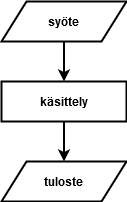

<text-box variant='learningObjectives' name='Oppimistavoitteet'>


- Opit kirjoittamaan ohjelman, joka lukee käyttäjän syötteen
- Tiedät, mitä tarkoitetaan muuttujalla
- Osaat käyttää muuttujaa syötteen lukemisessa ja tulostamisessa
- Osaat yhdistellä (eli katenoida) merkkijonoja

</text-box>

Palautetaan mieleen ensimmäisessä osassa esitetty yksinkertaistettu kaavio ohjelmien suorittamisesta:



Ohjelman suorituksen erikoistamiseksi tarvitsemme keinon lukea käyttäjältä syötteitä. Pythonissa tähän tarkoitukseen käytetään funktiota `input`. Samoin kuin print-funktio, myös se saa parametrikseen merkkijononon. Tämä merkkijono tulostetaan käyttäjlle kehotteeksi (eli viestiksi, jonka tarkoitus on ohjata käyttäjää antamaan oikeanlainen syöte).

Esimerkki ohjelmasta, jossa luetaan käyttäjän nimi käyttäen `input`-funktiota ja tulostetaan ruudulle tervehdys käyttäen `print`-funktiota:

```python
# Luetaan käyttäjän nimi ja tallennetaan se muuttujaan name
nimi = input("Anna nimesi: ")

# Tulostetaan käyttäjälle viesti hyödyntäen muuttujaa name
print("Moi vaan, " + nimi)
```

Ohjelman suoritus voisi näyttää esimerkiksi seuraavalta (käyttäjän kirjoittama syöte on merkitty punaisella:

<sample-output>

Anna nimesi: **Pekka Python**
Moi vaan, Pekka Python

</sample-output>

Ohjelman tuloste riippuu siis osittain käyttäjän syötteestä. Niinpä ohjelman suoritus voisi näyttää myös tältä:

<sample-output>

Anna nimesi: **Outi Ohjelmoija**
Moi vaan, Outi Ohjelmoija

</sample-output>

Ensimmäisellä rivillä oleva sana `nimi` on **muuttuja**. Muuttujalla tarkoitetaan ohjelmoinnissa "lokeroa", johon voidaan tallentaa jokin _arvo_. Tämä arvo voidaan myöhemmin lukea tai sitä voidaan _muuttaa_.

<text-box variant="hint">

Muuttujat voi periaatteesssa ohjelmissa nimetä vapaasti (tiettyjä Python-kielen asettamia rajoituksia noudattaen). Tällä kurssilla muuttujat ja muut vastaavat ohjelmien osat nimetään suomeksi. Ohjelmoinnissa käytetään kuitenkin yleisesti kielenä englantia - jos etsit Googlen avulla ohjelmointiesimerkkejä, ne todennäköisesti ovat englanniksi.

</text-box>

## Samaan muuttujaan viittaaminen useamman kerran

Samaan muuttujaan voidaan viitata ohjelmassa useasti:

```python
# Luetaan käyttäjän syöte muuttujaan nimi
nimi = input("Anna nimesi: ")

# Tulostetaan kaksi viestiä
print("Moi, " + nimi + "!")
print(nimi + " on aika kiva nimi.")
```

Esimerkkitulostus (kun käyttäjä syöttää merkkijonon `Pauli Python`:

<sample-output>

Anna nimesi: **Pauli Python**
Moi, Pauli Python!
Pauli Python on aika kiva nimi.

</sample-output>

Tarkastellaanpa tulostuskomentoja vähän tarkemmin: `print`-funktiota kutsuttaessa parametriksi annetaan merkkijono, johon on yhdistetty sekä valmista (eli _vakiomuotoista_) tekstiä ja käyttäjän syöte. Nämä on yhdistetty toisiinsa `+`-operaattorilla, joka yhdistää kaksi merkkijonoa yhdeksi uudeksi merkkijonoksi. Operaatiota kutsutaan merkkijonojen _katenoinniksi_.

Vakiomuotoisia merkkijonoja voidaan yhdistellä muuttujien arvoihin vapaasti:

```python
# Luetaan käyttäjän syöte muuttujaan nimi
nimi = input("Anna nimesi: ")

# Tulostetaan viesti
print("Moi " + nimi + "! Varmistan vielä: nimesi on siis " + nimi + "?")
```

Esimerkkitulostus voisi näyttää tältä, kun käyttäjä syöttää merkkijonon `Erkki Esimerkki`:

<sample-output>

Anna nimesi: **Erkki Esimerkki**
Moi Erkki Esimerkki! Varmistan vielä: nimesi on siis Erkki Esimerkki?

</sample-output>

## Useampi kuin yksi syöte

Ohjelmassa voi lukea useamman eri syötteen. Huomaa, että jokaisen `input`-funktion palautusarvo tallennetaan erinimiseen muuttujaan:

```python
# Luetaan käyttäjän nimi, sähköposti ja lempinimi
nimi = input("Anna nimesi: ")
sposti = input("Anna sähköpostiosoitteesi: ")
lempinimi = input("Anna lempinimesi: ")

# Tulostetaan käyttäjälle tiedot varmistukseksi
print("Varmistetaan vielä, että tiedot menivät oikein")
print("Annoit nimeksesi " + nimi)
print("...sähköpostiosoitteeksesi " + sposti)
print("...ja lempinimeksesi " + lempinimi + ".")
```

Esimerkki ohjelman suorituksesta:

<sample-output>

Anna nimesi: **Keijo Keksitty**
Anna sähköpostiosoitteesi: **keijo99@example.com**
Anna lempinimesi: **Keke**
Varmistetaan vielä, että tiedot menivät oikein
Annoit nimeksesi Keijo Keksitty
...sähköpostiosoitteeksesi keijo@example.com
...ja lempinimeksesi Keke.

</sample-output>

Huomaa, että mikäli samaan muuttujaan luetaan syöte useamman kerran, uusi arvo ylikirjoittaa edellisen. Esimerkiksi

```python
# Luetaan käyttäjältä osoite
osoite = input("Mikä on osoitteesi? ")

# Tulostetaan viesti
print("Asut siis osoitteessa " + osoite)

# Luetaan osoite uudestaan
osoite = input("Anna uusi osoite: ")

# Nyt uusi arvo on ylikirjoittanut vanhan
print("Osoite on nyt " + osoite)
```

Esimerkkisuoritus:

<sample-output>

Mikä on osoitteesi? **Pythonpolku 1 A 10**
Asut siis osoitteessa Pythonpolku 1 A 10
Anna uusi osoite: **Uusikatu 999**
Osoite on nyt Uusikatu 999

</sample-output>

Jos samaan muuttujaan luetaan kaksi syötettä peräkkäin, ei ensimmäisenä syötettyyn arvoon siis pääse enää käsiksi:

```python
# Luetaan käyttäjältä osoite
osoite = input("Mikä on osoitteesi? ")

# Luetaan osoite uudestaan
# Nyt uusi arvo ylikirjoittaa vanhan
osoite = input("Anna uusi osoite: ")

# Tulostaa viimeisenä syötetyn arvon
print("Osoite on nyt " + osoite)
```

Esimerkkisuoritus:

<sample-output>

Mikä on osoitteesi? **Pythonpolku 10**
Anna uusi osoite: **Ohjelmoijanraitti 230**
Osoite on nyt Ohjelmoijanraitti 230

</sample-output>


