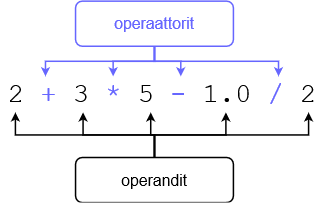

<text-box variant='learningObjectives' name='Oppimistavoitteet'>

Tämän osion jälkeen

- Osaat käyttää muuttujia laskutoimitusten kanssa
- Osaat käsitellä käyttäjän antamia lukuarvoja
- Osaat muuntaa arvoja eri perustyyppien välillä

</text-box>

Aiemmissa osissa nähtiin esimerkkejä peruslaskutoimituksista. Seuraavaan taulukkoon on koottu Pythonin yleisimmät laskuoperaattorit esimerkkeineen:

| Operaattori   | Merkitys      | Esimerkki    | Tulos |
|:-------------:|---------------|--------------|-------|
| `+`           | Yhteenlasku   | `2 + 4`      |`6`    |
| `-`           | Vähennyslasku | `10 - 2.5`   |`7.5`  |
| `*`           | Kertolasku    | `-2 * 123`   |`-246` |
| `/`           | Jakolasku (liukuluku)    | `9 / 2`     |`4.5`  |
| `//`           | Jakolasku (kokonaisluku)    | `9 // 2`     |`4`  |
| `%`           | Jakojäännös    | `9 % 2`     |`1`  |
| `**`          | Potenssi      | `2 ** 3`     |`8`    |

Laskujärjestys noudattaa matematiikasta tuttuja sääntöjä: aluksi lasketaan potenssilaskut, sitten kerto- ja jakolaskut ja lopuksi yhteen- ja vähennyslaskut. Järjestystä voidaan muuttaa sulkujen avulla.

Esimerkki:

```python
print(2 + 3 * 3)
print((2 + 3) * 3)
```

Ohjelma tulostaa

<sample-output>

11
15

</sample-output>

## Operandit, operaattorit ja tyypit

Laskutoimituksen osana on yleensä *operandeja* ja *operaattoreita*:



Yleensä operandien tyyppi ratkaisee lopputuloksen tyypin: jos lasketaan yhteen kaksi kokonaislukua, myös tulos on kokonaisluku. Jos taas vähennetään liukuluku toisesta liukuluvusta, myös tulos on liukuluku. Itse asiassa tulos on liukuluku, jos edes yksi operandeista lausekkeessa on liukuluku.

Jakolasku `/` muodostaa Pythonissa poikkeuksen sääntöön: sen tulos on liukuluku, vaikka operandit olisivatkin kokonaislukuja (esim. `1 / 5` tuottaa liukuluvun `0.2`).

Esimerkki:

```python
pituus = 172.5
paino = 68.55

# painoindeksi lasketaan jakamalla paino pituuden neliöllä
# pituus ilmoitetaan kaavassa metreinä
bmi = paino / (pituus / 100) ** 2

print(f"Painoindeksi on {bmi}")
```

Ohjelman tulostus on seuraava:

<sample-output>

Painoindeksi on 23.037177063642087

</sample-output>

Huomaa, että Pythonissa on myös kokonaislukujakolaskuoperaattori `//`, joka tuottaa kokonaisluvun, jos sen operandit ovat kokonaislukuja. Vastaus pyöristetään alaspäin kokonaisluvuksi, eli esim.

```python
x = 3
y = 2

print(f"/-operaattori {x/y}")
print(f"//-operaattori {x//y}")
```

tulostaa

<sample-output>

/-operaattori 1.5
//-operaattori 1

</sample-output>

## Lukuarvojen lukeminen

Aikaisemmin käytettiin `input`-komentoa lukemaan käyttäjältä merkkijonoja. Samaa funktiota voidaan käyttää myös lukuarvojen lukemiseen. Tällaisessa tapauksessa muunnos merkkijonosta lukutyyppiin on kuitenkin tehtävä itse. Logiikka on samanlainen kuin edellisessä osassa opitussa `str`-funktiossa, vain funktion nimi vaihtuu.

Esimerkiksi voimme muuttaa merkkijonon kokonaisluvuksi funktiolla `int`. Seuraava ohjelma lukee käyttäjältä syntymävuoden muuttujaan `syote` ja luo sitten toisen muuttujan `vuosi`, jossa on vuosi kokonaisluvuksi muutettuna. Tämän jälkeen voimme suorittaa laskun `2020-vuosi`, jossa on mukana käyttäjän antama vuosi.

```python
syote = input("Minä vuonna olet syntynyt? ")
vuosi = int(syote)
print(f"Ikäsi vuoden 2020 lopussa: {2020 - vuosi}" )
```
<sample-output>

Minä vuonna olet syntynyt? **1995**
Ikäsi vuoden 2020 lopussa: 25

</sample-output>

Yleensä ei kannata luoda kahta muuttujaa (tässä `syote` ja `vuosi`) lukuarvon lukemista varten, vaan voimme samalla kertaa lukea merkkijonon `input`-funktiolla ja muuttaa sen kokonaisluvuksi `int`-funktiolla:

```python
vuosi = int(input("Minä vuonna olet syntynyt? "))
print(f"Ikäsi vuoden 2020 lopussa: {2020 - vuosi}" )
```

Vastaavasti voimme muuttaa merkkijonon liukuluvuksi funktiolla `float`. Seuraava ohjelma kysyy käyttäjän painon ja pituuden ja laskee näiden tietojen avulla painoindeksin:

```python
pituus = float(input("Anna pituus: "))
paino = float(input("Anna paino: "))

pituus = pituus / 100
bmi = paino / pituus ** 2

print(f"Painoindeksi on {bmi}")
```

Ohjelman tulostus voisi näyttää vaikka seuraavalta:

<sample-output>

Anna pituus: **163**
Anna paino: **74.45**
Painoindeksi on 28.02137829801649

</sample-output>

<in-browser-programming-exercise name="Luku kertaa viisi" tmcname="osa01-13_kerrottuna_viidella">

Tee ohjelma, joka kysyy käyttäjältä lukua. Ohjelma tulostaa luvun kerrottuna viidellä.

Ohjelman tulee toimia seuraavasti:

<sample-output>

Anna luku: **3**
Kun kerrotaan 3 luvulla 5, saadaan 15

</sample-output>

</in-browser-programming-exercise>

<in-browser-programming-exercise name="Nimi ja ikä" tmcname="osa01-14_nimi_ja_ika">

Tee ohjelma, joka kysyy käyttäjältä tämän nimen ja syntymävuoden. Ohjelma tulostaa sitten viestin seuraavan esimerkin mukaisesti:

<sample-output>

Anna nimi: **Keijo Keksitty**
Anna syntymävuosi: **1990**
Moi Keijo Keksitty, olet 30 vuotta vanha vuoden 2020 lopussa

</sample-output>

</in-browser-programming-exercise>

## Muuttujien käyttöä

Tarkastellaan ohjelmaa, joka laskee kolmen käyttäjän syöttämän luvun summan:

```python
luku1 = int(input("Ensimmäinen luku: "))
luku2 = int(input("Toinen luku: "))
luku3 = int(input("Kolmas luku: "))

summa = luku1 + luku2 + luku3
print(f"Lukujen summa: {summa}")
```

Ohjelman esimerkkisuoritus:

<sample-output>

Ensimmäinen luku: **5**
Toinen luku: **21**
Kolmas luku: **7**
Lukujen summa: 33

</sample-output>

Ohjelma käyttää nyt neljää muuttujaa. Tässä tilanteessa tultaisiin toimeen myös vähemmällä:

```python
summa = 0

luku = int(input("Ensimmäinen luku: "))
summa = summa + luku

luku = int(input("Toinen luku: "))
summa = summa + luku

luku = int(input("kolmas luku: "))
summa = summa + luku

print(f"Lukujen summa: {summa}")
```

Nyt kaikki käyttäjän syötteet luetaan muuttujaan `luku`, jonka arvolla _kasvatetaan_ muuttujan `summa` arvoa joka kerta sen jälkeen kun käyttäjältä on saatu uusi syöte.

Seuraava komento siis _kasvattaa_ muuttujassa `summa` olevaa arvoa muuttujan `luku` arvolla:

```python
summa = summa + luku
```

Eli esimerkiksi jos ennen komentoa `summa` on 3 ja `luku` on 2, niin komennon suorittamisen jälkeen muuttujan `summa` arvona on 5.

Koska muuttujan arvon kasvattaminen on usein tarvittava toiminto, voimme kirjoittaa sen myös lyhyemmin näin:

```python
summa += luku
```

Tämän avulla saamme kirjoitettua ohjelman koodin tiiviimmin:

```python
summa = 0

luku = int(input("Ensimmäinen luku: "))
summa += luku

luku = int(input("Toinen luku: "))
summa += luku

luku = int(input("kolmas luku: "))
summa += luku

print(f"Lukujen summa: {summa}")
```

Itse asiassa apumuuttujaa `luku` ei välttämättä tarvita ollenkaan. Käyttäjän antamat syötteet voitaisiin lisätätä yksi kerrallaan muuttujaan `summa` myös seuraavasti:

```python
summa = 0

summa += int(input("Ensimmäinen luku: "))
summa += int(input("Toinen luku: "))
summa += int(input("Kolmas luku: "))

print(f"Lukujen summa: {summa}")
```

Riippuu toki tilanteesta, montako muuttujaa ohjelmassa tarvitaan. Jos käyttäjän kaikkien syötteiden arvo tulee muistaa, ei ole mahdollista "uusiokäyttää" samaa apumuuttujaa kaikkien syötteiden lukemiseen. Näin on seuraavassa esimerkissä:

```python
luku1 = int(input("Ensimmäinen luku: "))
luku2 = int(input("Toinen luku: "))

print(f"{luku1} + {luku2} = {luku1+luku2}")
```

<sample-output>

Ensimmäinen luku: **2**
Toinen luku: **3**
2 + 3 = 5

</sample-output>

Toistaalta tässä ohjelmassa ei ole omaa muuttujaa summan arvon tallettamiseen.

Kannattaa kuitenkin huomata, että yhtä muuttujaa ei kannata "uusiokäyttää" kuin samankaltaisiin asioihin, esim. summattavien lukujen tilapäiseen tallentamiseen.

Esimerkiksi seuraavassa on uusiokäytetty muuttujaa `tieto` nimen ja iän tallentamiseen ja tämä ei ole missään nimessä järkevää:

```python
tieto = input("Mikä on nimesi? ")
print("Hei " + tieto + "!")

tieto = int(input("Mikä on ikäsi? "))
# ohjelma jatkuu...
```

Parempi on siis käyttää molempaa tarkoitusta varten omaa _kuvaavasti nimettyä_ muuttujaa:

```python
nimi = input("Mikä on nimesi? ")
print("Hei " + nimi + "!")

ika = int(input("Mikä on ikäsi? "))
# ohjelma jatkuu...
```

<in-browser-programming-exercise name="Vuorokaudet sekunteina" tmcname="osa01-15_sekunteja_vuorokaudessa">

Tee ohjelma, joka kysyy käyttäjältä vuorokausien lukumäärän. Tämän jälkeen ohjelma tulostaa sekuntien määrän annetuissa vuorokausissa.

Ohjelman tulee toimia seuraavasti:

<sample-output>

Kuinka monen vuorokauden sekunnit tulostetaan? **1**
86400

</sample-output>

Toinen esimerkki:

<sample-output>

Kuinka monen vuorokauden sekunnit tulostetaan? **7**
604800

</sample-output>

</in-browser-programming-exercise>


<in-browser-programming-exercise name="Korjaa ohjelma: Lukujen tulo" tmcname="osa01-20_korjaa_ohjelma_lukujen_tulo">

Oheinen ohjelma kysyy käyttäjältä kolme lukua ja tulostaa näiden tulon (eli luvut kerrottuna toisillaan).
Ohjelmassa on kuitenkin virhe tai virheitä, joiden takia se ei toimi. Korjaa ohjelma sellaiseksi, että se toimii oikein.

Ohjelman siis pitäisi toimia esimerkiksi näin:

<sample-output>

Anna luku 1: **2**
Anna luku 2: **3**
Anna luku 3: **5**
Tulo on 30

</sample-output>

</in-browser-programming-exercise>

<in-browser-programming-exercise name="Lukujen summa ja tulo" tmcname="osa01-16_lukujen_summa_ja_tulo">

Tee ohjelma joka kysyy käyttäjältä kaksi lukua. Ohjelma tulostaa lukujen summan ja tulon.

Ohjelman tulee toimia seuraavasti:

<sample-output>

Luku 1: **3**
Luku 2: **7**
Lukujen summa 10
Lukujen tulo 21

</sample-output>

</in-browser-programming-exercise>


<in-browser-programming-exercise name="Lukujen summa ja keskiarvo" tmcname="osa01-17_lukujen_summa_ja_keskiarvo">

Tee ohjelma, joka lukee käyttäjältä neljä lukua ja tulostaa niiden summan ja keskiarvon

Ohjelman tulee toimia seuraavasti:

<sample-output>

Luku 1: **2**
Luku 2: **1**
Luku 3: **6**
Luku 4: **7**
Lukujen summa on 16 ja keskiarvo 4.0

</sample-output>

</in-browser-programming-exercise>


<in-browser-programming-exercise name="Ruokailukustannukset" tmcname="osa01-19_ruokailukustannukset">

Tee ohjelma, joka arvioi käyttäjän keskimääräisiä ruokailukustannuksia.

Ohjelma kysyy, kuinka monta kertaa viikossa käyttäjä käy Unicafessa ja Unicafe-lounaan hinnan sekä viikon muiden ruokaostosten hinnan.

Näiden tietojen perusteella ohjelma laskee käyttäjän keskimääräiset ruokamenot sekä viikossa että yhtenä päivänä.

Ohjelman tulee toimia seuraavasti:

<sample-output>

Montako kertaa viikossa syöt Unicafessa? **4**
Unicafe-lounaan hinta? **2.5**
Paljonko käytät viikossa ruokaostoksiin? **28.5**

Kustannukset keskimäärin:
Päivässä 5.5 euroa
Viikossa 38.5 euroa

</sample-output>

</in-browser-programming-exercise>

<in-browser-programming-exercise name="Opiskelijat ryhmiin" tmcname="osa01-18_opiskelijat_ryhmiin">

Tee ohjelma, joka kysyy kurssin opiskelijoiden määrän ja ryhmän koon ja ilmoittaa, montako ryhmää opiskelijoista muodostuu. Jos jako ei mene tasan, yhdessä ryhmässä voi olla vähemmän opiskelijoita, mutta kaikissa muissa on oltava haluttu määrä.

<sample-output>

Montako opiskelijaa? **8**
Mikä on ryhmän koko? **4**
Ryhmien määrä: 2

</sample-output>

<sample-output>

Montako opiskelijaa? **11**
Mikä on ryhmän koko? **3**
Ryhmien määrä: 4

</sample-output>

Vihje: tehtävän tekeminen onnistuu kokonaislukujakolaskuoperaattorilla `//`

Vihje2: jos et keksi miten tehtävä ratkeaa, älä huolestu suotta vaan tutustu [seuraavassa luvussa](/osa-1/5-ehtorakenne) esiteltävään <i>ehtorakenteeseen</i>. Ehtorakenteen avulla tehtävä on huomattavasti helpompi ratkaista.

</in-browser-programming-exercise>

Kertauskysely tämän osan asioihin liittyen:

<quiz id="d781d54e-9792-5a79-a018-168940390580"></quiz>
