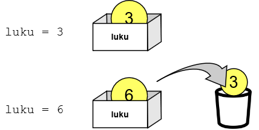

<text-box variant='learningObjectives' nimi='Oppimistavoitteet'>

Käsiteltävä tieto pitää tallentaa muistiin ohjelman suorituksen ajaksi. Tätä tarkoitusta varten ohjelmissa käytetään muuttujia.

Tämän osion suoritettuasi

- Tiedät, mitä tarkoitetaan muuttujalla ja mihin niitä tarvitaan
- Tiedät, millaista tietoa muuttujiin voidaan tallentaa
- Ymmärrät merkkijonojen sekä kokonais- ja liukulukujen eron
- Osaat käyttää muuttujia omissa ohjelmissasi

</text-box>


Edellisessä osassa käytettiin muuttujia tallentamaan syötefunktion (eli `input`-funktion) palauttamat arvot.

Muuttujia tarvitaan ohjelmissa lukuisiin muihinkin tarkoituksiin: muuttujiin voidaan tallentaa mitä tahansa sellaista tietoa, jota tarvitaan ohjelmassa myöhemmin.

Muuttujan alustamiseksi Pythonissa käytetään seuraavaa syntaksia:

`muuttujan_nimi = <lauseke>`

...missä lauseke tuottaa tulokseksi jonkin arvon, joka tallennetaan muuttujaan. Esimerkiksi `input`-funktion kutsuminen tuottaa tulokseksi käyttäjän syöttämän merkkijonon. Jotta tätä merkkijonoa voidaan käyttää ohjelmassa myöhemmin (esimerkiksi tulostettaessa käyttäjälle tervehdys), se tallennetaan muuttujaan.

Merkkijonomuuttujalle voidaan antaa arvoja myös esimerkiksi näin:

```python

# Alustetaan muuttujat etunimi ja sukunimi
etunimi = "Pekka"
sukunimi = "Pythonen"

# Alustetaan muuttuja väli, jonka arvo on 1 välilyönti
väli = " "

# Yhdistetään (eli katenoidaan) kolme muuttujaa
# yhdeksi, ja tallennetaan arvo muuttujaan nimi
nimi = etunimi + väli + sukunimi

# Tulostetaan muuttujan nimi arvo
print(nimi)

```

<sample-output>

Pekka Pythonen

</sample-output>

## Muuttujien arvon muuttaminen

Muuttujan arvo voi nimensä mukaisesti muuttua. Niin kuin edellisessä osassa todettiin, uusi arvo ylikirjoittaa vanhan arvon.



Esimerkiksi

```python

# Lauseen arvo on aluksi tyhjä
lause = ""

# Kysy käyttäjältä nimi, ja lisää se lauseeseen
nimi = input("Anna nimi: ")
lause = lause + nimi
lause = lause + ", "

# Kysy käyttäjältä toinen nimi, ja lisää se lauseeseen
nimi = input("Anna toinen nimi: ")
lause = lause + nimi
lause = lause + " ja "

# ...ja vielä kolmas: huomaa, että syötefunktion palaute
# voidaan tallentaa suoraan lauseen perään
lause = lause + input("Anna vielä kolmas nimi: ")

# Tulostetaan lopullinen lause
print(lause)

```

<sample-output>

Anna nimi: **Tupu**
Anna toinen nimi: **Hupu**
Anna vielä kolmas nimi: **Lupu**
Tupu, Hupu ja Lupu

</sample-output>

Huomaa, että `lause`-muuttujan alkuarvoksi annetaan tyhjä merkkijono. Jos tätä ei tehdä, ei lause `lause = lause + nimi` toimi, koska merkkijono voidaan yhdistää vain toiseen merkkijonoon. Myös tyhjä merkkijono _on_ merkkijono.

<text-box variant="hint">

Muuttujat kannattaa nimetä niiden käyttötarkoituksen mukaan. Esimerkiksi `ikä` on parempi muuttujan nimi kuin `a`. Python ei rajoita muuttujien nimien pituutta, mutta eräitä muita sääntöjä muuttujien nimiin liittyy. Nimen täytyy _alkaa kirjaimella_ ja se saa sisältää vain _kirjaimia, numeroita ja alaviivoja &#95;. Huomaa myös, että pienet ja isot kirjaimet ovat eri merkkejä - muuttuja `nimi` on siis eri muuttuja kuin `Nimi` tai `NIMI`.

</text-box>

## Kokonaislukutyyppiset muuttujat

Tähän mennessä on käsitelty pelkästään merkkijonotyyppisiä muuttujia. Yleensä ohjelmissa halutaan kuitenkin tallentaa myös muun tyyppistä tietoa. Tarkastellaan aluksi _kokonaislukutyyppisiä muuttujia_.

Python on _dynaamisesti tyypitetty_ ohjelmointikieli. Tämä tarkoittaa, että ohjelmoijan ei tarvitse ilmoittaa muuttujan tyyppiä, vaan Python päättelee sen automaattisesti muuttujaan sijoitettavan arvon perusteella.

Kokonaislukutyyppinen muuttuja voidaan siis alustaa sijoittamalla muuttujan arvoksi kokonaisluku.

```python

# Alustetaan muuttuja ikä arvolla 24
ikä = 24
print(ikä)

```

Ohjelma tulostaa arvon

<sample-output>

24

</sample-output>

Kokonaisluvun ympärille ei kirjoiteta lainausmerkkejä. Itse asiassa luvun ympärille kirjoitettavat lainausmerkit tarkoittavat, että kyseessä ei ole luku vaan merkkijono (joka tosin saattaa sisältää numeroita).

Mitä eroa muuttujan tyypeillä siis on, kun seuraava ohjelma tulostaa samat arvot?

```python

numero1 = 100
numero2 = "100"

print(numero1)
print(numero2)

```

<sample-output>

100
100

</sample-output>

Erilaiset operaatiot vaikuttavat eri tavalla erityyppisiin muuttujiin. Tarkastellaan seuraavaa esimerkkiä:

```python

numero1 = 100
numero2 = "100"

print(numero1 + numero1)
print(numero2 + numero2)

```

Ohjelma tulostaa suoritettaessa

<sample-output>

200
100100

</sample-output>

Kahdelle lukutyyppiselle arvolle `+`-operaattori siis merkitsee aritmeettista (eli matemaattista) yhteenlaskua, merkkijonoille taas katenointia.

## Erityyppisten arvojen tulostaminen

Erityyppisiä arvoja _ei_ voi yhdistää, seuraava ei siis toimi:

```python

numero1 = 100
numero2 = "100"

print(numero1 + numero2) # Tämä tuottaa virheen!

```

Ohjelma ei tulosta mitään, vaan antaa virheen

<sample-output>

TypeError: unsupported operand type(s) for +: 'int' and 'str'

</sample-output>

Python siis kertoo, ettei kahden erityyppisen arvon yhdistäminen toimi. Jos haluat tulostaa yhdellä lauseella sekä merkkijonon että luvun, tulee luku muuntaa merkkijonoksi `str`-funktiota hyödyntäen. Esimerkiksi

```python

numero1 = 10
numero2 = 25
tulos = numero1 * numero2

# Muutetaan kokonaisluku merkkijonoksi ennen yhdistämistä
print("Tulos on " + str(tulos))

```

<sample-output>

Tulos on 250

</sample-output>

## Liukuluvut

Aina kokonaisluvut eivät riitä. Desimaalilukuja (eli _liukulukuja_) voidaan käyttää samalla tavalla kuin kokonaislukujakin. Huomaa kuitenkin, että _desimaalierottimena käytetään pilkun sijasta pistettä_.

Esimerkiksi:

```python

lämpötila_tammi = 2.5
lämpötila_helmi = -1.25
lämpötila_maalis = 3.62

keskilämpö = (lämpötila_tammi + lämpötila_helmi + lämpötila_maalis) / 3
print("Keskilämpötila tammikuusta maaliskuuhun on " + str(keskilämpö))

```

<sample-output>

Keskilämpötila tammikuusta maaliskuuhun on 1.6233333333333333

</sample-output>


