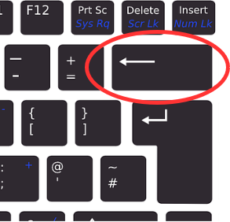

<text-box variant='learningObjectives' name='Oppimistavoitteet'>

Suorituksen ohjaaminen on tärkeä osa ohjelmia: eri syötteitä tai tilanteita tulee usein käsitellä eri tavoilla. Tutustutaan seuraavaksi siis ehdolliseen suoritukseen.

Tämän osion suoritettuasi

- Tiedät, mitä tarkoittaa ehtorakenne ja osaat käyttää sitä omissa ohjelmissa
- Osaat muodostaa lohkoja Pythonissa
- Tiedät, mitä tarkoitetaan totuusarvoilla
- Osaat käyttää vertailuoperaattoreita yhtäsuuruuden ja erisuuruuden toteamiseen

</text-box>

Tähän mennessä kaikissa ohjelmissamme on suoritettu samat rivit samassa järjestyksessä.
Usein on kuitenkin tarpeen määritellä ohjelmaan osia, jotka suoritetaan vain tietyissä tilanteissa.

Tarkastellaan ensin esimerkkiä, joka tarkastelee, onko henkilö täysi-ikäinen:

```python
ika = int(input("Kuinka vanha olet? "))

if ika > 17:
    print("Olet täysi-ikäinen.")
    print("Tässä siis sinulle ikiomaksi GTA6.")

print("Seuraava asiakas, kiitos!")
```

Ohjelman suoritus näyttää tältä, kun ikä on suurempi kuin 17:

<sample-output>

Kuinka vanha olet? **18**
Olet täysi-ikäinen!
Tässä siis sinulle ikiomaksi GTA6.
Seuraava asiakas, kiitos!

</sample-output>

Jos kuitenkin ikä ei ole suurempi kuin 17, käy näin:

<sample-output>

Kuinka vanha olet? **16**
Seuraava asiakas, kiitos!

</sample-output>

Esimerkkejä tarkastelemalla huomataan, että syötteenä annettu arvo vaikuttaa nyt siihen, mitkä osat ohjelmasta suoritetaan. Ohjelmassa on käytössä _ehtorakenne_, jonka sisällä oleva koodi suoritetaan vain, kun annettu ehto on tosi.


Ehtorakenteessa avainsanaa `if` seuraa jokin _ehto_, kuten kahden arvon vertailu. Tämän jälkeen tuleva koodi suoritetaan vain, jos ehto pitää paikkansa.

Huomaa, että ehtorakenteen ensimmäisen rivin lopussa on kaksoispiste. Seuraavassa koodissa kaksoispiste on unohtunut:

```python
ika = 10

# puolipiste unohtui seuraavan rivin lopusta...
if ika > 17
    print("Olet täysi-ikäinen.")
```

Tämän seurauksena koodi antaa virheen:

<sample-output>
<pre>
File "ohjelma.py", line 3
  if ika > 17
            ^
SyntaxError: invalid syntax
</pre>
</sample-output>

## Vertailuoperaattorit

Tyypillinen ehto on kahden arvon vertailu. Pythonin vertailuoperaattorit ovat:

| Operaattori | Merkitys       | Esimerkki    |
|:-----------:|----------------|--------------|
| `==` | Yhtä suuri    | `a == b` |
| `!=` | Eri suuri | `a != b` |
| `>` | Suurempi | `a > b` |
| `>=` | Suurempi tai yhtä suuri | `a >= b` |
| `<` | Pienempi | `a < b` |
| `<=` | Pienempi tai yhtä suuri | `a <= b` |

Tarkastellaan esimerkkinä ohjelmaa, joka tulostaa tiedon siitä, onko käyttäjän syöttämä luku negatiivinen, positiivinen vai nolla:

```python
luku = int(input("Anna luku: "))

if luku < 0:
    print("Luku on negatiivinen.")

if luku > 0:
    print("Luku on positiivinen.")

if luku == 0:
    print("Luku on nolla.")
```

Ohjelma suoritettuna kolme kertaa eri syötteillä:

<sample-output>

Anna luku: **15**
Luku on positiivinen.

</sample-output>

<sample-output>

Anna luku: **-18**
Luku on negatiivinen.

</sample-output>

<sample-output>

Anna luku: **0**
Luku on nolla.

</sample-output>

<in-browser-programming-exercise name="Orwel" tmcname="osa01-21_orwel">

Tee ohjelma, joka kysyy käyttäjältä kokonaisluvun ja tulostaa merkkijonon "Orwell" jos luku on täsmälleen 1984. Muussa tapauksessa ohjelma ei tulosta mitään.

<sample-output>

Anna luku: **2020**

</sample-output>

<sample-output>

Anna luku: **1984**
Orwell

</sample-output>

</in-browser-programming-exercise>

<in-browser-programming-exercise name="Itseisarvo" tmcname="osa01-22_itseisarvo">

Kirjoita ohjelma, joka lukee käyttäjältä kokonaisluvun. Mikäli luku on pienempi kuin 0, ohjelma tulostaa luvun kerrottuna luvulla -1. Muulloin ohjelma tulostaa käyttäjän syöttämän luvun. Alla on muutamia esimerkkejä ohjelman odotetusta toiminnasta.

<sample-output>

syötä luku? **-7**
luvun itseisarvo on 7

</sample-output>

<sample-output>

syötä luku? **1**
luvun itseisarvo on 1

</sample-output>

<sample-output>

syötä luku? **-99**
luvun itseisarvo on 99

</sample-output>

</in-browser-programming-exercise>


<in-browser-programming-exercise name="Keittoa vai ei" tmcname="osa01-23_keittoa_vai_ei">

Kirjoita ohjelma, joka kysyy ensin käyttäjän nimen. Jos nimi on mikä tahansa muu kuin "Jerry", ohjelma kysyy keittoannosten lukumäärän ja kertoo sitten kokonaishinnan. Yksi annos maksaa 5.9.

Kaksi esimerkkisuoritusta:

<sample-output>

Mikä on nimesi: **Kramer**
Kuinka monta annosta keittoa: **2**
Kokonaishinta on 11.8
Seuraava!

</sample-output>

<sample-output>

Mikä on nimesi: **Jerry**
Seuraava!

</sample-output>

</in-browser-programming-exercise>


<in-browser-programming-exercise name="Luvun suuruusluokka" tmcname="osa01-24_luvun_suuruusluokka">

Tee ohjelma, joka lukee käyttäjältä kokonaisluvun ja kertoo sitten sen suuruusluokan oheisen esimerkin mukaisesti:

<sample-output>

Anna luku: **950**
Luku on pienempi kuin 1000
Kiitos!

Anna luku: **59**
Luku on pienempi kuin 1000
Luku on pienempi kuin 100
Kiitos!

Anna luku: *2**
Luku on pienempi kuin 1000
Luku on pienempi kuin 100
Luku on pienempi kuin 10
Kiitos!

Anna luku: **1123**
Kiitos!

</sample-output>


</in-browser-programming-exercise>

## Lohkot

Ehtorakenteen aloitusrivin jälkeiseltä riviltä alkaa _lohko_, jossa oleva koodi suoritetaan vain silloin, kun ehto on tosi. Python tunnistaa lohkoon kuuluvan koodin siitä, että jokainen rivi on _sisennetty_ samalla tavalla. Tämä tarkoittaa, että ennen lohkoon kuuluvan rivin alkua on tyhjää tilaa enemmän kuin rivillä, jolla ehto annettiin.

Esimerkiksi:

````python
salasana = input("Anna salasana: ")

if salasana == "kissa":
    print("Tiesit salasanan!")
    print("Olet siis joko oikea käyttäjä...")
    print("...tai melkoinen hakkerivelho.")

print("Ohjelman suoritus päättyi. Kiitos ja hei!")
````

Tyhjä tila saadaan aikaan _tabulaattorilla_, jonka saat Tab-näppäimestä.


Suurin osa editoreista osaa automaattisesti sisentää rivin, kun edellinen rivi päättyy kaksoispisteeseen. Lohkon kirjoittamisen voit lopettaa editorissa painamalla rivin alussa `Backspace`-näppäintä.


<small><center>
Näppäimistökuvien alkuperä:  <a href="https://pixabay.com/users/Clker-Free-Vector-Images-3736/?utm_source=link-attribution&amp;utm_medium=referral&amp;utm_campaign=image&amp;utm_content=311803">Clker-Free-Vector-Images</a> from <a href="https://pixabay.com/?utm_source=link-attribution&amp;utm_medium=referral&amp;utm_campaign=image&amp;utm_content=311803">Pixabay</a>
</center></small>

## Totuusarvot

Ehtorakenteessa käytettävä ehto saa totuusarvon `True` (tosi) tai `False` (epätosi). Esimerkiksi ehto `a < 5` on tosi jos `a` on alle 5 ja epätosi jos `a` on 5 tai suurempi.

Voimme asettaa ehdon tuloksen muuttujan arvoksi samaan tapaan kuin laskutoimituksen tuloksen:

```python
a = 3
ehto = a < 5
print(ehto)
if ehto:
    print("a on pienempi kuin 5")
```

<sample-output>

True
a on pienempi kuin 5

</sample-output>

Voimme käyttää koodissa myös sanoja `True` ja `False`. Esimerkiksi seuraava koodi suorittaa `print`-komennon aina, koska ehdon arvona on `True`:

```python
ehto = True
if ehto:
    print("Tänne tullaan aina")
```

<sample-output>

Tänne tullaan aina

</sample-output>

Tällainen ohjelma ei ole sinänsä kovin hyödyllinen, mutta myöhemmin kurssilla näemme, mitä hyötyä on totuusarvoista muuttujissa.

<in-browser-programming-exercise name="" tmcname="osa01-">

</in-browser-programming-exercise>

Kertauskysely tämän osan asioihin liittyen:

<quiz id="b7c4a09f-9257-4060-8553-f2ec780a4c5c"></quiz>
