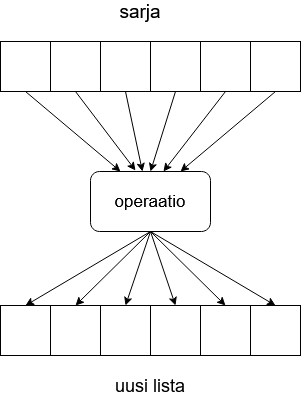

<text-box variant='learningObjectives' name='Oppimistavoitteet'>

Tämän osion jälkeen

- Tiedät mitä tarkoitetaan koosteella (comprehension)
- Osaat hyödyntää koosteita uusien listojen muodostamiseen

</text-box>

Ohjelmointiin liittyy usein erilaisten sekvenssien (eli sarjojen) käsittely. Aikaisemmissa osissa on käytetty runsaasti aikaa merkkijonojen, listojen ja sanakirjojen käsittelyyn eri tavoilla.

Oletetaan tilanne, jossa meillä on lista kokonaislukuja. Tämän listan perusteella meidän pitäisi luoda vastaava merkkijonolista.

Perinteinen tapa toteuttaa operaatio näyttäisi esimerkiksi tältä:

```python
luvut = [1, 2, 3, 6, 5, 4, 7]

merkkijonot = []
for luku in luvut:
    merkkijonot.append(str(luku))
```

## Listakooste

Python tarjoaa kuitenin "pythonmaisemman" tavan uuden listan muodostamiseksi vanhan perusteella. Menetelmää voidaan kutsua "listakoosteeksi", mutta huomattavasti yleisempää on käyttää englanninkielistä nimeä _list comprehension_.

Menetelmässä ideana on kuvata yhden rivin lausekkeella, mikä operaatio listan kaikille alkioille tehdään, ennen kuin ne tallennetaan uuteen listaan.

Esimerkiksi yllä esitetty ohjelma, joka luo merkkijonolistan kokonaislukulistan perusteella, näyttäisi listakoostetta hyödyntäen tältä:

```python
luvut = [1, 2, 3, 6, 5, 4, 7]
merkkijonot = [str(luku) for luku in luvut]
```

Koosteessa näyttää siis olevan jotakuinkin samat elementit kuin perinteisessäkin toteutuksessa, mutta syntaksi on uudenlainen. Yleisemmin listakoosteen syntaksi voitaisiin esittää esimerkiksi näin:

`[<lauseke> for <alkio> in <sarja>]`

Koosteen ympärillä olevat hakasulkeet kertovat, että lopputuloksena on uusi lista. Koosteessa poimitaan yksi kerrallaan alkio alkuperäisestä sarjasta (esimerkkimme tapauksessa listasta) ja tallennetaan siihen liittyvän lausekkeen arvo uuteen listaan. Lopputuloksena on lista, jossa on yhtä paljon alkioita kuin alkuperäisessä listassa ja kaikki alkiot on käsitelty samalla tavalla.



Toisessa esimerkissä jokainen alkuperäisen listan alkio kerrotaan kymmenellä ja tallennetaan uuteen listaan:

```python
luvut = list(range(1,10))
print(luvut)

luvut_kerrottuna = [luku * 10 for luku in luvut]
print(luvut_kerrottuna)
```

<sample-output>

[1, 2, 3, 4, 5, 6, 7, 8, 9]
[10, 20, 30, 40, 50, 60, 70, 80, 90]

</sample-output>

Lauseke voi olla mikä tahansa Pythonin lauseke. Esimerkiksi koosteessa voidaan kutsua itse määriteltyä funktiota:

```python
def kertoma(n: int):
    """ Funktio laskee positiivisen luvun n kertoman n! """
    k = 1
    while n >= 2:
        k *= n
        n -= 1
    return k

if __name__ == "__main__":
    lista = [5, 2, 4, 3, 0]
    kertomat = [kertoma(luku) for luku in lista]
    print(kertomat)
```

<sample-output>

[120, 2, 24, 6, 1]

</sample-output>

Sama ohjelma esitettynä perinteisellä silmukalla näyttäisi tältä:

```python

def kertoma(n: int):
    """ Funktio laskee positiivisen luvun n kertoman n! """
    k = 1
    while n >= 2:
        k *= n
        n -= 1
    return k

if __name__ == "__main__":
    lista = [5, 2, 4, 3, 0]
    kertomat = []
    for luku in lista:
        kertomat.append(kertoma(luku))
    print(kertomat)

```

Koosteen avulla on siis mahdollista ilmaista sama toiminnallisuus tiiviimmin ja silti yhä helposti luettavassa muodossa.

Palauttamalla funktiosta suoraan kooste saadaan aikaiseksi hyvin tiivistä koodia:

```python
def kertomat(luvut: list):
    return [kertoma(luku) for luku in luvut]
```

<programming-exercise name='Neliojuuret' tmcname='osa11-01_neliojuuret'>

Tee funktio `neliojuuret(luvut: list)`, joka saa parametriksi listan kokonaislukuja. Funktio palauttaa listan parametrina olevien lukujen neliöjuurista. Neliöjuuren laskemiseen löytyy sopiva funktio moduulista [math](https://docs.python.org/3/library/math.html)

Funktion tulee käyttää listakoostetta. Funktion maksimipituus on siis (mukaanlukien `def`-sanalla alkava otsikkorivi) kokonaisuudessaan kaksi riviä!

Funktio toimii seuraavasti:

```python
rivit = neliojuuret([1,2,3,4])
for rivi in rivit:
    print(rivi)
```

<sample-output>

1.0
1.4142135623730951
1.7320508075688772
2.0

</sample-output>

</programming-exercise>

<programming-exercise name='Tähtirivit' tmcname='osa11-02_tahtirivit'>

Tee funktio `tahtirivit(luvut: list)`, joka saa parametriksi listan kokonaislukuja. Funktio palauttaa listan, joka koostuu tähtiriveistä, joiden pituus vastaa parametrina olevan listan lukuja. Funktion tulee käyttää listakoostetta.

Funktion maksimipituus on siis (mukaanlukien `def`-sanalla alkava otsikkorivi) kokonaisuudessaan kaksi riviä!

Funktio toimii seuraavasti:

```python
rivit = tahtirivit([1,2,3,4])
for rivi in rivit:
    print(rivi)

print()

rivit = tahtirivit([4, 3, 2, 1, 10])
for rivi in rivit:
    print(rivi)
```

<sample-output>

<pre>
*
**
***
****

****
***
**
*
**********
</pre>

</sample-output>

</programming-exercise>

<programming-exercise name='Paras koetulos' tmcname='osa11-03_paras_koetulos'>

Tehtäväpohjassa on valmiina luokka `Koesuoritus`, jolla on seuraavat julkiset attribuutit:

* nimi
* arvosana1
* arvosana2
* arvosana3

Kirjoita funktio `parhaat_tulokset(suoritukset: list)`. Funktio saa parametrikseen listan koesuoritusolioita.

Funktio palauttaa listakoostetta käyttäen uuden listan, johon on tallennettu jokaisen suorituksen paras arvosana.

Funktion maksimipituus on siis (mukaanlukien def-sanalla alkava otsikkorivi) kokonaisuudessaan kaksi riviä!

Esimerkki suorituksesta:

```python
suoritus1 = Koesuoritus("Pekka",5,3,4)
suoritus2 = Koesuoritus("Pirjo",3,4,1)
suoritus3 = Koesuoritus("Paavo",2,1,3)
suoritukset = [suoritus1, suoritus2, suoritus3]
print(parhaat_tulokset(suoritukset))
```

<sample-output>

[5, 4, 3]

</sample-output>

</programming-exercise>

<programming-exercise name='Pituudet' tmcname='osa11-04_pituudet'>

Tee funktio `pituudet(listat: list)` joka saa parametriksi listan, joka sisältää listoja, jotka sisältävät kokonaislukuja. Funktio palauttaa listan, joka sisältää parametrina olevien listojen pituudet.

Funktio tulee toteuttaa listakoosteen avulla. Funktion maksimipituus on siis (mukaanlukien `def`-sanalla alkava otsikkorivi) kokonaisuudessaan kaksi riviä!

Funktio toimii seuraavasti

```python
listat = [[1,2,3,4,5], [324, -1, 31, 7],[]]
print(pituudet(listat))
```

<sample-output>

[5, 4, 0]

</sample-output>

</programming-exercise>


## Alkoiden suodatus

Edellisissä esimerkeissä uusi lista muodostettiin kaikista alkuperäisen listan alkioista. Joskus on kuitenkin näppärää, jos voitaisiin valita alkuperäiseltä listalta vain tietyt alkiot. Koosteessa tämä onnistuu yhdistämällä siihen ehto-osa. Yleinen syntaksi on seuraava:

`[<lauseke> for <alkio> in <sarja> if <ehtolauseke>]`

Erotuksena aiempaan koosteen loppuun kirjoitetaan siis ehtolause. Ainoastaan ne alkiot poimitaan mukaan tuloslistaan, joiden kohdalla ehtolauseke on tosi.

Esimerkissä poimitaan kaikki parilliset alkiot uuteen listaan. Huomaa, että lausekkeena on esimerkissä ainoastaan listan alkio eli poimittavia alkioita ei käsitellä minkään operaation avulla ennen sijoittamista uuteen listaan:

```python
lista = [1, 1, 2, 3, 4, 6, 4, 5, 7, 10, 12, 3]

parilliset = [alkio for alkio in lista if alkio % 2 == 0]
print(parilliset)
```

<sample-output>

[2, 4, 6, 4, 10, 12]

</sample-output>

Jos lausekkeeksi on määritelty jotain muuta kuin pelkkä alkio, mukaan otetuille alkoille toteutetaan tämä operaatio kuten ennenkin. Muokataan edellistä esimerkkiä niin, että uudessa listassa on kaikki alkuperäisen listan parilliset alkiot kerrotuna kymmenellä:

```python
lista = [1, 1, 2, 3, 4, 6, 4, 5, 7, 10, 12, 3]

parilliset = [alkio * 10 for alkio in lista if alkio % 2 == 0]
print(parilliset)
```

<sample-output>

[20, 40, 60, 40, 100, 120]

</sample-output>

Seuraavassa esimerkissä lasketaan ainoastaan positiivisten alkioiden kertoma:

```python
def kertoma(n: int):
    """ Funktio laskee positiivisen luvun n kertoman n! """
    k = 1
    while n >= 2:
        k *= n
        n -= 1
    return k

if __name__ == "__main__":
    lista = [-2, 3, -1, 4, -10, 5, 1]
    kertomat = [kertoma(luku) for luku in lista if luku > 0]
    print(kertomat)
```

<sample-output>

[6, 24, 120, 1]

</sample-output>

Tarkastellaan vielä edellisestä jatkettua esimerkkiä, jossa kertoma lasketaan vain parillisista positiivista luvuista. Lisäksi listaan tallennetaan tuplessa sekä alkuperäinen alkio että kertoma:

```python

def kertoma(n: int):
    """ Funktio laskee positiivisen luvun n kertoman n! """
    k = 1
    while n >= 2:
        k *= n
        n -= 1
    return k

if __name__ == "__main__":
    lista = [-2, 3, 2, 1, 4, -10, 5, 1, 6]
    kertomat = [(luku, kertoma(luku)) for luku in lista if luku > 0 and luku % 2 == 0]
    print(kertomat)

```

<sample-output>

[(2, 2), (4, 24), (6, 720)]

</sample-output>

Esimerkissä lauseke on siis `(luku, kertoma(luku))`, joka muodostaa tuplen, jossa ensimmäinen alkio on alkio alkuperäisestä listasta ja toinen alkio kertoma-funktion palauttama arvo. Ehtolauseke on `luku > 0 and luku % 2 == 0`, jossa valikoidaan mukaan vain alkiot, jotka ovat sekä positiivisia että jaollisia kahdella.

<programming-exercise name='Poista pienemmät' tmcname='osa11-05_poista_pienemmat'>

Kirjoita funktio `poista_pienemmat(luvut: list, raja: int)`, joka saa parametrikseen listan kokonaislukuja sekä raja-arvon, joka on myös kokonaisluku.

Funktio muodostaa listakoostetta käyttäen uuden listan, josta on jätetty pois raja-arvoa pienemmät luvut.

Funktion maksimipituus on siis (mukaanlukien `def`-sanalla alkava otsikkorivi) kokonaisuudessaan kaksi riviä!

Esimerkki funktion käytöstä:

```python
lukuja = [1,65, 32, -6, 9, 11]
print(poista_pienemmat(lukuja, 10))

print(poista_pienemmat([-4, 7, 8, -100], 0))
```

<sample-output>

[65, 32, 11]
[7, 8]

</sample-output>

</programming-exercise>

<programming-exercise name='Vokaalilla alkavat' tmcname='osa11-06_vokaalilla_alkavat'>

Kirjoita funktio `vokaalilla_alkavat(sanat: list)`, joka saa parametrikseen listan merkkijonoja.

Tehtävänäsi on listakoostetta hyödyntäen muodostaa ja palauttaa uusi lista, joka sisältää vain alkuperäisen listan ne sanat, jotka alkavat vokaalilla (a, e, i, o, u, y, ä, ö). Sekä pienien että suurten kirjaimien pitää kelvata.

Funktion maksimipituus on (mukaanlukien `def`-sanalla alkava otsikkorivi) kokonaisuudessaan kaksi riviä!

Esimerkki funktion käytöstä:

```python
klista = ["auto","mopo","Etana","kissa","Koira","OMENA","appelsiini"]
for vok in vokaalilla_alkavat(klista):
    print vok
```

<sample-output>

auto
Etana
OMENA
appelsiini

</sample-output>

</programming-exercise>

## Vaihtoehtoinen haara suodatuksessa

Koosteessa voi käyttää ehtolauseen ohella myös vaihtoehtoista haaraa. Syntaksi saattaa olla alkuun hankala, koska komponenttien järjestys poikkeaa aikaisemmista tavoista. Mikäli mukana on `else`-haara, annetaan koko ehtolause ennen `for`-osuutta. Yleinen muoto olisi siis

`[<lauseke 1> if <ehto> else <lauseke 2> for <alkio> in <sarja>]`

Lopputuloksena syntyvässä listassa on yksi alkio jokaista alkuperäisen sarjan alkiota kohti. Jokaiselle alkiolle suoritetaan joko lauseke 1 tai lauseke 2 riippuen siitä onko ehtolauseke tosi vai ei.

KUVA?

Seuraava esimerkki muodostaa uuden listan, jossa alkuperäisen listan negatiiviset alkiot on käännetty vastaluvuikseen - positiiviset alkiot kelpuutetaan sellaisenaan. Käytännössä koostelause siis muodostaa listan alkuperäisen listan itseisarvoista.

```python

luvut = [1, -3, 45, -110, 2, 9, -11]
itseisarvot = [luku if luku >= 0 else -luku for luku in luvut]
print(itseisarvot)

```

<sample-output>

[1, 3, 45, 110, 2, 9, 11]

</sample-output>

Suoritettava lauseke on siis `luku` (eli alkio sellaisenaan), jos ehto `luku >= 0` on tosi, muuten suoritetaan lauseke `-luku`.

Seuraavassa esimerkissä funktio `merkkijonojen_pituudet` saa parametrikseen sekalaisia alkioita sisältävän listan. Funktio laskee merkkijonoista tuloslistaan pituuden, muun tyyppisten alkioiden kohdalle asetetaan -1.

```python

def merkkijonojen_pituudet(lista: list):
    """ Funktio palauttaa uudessa listassa merkkijonojen pituudet """
    return [len(alkio) if type(alkio) == str else -1 for alkio in lista]

if __name__ == "__main__":
    testilista = ["moi", 3, True, "kaikki", -123.344, "heipparallaa", 2, False]
    pituudet = merkkijonojen_pituudet(testilista)
    print(pituudet)

```

<sample-output>

[3, -1, -1, 6, -1, 12, -1, -1]

</sample-output>


<programming-exercise name='Lottorivi' tmcname='osa11-07_lottorivi'>

## Lottorivi, osa 1

Kirjoita luokka `Lottorivi`, joka saa konstruktorissaan parametrikseen kierroksen numeron (kokonaisluku) sekä seitsemänalkioisen kokonaislukulistan. Lista kuvaa kierroksen oikeita numeroita (eli oikeaa _riviä_). Kirjoita lisäksi luokalle metodi

`osumien_maara(pelattu_rivi: list)`

...joka palauttaa kokonaislukuna tiedon siitä, kuinka monta osumaa rivissä oli. Metodin tulee käyttää listakoostetta! Metodin pituus kokonaisuudessaan (def-rivi mukaanlukien) saa olla korkeintaan 2 riviä.

Esimerkki luokan käytöstä:

```python
oikea = Lottorivi([1,2,3,4,5,6,7])
oma_rivi = [1,4,7,11,13,19,24]

print(oikea.osumien_maara(oma_rivi))
```

<sample-output>

3

</sample-output>

## Lottorivi, osa 2

Kirjoita luokkaan metodi `osumat_paikoillaan(pelattu_rivi)`, joka palauttaa uuden listan. Uudessa listassa on omilla paikoillaan oikeat numerot (eli ne, jotka löytyvät myös oikeasta rivistä), muiden paikalla on -1.

Metodin tulee käyttää listakoostetta. Metodin pituus kokonaisuudessaan (def-rivi mukaanlukien) saa olla korkeintaan 2 riviä.

Esimerkki metodin käytöstä:

```python
oikea = Lottorivi([1,2,3,10,20,30,33])
oma_rivi = [1,4,7,10,11,20,30]

print(oikea.osumat_paikoillaan(oma_rivi))
```

<sample-output>

[1, -1, -1, 10, -1, 20, 30]

</sample-output>

</programming-exercises>
