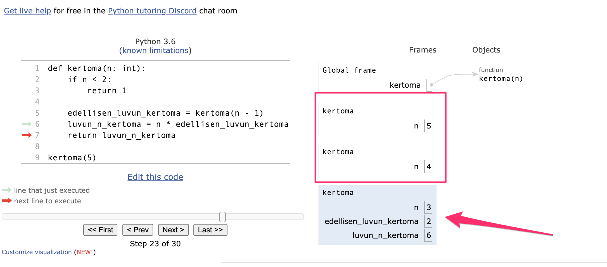

<text-box variant='learningObjectives' name='Oppimistavoitteet'>

Tämän osion jälkeen

- Tiedät mitä tarkoitetaan rekursiolla
- Osaat kirjoittaa itse yksinkertaisen rekursiivisen funktion

</text-box>

Kuten aiemmin on huomattu, funktiot voivat kutsua toisia funktioita. Esimerkiksi näin:

```python
def laske_positiiviset(luvut: list):
    return len([x for x in luvut if x >= 0])

def laske_negatiiviset(luvut: list):
    return len(luvut) - laske_positiiviset(luvut)
```

Kun funktiota voidaan kutsua myös toisesta funktiosta, on oletettavaa, että funktio voi kutsua myös itseään. Jos funktion syöte ei kuitenkaan muutu kutsukertojen välissä, kyseessä on "ikuinen" silmukka:

```python
def huuda(viesti: str):
    s = viesti + "!"
    # lisää huutomerkkejä?
    return huuda(viesti)
```

Tällöin funktion kutsuminen millä tahansa merkkijonolla antaa virheilmoituksen:

<sample-output>

RecursionError: maximum recursion depth exceeded

</sample-output>

## Mitä rekursio tarkoittaa?

Virheilmoituksessakin mainitulla _rekursiolla_ tarkoitetaan sitä, että funktio kutsuu itseään. Rekursiossa funktion syötteen pitää kuitenkin muuttua niin, että jossain vaiheessa kutsuminen lopetetaan. Perusperiaate on sama kuin silmukoissa: jotta silmukka päättyisi, tulee ehtolausekkeeseen vaikuttavien muuttujien arvojen muuttua lohkon sisällä kohti tilannetta, jossa ehtolauseke on epätosi.

Tarkastellaan aluksi yksinkertaista funktiota, joka lisää listan loppuun nolla-alkioita niin kauan kuin pituus on alle 10. Silmukan sijasta funktio kutsuukin itseään uudestaan, jos ehto ei täyty:

```python

def tayta_lista(luvut: list):
    """ Lisää listaan alkoita jos sen pituus on alle 10 """
    if len(luvut) < 10:
        luvut.append(0)
        # Kutsutaan uudestaaan
        tayta_lista(luvut)


if __name__ == "__main__":
    testi = [1,2,3,4]
    tayta_lista(testi)
    print(testi)

```

<sample-output>

[1, 2, 3, 4, 0, 0, 0, 0, 0, 0]

</sample-output>

Perinteisellä silmukalla ohjelma näyttäisi esimerkiksi tältä:

```python

def tayta_lista(luvut: list):
    """ Lisää listaan alkoita jos sen pituus on alle 10 """
    while len(luvut) < 10:
        luvut.append(0)

if __name__ == "__main__":
    testi = [1,2,3,4]
    tayta_lista(testi)
    print(testi)

```

Esimerkeistä huomataan, että perinteinen (eli _iteratiivinen_) lähestymistapa tuottaa lyhyemmän ja selkeämmän ohjelman.
Rekursiivinen ohjelma kuitenkin toimii ja tuottaa oikean lopputuloksen, koska funktio käsittelee jokaisella kutsukerralla samaa listaa viittauksen kautta.

<text-box variant="hint" name="Iteratiivinen vai rekursiivinen?">

Tietojenkäsittelytieteteessä erotetaan usein _iteratiiviset_ ja _rekursiiviset_ algoritmit. Iteratiivinen tarkoittaa kurssilla tähän asti yleensä käyttämäämme tapaa, jossa ratkaisu perustuu peräkkäisyyteen - yleensä siihen, että käsitellään rakenne silmukassa. Rekursiivinen tarkoittaa vaihtoehtoista tapaa, jossa funktio silmukan sijasta (tai lisäksi) kutsuu itseään muuttuvalla parametrin arvolla.

Mikä tahansa algoritmi on periaatteessa mahdollista toteuttaa sekä iteraiivisesti että rekursiivisesti, mutta monessa tapauksessa jompikumpi tapa soveltuu selkeästi paremmin ongelman ratkaisemiseen.

</text-box>

<programming-exercise name='Suurempia lukuja' tmcname='osa11-13_listaan_lukuja'>

Kirjoita _rekursiivinen funktio_ `listaan_lukuja(luvut: list)`, joka lisää listaan lukuja niin kauan, että sen pituus on viidellä jaollinen. Jokainen listaan lisättävä luku on aina yhden suurempi kuin listan viimeinen luku.

Funktion pitää kutsua itseään rekursiivisesti.

Esimerkki funktion kutsusta:

```python
luvut = [1,3,4,5,10,11]
listaan_lukuja(luvut)
print(luvut)
```

<sample-output>

[1, 3, 4, 5, 10, 11, 12, 13, 14, 15]

</sample-output>

</programming-exercise>

## Rekursio ja paluuarvot

Jos käsiteltävä olio on muuttumaton (eli mutatoitumaton), niin kuin vaikkapa merkkijono tai luku, pitäisi se myös palauttaa rekursiivisesta funktiosta. Tarkastellaan tätä tarkoitusta varten esimerkkiä, joka laskee kertoman rekursiivisesti:

```python

def kertoma(n: int):
    """ Funktio laskee positiivisen luvun n kertoman n!, eli n * (n-1) ... * 2 * 1 """
    if n < 2:
        # Lukujen 0 ja 1 kertoma on 1
        return 1

    # Kutsuu funktiota uudestaan
    return n * kertoma(n - 1)

if __name__ == "__main__":
    # Testataan
    for i in range(1, 7):
        print(f"Luvun {i} kertoma on {kertoma(i)}")

```

<sample-output>

Luvun 1 kertoma on 1
Luvun 2 kertoma on 2
Luvun 3 kertoma on 6
Luvun 4 kertoma on 24
Luvun 5 kertoma on 120
Luvun 6 kertoma on 720

</sample-output>

Jos funktion parametrin arvo on 0 tai 1, funktio palauttaa 1 (koska kertoman määritelmän mukaan lukujen 0 ja 1 kertoma on 1). Muuten funktio palauttaa erikoisen näköisen lausekkeen:

`n * kertoma(n - 1)`

Funktio siis kertoo parametrin n funktion itsensä kutsun palauttamalla arvolla.

Olennaista funktion toimivuuden kannalta on, että funktiossa on määritelty ehto, jolla se ei kutsu itseään enää uudestaan. Tässä tapauksessa ehto on `n < 2`.

[Visualisaattori](http://www.pythontutor.com/visualize.html#mode=edit) on oivallinen väline rekursiota käyttävien ohjelmien tutkimiseksi.

Laajennetaan kertoman laskevaa funktiota niin, että se käyttää apumuuttujia:

```python
def kertoma(n: int):
    if n < 2:
        return 1

    edellisen_luvun_kertoma = kertoma(n - 1)
    luvun_n_kertoma = n * edellisen_luvun_kertoma
    return luvun_n_kertoma

kertoma(5)
```

Kokeile, miten [visualisaattori](http://www.pythontutor.com/visualize.html#code=def%20kertoma%28n%3A%20int%29%3A%0A%20%20%20%20if%20n%20%3C%202%3A%0A%20%20%20%20%20%20%20%20return%201%0A%0A%20%20%20%20edellisen_luvun_kertoma%20%3D%20kertoma%28n%20-%201%29%0A%20%20%20%20luvun_n_kertoma%20%3D%20n%20*%20edellisen_luvun_kertoma%0A%20%20%20%20return%20luvun_n_kertoma%0A%20%20%20%20%0Akertoma%285%29&cumulative=false&curInstr=5&heapPrimitives=nevernest&mode=display&origin=opt-frontend.js&py=3&rawInputLstJSON=%5B%5D&textReferences=false) demonstroi rekursion etenemisen.

Hieman normaalista poiketen visualisaattorissa kutsupino "kasvaa" alaspäin. Suorituksessa oleva funktiokutsu on kutsupinon alimpana oleva sinisellä merkitty "lohko", jolla on omat muuttujansa. Hetken kuluttua palautettava tulos on laskettu muuttujaan `luvun_n_kertoma`.



Tarkastellaan vielä toista funktiota, joka laskee Fibonaccin n:nen luvun rekursiivisesti. Fibonaccin lukusarjassa luku on aina kahden edellisen luvun summa. Niinpä sarjan alku näyttää tältä: 1, 1, 2, 3, 5, 8, 13, 21, 34.

```python
def fibonacci(n: int):
    """ Funktio palauttaa n:nen luvun Fibonaccin sarjasta (1, 1, 2, 3, 5, 8 jne.); n > 0"""

    if n <= 2:
        # Kaksi ekaa lukua ovat ykkösiä
        return 1

    # Muuten luku saadaan laskemalla kaksi edellistä yhteen
    return fibonacci(n - 1) + fibonacci(n - 2)

# Testataan, että toimii
if __name__ == "__main__":
    for i in range(1, 11):
        print(f"Fibonaccin {i}. luku on {fibonacci(i)}")
```

<sample-output>

Fibonaccin 1. luku on 1
Fibonaccin 2. luku on 1
Fibonaccin 3. luku on 2
Fibonaccin 4. luku on 3
Fibonaccin 5. luku on 5
Fibonaccin 6. luku on 8
Fibonaccin 7. luku on 13
Fibonaccin 8. luku on 21
Fibonaccin 9. luku on 34
Fibonaccin 10. luku on 55

</sample-output>

Tällä kertaa lopetusehtona on, että luku on pienempi tai yhtä suuri kuin 2, koska Fibonaccin kaksi ensimmäistä lukua ovat molemmat ykkösiä.

Miten algoritmi käytännössä oikein toimii?

Luvuille 1 ja 2 algoritmi palauttaa arvon 1 ehdon `n <= 2` mukaisesti.

Luvulle 3 algoritmi palauttaa arvon lausekkeesta `fibonacci(n - 1) + fibonacci(n - 2)`, eli käytännössä lausekkeen `fibonacci(2) + fibonacci(1)`. Koska edellisessä kohdassa huomattiin, että näiden molempien arvo on 1, palauttaa funktio siis arvon 2 (joka onkin kolmas Fibonaccin luku)

Luvulle 4 algoritmi palauttaa arvon lausekkeesta `fibonacci(3) + fibonacci(2)`, mikä edellisten kohtien perusteella on siis `2 + 1` eli 3.

Luvulle 5 algoritmi palauttaa arvon lausekkeesta `fibonacci(4) + fibonacci(3)`, mikä edellisten kohtien perusteella on siis `3 + 2` eli 5.

jne.

Rekursiivinen algoritmimme siis toimii, koska voimme todistaa jokaisen luvun kohdalla ohjelman toimivuuden aikaisempien lukujen perusteella.

<programming-exercise name='Rekursiivinen summa' tmcname='osa11-14_rekursiivinen_summa'>

Tee rekursiivinen funktio `summa(luku: int)` summan `1 + 2 + ... + luku` laskemiseen. Funktion runko on seuraava:

```python
def summa(luku: int):
    # kun luku on 1, ei ole muita summattavia...
    if luku <= 1:
        return luku

    # täydennä koodi...
```

Muutama käyttöesimerkki:

```python
tulos = summa(3)
print(tulos)

print(summa(5))
print(summa(10))
```

<sample-output>

6
15
55

</sample-output>

</programming-exercise>

<programming-exercise name='Sulut tasapainossa' tmcname='osa11-15_sulut_tasapainossa'>

Tehtäväpohjassa on valmiina funktio `sulut_tasapainossa`, joka tarkastaa, onko sen parametrina olevassa merkkijonossa sulut tasapainossa, eli onko jokaista "aukeavaa" sulkumerkkiä ( kohti on oma "sulkeutuva" sulkumerkki ), ja että sulut eivät mene ristiin.

```python
def sulut_tasapainossa(merkkijono: str):
    if len(merkkijono) == 0:
        return True
    if not (merkkijono[0] == '(' and merkkijono[-1] == ')'):
        return False

    # poistetaan ensimmäinen ja viimeinen merkki
    return sulut_tasapainossa(merkkijono[1:-1])

ok = sulut_tasapainossa("(((())))")
print(ok)

# ei kelpaa sillä yksi loppusulku liikaa
ok = sulut_tasapainossa("()())")
print(ok)

# ei kelpaa sillä alussa virheellinen loppusulku
ok = sulut_tasapainossa(")()")
print(ok)

# ei kelpaa, sillä funktio ei osaa käsitellä kuin sisäkkäisiä sulkuja
ok = sulut_tasapainossa("()(())")
print(ok)
```

<sample-output>

True
False
False
False

</sample-output>

Laajenna funktiota siten, että se jättää huomiotta kaikki muut kuin sulkumerkit, ja että se osaa kaarisulkujen lisäksi myös hakasulut. Haka- ja kaarisulut eivät saa mennä ristiin!

Seuraavassa muutama käyttöesimerkki:

```python
ok = sulut_tasapainossa("([([])])")
print(ok)

ok = sulut_tasapainossa("(python versio [3.7]) käytä tätä!")
print(ok)

# ei kelpaa sillä virheellinen loppusulku
ok = sulut_tasapainossa("(()]")
print(ok)


# ei kelpaa sillä erityyppiset sulut menevät ristiin
ok = sulut_tasapainossa("([huono)]")
print(ok)
```

Huomaa, että funktion ei tarvitse osata kuin yksi sisäkkäinen sulutus - sen ei siis tarvitse ymmärtää esimerkiksi jonoa (x + 1)(y + 1).

<sample-output>

True
True
False
False

</sample-output>

</programming-exercise>

## Häntärekursio

Edellisen kaltaisia rekursiivisia ratkaisuja nimitetään myös _häntärekursioksi (tail recursion)_. Tällä tarkoitetaan rekursiota, jossa vakiomuotoinen paluuarvo (esim kertoman tapauksessa arvo 1) aiheuttaa koko rekursiopinon "purkautumisen" ilman uusia rekursiivisia kutsuja. Häntärekursioesimerkit on usein helppo kirjoittaa myös iteratiivisesti. Alla on esitetty kertomafunktiosta sekä rekursiivinen että iteratiivinen versio:

```python
def kertoma_rekursiivinen(n):
    """ Funktio laskee luvun n kertoman n!, eli n * (n-1) ... * 2 * 1 """
    if n < 2:
        return 1

    if n == 2:
        return 2

    return n * kertoma_rekursiivinen(n - 1)

def kertoma_iteratiivinen(n):
    """ Funktio laskee luvun n kertoman n!, eli n * (n-1) ... * 2 * 1 """
    luku = 1
    while n >= 2:
        luku *= n
        n -= 1

    return luku
```

Kutsujan kannalta molempien funktioiden toiminnallisuus on samanlainen. Ohjelmoija voi itse päättää, kumpi tapa tuntuu selkeämmältä.

Tietyissä tapauksissa rekursiivinen algoritmi on myös häntärekursion tapauksessa yleensä selkeämpi. Tarkastellaan tästä esimerkkinä binäärihakualgoritmia.

Binäärihaussa yritetään löytää luonnollisessa järjestyksessä olevasta listasta annettu alkio. Luonnollinen järjestys tarkoittaa tässä yhteydessä esimerkiksi lukujen järjestystä pienimmästä suurimpaan tai nimiä aakkosjärjestyksessä.

Binäärihaun ideana on, että tarkastellaan aina listan keskimmäistä alkiota. Jos
- keskimmäinen alkio on etsitty alkio, palautetaan tieto siitä, että alkio löytyi
- keskimmäinen alkio on pienempi kuin etsittävä alkio, rajataan haku listan jälkimmäiselle puolikkaalle
- keskimmäinen alkio on suurempi kuin etsittävä alkio, rajataan haku listan ensimmäiselle puolikkaalle

Jos lista on tyhjä, palautetaan tieto siitä, että alkiota ei löytynyt.

Seuraava kuva havainnollistaa binäärihaun etenemistä, kun etsitään listasta lukua 24:


Rekursiivinen algoritmi binäärihaulle:

```python

def binaarihaku(lista: list, alkio: int):
    """ Funktio palauttaa True tai False sen mukaan löytyykö alkio listasta """
    # Jos lista on tyhjä, ei löydy
    if not lista:
        return False

    # Keskimmäinen alkio
    keskialkio = lista[len(lista) // 2]

    # Jos on etsittävä
    if keskialkio == alkio:
        return True

    # Jos pienempi, etsi jälkipuoliskolta
    if keskialkio < alkio:
        return binaarihaku(lista[len(lista) // 2 + 1 : ], alkio)

    # Täytyy olla suurempi, etsitään alkupuoliskolta
    return binaarihaku(lista[ : len(lista) // 2], alkio)

if __name__ == "__main__":
    # Testataan
    lista = [1, 2, 4, 5, 7, 8, 11, 13, 14, 18]
    print(binaarihaku(lista, 2))
    print(binaarihaku(lista, 13))
    print(binaarihaku(lista, 6))
    print(binaarihaku(lista, 15))

```

<sample-output>

True
True
False
False

</sample-output>

Binäärihakualgoritmi on helppo toteuttaa Pythonissa, koska listojen pilkkominen `[:]`-operaattorin avulla on vaivatonta.

Jos verrataan binäärihakua _peräkkäishakuun_, algoritmien tehokkuus erottuu selvästi. Peräkkäishaussa alkiota lähdetään etsimään listan alusta ja listaa käydään läpi yksi alkio kerrallaan, kunnes alkio on löytynyt tai on päästy listan loppuun. Jos listan pituus on miljoona alkiota, tarvitaan perättäishaussa koko listan läpikäyntiin miljoona askelta - binäärihaussa askelia tarvitaan vain 20.
