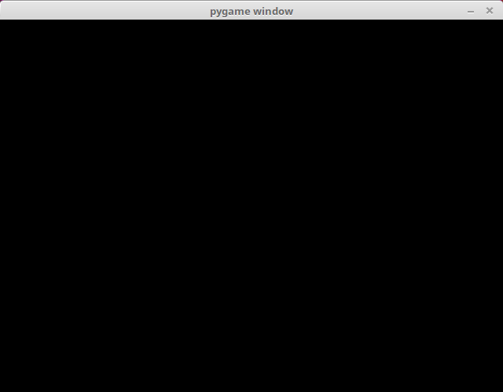
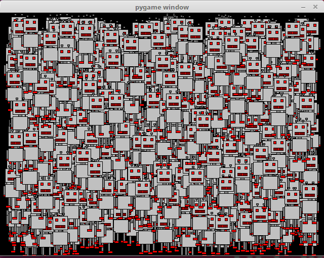

<text-box variant='learningObjectives' name='Oppimistavoitteet'>

Tämän osion jälkeen

- TODO

</text-box>

Kurssin kahdella viimeisellä viikolla tutustumme Pygame-kirjastoon, joka on peliohjelmointiin tarkoitettu Python-kirjasto. Pygamen avulla pystyy piirtämään grafiikkaa, käsittelemään näppäimistön ja hiiren tapahtumia ja tekemään muuta peleissä tarvittavaa.

## Pygamen asentaminen

TODO

## Ensimmäinen ohjelma

Tässä on yksinkertainen Pygamea käyttävä testiohjelma:

```python
import pygame

pygame.init()
naytto = pygame.display.set_mode((640, 480))

while True:
    for tapahtuma in pygame.event.get():
        if tapahtuma.type == pygame.QUIT:
            exit()
```

Kun ohjelma käynnistetään, se näyttää käyttäjälle seuraavanlaisen ikkunan:



Ohjelmassa ei ole kuitenkaan vielä muuta sisältöä kuin ikkunan näyttäminen. Ohjelman suoritus jatkuu niin kauan, kunnes käyttäjä sulkee ikkunan.

Katsotaan seuraavaksi tarkemmin, miten ohjelma on rakentunut. Ohjelman alussa rivi `import pygame` ottaa mukaan Pygame-kirjaston. Kirjaston käyttäminen alkaa kutsumalla funktiota `pygame.init`, minkä jälkeen ohjelma luo ikkunan funktiolla `pygame.display.set_mode`.

```python
pygame.init()
naytto = pygame.display.set_mode((640, 480))
```

Muuttujan `naytto` kautta ikkunaan voidaan viitata myöhemmin esimerkiksi grafiikan piirtämistä varten. Parametri `(640, 480)` tarkoittaa, että tässä ohjelmassa ikkunan leveys on 640 pikseliä ja korkeus on 480 pikseliä.


Tämän jälkeen alkaa ohjelman _pääsilmukka_:

```python
while True:
    for tapahtuma in pygame.event.get():
        if tapahtuma.type == pygame.QUIT:
            exit()
```

Pääsilmukka käsittelee tapahtumat, jotka käyttöjärjestelmä välittää ohjelmalle. Joka kierroksella funktio `pygame.event.get` antaa listan tapahtumista, jotka ovat syntyneet funktion edellisen kutsukerran jälkeen.

Tässä tapauksessa ohjelma käsittelee vain tyyppiä `pygame.QUIT` olevat tapahtumat. Tällainen tapahtuma syntyy, kun käyttäjä sulkee ohjelman esimerkiksi painamalla ikkunan ylänurkassa olevaa raksia. Tämän tapahtuman seurauksena ohjelma sulkee itsensä kutsumalla `exit`-funktiota.

Voit kokeilla, mitä tapahtuu, jos ohjelma ei käsittele tapahtumaa `pygame.QUIT`. Tällöin raksin painamisen ei pitäisi vaikuttaa ohjelman toimintaan, mikä on hämmentävää käyttäjälle. Ohjelman voi kuitenkin tässäkin tapauksessa sulkea väkisin komentoriviltä painamalla Control+C.

## Kuva ohjelmaan

Pelkän ikkunan näyttävä ohjelma on melko tylsä, joten laajennetaan seuraavaksi ohjelmaa niin, että se näyttää ikkunassa kuvan. Tämä onnistuu seuraavasti:

```python
import pygame

pygame.init()
naytto = pygame.display.set_mode((640, 480))

robo = pygame.image.load("robo.png")
naytto.blit(robo, (100, 50))
pygame.display.flip()

while True:
    for tapahtuma in pygame.event.get():
        if tapahtuma.type == pygame.QUIT:
            exit()
```

Koodi käyttää kuvaa `robo.png`, jossa on robotin kuva:


TODO: miten robotin kuvan saa omaan ohjelmaan?

Nyt ikkuna näyttää tältä:


Tässä funktio `pygame.image.load` lataa muuttujaan tiedostossa `robo.png` olevan kuvan. Tämän jälkeen metodi `blit` piirtää kuvan ikkunaan kohtaan `(100, 50)` ja sitten funktio `pygame.display.flip` päivittää ikkunan sisällön. Kohta `(100, 50)` tarkoittaa, että kuvan _vasen yläkulma_  on kyseisessä kohdassa.

Huomaa, että Pygamessa ja yleensä muutenkin ohjelmoinnissa koordinaatisto on rakennettu niin, että piirtoalueen vasen yläkulma on kohdassa `(0, 0)` ja koordinaatit kasvavat x-suunnassa oikealle ja y-suunnassa alaspäin. Tässä tapauksessa ikkunan oikean alakulman koordinaatit ovat `(640, 480)`.

Kuvan voi piirtää moneenkin kohtaan ikkunassa. Esimerkiksi seuraava koodi piirtää kuvan kolmeen eri kohtaan:

```python
naytto.blit(robo, (0, 0))
naytto.blit(robo, (300, 0))
naytto.blit(robo, (100, 200))
```

Tällöin ikkuna näyttää seuraavalta:


Seuraava koodi puolestaan piirtää kuvan ikkunan keskelle:

```python
leveys = robo.get_width()
korkeus = robo.get_height()
naytto.blit(robo, (320-leveys/2, 240-korkeus/2))
```

Nyt ikkuna näyttää tältä:


Tässä metodi `get_width` antaa kuvan leveyden ja vastaavasti metodi `get_height` antaa kuvan korkeuden. Ikkunan keskikohta on `(320, 240)`, joten tämän avulla saadaan laskettua sopiva kohta kuvan vasemmalle yläkulmalle niin, että kuva sijoittuu ikkunan keskelle.

<programming-exercise name='Neljä robottia' tmcname=''>

Tee ohjelma, joka piirtää robotin jokaiseen ikkunan neljään nurkkaan. Ohjelman suorituksen tulee näyttää tältä:


</programming-exercise>

<programming-exercise name='Robotit rivissä' tmcname=''>

Tee ohjelma, joka piirtää kymmenen robottia riviin. Ohjelman suorituksen tulee näyttää tältä:


</programming-exercise>

<programming-exercise name='Sata robottia' tmcname=''>

Tee ohjelma, joka piirtää sata robottia: kymmenen riviä ja joka rivissä kymmenen robottia. Ohjelman suorituksen tulee näyttää tältä:


</programming-exercise>

<programming-exercise name='Satunnaiset robotit' tmcname=''>

Tee ohjelma, joka piirtää _tuhat_ robottia satunnaisiin paikkoihin. Ohjelman suorituksen tulee näyttää tältä:



</programming-exercise>
