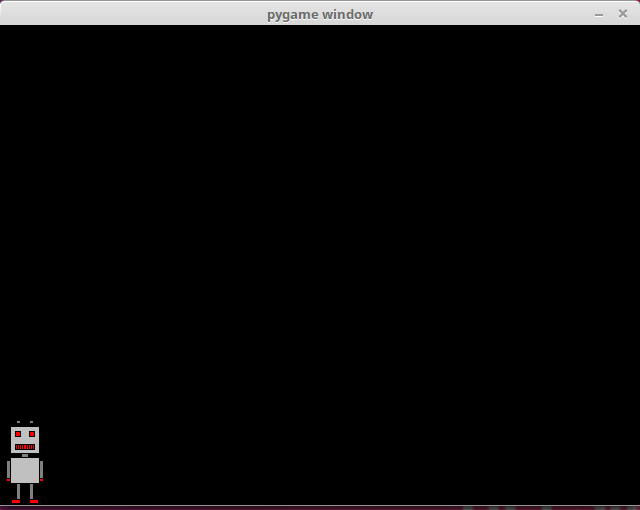
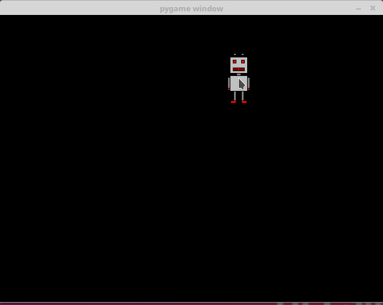

<text-box variant='learningObjectives' name='Oppimistavoitteet'>

Tämän osion jälkeen

- TODO

</text-box>

Tähän asti olemme toteuttaneet Pygame-ohjelman pääsilmukan niin, että se käy läpi tapahtumat ja tunnistaa tapahtuman `pygame.QUIT`, mutta ei käsittele muita tapahtumia. Nyt on aika tutustua tarkemmin tapahtumien käsittelyyn.

## Tapahtumien käsittely

Seuraavan koodi näyttää, mitä tapahtumia syntyy ohjelman suorituksen aikana:

```python
import pygame

pygame.init()
naytto = pygame.display.set_mode((640, 480))

while True:
    for tapahtuma in pygame.event.get():
        print(tapahtuma)
        if tapahtuma.type == pygame.QUIT:
            exit()
```

Kun ohjelmaa käytetään hetki, se voi tulostaa esimerkiksi seuraavanlaisia tapahtumia:

```x
<Event(4-MouseMotion {'pos': (495, 274), 'rel': (495, 274), 'buttons': (0, 0, 0), 'window': None})>
<Event(4-MouseMotion {'pos': (494, 274), 'rel': (-1, 0), 'buttons': (0, 0, 0), 'window': None})>
<Event(4-MouseMotion {'pos': (492, 274), 'rel': (-2, 0), 'buttons': (0, 0, 0), 'window': None})>
<Event(4-MouseMotion {'pos': (491, 274), 'rel': (-1, 0), 'buttons': (0, 0, 0), 'window': None})>
<Event(5-MouseButtonDown {'pos': (491, 274), 'button': 1, 'window': None})>
<Event(6-MouseButtonUp {'pos': (491, 274), 'button': 1, 'window': None})>
<Event(2-KeyDown {'unicode': 'a', 'key': 97, 'mod': 0, 'scancode': 38, 'window': None})>
<Event(3-KeyUp {'key': 97, 'mod': 0, 'scancode': 38, 'window': None})>
<Event(2-KeyDown {'unicode': 'b', 'key': 98, 'mod': 0, 'scancode': 56, 'window': None})>
<Event(3-KeyUp {'key': 98, 'mod': 0, 'scancode': 56, 'window': None})>
<Event(2-KeyDown {'unicode': 'c', 'key': 99, 'mod': 0, 'scancode': 54, 'window': None})>
<Event(3-KeyUp {'key': 99, 'mod': 0, 'scancode': 54, 'window': None})>
<Event(12-Quit {})>
```

Tässä ensimmäiset tapahtumat liittyvät hiiren käyttämiseen, seuraavat tapahtumat näppäimistön käyttämiseen ja viimeinen tapahtuma sulkee ohjelman. Jokaisella tapahtumalla on tyyppi ja mahdollisesti lisätietoa, josta voi päätellä esimerkiksi hiiren sijainnin tai painetun näppäimen.

Tapahtumia voi etsiä Pygamen dokumentaatiosta mutta usein tehokas tapa löytää sopiva tapahtuma on käyttää yllä olevaa koodia ja tutkia, millainen tapahtuma syntyy, kun ohjelmassa tapahtuu haluttu asia.

## Näppäimistön käsittely

Seuraava ohjelma tunnistaa tapahtumat, joissa käyttäjä painaa oikealle tai vasemmalle nuolinäppäintä. Ohjelma tulostaa testiksi tiedon näppäimen painamisesta.

```python
import pygame

pygame.init()
naytto = pygame.display.set_mode((640, 480))

while True:
    for tapahtuma in pygame.event.get():
        if tapahtuma.type == pygame.KEYDOWN:
            if tapahtuma.scancode == 79:
                print("oikealle")
            if tapahtuma.scancode == 80:
                print("vasemmalle")
        if tapahtuma.type == pygame.QUIT:
            exit()
```

TODO: Näppäinkoodit vaihtelevat eri ympäristöissä

Tässä näppäinkoodit 79 ja 80 tarkoittavat nuolinäppäimiä oikealle ja vasemmalle. Nämä koodit on saatu selville tutkimalla, mitä tapahtumia syntyy, kun käyttäjä painaa nuolinäppäimiä.

Esimerkiksi kun käyttäjä painaa ensin kahdesti oikealle, sitten kerran vasemmalle ja lopuksi kerran oikealle, ohjelman tulostus on seuraava:

```x
oikealle
oikealle
vasemmalle
oikealle
```

Voimme nyt tehdä ohjelman, jossa käyttäjä pystyy liikuttamaan hahmoa oikealle ja vasemmalle nuolinäppäimillä. Tämä onnistuu seuraavasti:

```python
import pygame

pygame.init()
naytto = pygame.display.set_mode((640, 480))

robo = pygame.image.load("robo.png")
x = 0
y = 480-robo.get_height()

while True:
    for tapahtuma in pygame.event.get():
        if tapahtuma.type == pygame.KEYDOWN:
            if tapahtuma.scancode == 79:
                x += 10
            if tapahtuma.scancode == 80:
                x -= 10
        if tapahtuma.type == pygame.QUIT:
            exit()
    naytto.fill((0, 0, 0))
    naytto.blit(robo, (x, y))
    pygame.display.flip()
```

Ohjelman suoritus voi näyttää seuraavalta:



Tässä muuttujat `x` ja `y` sisältävät hahmon sijainnin. Käyttäjä pystyy muuttamaan muuttujaa `x`, ja muuttuja `y` on asetettu niin, että hahmo on ikkunan alalaidassa. Kun käyttäjä painaa oikealle tai vasemmalle nuolinäppäintä, hahmo liikkuu vastaavasti 10 pikseliä oikealle tai vasemmalle.

Yllä oleva ohjelma toimii muuten hyvin, mutta pelikokemuksessa on puutteena, että näppäintä pitää painaa uudestaan aina, kun haluaa liikkua askeleen oikealle tai vasemmalle. Olisi parempi, että voi pitää näppäintä pohjassa ja hahmo liikkuu niin kauan, kuin näppäin on pohjassa. Seuraava koodi mahdollistaa tämän:

```python
import pygame

pygame.init()
naytto = pygame.display.set_mode((640, 480))

robo = pygame.image.load("robo.png")
x = 0
y = 480-robo.get_height()

oikealle = False
vasemmalle = False

kello = pygame.time.Clock()

while True:
    for tapahtuma in pygame.event.get():
        if tapahtuma.type == pygame.KEYDOWN:
            if tapahtuma.scancode == 79:
                oikealle = True
            if tapahtuma.scancode == 80:
                vasemmalle = True
        if tapahtuma.type == pygame.KEYUP:
            if tapahtuma.scancode == 79:
                oikealle = False
            if tapahtuma.scancode == 80:
                vasemmalle = False
        if tapahtuma.type == pygame.QUIT:
            exit()
    if oikealle:
        x += 2
    if vasemmalle:
        x -= 2
    naytto.fill((0, 0, 0))
    naytto.blit(robo, (x, y))
    pygame.display.flip()
    kello.tick(60)
```

Koodissa on nyt muuttujat `oikealle` ja `vasemmalle`, joissa pidetään tietoa siitä, kuuluuko hahmon liikkua tällä hetkellä oikealle tai vasemmalle. Kun käyttäjä painaa alas nuolinäppäimen, vastaava muuttuja saa arvon `True`, ja kun käyttäjä nostaa alas nuolinäppäimen, vastaava muuttuja saa arvon `False`.

Hahmon liike on tahdistettu kellon avulla niin, että liikkumista tapahtuu 60 kertaa sekunnissa. Jos nuolinäppäin on alhaalla, hahmo liikkuu 2 pikseliä oikealle tai vasemmalle. Tämän seurauksena hahmo liikkuu 120 pikseliä sekunnissa, jos nuolinäppäin on painettuna.

## Hiiren käsittely

Seuraava koodi tunnistaa tapahtumat, jossa käyttäjä painaa hiiren nappia ikkunan alueella:

```python
import pygame

pygame.init()
naytto = pygame.display.set_mode((640, 480))

while True:
    for tapahtuma in pygame.event.get():
        if tapahtuma.type == pygame.MOUSEBUTTONDOWN:
            print("painoit nappia", tapahtuma.button, "kohdassa", tapahtuma.pos)
        if tapahtuma.type == pygame.QUIT:
            exit()
```

Ohjelman suoritus voi näyttää tältä:

```x
painoit nappia 1 kohdassa (82, 135)
painoit nappia 1 kohdassa (369, 135)
painoit nappia 1 kohdassa (269, 297)
painoit nappia 3 kohdassa (515, 324)
```

Tässä nappi 1 tarkoittaa hiiren vasenta nappia ja nappi 3 tarkoittaa hiiren oikeaa nappia.

Seuraava ohjelma yhdistää hiiren käsittelyn ja kuvan piirtämisen. Kun käyttäjä painaa hiirellä ikkunan alueella, robotti piirretään hiiren kohtaan.

```python
import pygame

pygame.init()
naytto = pygame.display.set_mode((640, 480))

robo = pygame.image.load("robo.png")

while True:
    for tapahtuma in pygame.event.get():
        if tapahtuma.type == pygame.MOUSEBUTTONDOWN:
            x = tapahtuma.pos[0]-robo.get_width()/2
            y = tapahtuma.pos[1]-robo.get_height()/2
            naytto.fill((0, 0, 0))
            naytto.blit(robo, (x, y))
            pygame.display.flip()
        if tapahtuma.type == pygame.QUIT:
            exit()
```

Ohjelman suoritus voi näyttää tältä:


Seuraava ohjelma puolestaan toteuttaa animaation, jossa robotti seuraa hiirtä. Robotin sijainti on muuttujissa `robo_x` ja `robo_y`, ja kun hiiri liikkuu, sen sijainti merkitään muuttujiin `kohde_x` ja `kohde_y`. Jos robotti ei ole hiiren kohdalla, se liikkuu sopivaan suuntaan.

```python
import pygame

pygame.init()
naytto = pygame.display.set_mode((640, 480))

robo = pygame.image.load("robo.png")

robo_x = 0
robo_y = 0
kohde_x = 0
kohde_y = 0

kello = pygame.time.Clock()

while True:
    for tapahtuma in pygame.event.get():
        if tapahtuma.type == pygame.MOUSEMOTION:
            kohde_x = tapahtuma.pos[0]-robo.get_width()/2
            kohde_y = tapahtuma.pos[1]-robo.get_height()/2
        if tapahtuma.type == pygame.QUIT:
            exit(0)
    naytto.fill((0, 0, 0))
    if robo_x > kohde_x:
        robo_x -= 1
    if robo_x < kohde_x:
        robo_x += 1
    if robo_y > kohde_y:
        robo_y -= 1
    if robo_y < kohde_y:
        robo_y += 1
    naytto.blit(robo, (robo_x, robo_y))
    pygame.display.flip()
    kello.tick(60)
```

Ohjelman suoritus voi näyttää tältä:


<programming-exercise name='Neljä suuntaa' tmcname=''>

Tee ohjelma, jossa pelaaja pystyy ohjaamaan robottia neljään suuntaan nuolinäppäimillä. Ohjelman suorituksen tulee näyttää tältä:


</programming-exercise>

<programming-exercise name='Neljä seinää' tmcname=''>

Paranna edellistä ohjelmaa niin, että robotti ei pysty menemään ikkunan ulkopuolelle mistään reunasta. Ohjelman suorituksen tulee näyttää tältä:


</programming-exercise>

<programming-exercise name='Kaksi pelaajaa' tmcname=''>

Tee ohjelma, jossa kaksi pelaajaa voi ohjata omia robottejaan. Toinen pelaaja käyttää nuolinäppäimiä ja toinen esimerkiksi w-s-a-d. Ohjelman suorituksen tulee näyttää tältä:


</programming-exercise>

<programming-exercise name='Robotti ja hiiri' tmcname=''>

Tee ohjelma, jossa robotti seuraa hiirtä niin, että robotin keskikohta on aina hiiren kohdalla. Ohjelman suorituksen tulee näyttää tältä:



</programming-exercise>

<programming-exercise name='Robotin paikka' tmcname=''>

Tee ohjelma, jossa robotti on satunnaisessa paikassa ikkunassa. Kun pelaaja painaa hiirellä robotista, se siirtyy aina uuteen paikkaan. Ohjelman suorituksen tulee näyttää tältä:


</programming-exercise>
