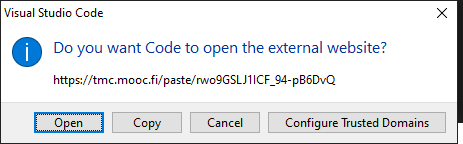

## Viikon tehtävä

Tämän viikon tehtäväsi on tehdä oma pieni peli Pygamen avulla. Peliä varten tehtäväpohjassa on joukko kuvia, joita voit käyttää pelissä. Älä käytä muita kuvia, jotta muutkin pystyvät kokeilemaan peliä koodin perusteella.

Saat päättää pelin aiheen itse, ja pelin tulisi olla suunnilleen saman laajuinen kuin tämän viikon esimerkki. Pelin tulisi noudattaa seuraavia vaatimuksia:

* Pelissä on hahmo, jota pelaaja pystyy liikuttamaan
* Pelissä on kerättäviä asioita ja/tai vihollisia
* Pelaajalla on jokin selkeä tavoite
* Pelissä on laskuri, joka näyttää, miten pelaaminen sujuu
* Pelin koodi on jaettu sopivasti funktioihin tämän viikon esimerkin tyylisesti

Kun peli on valmis, lähetä se vertaisarviointiin alla olevan lomakkeen avulla. Tämän jälkeen tutustu vielä kahden muun kurssilaisen peliin ja anna niille mielestäsi sopiva arvosana ja kirjoita lyhyt arvio peleistä. Ota arvioinnissa huomioon sekä pelin kiinnostavuus ja pelattavuus että koodin selkeys.

### Pelin lähettäminen

Pelin lähetys onnistuu lähettämällä oma ohjelmakoodi TMC Paste -ominaisuuden avulla palvelimelle ja liittämällä linkki palautuslomakkeeseen.

Klikkaa ensin TMC-painiketta (silmän oikealla puolella oleva painike). Tämä avaa valikon, josta löydät oikean ominaisuuden kirjoittamalla hakukenttään sanan `send`:

Kun klikkaat valintaa `Send Exercise to TMC Paste`, ruudun oikeaan alakulmaan putkahtaa tieto siitä, että ohjelmakoodi on lähetetty palvelimelle:

Saat linkin kopioitua leikepöydälle klikkaamalla painiketta `Open URL` ja valitsemalla aukeavasta ikkunasta valihtoehdon `Copy`.

Tämä linkki sinun tulee liittää palautuslomakkeeseen.

## Osan 14 arvioinnista

Tämän viikon tavoitteena on saada aikaan toimiva peli. Koska osassa on vain yksi tehtävä, *myös yritys hyväksytään*. Voit siis palauttaa pelisi vaikka se ei toimisikaan haluamallasi tavalla.

Jos et saa peliä toimimaan, kirjoita ohjelmakoodin kommentteihin miten pelin (tai jonkin puuttuvan ominaisuuden) olisi tarkoitus toimia.

Kun arvioit (osittain tai kokonaan) toimimatonta peliä, pyri arviossasi mahdollisuuksien mukaan kertomaan mitä pelin valmiiksi saaminen olisi mielestäsi vaatinut.

## Peli-ideoita

Voit valita pelin aiheen vapaasti mutta tässä on joitakin ideoita. Pelin tekemisessä on hyötyä myös viikon 13 materiaalista.

### Keräilypeli

* Pelaaja liikuttaa robottia nuolinäppäimillä
* Ruudulla on kolikko, joka robotin tulee kerätä. Kun robotti saa kolikon, se siirtyy uuteen paikkaan.
* Ruudulla liikkuu myös hirviöitä, joita robotin tulee väistellä.

### Rahasade

* Ruudun alareunassa on robotti, jota pelaaja voi liikuttaa vasemmalle tai oikealle
* Taivaalta sataa rahaa, jota robotin tulee kerätä.
* Taivaalta sataa myös hirviöitä, joita robotin tulee väistellä.

## Vertaisarviointi

Arvioi peliä esimerkiksi seuraavien kriteerien mukaan:

* Miltä peli näyttää?
* Onko peli *pelattava*, ts. onko sen pelaaminen hauskaa ja sujuvaa?
* Onko peli-idea kiinnostava?
* Miten hyvin peliohjelma on kirjoitettu? Onko pelissä hyödynnetty tarvittavissa kohdin järkevästi funktioita ja luokkia?

Hyvään arvioon kuuluu yleensä se, että löydät ohjelmasta sekä hyviä puolia että jotain kehitettävää.

<quiz id="a3101454-6036-54b2-9b78-99064a8c9efe"></quiz>

## Loppukysely

Vastaa ensin osion loppukyselyyn...

<quiz id="45f0730f-4793-5430-835a-3e87aeaa23c2"></quiz>

...ja sitten vielä koko kurssin loppukyselyyn:

<quiz id="bed259bc-56d7-5acb-91bf-3f5d174923db"></quiz>

