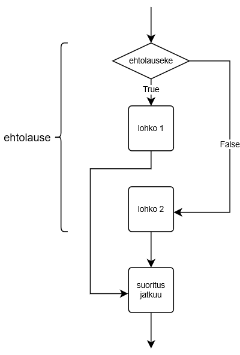

<text-box variant='learningObjectives' name='Oppimistavoitteet'>

Tämän osion jälkeen

- Osaat luoda vaihtoehtoisia haaroja toistolauseisiin
- Ymmärrät `if`-, `elif`- ja `else`-lauseiden merkityksen ehtolauseessa
- Osaat soveltaa jakojäännöstä `%` ehdoissa

</text-box>

Tarkastellaan ohjelmaa, joka tulostaa tiedon siitä, onko käyttäjän syöte negatiivinen vai positiivinen tai nolla:

```python
luku = int(input("Anna luku: "))

if luku < 0:
    print("Luku on negatiivinen")

if luku >= 0:
    print("Luku on positiivinen tai nolla")
```

Ohjelma on hiukan kömpelö. Jokaisen mahdollisen syötteen kohdalla halutaan suorittaa vain toinen lohkoista, koska aina pätee joko `luku < 0` tai `luku >= 0`. Ensimmäinen vertailu sisältää tavallaan kaiken olennaisen: jos tulos on tosi, luku on negatiivinen, ja jos se on epätosi, luku on positiivinen tai nolla.

Toisen vertailun sijasta onkin usein näppärämpää luoda vaihtoehtoinen haara, joka suoritetaan, _jos ehto on epätosi_. Tätä tarkoitusta varten käytetään `else`-lausetta.

Edellinen esimerkki kirjoitettuna uudestaan:

```python
luku = int(input("Anna luku: "))

if luku < 0:
    print("Luku on negatiivinen")
else:
    print("Luku on positiivinen tai nolla")
```

Kun käytetään if-else-rakennetta, suoritetaan vaihtoehtoisista lohkoista aina jompikumpi. Seuraava kuva havainnollistaa asiaa:



Huomaa, että else-haaraa ei voi olla olemassa ilman edeltävää if-haaraa. Koko if-else-rakenne lohkoineen muodostaa yhden _ehtolauseen_.

Seuraava esimerkki tutkii, onko käyttäjän syöttämä luku parillinen vai ei. Parillisuuden selvittämiseen käytetään jakojäännösoperaattoria `%`. Jakojäännöksellä on kätevä testata luvun parillisuutta: jos luvun jakojäännös kahdella on nolla, luku on parillinen, ja muuten pariton.

```python
luku = int(input("Anna luku: "))

if luku % 2 == 0:
    print("Luku on parillinen")
else:
    print("Luku on pariton")
```

<sample-output>

Anna luku: **5**
Luku on pariton

</sample-output>

Kolmas esimerkki, jossa vertaillaan merkkijonojen samuutta:

```python
oikea = "kissa"
salasana = input("Anna salasana: ")

if salasana == oikea:
    print("Tervetuloa")
else:
    print("Pääsy kielletty")
```

Kaksi esimerkkisuoritusta eri syötteillä:

<sample-output>

Anna salasana: **kissa**
Tervetuloa

</sample-output>

<sample-output>

Anna salasana: **apina**
Pääsy kielletty

</sample-output>


<in-browser-programming-exercise name="Täysi-ikäisyys" tmcname="osa02-04_taysi_ikaisyys" height="400px">

Tee ohjelma, joka kysyy käyttäjän ikää ja kertoo, onko tämä täysi-ikäinen (eli 18-vuotias tai vanhempi).

Esimerkkitulostuksia:

<sample-output>

Kuinka vanha olet? **12**
Et ole täysi-ikäinen!

</sample-output>


<sample-output>

Kuinka vanha olet? **32**
Olet täysi-ikäinen!

</sample-output>

</in-browser-programming-exercise>

## Vaihtoehtoiset haarat elif-lauseella

Usein vaihtoehtoja on kuitenkin enemmän kuin kaksi. Esimerkiksi jalkapallo-ottelun lopputulosta käsitellessä olisi hyvä varautua kolmeen vaihtoehtoiseen lopputulokseen kotijoukkueen kannalta: voitto, häviö tai tasapeli.

Ehtolausetta voidaan laajentaa `elif`-haaralla. Se on lyhenne sanoista "else if", ja tarkoittaa nimensä mukaisesti vaihtoehtoa alkuperäiselle ehdolle.


Tarkastellaan esimerkkiä, jossa selvitetään ottelun voittaja:

```python
maalit_koti = int(input("Kotijoukkueen maalimäärä: "))
maalit_vieras = int(input("Vierasjoukkueen maalimäärä: "))

if maalit_koti > maalit_vieras:
    print("Kotijoukkue voitti!")
elif maalit_vieras > maalit_koti:
    print("Vierasjoukkue voitti!")
else:
    print("Tasapeli!")
```

Kolme esimerkkitulosta eri syötteillä:

<sample-output>

Kotijoukkueen maalimäärä: **4**
Vierasjoukkueen maalimäärä: **2**
Kotijoukkue voitti!

</sample-output>

<sample-output>

Kotijoukkueen maalimäärä: **0**
Vierasjoukkueen maalimäärä: **6**
Vierasjoukkue voitti!

</sample-output>

<sample-output>

Kotijoukkueen maalimäärä: **3**
Vierasjoukkueen maalimäärä: **3**
Tasapeli!

</sample-output>

Esimerkissä ehtolauseessa on siis kolme vaihtoehtoista haaraa, joista suoritetaan aina yksi. Ehtolauseessa `elif`-haaroja voi olla useampia, eikä `else`-haara ole pakollinen.

Esimerkiksi:

```python
print("Joulukalenteri")
pvm = input("Mikä päivä nyt on? ")

if pvm == "24.12.":
    print("Nyt on jouluaatto")
elif pvm == "25.12.":
    print("Nyt on joulupäivä")
elif pvm == "26.12.":
    print("Nyt on tapaninpäivä")

print("Kiitos ja hei.")
```

<sample-output>

Joulukalenteri
Mikä päivä nyt on? **25.12.**
Nyt on joulupäivä
Kiitos ja hei.

</sample-output>

Huomaa, että ehtolauseessa ei edellisessä esimerkissä ole ollenkaan else-haaraa. Jos käyttäjä syöttää jonkin sellaisen päivämäärän, jota ei täytä ehtoa jossain `if`- tai `elif`-lauseessa, ohjelmassa ei suoriteta mitään ehtolauseen kolmesta lohkosta.

<sample-output>

Joulukalenteri
Mikä päivä nyt on? **1.1.**
Kiitos ja hei.

</sample-output>

<in-browser-programming-exercise name=" Suurempi tai yhtäsuuri" tmcname="osa02-05_suurempi_tai_yhtasuuri"  height="400px">

Tee ohjelma, joka kysyy käyttäjältä kaksi kokonaislukua ja tulostaa niistä suuremman. Jos luvut ovat yhtä suuret, ohjelma huomaa myös tämän.

Esimerkkitulostuksia:

<sample-output>

Anna ensimmäinen luku: **5**
Anna toinen luku: **3**
Suurempi luku: 5

</sample-output>

<sample-output>

Anna ensimmäinen luku: **5**
Anna toinen luku: **8**
Suurempi luku: 8

</sample-output>

<sample-output>

Anna ensimmäinen luku: **5**
Anna toinen luku: **5**
Luvut ovat yhtä suuret!

</sample-output>

</in-browser-programming-exercise>


<in-browser-programming-exercise name="Vanhempi" tmcname="osa02-06_vanhempi" height="550px">

Tee ohjelma, joka kysyy kahden henkilön nimen ja iän ja tulostaa vanhemman henkilön nimen.

Esimerkkisyötteitä

<sample-output>

Henkilö 1:
Nimi: **Teppo**
Ikä: **26**
Henkilö 2:
Nimi: **Tiina**
Ikä: **27**
Vanhempi on Tiina

</sample-output>

<sample-output>

Henkilö 1:
Nimi: **Antti**
Ikä: **1**
Henkilö 2:
Nimi: **Venla**
Ikä: **1**
Antti ja Venla ovat yhtä vanhoja

</sample-output>

</in-browser-programming-exercise>

<in-browser-programming-exercise name="Aakkosjärjestyksessä viimeinen" tmcname="osa02-07_aakkkosjarjestyksessa_viimeinen"  height="500px">

Lukujen lisäksi Python osaa vertailla myös merkkijonojen suuruusjärjestystä. Merkkijono a on pienempi kuin merkkijono b, jos merkkijono a tulee aakkosjärjestyksessä ennen jonoa b.
Huomaa kuitenkin, että tämä pätee varmasti vain kun
- vertaillaan samankokoisia kirjaimia (eli ISOJA tai pieniä kirjaimia) keskenään ja
- vertailtavissa sanoissa on vain englannin kielestä tuttuja kirjaimia (eli a-z tai A-Z).

Tee ohjelma, joka kysyy käyttäjältä kahta sanaa. Ohjelma tulostaa sanoista sen, joka on aakkosjärjestyksessä jälkimmäinen.

Voit olettaa, että sanat on syötetty kokonaan pienillä kirjaimilla.

Esimerkkisuorituksia eri syötteillä:

<sample-output>

Anna 1. sana: **auto**
Anna 2. sana: **mopo**
mopo on aakkosjärjestyksessä viimeinen.

</sample-output>

<sample-output>

Anna 1. sana: **zorro**
Anna 2. sana: **batman**
zorro on aakkosjärjestyksessä viimeinen.

</sample-output>

<sample-output>

Anna 1. sana: **python**
Anna 2. sana: **python**
Annoit saman sanan kahdesti.

</sample-output>

</in-browser-programming-exercise>

<quiz id="a33838ef-81fa-4020-96e8-d7c2b84b07c6"></quiz>
