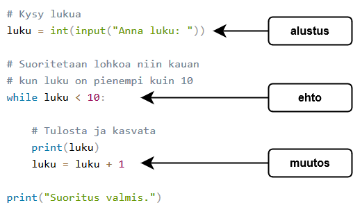

<text-box variant='learningObjectives' name='Oppimistavoitteet'>

Tämän osion jälkeen

- Osaat tehdä while-silmukan, jonka alkurivillä on ehto
- Tiedät, mikä merkitys alustuksella, ehdolla ja muutoksella on silmukassa
- Osaat käyttää erilaisia ehtoja silmukoissa

</text-box>

Edellisen osan lopussa opimme käyttämään `while True` -silmukkaa koodin toistamiseen. Tässä tapauksessa silmukan ehtona on `True`, mikä on aina tosi. Yleisemmin voimme käyttää silmukkaa näin:

```python
while <ehtolauseke>:
    <lohko>
```

Ideana on, että silmukka vuorotellen tarkastaa ehdon ja suorittaa lohkossa olevan koodin, jos ehto pätee. Sitten kun ehto ei päde, ohjelman suoritus jatkuu silmukan jälkeiseltä riviltä.


Esimerkiksi seuraavassa silmukassa ehtona on `luku < 10` eli silmukan koodi suoritetaan, jos luku on alle 10.

```python
luku = int(input("Anna luku: "))

while luku < 10:
    print(luku)
    luku += 1

print("Suoritus valmis.")
```

Ohjelman tulostus voi olla seuraava:

<sample-output>

Anna luku: **4**
4
5
6
7
8
9
Suoritus valmis.

</sample-output>

Koska ehto tarkastetaan aina ennen silmukan koodin suoritusta, on mahdollista, ettei koodia suoriteta kertaakaan. Esimerkiksi:

<sample-output>

Anna luku: **12**
Suoritus valmis.

</sample-output>

Koska 12 ei ole pienempi kuin 10, ohjelma ei tulosta mitään lukua:

## Alustus, testaus ja muutos

Monessa silmukassa on kolme osaa: alustus, testaus ja muutos.

_Alustus_ tarkoittaa silmukassa käytettävän muuttujan tai muuttujien alkuarvojen antamista. Tämä vaihe tehdään ennen silmukkaa. _Testaus_ kirjoitetaan silmukan alkuun, ja se määrittelee ehdon, jonka ollessa tosi silmukka suoritetaan. Joka kierroksella tapahtuva _muutos_ vie silmukan askeleen lähemmäs sen loppumista. Esimerkiksi:



Jos jokin kolmesta osasta puuttuu, silmukka ei toimi oikein. Yksi tyypillinen virhe on muutoksen unohtaminen:

```python
luku = 1

while luku < 10:
    print(luku)

print("Suoritus valmis.")
```

Koska muuttujan `luku` arvo ei koskaan muutu, jää ohjelma suoritettaessa ikuiseen silmukkaan eli toistaa samaa koodia, kunnes käyttäjä katkaisee ohjelman suorituksen (esimerkiksi painamalla `CTRL` + `C`):

<sample-output>

1
1
1
1
1
(tämä jatkuu ikuisesti...)

</sample-output>

<in-browser-programming-exercise name="Lähtölaskenta" tmcname="osa03-01_lahtolaskenta">

Korjaa tehtäväpohjassa oleva ohjelma

```python
print("Valmiina?")
luku = int(input("Anna luku: "))
while luku = 0:
print(luku)
print("Nyt!")
```

siten että se toimii seuraavasti:

<sample-output>

Valmiina?
Anna luku: **5**
5
4
3
2
1
Nyt!

</sample-output>

Älä tällä kertaa käytä `while True` -silmukkaa!


</in-browser-programming-exercise>

## Ehdoista tarkemmin

Silmukan ehtona voidaan käyttää mitä tahansa ehtolauseketta. Esimerkiksi seuraava ohjelma tulostaa lukuja kolmen välein niin kauan kun luku on pienempi kuin 100 eikä se ole jaollinen 5:llä:

```python
luku = int(input("Anna luku: "))

while luku < 100 and luku % 5 != 0:
    print(luku)
    luku += 3
```

Kaksi esimerkkitulostusta eri syötteillä:

<sample-output>

Anna luku: **28**
28
31
34
37
...

</sample-output>

<sample-output>

Anna luku: **96**
96
99

</sample-output>

Luvun 28 kohdalla silmukka päättyy lukuun 37, koska seuraava luku 40 on jaollinen 5:llä. Luvun 96 kohdalla silmukka päättyy lukuun 99, koska seuraava luku 102 ei ole alle 100.

Silmukan ehtoa kirjoittaessa on tärkeä varmistua siitä, että silmukan suoritus päättyy. Esimerkiksi seuraava ohjelma on joko päättyvä tai ei-päättyvä riippuen alkuarvosta:

```python
luku = int(input("Anna luku: "))

while luku != 10:
    print(luku)
    luku += 2
```

Jos syötteeksi parillinen luku, joka on enintään 10, silmukan suoritus päättyy:

<sample-output>

Anna luku: **4**
4
6
8

</sample-output>

Muissa tapauksissa silmukka on kuitenkin ikuinen, koska muuttuja ei koskaan saavuta arvoa 10. Tällaisia syötteitä ovat esimerkiksi 3 ja 12.

<in-browser-programming-exercise name="Luvut" tmcname="osa03-02_luvut">

Tee ohjelma, joka tulostaa kaikki käyttäjän antamaa lukua pienemmät luvut alkaen luvusta yksi.

<sample-output>

Mihin asti: **5**
1
2
3
4

</sample-output>

Älä käytä tässä tehtävässä while-komennon ehtona arvoa `True`!

</in-browser-programming-exercise>

<in-browser-programming-exercise name="Kahden potenssit" tmcname="osa03-03_kahden_potenssit">

Tee ohjelma, joka tulostaa ensin luvun 1 ja sen jälkeen kerta toisensa jälkeen kerta kaksi kertaa suuremman luvun. Ohjelman siis tulostaa luvun kaksi potensseja.

Ohjelman suoritus päättyy, kun luku yltää käyttäjän antaman luvun.

<sample-output>

Mihin asti: **8**
1
2
4
8

</sample-output>

<sample-output>

Mihin asti: **20**
1
2
4
8
16

</sample-output>

<sample-output>

Mihin asti: **100**
1
2
4
8
16
32
64

</sample-output>

Älä käytä tässä tehtävässä while-komennon ehtona arvoa `True`!

</in-browser-programming-exercise>

<in-browser-programming-exercise name="Luvun n potenssit" tmcname="osa03-04_luvun_n_potenssit">

Muuta edellistä ohjelmaa siten, että käyttäjä saa määrätä kertoimen (edellisessä ohjelmassa kerroin oli aina 2), eli sen minkä luvun potensseja ohjelma tulostaa.

<sample-output>

Mihin asti: **35**
Mikä kerroin: **3**
1
3
9
27

</sample-output>

<sample-output>

Mihin asti: **1234567**
Mikä kerroin: **10**
1
10
100
1000
10000
100000
1000000

</sample-output>

Älä käytä tässä tehtävässä while-komennon ehtona arvoa `True`!

</in-browser-programming-exercise>

<in-browser-programming-exercise name="Peräkkäisten summa" tmcname="osa03-05_perakkaisten_summa">

Tee ohjelma, joka laskee peräkkäisten lukujen summaa 1 + 2 + 3 + ... kunnes sen arvo on vähintään käyttäjän syöttämä luku. Ohjelma toimii seuraavasti:

<sample-output>

Mihin asti: **2**
Laskettiin 1 + 2 = 3

</sample-output>

<sample-output>

Mihin asti: **10**
Laskettiin 1 + 2 + 3 + 4 = 10

</sample-output>

<sample-output>

Mihin asti: **18**
Laskettiin 1 + 2 + 3 + 4 + 5 + 6 = 21

</sample-output>

</in-browser-programming-exercise>
