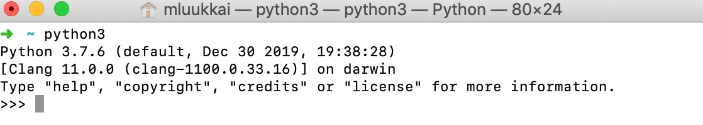
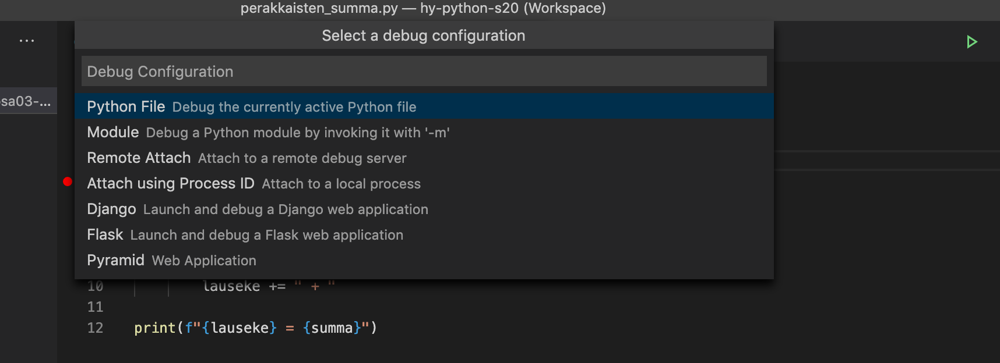
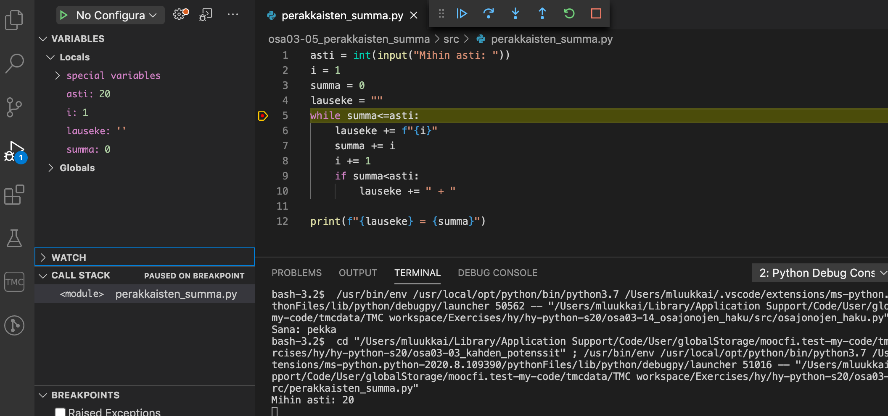
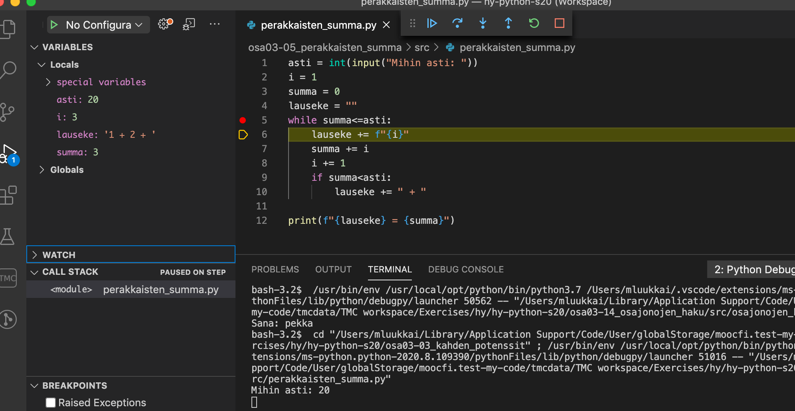
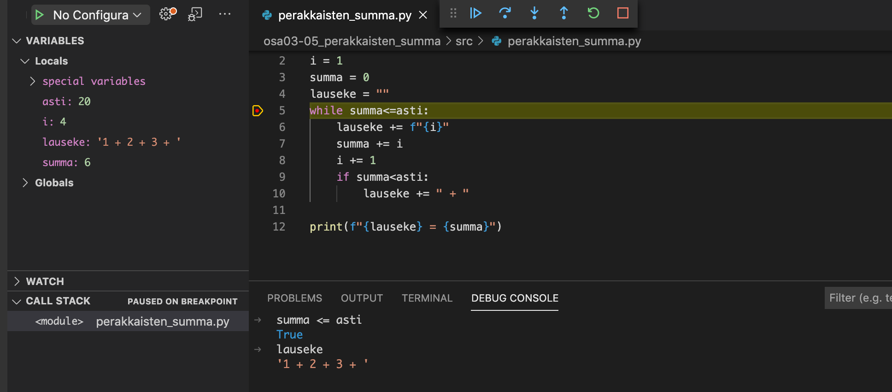

<text-box variant='learningObjectives' name='Oppimistavoitteet'>

Tämän osion jälkeen

- Osaat käyttää Visual studio Code -editoria kurssin tehtävien tekemiseen
- Osaat suorittaa koodia interaktiivisen Python-tulkin avulla

</text-box>

Olemme tähän mennessä ohjelmoineet kaikki tehtävät kurssisivuille upotettuihin editori-ikkunoihin. Selaineditorissa tapahtuva ohjelmointi sopii hyvin kurssin alkuun, mutta siirrymme nyt käyttämään erillistä ohjelmointiin tarkoitettua editoria.

Erilaisia ohjelmointiin sopivia editoreja on kymmeniä. Käytämme kurssilla viime vuosina suureen suosioon noussutta [Visual Studio Code](https://code.visualstudio.com/) -editoria.

Asenna nyt Visual Studio Code ja kurssin tehtävien testien suorittamiseen käytettävä TMC-plugin [tämän ohjeen](https://www.mooc.fi/fi/installation/vscode) avulla.

<programming-exercise name='Hello Visual Studio Code' tmcname='osa04-01_hello_visualstudio_code'>

Tee ohjelma, joka kysyy käyttäjältä, mikä editori on käytössä. Ohjelma jatkaa, kunnes vastaus on _Visual Studio Code_.

Seuraava käyttöesimerkki havainnollistaa ohjelman haluttua tulostusta:

<sample-output>

Editori: **Emacs**
ei ole hyvä
Editori: **Vim**
ei ole hyvä
Editori: **Word**
surkea
Editori: **Atom**
ei ole hyvä
Editori: **Visual Studio Code**
loistava valinta!

</sample-output>

Jos käyttäjä kirjoittaa Word tai Notepad, ohjelma vastaa _surkea_. Muissa epäkelvoissa tapauksissa vastaus on _ei ole hyvä_.

Ohjelman tulee toimia siten, että "oikean vastauksen" kirjoitusasu ei riipu siitä, kirjoitetaanko vastaus isoja vai pieniä kirjaimia käyttämällä:

<sample-output>

Editori: **NOTEPAD**
surkea
Editori: **viSUal STudiO cODe**
loistava valinta!

</sample-output>

Kirjainten koon voi jättää huomiotta esim. muuttamalla kirjaimet pieniksi merkkijonojen metodilla `lower`, jota voi käyttää seuraavasti:

```python
mjono = "Visual Studio CODE"
if "visual studio code" == mjono.lower():
    print("merkkijono oli etsitty!")
```

**Huom:** tässä tehtävässä (eikä missään muussakaan tehtävissä missä _ei_ erikseen pyydetä funktioiden toteuttamista) mitään koodia __ei tule sijoittaa__
`if __name__ == "__main__"`-lohkoon!

</programming-exercise>

## Koodin suorittaminen

Visual Studio Codessa koodi suoritetaan painamalla vihreää kolmiota. Joskus koodisi suoritus voi jää kesken, esimerkiksi odottamaan käyttäjän syötettä tai ikuiseen silmukkaan, ja siirryt jo seuraavaan tehtävään. Kun yrität suorittaa seuraavan tehtävän koodia, tuleekin esille edellisen tehtävän kesken ollut suoritus. Joissain tilanteissa joudut sammuttamaan edellisen suorituksen painamalla yhtä aikaa näppäimiä _Control_+_C_, jotta saat suoritetuksi uuden tehtävän koodin.

## Interaktiivinen Python-tulkki

Emme ole toistaiseksi puhuneet kurssilla sanallakaan eräästä Python-ohjelmoinnin tärkeimmästä työkalusta, interaktiivisesta komentotulkista.

Komentotulkki käynnistyy antamalla komentoriviltä komento `python3` (joissain tapauksissa, esim. Windowsilla komento saattaa olla `python`). Esim. Macilla komentotulkin avaaminen näyttää seuraavalta:



Komentotulkki on myös mahdollista avata Visual Studio Coden sisälle, ensin suorittamalla jokin ohjelma "vihreällä kolmiolla" ja sen jälkeen kirjoittamalla avautuvaan _Terminal_-näkymään `python3` (tai `python`)


On olemassa myös selaimessa toimivia interaktiivisia tulkkeja, kuten <https://www.python.org/shell/>.

Komentotulkki tarjoaa interaktiivisen tavan suorittaa Python-koodia rivi riviltä sitä mukaa kuin käyttäjä kirjoittaa koodia. Ideana on, että kun käyttäjä kirjoittaa rivin koodia, Python suorittaa rivin välittömästi ja näyttää rivin operaation tuloksen:


Komentotulkkiin on mahdollista kirjoittaa mitä tahansa Pythonia, muuttujien ja metodienkin määrittely on mahdollista:

```python
>>> t = [1,2,3,4,5]
>>> for luku in t:
...   print(luku)
...
1
2
3
4
5
>>> def itseisarvo(luku):
...   if luku<0:
...      luku = -luku
...   return luku
...
>>> x = 10
>>> y = -7
>>> itseisarvo(luku)
Traceback (most recent call last):
  File "<stdin>", line 1, in <module>
NameError: name 'luku' is not defined
>>> itseisarvo(x)
10
>>> itseisarvo(y)
7
>>>
```

Parhaimmillaan komentotulkki on pienten tarkistusten tekemiseen, esim. miten tietty metodi toimii tai onko metodia ylipäätään olemassa:

```python
>>> "TekstIä".toupper()
Traceback (most recent call last):
  File "<stdin>", line 1, in <module>
AttributeError: 'str' object has no attribute 'toupper'
>>> "TekstIä".upper()
'TEKSTIÄ'
>>>
```

Jos muistaa melkein jonkin metodin nimen, googlaamisen sijaan voi olla nopeampi käyttää komentotulkkia ja kysyä funktiolla `dir`, mitä metodeja tietyllä oliolla on:

```python
>>> dir("teksti")
['__add__', '__class__', '__contains__', '__delattr__', '__dir__', '__doc__', '__eq__',
'__format__', '__ge__', '__getattribute__', '__getitem__', '__getnewargs__', '__gt__',
'__hash__', '__init__', '__init_subclass__', '__iter__', '__le__', '__len__', '__lt__',
'__mod__', '__mul__', '__ne__', '__new__', '__reduce__', '__reduce_ex__', '__repr__',
'__rmod__', '__rmul__', '__setattr__', '__sizeof__', '__str__', '__subclasshook__',
'capitalize', 'casefold', 'center', 'count', 'encode', 'endswith', 'expandtabs', 'find',
'format', 'format_map', 'index', 'isalnum', 'isalpha', 'isascii', 'isdecimal', 'isdigit',
'isidentifier', 'islower', 'isnumeric', 'isprintable', 'isspace', 'istitle', 'isupper', 'join',
'ljust', 'lower', 'lstrip', 'maketrans', 'partition', 'replace', 'rfind', 'rindex', 'rjust','rpartition', 'rsplit', 'rstrip', 'split', 'splitlines', 'startswith', 'strip', 'swapcase',
'title', 'translate', 'upper', 'zfill']
```

Kuten näemme, merkkijonoilla on suuri määrä metodeja. Kurssin tässä vaiheessa ei kannata välittää alaviivoja sisältävistä metodeista, mutta muut voivat olla käyttökelpoisia. Osa metodien toiminnasta voi selvitä kokeilemalla, osan toiminta selviää googlaamalla.

Listojen metodeista käy ilmi seuraavaa:

```python
>>> dir([])
['__add__', '__class__', '__contains__', '__delattr__', '__delitem__', '__dir__', '__doc__',
'__eq__', '__format__', '__ge__', '__getattribute__', '__getitem__', '__gt__', '__hash__',
'__iadd__', '__imul__', '__init__', '__init_subclass__', '__iter__', '__le__', '__len__',
'__lt__', '__mul__', '__ne__', '__new__', '__reduce__', '__reduce_ex__', '__repr__',
'__reversed__', '__rmul__', '__setattr__', '__setitem__', '__sizeof__', '__str__',
'__subclasshook__', 'append', 'clear', 'copy', 'count', 'extend', 'index', 'insert', 'pop',
'remove', 'reverse', 'sort']
>>>
```

Tarjolla näyttää siis olevan mm. metodit `reverse` ja `clear`. Kokeillaan niitä:

```python
>>> luvut = [1,2,3,4,5]
>>> luvut.reverse()
>>> luvut
[5, 4, 3, 2, 1]
>>> luvut.clear()
>>> luvut
[]
```

Metodit siis tekevät aika lailla sen, mitä nimen perusteella voi olettaa.

Huomaa, että komentotulkki ei näytä mitään tulosta, kun kutsutaan esim. metodia `lista.reverse()`. Mistä tämä johtuu? Komentotulkki tekee komentojen suorituksen yhteydessä tulostuksen vain, jos suoritetulla koodirivillä on jokin arvo. Edellisessä esimerkissä saatiin tulostettua listan `luvut` arvo kirjoittamalla komentotulkkiin pelkkä muuttujan nimi. Komentotulkissa ei siis useinkaan ole tarvetta kirjottaa erikseen `print`-komentoja.

Tärkeä komento on `exit()`, joka sulkee komentotulkin. Erityisesti jos käytät komentotulkkia Visual Studio Codessa, se tulee muistaa sulkea, ennen kuin suoritat jonkin ohjelman uudelleen"vihreällä kolmiolla. Jos tämä unohtuu, on seurauksena hieman erikoinen virheilmoitus:


## Debuggeri

Muutamassa edellisessä osassa on jo korostettu debuggaustaitojen tärkeyttä ja demonstroitu tulostamalla tapahtuvaa debuggausta. Visual Studio Code sisältää debuggausta varten _visuaalisen debuggerin_.

Debuggaus aloitetaan määrittelemällä koodiin _breakpoint_ eli kohta, johon debuggeri pysäyttää koodin suorituksen. Breakpoint asetetaan klikkaamalla hiirellä halutun koodirivin vasemmalta puolelta.

Seuraavassa esimerkissä breakpoint on asetettu [edellisen osan](/osa-3/1-ehdot-silmukoissa) tehtävän _Peräkkäisten summa_ hieman virheellisen ratkaisun riville 5:


Breakpointin asetuksen jälkeen valitaan valikosta _Run_ kohta _Start debugging_. Tämä avaa valintanäkymän, josta valitaan _Python File_:



Debuggeri käynnistyy ja alkaa suorittaa koodia normaaliin tapaan, kunnes se törmää breakpointiin ja pysähtyy:



Vasempaan reunaan on avautunut näkymä _Variables_, joka kertoo senhetkisten muuttujien arvot. Koodia voidaan suorittaa rivi riviltä painelemalla alaspäin osoittavaa nuolta (_Step into_).

Seuraavassa tilanteessa silmukkaa on suoritettu muutamia kertoja:



Debuggerin välilehti _Debug console_ mahdollistaa myös lausekkeiden arvojen näyttämisen debuggaushetken muuttujien arvoilla. Voidaan esimerkiksi kokeilla, mikä silmukan lopetusehdon arvo on:



Ohjelmassa voi olla myös useita breakpointeja. Pysähtymisen jälkeen koodi voidaan taas käynnistää sinisellä kolmiolla (_Continue_) ja suoritus jatkuu, kunnes ohjelma törmää seuraavaan breakpointiin.

Visuaalinen debuggeri on vaihtoehto debug-tulostuksille, mutta on mieltymyksistä kiinni, mitä debuggaustekniikoita kukin ohjelmoija käyttää. On hyvä kokeilla erilaisia tapoja ja valita itselle sopiva tapa.
