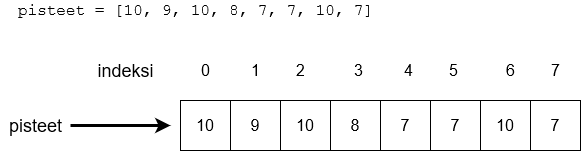

<text-box variant='learningObjectives' name='Oppimistavoitteet'>

Tämän osion jälkeen

- Tiedät, mitä lista tarkoittaa ohjelmoinnissa
- Osaat viitata listan yksittäisiin alkioihin
- Osaat lisätä ja poistaa listan alkioita
- Osaat hyödyntää valmiita funktioita ja metodeita listojen käsittelyyn

</text-box>

Tähän asti olemme tallentaneet ohjelmissa käytettävää tietoa muuttujien avulla. Yksittäisillä muuttujilla on kuitenkin rajoituksensa. Jos ohjelman käsittelemä tiedon määrä on vaihteleva ja saattaa olla suuri, olisi vaivalloista määritellä jokaiselle arvolle erillinen muuttuja.

_Lista_ on kokoelma tietoa, johon viitataan yhteisen nimen kautta. Listan sisältö kirjoitetaan hakasulkeiden sisään, ja jokaista listalla olevaa arvoa kutsutaan _alkioksi_.

Esimerkiksi seuraava koodi luo uuden tyhjän listan:

```python
lista = []
```

Seuraava koodi puolestaan luo listan, jossa on valmiina viisi alkiota:

```python
lista = [7, 2, 2, 5, 2]
```

## Listan alkioihin viittaaminen

Listan alkiot on indeksoitu samalla tavalla kuin merkkijonon yksittäiset merkit. Tässäkin tapauksessa indeksointi alkaa nollasta:



Yksittäiseen listan alkioon voidaan viitata samalla tavalla kuin merkkijonon yksittäisiin merkkeihin hakasulkujen avulla. Esimerkiksi:

```python
lista = [7, 2, 2, 5, 2]

print(lista[0])
print(lista[1])
print(lista[3])

print("Kahden ekan summa:", lista[0] + lista[1])
```

<sample-output>

7
2
5
Kahden ekan summa: 9

</sample-output>

Voimme tulostaa listan koko sisällön näin:

```python
lista = [7, 2, 2, 5, 2]
print(lista)
```

<sample-output>

[7, 2, 2, 5, 2]

</sample-output>

Listan alkioita voidaan myös muuttaa. Alkion arvon muuttaminen tapahtuu sijoittamalla uusi arvo vanhan paikalle – siis samalla tavalla kuin muuttujia käytettäessä:

```python
lista = [7, 2, 2, 5, 2]
print(lista)
lista[1] = 3
print(lista)
```

<sample-output>

[7, 2, 2, 5, 2]
[7, 3, 2, 5, 2]

</sample-output>

Funktio `len` antaa listan alkioiden määrän:

```python
lista = [7, 2, 2, 5, 2]
print(len(lista))
```

<sample-output>

5

</sample-output>


<programming-exercise name='Alkioiden arvojen muutokset' tmcname='osa04-07a_alkioiden_arvojen_muutokset'>

Tee ohjelma, joka alustaa listan jossa on arvot `[1, 2, 3, 4, 5]`. Tämän jälkeen ohjelma kysyy käyttäjältä alkion indeksin ja uuden arvon, vaihtaa kyseisen alkion arvon ja tulostaa listan uudelleen. Ohjelman suoritus päättyy, jos käyttäjä antaa alkion indeksiksi -1.

Esimerkkisuoritus:

<sample-output>

Anna indeksi: **0**
Anna arvo: **10**
[10, 2, 3, 4, 5]
Anna indeksi: **2**
Anna arvo: **250**
[10, 2, 250, 4, 5]
Anna indeksi: **4**
Anna arvo: **-45**
[10, 2, 250, 4, -45]
Anna indeksi: **-1**

</sample-output>

**Huom:** tässä tehtävässä (eikä missään muussakaan tehtävissä missä _ei_ erikseen pyydetä funktioiden toteuttamista) mitään koodia __ei tule sijoittaa__
`if __name__ == "__main__"`-lohkoon!

</programming-exercise>

## Alkioiden lisääminen ja poistaminen

Listan loppuun voidaan lisätä uusia alkoita `append`-metodin avulla. Metodia käytetään seuraavasti:

```python
luvut = []
luvut.append(5)
luvut.append(10)
luvut.append(3)
print(luvut)
```

<sample-output>

[5, 10, 3]

</sample-output>

Seuraavassa esimerkissä ohjelman käytössä on kaksi erillistä listaa:

```python
luvut = []
kengannumerot = []

luvut.append(5)
luvut.append(10)
luvut.append(3)

kengannumerot.append(37)
kengannumerot.append(44)
kengannumerot.append(40)
kengannumerot.append(28)

print("Luvut:")
print(luvut)

print("Kengännumerot:")
print(kengannumerot)
```

Lisäys menee siis siihen listaan, mihin metodikutsu kohdistetaan:

<sample-output>

Luvut:
[5, 10, 3]
Kengännumerot:
[37, 44, 40, 28]

</sample-output>

<programming-exercise name='Alkoiden lisäys listaan' tmcname='osa04-07b_alkoiden_lisays_listaan'>

Tee ohjelma, joka kysyy käyttäjältä ensin lukujen määrän. Sen jälkeen ohjelma pyytää käyttäjää syöttämään annetun määrän lukuja yksitellen ja lisää ne listaan samassa järjestyksessä.

Lopuksi lista tulostetaan.

Esimerkkisuoritus:

<sample-output>

Kuinka monta lukua: **3**
Anna luku 1: **10**
Anna luku 2: **250**
Anna luku 3: **34**
[10, 250, 34]

</sample-output>

**Huom:** tässä tehtävässä (eikä missään muussakaan tehtävissä missä _ei_ erikseen pyydetä funktioiden toteuttamista) mitään koodia __ei tule sijoittaa__
`if __name__ == "__main__"`-lohkoon!

</programming-exercise>

Mikäli halutaan lisätä alkio johonkin muualle kuin listan loppuun, voidaan käyttää `insert`-metodia. Metodi lisää alkion halutun indeksin paikalle. Kaikkia listalla valmiina olevia alkioita lisäyspaikasta alkaen siirretään yhdellä askeleella eteenpäin:


Esimerkiksi

```python
luvut = [1, 2, 3, 4, 5, 6]
luvut.insert(0, 10)
print(luvut)
luvut.insert(2, 20)
print(luvut)
```

<sample-output>

[10, 1, 2, 3, 4, 5, 6]
[10, 1, 20, 2, 3, 4, 5, 6]

</sample-output>

Alkioita voidaan poistaa listasta kahden eri lähtökohdan mukaisesti:

* Jos tiedetään, _missä_ poistettava alkio sijaitsee, voidaan käyttää metodia `pop`.
* Jos tiedetään, _mikä_ poistettavan alkion arvo on, käytetään metodia `remove`.

Metodille `pop` annetaan poistettavan alkion indeksi. Esimerkiksi seuraava koodi poistaa listalta alkiot kohdista 2 ja 3. Huomaa, että alkioiden indeksit muuttuvat poiston jälkeen.

```python
lista = [1, 2, 3, 4, 5, 6]

lista.pop(2)
print(lista)
lista.pop(3)
print(lista)
```

<sample-output>

[1, 2, 4, 5, 6]
[1, 2, 4, 6]

</sample-output>

Metodi `pop` myös _palauttaa_ poistetun listan alkion:

```python
lista = [4, 2, 7, 2, 5]

luku = lista.pop(2)
print(luku)
print(lista)
```

<sample-output>

7
[4, 2, 2, 5]

</sample-output>

Metodille `remove` annetaan indeksin sijasta poistettavan alkion arvo. Esimerkiksi:

```python
lista = [1, 2, 3, 4, 5, 6]

lista.remove(2)
print(lista)
lista.remove(5)
print(lista)
```

<sample-output>

[1, 3, 4, 5, 6]
[1, 3, 4, 6]

</sample-output>

Huomaa, että metodi poistaa listalta _ensimmäisen_ alkion, jolla on annettu arvo:

```python
lista = [1, 2, 1, 2]

lista.remove(1)
print(lista)
lista.remove(1)
print(lista)
```

<sample-output>

[2, 1, 2]
[2, 2]

</sample-output>

<programming-exercise name='Lisäys ja poisto' tmcname='osa04-07c_lisays_ja_poisto'>

Tee ohjelma, joka pyytää käyttäjää valitsemaan alkion lisäyksen tai poiston. Sekä lisäys että poisto tehdään listan loppuun. Lisättävän alkion arvo on aina yhtä suurempi kuin listan viimeinen alkio (tai 1, jos listassa ei ole alkioita).

Joka operaation välissä lista tulostetaan. Katso esimerkkiä seuraavasta tulosteesta:

<sample-output>

Lista on nyt []
(l)isää, (p)oista vai e(x)it: **l**
Lista on nyt [1]
(l)isää, (p)oista vai e(x)it: **l**
Lista on nyt [1, 2]
(l)isää, (p)oista vai e(x)it: **l**
Lista on nyt [1, 2, 3]
(l)isää, (p)oista vai e(x)it: **p**
Lista on nyt [1, 2]
(l)isää, (p)oista vai e(x)it: **l**
Lista on nyt [1, 2, 3]
(l)isää, (p)oista vai e(x)it: **x**
Moi!

</sample-output>

Voit olettaa, että listalta ei yritetä poistaa alkoita, jos lista on tyhjä.

**Huom:** tässä tehtävässä (eikä missään muussakaan tehtävissä missä _ei_ erikseen pyydetä funktioiden toteuttamista) mitään koodia __ei tule sijoittaa__
`if __name__ == "__main__"`-lohkoon!

</programming-exercise>

Jos listalla ei ole poistettavaa alkiota, seuraa virhe. Merkkijonoista tutulla tavalla alkion olemassaolon listalla voi testata `in`-operaattorin avulla:

```python
lista = [1, 3, 4]

if 1 in lista:
    print("Listalla on alkio 1")

if 2 in lista:
    print("listalla on alkio 2")
```

<sample-output>

Listalla on alkio 1

</sample-output>

<programming-exercise name='Sama sana kahdesti' tmcname='osa04-08_sama_sana_kahdesti'>

Tee ohjelma, joka kyselee käyttäjältä sanoja. Kun käyttäjä syöttää jonkin sanan kahdesti, ohjelma tulostaa eri sanojen määrän ja lopettaa toimintansa.

<sample-output>

sana: **olipa**
sana: **kerran**
sana: **kauan**
sana: **sitten**
sana: **kerran**
Annoit 4 eri sanaa

</sample-output>

**Huom:** tässä tehtävässä (eikä missään muussakaan tehtävissä missä _ei_ erikseen pyydetä funktioiden toteuttamista) mitään koodia __ei tule sijoittaa__
`if __name__ == "__main__"`-lohkoon!

</programming-exercise>

## Listan järjestäminen

Listan alkiot voidaan _järjestää_ pienimmästä suurimpaan metodin `sort` avulla:

```python
lista = [2,5,1,2,4]
lista.sort()
print(lista)
```

<sample-output>

[1, 2, 2, 4, 5]

</sample-output>

Toinen tapa on käyttää funktiota `sorted`, joka _palauttaa_ järjestetyn listan:

```python
lista = [2,5,1,2,4]
print(sorted(lista))
```

<sample-output>

[1, 2, 2, 4, 5]

</sample-output>

Huomaa ero näissä tavoissa: `sort` muuttaa listan sisällön järjestetyksi, kun taas `sorted` luo uuden järjestetyn listan. Jälkimmäisessä tavassa voimme säilyttää myös listan alkuperäisen järjestyksen:

```python
alkuperainen = [2, 5, 1, 2, 4]
jarjestetty = sorted(alkuperainen)
print(alkuperainen)
print(jarjestetty)
```

<sample-output>

[2, 5, 1, 2, 4]
[1, 2, 2, 4, 5]

</sample-output>

<programming-exercise name='Lista kahdesti' tmcname='osa04-08b_lista_kahdesti'>

Tee ohjelma, joka kysyy käyttäjältä lukuja ja lisää niitä listaan. Lista tulostetaan jokaisen luvun lisäyksen jälkeen kahdella eri tavalla:
- alkiot lisäysjärjestyksessä ja
- järjestettynä pienimmästä suurimpaan alkioon

Ohjelman suoritus päättyy, kun käyttäjä syöttää luvun 0.

Esimerkkisuoritus:

<sample-output>

Anna luku: **3**
Lista: [3]
Järjestettynä: [3]
Anna luku: **1**
Lista: [3, 1]
Järjestettynä: [1, 3]
Anna luku: **9**
Lista: [3, 1, 9]
Järjestettynä: [1, 3, 9]
Anna luku: **5**
Lista: [3, 1, 9, 5]
Järjestettynä: [1, 3, 5, 9]
Anna luku: **0**
Moi!

</sample-output>

**Huom:** tässä tehtävässä (eikä missään muussakaan tehtävissä missä _ei_ erikseen pyydetä funktioiden toteuttamista) mitään koodia __ei tule sijoittaa__
`if __name__ == "__main__"`-lohkoon!

</programming-exercise>

## Suurin, pienin ja summa

Funktiot `max` ja `min` antavat listan suurimman ja pienimmän alkion.
Funktio `sum` puolestaan laskee listan alkioiden summan.

```python
lista = [5, 2, 3, 1, 4]

suurin = max(lista)
pienin = min(lista)
summa = sum(lista)

print("Pienin:", pienin)
print("Suurin:", suurin)
print("Summa:", summa)
```

<sample-output>

Pienin: 1
Suurin: 5
Summa: 15

</sample-output>

## Metodit vs. funktiot

Pythonissa on ehkä hieman hämmentävästi käytössä kaksi eri tapaa listojen käsittelyyn.

Suurin osa käsittelystä tapahtuu _metodien_ avulla. Esimerkiksi `append` ja `sort` ovat metodeja, joita kutsutaan listamuuttujan kautta pistenotaatiolla:

```python
lista = []

# metodikutsuja
lista.append(3)
lista.append(1)
lista.append(7)
lista.append(2)

# metodikutsu
lista.sort()
```

 Sen sijaan esimerkiksi `max`,  `min`, `len` ja `sorted` ovat _funktioita_, joille lista annetaan parametrina:

```python
lista = [3, 2, 7, 1]

# funktiokutsuissa lista on parametrina
suurin = max(lista)
pienin = min(lista)
pituus = len(lista)

print("Pienin:", pienin)
print("Suurin:", suurin)
print("Listan pituus:", pituus)

# funktiokutsu: lista on parametrina, järjestetty lista paluuarvona
jarjestyksessa = sorted(lista)
print(jarjestyksessa)
```

<sample-output>

Pienin: 1
Suurin: 7
Listan pituus: 4
[1, 2, 3, 7]

</sample-output>

## Lista funktion parametrina ja paluuarvona

Itse tekemiemme funktioiden parametreina voi olla myös listoja. Seuraavassa on funktio, joka selvittää parametrina listan _mediaanin_ eli keskimmäisen alkion järjestetyssä listassa:

```python
def mediaani(lista: list):
    jarjestetty = sorted(lista)
    keskikohta = len(jarjestetty) // 2
    return jarjestetty[keskikohta]
```

Funktio selvittää mediaanin tekemällä parametrinaan saamasta listasta järjestetyn version ja palauttamalla sen keskimmäisen alkion. Huomaa, että käytössä on kokonaislukujakolasku `//`, koska listan indeksin tulee olla kokonaisluku.

Seuraavassa on esimerkki funktion käytöstä:

```python
kengannumerot = [45, 44, 36, 39, 40]
print("Kengännumeroiden mediaani on", mediaani(kengannumerot))

iat = [1, 56, 34, 22, 5, 77, 5]
print("Ikien mediaani on", mediaani(iat))
```

<sample-output>

Kengännumeroiden mediaani on 40
Ikien mediaani on 22

</sample-output>

Funktio voi myös palauttaa listan. Seuraavassa on funktio, joka palauttaa listan käyttäjän syöttämiä kokonaislukuja:

```python
def lue_luvut():
    luvut = []
    while True:
        syote = input("Anna luku (tyhjä lopettaa): ")
        if len(syote) == 0:
            break
        luvut.append(int(syote))
    return luvut
```

Funktio käyttää lista-tyyppistä apumuuttujaa `luvut`, johon se lisää kaikki käyttäjän antamat luvut. Silmukan jälkeen funktio palauttaa `return`-komennon avulla listan `luvut`.

Funktiota käytetään seuraavasti:

```python
luvut = lue_luvut()

print("Suurin luku on", max(luvut))
print("Lukujen mediaani on", mediaani(luvut))
```

<sample-output>

Anna luku (tyhjä lopettaa): **5**
Anna luku (tyhjä lopettaa): **-22**
Anna luku (tyhjä lopettaa): **4**
Anna luku (tyhjä lopettaa): **35**
Anna luku (tyhjä lopettaa): **1**
Anna luku (tyhjä lopettaa):
Suurin luku on 35
Lukujen mediaani on 4

</sample-output>

Pieni esimerkkiohjelmamme demonstroi jo yhtä funktioiden tärkeimmistä käyttötarkoituksista: niiden avulla ohjelma saadaan jaettua loogisiin selkeästi ymmärrettäviin kokonaisuuksiin.

Sinänsä sama ohjelma olisi voitu tehdä myös ilman funktiota:

```python
luvut = []
while True:
    syote = input("Anna luku (tyhjä lopettaa): ")
    if len(syote) == 0:
        break
    luvut.append(int(syote))

jarjestetty = sorted(luvut)
keskikohta = len(jarjestetty) // 2
mediaani = jarjestetty[keskikohta]

print("Suurin luku on", max(luvut))
print("Lukujen mediaani on", mediaani)
```

Nyt kuitenkin ohjelman logiikan seuraaminen on vaikeampaa, koska ei ole enää yhtä selvää, mitkä komennot liittyvät minkäkin kokonaisuuden (syötteiden lukeminen, mediaanin laskeminen, ohjelman muu toiminta) toteuttamiseen.

Jako funktioiksi siis selkeyttää koodin rakennetta ja tuo esille loogisia kokonaisuuksia. Tämän ansiosta on myös helpompaa varmistaa, että ohjelma toimii halutulla tavalla, koska voimme testata erikseen tiettyä funktiota (esim. toimiiko funktio `mediaani` oikein).

Ohjelman rakenteen loogisen jakamisen lisäksi funktioiden toinen käyttötarkoitus on koodin _uusiokäyttö_. Jos ohjelmassa on tarvetta tehdä samankaltainen operaatio useaan kertaan, kannattaa sitä varten luoda oma selkeästi nimetty funktio:

```python
print("Kengännumerot:")
kengat = lue_luvut()

print("Painot:")
painot = lue_luvut()

print("Pituudet:")
pituudet = lue_luvut()
```

<programming-exercise name='Listan pituus' tmcname='osa04-09_listan_pituus'>

Tee funktio `pituus`, joka palauttaa parametrinaan saamansa listan pituuden.

```python
lista = [1, 2, 3, 4, 5]
vastaus = pituus(lista)
print("vastaus", vastaus)

# huomaa, että voit kutsua funktiota myös antamalla listan suoraan funktion parametriksi
vastaus = pituus([1, 1, 1, 1])
print("vastaus", vastaus)
```

<sample-output>

vastaus 5
vastaus 4

</sample-output>

</programming-exercise>

<programming-exercise name='Keskiarvo' tmcname='osa04-10_keskiarvo'>

Tee funktio `keskiarvo`, joka palauttaa parametrinaan saamansa kokonaislukuja sisältävän listan alkioiden keskiarvon.

```python
lista = [1, 2, 3, 4, 5]
vastaus = keskiarvo(lista)
print("vastaus", vastaus)
```

<sample-output>

vastaus 3.0

</sample-output>

</programming-exercise>

<programming-exercise name='Vaihteluväli' tmcname='osa04-11_vaihteluvali'>

Tee funktio `vaihteluvali`, joka palauttaa parametrinaan saamansa kokonaislukuja sisältävän listan vaihteluvälin (eli suurimman ja pienimmän alkion erotuksen).

```python
lista = [1, 2, 3, 4, 5]
vastaus = vaihteluvali(lista)
print("vastaus", vastaus)
```

<sample-output>

vastaus 4

</sample-output>


</programming-exercise>

## Lisää listan käsittelystä

Pythonissa on paljon muitakin mahdollisuuksia listan käsittelyyn. Voit tutustua niihin Pythonin [dokumentaation](https://docs.python.org/3/tutorial/datastructures.html) kautta.

<quiz id="4849cd69-1938-5f4f-8805-8445f0f5c015"></quiz>
