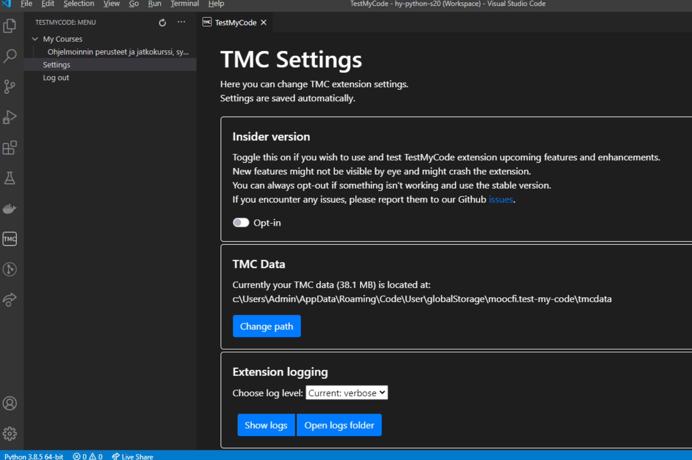

<text-box variant='learningObjectives' name='Oppimistavoitteet'>

Tämän osion jälkeen

- Tiedät, mitä tarkoitetaan iteroinnilla
- Tiedät, miten `for`-silmukka toimii
- Osaat käyttää `for`-silmukkaa listojen ja merkkijonojen läpikäyntiin

</text-box>

Voimme käydä listan alkiot läpi `while`-silmukalla samaan tapaan kuin olemme aiemmin käyneet läpi merkkijonon merkkejä. Esimerkiksi seuraava ohjelma tulostaa kaikki listan alkiot omille riveilleen:

```python
lista = [3, 2, 4, 5, 2]

kohta = 0
while kohta < len(lista):
    print(lista[kohta])
    kohta += 1
```

<sample-output>

3
2
4
5
2

</sample-output>

Tämä on kuitenkin melko vaivalloinen tapa, sillä joudumme käyttämään indeksimuuttujaa `kohta`, joka "muistaa", missä kohtaa listaa ollaan menossa. Nyt on aika opetella parempi tapa listan, merkkijonon tai muun vastaavan rakenteen läpikäyntiin.

## for-silmukka

Pythonin `for`-silmukka käy läpi annetun rakenteen sisällön. Esimerkiksi voimme käydä läpi kaikki listalla olevat alkiot vasemmalta oikealle. Ohjelmoinnissa tällaista läpikäyntiä kutsutaan myös nimellä _iterointi_.

Ideana on, että `for`-silmukka poimii yksi kerrallaan kunkin alkion ja suorittaa kaikille saman operaation. Näin ohjelmoijan ei tarvitse itse huolehtia, mistä kohdasta alkio haetaan missäkin vaiheessa. Silmukan syntaksi on seuraava:

```python
for <muuttuja> in <rakenne>:
    <lohko>
```

Kun `for`-silmukka käy listan läpi, se poimii vuorollaan kunkin alkion, sijoittaa sen muuttujaan ja suorittaa lohkon. Kun silmukka on käynyt kaikki alkiot läpi, ohjelman suoritus jatkuu silmukan jälkeiseltä riviltä.


Seuraava ohjelma tulostaa listan kaikki alkiot `for`-silmukan avulla:

```python
lista = [3, 2, 4, 5, 2]

for alkio in lista:
    print(alkio)
```

<sample-output>

3
2
4
5
2

</sample-output>

Jos verrataan tätä edelliseen esimerkkiin, huomataan, että `for`-silmukka selkeyttää suoraviivaista listan alkioiden läpikäyntiä huomattavasti.

Voimme käydä samalla idealla läpi myös merkkijonon merkit:

```python
nimi = input("Anna nimesi: ")

for merkki in nimi:
    print(merkki)
```

<sample-output>

Anna nimesi: Pekka
P
e
k
k
a

</sample-output>

<programming-exercise name='Tulostus tähdillä' tmcname='osa04-11a_tulostus_tahdilla'>

Tee ohjelma, joka pyytää käyttäjää syöttämään merkkijonon ja tulostaa sitten merkkijonon kirjaimet yksitellen allekkain.

Jokaisen kirjaimen jälkeen tulostetaan lisäksi tähti (*) omalle rivilleen.

Esimerkiksi:

<sample-output>

Anna merkkijono: **Python**
P
*
y
*
t
*
h
*
o
*
n
*

</sample-output>

**Huom:** tässä tehtävässä (eikä missään muussakaan tehtävissä missä _ei_ erikseen pyydetä funktioiden toteuttamista) mitään koodia __ei tule sijoittaa__
`if __name__ == "__main__"`-lohkoon!

</programming-exercise>

## Funktio `range`

Silmukkaa tarvitaan usein myös siihen, että haluamme toistaa jonkin asian tietyn määrän kertoja tai käydä läpi tietyn lukuvälin (esimerkiksi kaikki luvut väliltä 1–100). Myös tämä onnistuu kätevästi `for`-silmukalla funktion `range` avulla.

Voimme kutsua `range`-funktiota monella tavalla. Yksinkertaisin tapa on `range(n)`, jolloin silmukka käy läpi kokonaisluvut 0:sta lukuun `n`–1:

```python
for i in range(5):
    print(i)
```

<sample-output>

0
1
2
3
4

</sample-output>

Kun annamme kaksi parametria, `range(a, b)` aloittaa luvusta `a` ja lopettaa lukuun `b`–1:

```python
for i in range(3, 7):
    print(i)
```

<sample-output>

3
4
5
6

</sample-output>

Kun annamme kolme parametria, `range(a, b, c)` aloittaa luvusta `a`, lopettaa lukuun `b`–1 ja muuttaa lukua `c`:llä joka askeleella:

```python
for i in range(1, 9, 2):
    print(i)
```

<sample-output>

1
3
5
7

</sample-output>

Voimme myös antaa negatiivisen askeleen, jolloin luvut käydään läpi käänteisesti:

```python
for i in range(6, 2, -1):
    print(i)
```

<sample-output>

6
5
4
3

</sample-output>

<programming-exercise name='Negatiivisesta positiiviseen' tmcname='osa04-11b_negatiivisesta_positiiviseen'>

Tee ohjelma, joka lukee käyttäjältä positiivisen kokonaisluvun N. Ohjelma tulostaa sen jälkeen luvut väliltä -N...N _nollaa lukuunottamatta_. Jokainen luku tulostetaan omalle rivilleen.

Esimerkiksi

<sample-output>

Anna luku: **4**
-4
-3
-2
-1
1
2
3
4

</sample-output>

**Huom:** tässä tehtävässä (eikä missään muussakaan tehtävissä missä _ei_ erikseen pyydetä funktioiden toteuttamista) mitään koodia __ei tule sijoittaa__
`if __name__ == "__main__"`-lohkoon!

</programming-exercise>

## Lukuväli listaksi

Funktio `range` palauttaa lukuvälin, joka voidaan käydä läpi listan kaltaisesti mutta joka ei kuitenkaan ole lista. Tämän näkee siitä, että jos tulostamme funktion palauttaman arvon, näemme vain kuvauksen lukuvälistä:

```python
luvut = range(2, 7)
print(luvut)
```

<sample-output>

range(2, 7)

</sample-output>

Tutustumme asiaan tarkemmin Ohjelmoinnin jatkokurssilla, mutta on hyvä tietää, että voimme muuttaa lukuvälin listaksi funktiolla `list`. Tällöin listaan tulevat kaikki lukuväliin kuuluvat arvot:

```python
luvut = list(range(2, 7))
print(luvut)
```

<sample-output>

[2, 3, 4, 5, 6]

</sample-output>

## Muistutus tehtävien funktioita testaavasta omasta koodista

Funktiotehtävien tehtäväpohjat ovat tähän asti näyttäneet seuraavilta:

```python
# tee ratkaisu tänne
# funktiota kannattaa testata kutsumalla sitä täällä seuraavasti
if __name__ == "__main__":
    lause = "olipa kerran kauan sitten ohjelmoija"
    print(eka_sana(lause))
    print(toka_sana(lause))
    print(vika_sana(lause))
```

Tästä eteenpäin muistutusta siitä, että testikoodi on sijoitettava `if __name__ == "__main__"` -lohkoon, ei tehtäväpohjissa enää ole. Testit kuitenkin vaativat lohkon edelleen, eli joudut lisäämään sen itse.

**Huomaa kuitenkin**, että jotkut tehtävät, esim. hetken kuluttua vuodossa oleva _Palindromit_, edellyttävät funktioiden lisäksi myös funktiota kutsuvaa koodia. Tätä koodia _ei tule_ sijoittaa  `if __name__ == "__main__"` -lohkon sisälle. Testit eivät nimittäin suorita mitään kyseisen lohkon koodista.

<programming-exercise name='Tähdet' tmcname='osa04-12_tahdet'>

Tee funktio `lista_tahtina`, joka saa parametriksi listan kokonaislukuja. Funktio tulostaa joukon tähtirivejä siten, että listalla olevat luvut kertovat kunkin rivin tähtimäärän.

Esim. kutsuttaessa `lista_tahtina([3, 7, 1, 1, 2])` tulostus on:

<sample-output>

<pre>
***
*******
*
*
**
</pre>

</sample-output>

<!-- **Huomaa** että tällä hetkellä Windowsissa on ongelmia joidenkin tehtävien testien suorittamisessa. Jos törmäät seuraavaan virheilmoitukseen


voit suorittaa testit lähettämällä ne palvelimelle valitsemalla testien suoritusnapin oikealla puolella olevasta symbolista avautuvasta TMC-valikosta _Submit solutions_.

Ongelman saa korjattua menemällä laajennuksen asennusvalikkoon ja muuttamalla "TMC Data" -kohdassa tehtävien sijainnin johonkin toiseen sijaintiin, jonka tiedostopolku on lyhempi, allaolevassa kuvassa nappi _change path_. Siirrossa saattaa kestää hetken, joten odotathan operaation päättymistä.



Ongelmaan pyritään saamaan parempi ratkaisu lähipäivinä. -->

</programming-exercise>

<programming-exercise name='Anagrammi' tmcname='osa04-13_anagrammi'>

Tee funktio `anagrammi` joka saa parametriksi kaksi merkkijonoa. Funktio palauttaa `True`, jos merkkijonot ovat anagrammeja eli ne muodostuvat täsmälleen samoista kirjaimista.

Esimerkiksi funktiota voisi käyttää näin:

```python
print(anagrammi("talo", "tola")) # True
print(anagrammi("talo", "lato")) # True
print(anagrammi("talo", "olat")) # True
print(anagrammi("tammi", "mitta")) # False
print(anagrammi("python", "java")) # False
```

Vihje: funktio `sorted` toimii myös merkkijonoille.

</programming-exercise>

<programming-exercise name='Palindromit' tmcname='osa04-14_palindromit'>

Tee funktio `palindromi`, joka saa parametriksi merkkijonon ja palauttaa True, jos merkkijono on palindromi (eli samansisältöinen luettuna alusta loppuun tai lopusta alkuun).

Tee myös funktiota hyödyntävä pääohjelma, joka kyselee käyttäjältä sanoja niin kauan, kunnes käyttäjä syöttää palindromin:

<sample-output>

Anna sana: **python**
ei ollut palindromi
Anna sana: **java**
ei ollut palindromi
Anna palindromi: **kauppias**
ei ollut palindromi
Anna palindromi: **saippuakauppias**
saippuakauppias on palindromi!

</sample-output>

**Huomaa**, että pääohjelmaa **ei tule kirjoittaa**
`if __name__ == "__main__":`-lohkon sisälle

</programming-exercise>

<programming-exercise name='Positiivisten summa' tmcname='osa04-15_positiivisten_summa'>

Tee funktio `positiivisten_summa`, joka saa parametriksi kokonaislukuja sisältävän listan.

Funktio palauttaa listan positiivisten lukujen summan.

```python
lista = [1, -2, 3, -4, 5]
vastaus = positiivisten_summa(lista)
print("vastaus", vastaus)
```

<sample-output>

vastaus 9

</sample-output>

</programming-exercise>

Kertaa nyt tarvittaessa [edellisen osion](/osa-4/3-listat) luku _Lista funktion parametrina ja paluuarvona_!

<programming-exercise name='Parilliset' tmcname='osa04-16_parilliset'>

Tee funktio `parilliset`, joka saa parametriksi kokonaislukuja sisältävän listan.

Funktio palauttaa uuden listan, jolla on parametrina olevan listan sisältämät parilliset luvut.

```python
lista = [1, 2, 3, 4, 5]
uusi_lista = parilliset(lista)
print("alkuperäinen", lista)
print("uusi", uusi_lista)
```

<sample-output>

alkuperäinen [1, 2, 3, 4, 5]
uusi [2, 4]

</sample-output>

</programming-exercise>

<programming-exercise name='Summalista' tmcname='osa04-17_summalista'>

Tee funktio `summa`, joka saa parametriksi kaksi kokonaislukuja sisältävää listaa. Molemmissa listoissa on sama määrä alkioita.

Funktio palauttaa uuden listan, jonka alkiot muodostuvat parametreina olevien listojen alkioiden summista.

Esim:

```python
a = [1, 2, 3]
b = [7, 8, 9]
print(summa(a, b)) # [8, 10, 12]
```

</programming-exercise>

<programming-exercise name='Uniikit' tmcname='osa04-18_uniikit'>

Tee funktio `uniikit`, joka saa parametriksi kokonaislukuja sisältävän listan.

Funktio palauttaa uuden listan, joka sisältää parametrina annetun listan luvut suuruusjärjestyksessä siten, että jokainen luku on listalla vain kerran.

```python
lista = [3, 2, 2, 1, 3, 3, 1]
print(uniikit(lista)) # [1, 2, 3]
```

</programming-exercise>

## Parhaan tai huonoimman etsiminen listalta

Ohjelmoinnissa tulee usein esiin tilanne, missä listalta on löydettävä jonkin kriteerin mukaan paras tai huonoin alkio. Ratkaisu onnistuu käyttämällä sopivaa apumuuttujaa, jonka avulla voidaan "muistaa" läpikäynnin aikana siihen mennessä löytynyt paras alkio. Tätä muistettavaa alkiota verrataan sitten yksi kerrallaan jokaiseen vastaantulevaan alkioon, ja lopulta on tiedossa koko listan paras.

Algoritmin "luonnos" on seuraavassa:

```python
paras = alkuarvo # sopiva alkuarvo riippuu tilanteesta
for alkio in lista:
    if alkio paremi kuin paras:
        paras = alkio

# paras on nyt tiedossa!
```

Koodin yksityiskohdat riippuvat siitä minkä tyyppisiä alkioita listalla on ja mikä parhauden/huonouden vertailukriteeri on käytössä. Joissain tilanteissa myös apumuuttujia saatetaan tarvita useampia.

Harjoitellaan hieman tämän ratkaisumenetelmän käyttöä.

<programming-exercise name='Listan pisimmän pituus' tmcname='osa04-18a_listan_pimman_pituus'>

Tee funktio `pisimman_pituus`, joka saa parametriksi listan merkkijonoja. Funktio palauttaa tiedon mikä on listan pisimmän merkkijonon pituus.

```python
lista = ["eka", "toka", "kolmas", "seitsemäs"]

tulos = pisimman_pituus(lista)
print(tulos)
```

```python
lista = ["pekka", "emilia", "venla", "eero", "antti", "juhani"]

tulos = pisimman_pituus(lista)
print(tulos)
```

<sample-output>

9
6

</sample-output>

</programming-exercise>

<programming-exercise name='Listan lyhin' tmcname='osa04-18b_listan_lyhin'>

Tee funktio `lyhin`, joka saa parametriksi listan merkkijonoja. Funktio tulostaa listan lyhimmän merkkijonon. Jos samanpituisia on useita (testeissä näin ei ole), voi funktio palauttaa niistä minkä vaan. Funktio voi olettaa että listalla ei ole tyhjiä eli nollan pituisia merkkijonoja.


```python
lista = ["eka", "toka", "kolmas", "seitsemäs"]

tulos = lyhin(lista)
print(tulos)
```

```python
lista = ["pekka", "emilia", "johanna", "venla", "eero", "antti"]

tulos = lyhin(lista)
print(tulos)
```

<sample-output>

eka
eero

</sample-output>

</programming-exercise>

<programming-exercise name='Listan pisimmät' tmcname='osa04-19_listan_pisimmat'>

Tee funktio `pisimmat`, joka saa parametriksi listan merkkijonoja. Funktio palauttaa listan, joka sisältää parametrina annetun listan pisimmän merkkijonon. Jos pisimpiä merkkijonoja on useampia, funktio palauttaa ne kaikki listassa.

Nimien järjestyksen tuloslistassa tulee noudattaa nimien järjestystä alkuperäisessä listassa.

```python
lista = ["eka", "toka", "kolmas", "seitsemäs"]

tulos = pisimmat(lista)
print(tulos) # ['seitsemäs']
```

```python
lista = ["pekka", "emilia", "venla", "eero", "antti", "juhani"]

tulos = pisimmat(lista)
print(tulos) # ['emilia', 'juhani']
```

</programming-exercise>

<quiz id="b1a91143-3137-5833-a771-6801f541a43b"></quiz>
