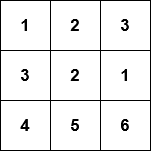

<text-box variant='learningObjectives' name='Oppimistavoitteet'>

Tämän osion jälkeen

- Osaat luoda listoja, joissa on erityyppistä tietoa
- Tiedät, miten listoja voi käyttää tiedon ryhmittelyyn
- Osaat tallentaa matriisin kaksiulotteisena listana

</text-box>

<text-box variant='hint' name='Kurssin tehtävien tekemisestä'>

Ohjelmointitaidon kehittyminen edellyttää vahvaa rutiinia ja myös omaa soveltavaa oivaltamista. Tämän takia kurssilla on paljon tehtäviä. Osa tehtävistä on kohtuullisen suoraviivaisesti materiaalia hyödyntäviä ja osa taas aivan tarkoituksella haastavampia soveltavia tehtäviä.

Ei kannata huolestua vaikka osa kurssin tehtävistä tuntuisikin ensiyrittämällä liian vaikealta. Kaikkia tehtäviä ei ole missään nimessä pakko tehdä, kuten [arvosteluperusteet](/arvostelu-ja-kokeet) toteavat: _Kurssin läpipääsyyn vaaditaan vähintään 25% jokaisen osan ohjelmointitehtävien pisteistä._

**Kurssin osien tehtävät eivät etene vaikeusjärjestyksessä.** Jokaisessa aliosassa esitellään yleensä muutama uusi konsepti, joita harjoitellaan sekä helpommilla että soveltavimmilla tehtävillä. **Jos törmäät liian haastavan tuntuiseen tehtävään, hyppää seuraavaan**. Voit palata vaikeimpiin tehtäviin osan lopuksi jos aikaa vielä jää.

Lohdutuksen sanana todettakoon että tällä viikolla mahdottomalta vaikuttava tehtävä näyttää melko varmasti neljän viikon päästä melko helpolta.


</text-box>

## Lisää listoista

Viime kerralla käsiteltiin lähes yksinomaan listoja, joissa alkiot ovat kokonaislukuja. Listoihin voi kuitenkin tallentaa minkä tahansa tyyppisiä arvoja. Esimerkiksi voimme tallentaa listaan merkkijonoja:

```python
nimet = ["Maija", "Liisa", "Pekka"]
print(nimet)
nimet.append("Kalle")
print(nimet)

print("Listalla nimiä:", len(nimet))
print("Nimet aakkosjärjestyksessä:")
nimet.sort()
for nimi in nimet:
  print(nimi)
```

<sample-output>

['Maija', 'Liisa', 'Pekka']
['Maija', 'Liisa', 'Pekka', 'Kalle']
Listalla nimiä: 4
Nimet aakkosjärjestyksessä:
Kalle
Liisa
Maija
Pekka

</sample-output>

Samalla tavalla listalle voidaan tallentaa liukulukuja:

```python
mittaukset = [-2.5, 1.1, 7.5, 14.6, 21.0, 19.2]

for mittaus in mittaukset:
    print(mittaus)

keskiarvo = sum(mittaukset) / len(mittaukset)

print("Keskiarvo:", keskiarvo)
```

<sample-output>

-2.5
1.1
7.5
14.6
21.0
19.2
Keskiarvo: 10.15

</sample-output>

## Muistutus: globaalin muuttujan käytön sudenkuoppa

Kuten olemme nähneet, funktioiden sisällä on mahdollista määritellä muuttujia. Kannattaa myös huomata se, että funktio näkee sen ulkopuolella, eli pääohjelmassa määritellyt muuttujat. Tälläisia muuttujia sanotaan _globaaleiksi_ muuttujiksi.

Globalien muuttujien käyttämistä funktioista käsin ei useimmiten pidetä hyvänä asiana muun muassa siksi, että ne saattavat johtaa ikäviin bugeihin.

Seuraavassa on esimerkki funktiosta, joka käyttää "vahingossa" globaalia muuttujaa:

```python
def tulosta_vaarinpain(nimet: list):
    # käytetään vahingossa parametrin sijaan globaalia muuttujaa nimilista
    i = len(nimilista) - 1
    while i>=0:
        print(nimilista[i])
        i -= 1

# globaali muuttuja
nimilista = ["Antti", "Emilia", "Erkki", "Margaret"]
tulosta_vaarinpain(nimilista)
print()
tulosta_vaarinpain(["Tupu", "Hupu", "Lupu"])
```

<sample-output>

Margaret
Erkki
Emilia
Antti

Margaret
Erkki
Emilia
Antti

</sample-output>

Vaikka funktiota kutsutaan oikein, se tulostaa aina globaalissa muuttujassa _nimilista_ olevat nimet.

Kuten olemme nähneet, kaikki funktioita testaava koodi on kirjoitettava erillisen lohkon sisälle, jotta TMC-testit hyväksyisivät koodin. Edellinen esimerkki siis tulisi toteuttaa seuraavasti:

```python
def tulosta_vaarinpain(nimet: list):
    # käytetään vahingossa parametrin sijaan globaalia muuttujaa nimilista
    i = len(nimilista) - 1
    while i>=0:
        print(nimilista[i])
        i -= 1

# kaikki funktiota testaava koodi tämän lohkon sisälle
if __name__ == "__main__":
    # globaali muuttuja
    nimilista = ["Antti", "Emilia", "Erkki", "Margaret"]
    tulosta_vaarinpain(nimilista)
    print()
    tulosta_vaarinpain(["Tupu", "Hupu", "Lupu"])
```

Nyt myös globaalin muuttujan määrittely on siirtynyt `if`-lohkoon.

TMC-testit suoritetaan aina siten, että mitään `if`-lohkon sisällä olevaa koodia ei huomioida. Tämän takia funktio ei voi edes teoriassa toimia, sillä se viittaa muuttujaan `nimilista` mitä ei testejä suoritettaessa ole ollenkaan olemassa.

## Varoitus: parametrin ylikirjoittaminen ja liian aikainen return

Ennen tämän osan tehtäviin menemistä on syytä kiinnittää huomiota pariin potentiaaliseen ongelmalähteeseen. Tarkastellaan funktiota, joka kertoo löytyykö parametrina oleva luku listalta:

```python
def luku_listalla(luvut: lista, luku: int):
    for luku in luvut:
        if luku == luku:
            return True
        else:
            return False
```

Funktio palauttaa jostain syystä aina `True`. Syynä tälle on se, että for-silmukka ylikirjoittaa parametrin `luku` arvon, ja tämän takia if-lauseen ehto on aina tosi.

Ongelmasta päästään eroon nimeämällä parametri uudelleen:

```python
def luku_listalla(luvut: lista, etsittava_luku: int):
    for luku in luvut:
        if luku == etsittava_luku:
            return True
        else:
            return False
```

Nyt if-lauseen ehto on kunnossa. Funktiossa on kuitenkin uusi ongelma, se ei näytä edelleenkään toimivan. Esim. seuraava kokeilu tuo esiin bugin:

```python
on = luku_listalla([1, 2, 3, 4], 3)
print(on)  # tulostuu False
```

Vika on nyt siinä että funktiosta poistutaan liian aikaisin. Funktio tarkistaa ainoastaan ensimmäisen luvun ja riippuen sen arvosta palauttaa heti joko arvon `True` tai `False`. Lopullista tuomiota, eli tietoa siitä että luku _ei ole listalla_ ei voi kuitenkaan antaa ennen kuin kaikki luvut on tarkastettu. Komento `return False` pitääkin siirtää silmukan ulkopuolelle:

```python
def luku_listalla(luvut: lista, etsittava_luku: int):
    for luku in luvut:
        if luku == etsittava_luku:
            return True

    return False
```

Tarkastellaan vielä yhtä virheellistä esimerkkiä:

```python
def luvut_erisuuret(luvut: list):
    # apumuuttuja, johon kerätään ne luvut jotka on jo tarkastettu
    luvut = []
    for luku in luvut:
        # joko luku on nähty?
        if luku in luvut:
            return False
        luvut.append(luku)

    return True

on = luvut_erisuuret([1, 2, 2])
print(on)  # tulostuu True
```

Funktio siis yrittää testata ovatko kaikki listan alkiot erisuuria. Se kuitenkin palauttaa aina arvon `True`.

Ongelmana on jälleen se, että funktio vahingossa ylikirjottaa parametrinsa arvon. Funktio yrittää käyttää muuttujaa `luvut` pitämään kirjaa jo vastaan tulleista luvuista ja tämä ylikirjoittaa parametrin. Lääke ongelmaan on muuttujan uudelleennimeäminen:

```python
def luvut_erisuuret(luvut: list):
    # apumuuttuja, johon kerätään ne luvut jotka on jo tarkastettu
    havaitut_luvut = []
    for luku in luvut:
        # joko luku on nähty?
        if luku in havaitut_luvut:
            return False
        havaitut_luvut.append(luku)

    return True

on = luvut_erisuuret([1, 2, 2])
print(on)  # tulostuu False
```

Nämä kuten oikeastaan kaikki koodia vaivaavat ongelmat selviävät debuggerilla tai [visualisaattorilla](http://www.pythontutor.com/visualize.html#mode=edit), jonka käytön tärkeyttä ei voi olla korostamatta liikaa.

<programming-exercise name='Pisin merkkijono' tmcname='osa05-01a_pisin_merkkijono'>

**HUOM:** tämä ja seuraava tehtävä ovat väärässä järjestyksessä VS Coden sivupalkissa

Tee funktio `pisin(merkkijonot: list)`, joka saa parametrikseen listan merkkijonoja. Funktio etsii ja palauttaa listalta pisimmän merkkijonon. Voit olettaa, että vain yksi jonoista on pisin.

Esimerkkikutsu:

```python

if __name__ == "__main__":
    jonot = ["moi", "moikka", "heip", "hellurei", "terve"]
    print(pisin(jonot))

```

<sample-output>

hellurei

</sample-output>

</programming-exercise>

## Sisäkkäiset listat

Listan alkiot voivat olla myös listoja:

```python
lista = [[5, 2, 3], [4, 1], [2, 2, 5, 1]]
print(lista)
print(lista[1])
print(lista[1][0])
```
<sample-output>

[[5, 2, 3], [4, 1], [2, 2, 5, 1]]
[4, 1]
4

</sample-output>

Mihin voimme käyttää listoja jonka sisällä on listoja?

Voisimme esimerkiksi esittää henkilön tiedot listana, jossa ensimmäisenä alkiona on henkilön nimi, toisena ikä ja kolmantena kengännumero:

```python
["Anu", 10, 26]
```

Vastaavasti joukko henkilöitä on lista, joka sisältää yksittäisiä henkilöä kuvaavia listoja:

```python
henkilot = [["Anu", 10, 26], ["Petteri", 7, 22], ["Emilia", 32, 37], ["Antti", 39, 44]]

for henkilo in henkilot:
  nimi = henkilo[0]
  ika = henkilo[1]
  kenka = henkilo[2]
  print(f"{nimi}: ikä {ika} vuotta, kengännumero {kenka}")
```

<sample-output>

Anu: ikä 10 vuotta, kengännumero 26
Petteri: ikä  7 vuotta, kengännumero 22
Emilia: ikä 32 vuotta, kengännumero 37
Antti: ikä 39 vuotta, kengännumero 44

</sample-output>

Huomaa, miten `for`-lause käy läpi henkilöt yksitellen, eli toiston lohko-osassa muuttuja  `henkilo` saa yksi kerrallaan arvokseen kutakin henkilöä esittävän listan.

Lista ei ole välttämättä paras Pythonin tietorakenne henkilön tietojen esittämiseen. Tutustumme pian _sanakirjaan_, joka on usein luontevampi tapa hoitaa vastaava tilanne.

## Matriisit

Sisäkkäisten listojen avulla voidaan myös esittää _matriisi_ eli kaksiulotteinen taulukko.

Esimerkiksi matriisi



voitaisiin mallintaa kaksiulotteisena listana näin:

```python
matriisi = [[1, 2, 3], [3, 2, 1], [4, 5, 6]]
```

Koska matriisi on lista listoja, matriisin alkioihin viitataan käyttämällä peräkkäisiä hakasulkuja. Ensimmäinen indeksi viittaa riviin ja toinen sarakkeeseen. Niinpä esimerkiksi `m[0][1]` tarkoittaa ensimmäisen rivin toista alkiota (kun muistetaan, että indeksointi alkaa nollasta).

```python
matriisi = [[1, 2, 3], [3, 2, 1], [4, 5, 6]]

print(matriisi[0][1])
matriisi[1][0] = 10
print(matriisi)
```

<sample-output>

2
[[1, 2, 3], [10, 2, 1], [4, 5, 6]]

</sample-output>

Voimme käydä läpi matriisin rivit `for`-silmukalla. Esimerkiksi seuraava koodi tulostaa matriisin rivit allekkain:

```python
matriisi = [[1, 2, 3], [4, 5, 6], [7, 8, 9]]

for rivi in matriisi:
    print(rivi)
```

<sample-output>

[1, 2, 3]
[4, 5, 6]
[7, 8, 9]

</sample-output>

Seuraava koodi puolestaan tulostaa matriisin alkiot yksitellen kahden `for`-silmukan avulla:

```python
matriisi = [[1, 2, 3], [4, 5, 6], [7, 8, 9]]

for rivi in matriisi:
    print("uusi rivi")
    for alkio in rivi:
        print(alkio)
```

<sample-output>

uusi rivi
1
2
3
uusi rivi
4
5
6
uusi rivi
7
8
9

</sample-output>

## Sisäkkäisiä listoja käyttävän koodin visualisointi

Jos sisäkkäisiä listoja käsittelevät ohjelmat tuntuvat hankalalta ymmärtää, kannattaa ehdottomasti havainnollistaa niitä Python Tutorin [visualisaattorilla](http://www.pythontutor.com/visualize.html). Seuraavassa kuva edellisen esimerkin visualisoinnista:


Kuten kuva paljastaa, 3x3-matriisi koostuu teknisesti ottaen neljästä listasta. Ensimmäinen lista edustaa koko matriisia ja sen alkioina on erillisiä rivejä edustavat listat.

Kuva havainnollistaa jo sitä seikkaa, josta puhumme tarkemmin [seuraavassa osassa](/osa-5/2-viittaukset): moniulotteisessa listassa listat eivät ole todellisuudessa sisäkkäin, vaan matriisia edustava lista "viittaa" jokaista riviä edustavaan listaan.

Kuvassa tulostus on edennyt matriisin toiselle riville, johon muuttuja `rivi` parhaillaan viittaa. Muuttuja `alkio` kertoo sen alkion, jonka kohdalla tulostus on menossa. Muuttujan arvo on nyt keskimmäisen rivin keskimmäinen eli 5.

## Lisää matriisin käsittelyä

Matriisin yksittäisten rivien käsittely on helppoa, riittää että valitaan haluttu rivi. Esimerkiksi seuraava funktio laskee halutun rivin alkioiden summan:

```python
def rivin_alkioiden_summa(matriisi, rivi_nro: int):
    # tarkasteluun valitaan yksi rivi
    rivi = matriisi[rivi_nro]
    summa = 0
    for alkio in rivi:
        summa += alkio

    return summa

m = [[4, 2, 3, 2], [9, 1, 12, 11], [7, 8, 9, 5], [2, 9, 15, 1]]

summa = rivin_alkioiden_summa(m, 1)
print(summa) # tulostuu 33 (saadaan laskemalla 9 + 1 + 12 + 11)
```

Jos taas haluttaisiin laskea tietyn sarakkeen eli "pystyrivin" alkioiden summa, tilanne olisi jo monimutkaisempi:

```python
def sarakkeen_alkioiden_summa(matriisi, sarake_nro: int):
    # summaan lisätään kaikkien rivien halutussa kohdassa oleva alkio
    summa = 0
    for rivi in matriisi:
        summa += rivi[sarake_nro]

    return summa

m = [[4, 2, 3, 2], [9, 1, 12, 11], [7, 8, 9, 5], [2, 9, 15, 1]]

summa = sarakkeen_alkioiden_summa(m, 2)
print(summa) # tulostuu 39 (saadaan laskemalla 3 + 12 + 9 + 15)
```

Tarkasteltava sarake siis koostuu _jokaisen rivin_ paikassa 2 olevasta alkiosta.

Näidenkin ohjelmien toiminta kannattaa ehdottomasti käydä läpi [visualisaattorilla](http://www.pythontutor.com/visualize.html)!

Matriisissa olevan yksittäisen arvon vaihtaminen on helppoa. Riittää että valitaan matriisin sisältä oikea rivi ja sen sisältä sarake:

```python
def vaihda_arvoon(matriisi, rivi_nro: int, sarake_nro: int, arvo: int):
    # haetaan oikea rivi
    rivi = matriisi[rivi_nro]
    # ja sen sisältä oikea kohta
    rivi[sarake_nro] = arvo

m = [[4, 2, 3, 2], [9, 1, 12, 11], [7, 8, 9, 5], [2, 9, 15, 1]]

print(m)
vaihda_arvoon(m, 2, 3, 1000)
print(m)
```

<sample-output>

[[4, 2, 3, 2], [9, 1, 12, 11], [7, 8, 9, 5], [2, 9, 15, 1]]
[[4, 2, 3, 2], [9, 1, 12, 11], [7, 8, 9, 1000], [2, 9, 15, 1]]

</sample-output>

Mikäli halutaan muuttaa matriisin sisältöä silmukan sisällä, ei ole mahdollista käyttää "normaalia" for-silmukkaa, sillä muutettaessa sisältöä on pakko tietää muutettavien alkioiden indeksit.

Tämä taas onnistuu `while`-silmukalla tai `for`-silmukalla hyödyntämällä `range`-funktiota iteroinnissa. Esimerkiksi seuraava koodi kasvattaa jokaista matriisin alkiota yhdellä:


```python
m = [[1,2,3], [4,5,6], [7,8,9]]

for i in range(len(m)):
    for j in range(len(m[i])):
        m[i][j] += 1

print(m)
```

<sample-output>

[[2, 3, 4], [5, 6, 7], [8, 9, 10]]

</sample-output>

Ulompi silmukka käy `range`-funktion avulla läpi arvot nollasta matriisin pituuteen (eli matriisin rivien määrään) ja sisempi silmukka jokaisen rivin alkiot nollasta rivin pituuteen.


<programming-exercise name='Alkioiden määrä' tmcname='osa05-01_alkoiden_maara'>

**HUOM:** tämä ja edellinen tehtävä ovat väärässä järjestyksessä VS Coden sivupalkissa

Tee funktio `laske_alkiot(matriisi: list, alkio: int)`, joka saa parametrikseen kaksiulotteisen kokonaislukutaulukon. Funktio laskee, kuinka monta annetun alkion mukaista arvoa taulukosta löytyy.

Esimerkiksi

```python
m = [[1, 2, 1], [0, 3, 4], [1, 0, 0]]
print(laske_alkiot(m, 1))
```

<sample-output>

3

</sample-output>

</programming-exercise>

## Kaksiulotteinen taulukko pelin tietorakenteena

Matriisi sopii hyvin monien pelien tietorakenteeksi. Esim. sudokun ruudukko


voitaisiin esittää seuraavana matriisina:

```python
sudoku = [
  [9, 0, 0, 0, 8, 0, 3, 0, 0],
  [0, 0, 0, 2, 5, 0, 7, 0, 0],
  [0, 2, 0, 3, 0, 0, 0, 0, 4],
  [0, 9, 4, 0, 0, 0, 0, 0, 0],
  [0, 0, 0, 7, 3, 0, 5, 6, 0],
  [7, 0, 5, 0, 6, 0, 4, 0, 0],
  [0, 0, 7, 8, 0, 3, 9, 0, 0],
  [0, 0, 1, 0, 0, 0, 0, 0, 3],
  [3, 0, 0, 0, 0, 0, 0, 0, 2]
]
```

Arvolla nolla siis kuvataan tilanne, jossa ruutu on vielä tyhjä.

Seuraavassa vielä yksinkertainen versio sudokun tulostavasta metodista:

```python
def tulosta(sudoku):
    for rivi in sudoku:
        for ruutu in rivi:
            if ruutu > 0:
                print(f" {ruutu}", end="")
            else:
                print(" _", end="")
        print()

tulosta(sudoku)
```

Tulostus näyttää seuraavalta:

```x

 9 _ _ _ 8 _ 3 _ _
 _ _ _ 2 5 _ 7 _ _
 _ 2 _ 3 _ _ _ _ 4
 _ 9 4 _ _ _ _ _ _
 _ _ _ 7 3 _ 5 6 _
 7 _ 5 _ 6 _ 4 _ _
 _ _ 7 8 _ 3 9 _ _
 _ _ 1 _ _ _ _ _ 3
 3 _ _ _ _ _ _ _ 2

```

Vastaavalla tavalla on mahdollista kuvata moni tuttu peli (esim. shakki, miinaharava, laivan upotus, mastermind, ...) matriisina. Pelistä riippuu, mikä on sopiva tapa "koodata" pelin tilanne matriisiin.

<programming-exercise name='Go' tmcname='osa05-02_go'>

Go-pelissä lisätään vuorotellen mustia ja valkoisia kiviä pelilaudalle. Pelin voittaa se pelaaja, joka saa omilla kivillään rajattua enemmän aluetta pelilaudalta.

Kirjoita funktio `kumpi_voitti(pelilauta: list)`, joka saa parametrikseen kaksiulotteisen taulukon, joka kuvaa pelilautaa. Taulukko koostuu kokonaisluvuista seuraavasti:

* 0: tyhjä ruutu
* 1: pelaajan 1 nappula
* 2: pelaajan 2 nappula

Esimerkissä pelilaudan koko voi olla mikä tahansa.

Funktio palauttaa arvon 1, jos pelaaja 1 on voittanut pelin, ja arvon 2, jos pelaaja 2 on voittanut pelin. Jos molemmilla pelaajilla on yhtä paljon nappuloita laudalla, funktio palauttaa arvon 0.

</programming-exercise>

<programming-exercise name='Sudoku: rivit oikein' tmcname='osa05-03_sudoku_osa1'>

Tee funktio `rivi_oikein(sudoku: list, rivi_nro: int)`, joka saa parametriksi sudokuruudukkoa esittävän kaksiulotteisen taulukon ja rivin numeron kertovan kokonaisluvun (rivit on numeroitu nollasta alkaen). Metodi palauttaa tiedon, onko rivi oikein täytetty eli onko siinä kukin luvuista 1–9 korkeintaan kerran.

```python
sudoku = [
  [9, 0, 0, 0, 8, 0, 3, 0, 0],
  [2, 0, 0, 2, 5, 0, 7, 0, 0],
  [0, 2, 0, 3, 0, 0, 0, 0, 4],
  [2, 9, 4, 0, 0, 0, 0, 0, 0],
  [0, 0, 0, 7, 3, 0, 5, 6, 0],
  [7, 0, 5, 0, 6, 0, 4, 0, 0],
  [0, 0, 7, 8, 0, 3, 9, 0, 0],
  [0, 0, 1, 0, 0, 0, 0, 0, 3],
  [3, 0, 0, 0, 0, 0, 0, 0, 2]
]

print(rivi_oikein(sudoku, 0))
print(rivi_oikein(sudoku, 1))
```

<sample-output>

True
False

</sample-output>

</programming-exercise>

<programming-exercise name='Sudoku: sarakkeet oikein' tmcname='osa05-04_sudoku_osa2'>

Tee funktio `sarake_oikein(sudoku: list, sarake_nro: int)`, joka saa parametriksi sudokuruudukkoa esittävän kaksiulotteisen taulukon ja sarakkeen (eli pystyrivin) numeron kertovan kokonaisluvun. Metodi palauttaa tiedon, onko sarake oikein täytetty eli onko siinä kukin luvuista 1–9 korkeintaan kerran.

```python
sudoku = [
  [9, 0, 0, 0, 8, 0, 3, 0, 0],
  [2, 0, 0, 2, 5, 0, 7, 0, 0],
  [0, 2, 0, 3, 0, 0, 0, 0, 4],
  [2, 9, 4, 0, 0, 0, 0, 0, 0],
  [0, 0, 0, 7, 3, 0, 5, 6, 0],
  [7, 0, 5, 0, 6, 0, 4, 0, 0],
  [0, 0, 7, 8, 0, 3, 9, 0, 0],
  [0, 0, 1, 0, 0, 0, 0, 0, 3],
  [3, 0, 0, 0, 0, 0, 0, 0, 2]
]

print(sarake_oikein(sudoku, 0))
print(sarake_oikein(sudoku, 1))
```

<sample-output>

False
True

</sample-output>

</programming-exercise>

<programming-exercise name='Sudoku: neliöt oikein' tmcname='osa05-05_sudoku_osa3'>

Tee funktio `nelio_oikein(sudoku: list, rivi_nro: int, sarake_nro: int)`, joka saa parametriksi sudokuruudukkoa esittävän kaksiulotteisen taulukon sekä yhden ruudun paikan kertovat rivi- ja sarakenumerot.

Funktio kertoo onko parametrina saadusta rivi/sarakenumerosta alkava 3x3-kokoinen neliö oikein täytetty eli onko siinä kukin luvuista 1–9 korkeintaan kerran.

Huomaa, että tässä tehtävässä toteutettava funktio on hieman yleiskäyttöisempi kuin sudokussa oikeasti tarvitaan. Todellisuudessahan oikeassa sudokussa tarkastellaan ainoastaan kohdista (0, 0), (0, 3), (0, 6), (3, 0), (3, 3), (3, 6), (6, 0), (6, 3) ja (6, 6) alkavia neliöitä.

```python
sudoku = [
  [9, 0, 0, 0, 8, 0, 3, 0, 0],
  [2, 0, 0, 2, 5, 0, 7, 0, 0],
  [0, 2, 0, 3, 0, 0, 0, 0, 4],
  [2, 9, 4, 0, 0, 0, 0, 0, 0],
  [0, 0, 0, 7, 3, 0, 5, 6, 0],
  [7, 0, 5, 0, 6, 0, 4, 0, 0],
  [0, 0, 7, 8, 0, 3, 9, 0, 0],
  [0, 0, 1, 0, 0, 0, 0, 0, 3],
  [3, 0, 0, 0, 0, 0, 0, 0, 2]
]

print(nelio_oikein(sudoku, 0, 0))
print(nelio_oikein(sudoku, 1, 2))
```

<sample-output>

False
True

</sample-output>

Ensimmäisen funktiokutsun tarkastelema kohdasta 0, 0 alkava neliö on

<pre>
9 0 0
2 0 0
0 2 0
</pre>

Toisen funktiokutsun tarkastelema kohdasta riviltä 1 ja sarakkeesta 2 alkava neliö on

<pre>
0 2 5
0 3 0
4 0 0
</pre>

Tämä neliö on siis sellainen, jota oikeassa sudokussa ei tarkasteltaisi.

</programming-exercise>

<programming-exercise name='Sudoku: ruudukko oikein' tmcname='osa05-06_sudoku_osa4'>

Tee funktio `sudoku_oikein(sudoku: list)`, joka saa parametriksi sudokuruudukkoa esittävän kaksiulotteisen taulukon. Funktio kertoo käyttäen edellisen kolmen tehtävän funktioita (kopioi ne tämän tehtävän koodin joukkoon), onko parametrina saatu ruudukko täytetty oikein, eli sen jokainen rivi, jokainen sarake sekä kaikki erilliset 3x3-neliöt sisältävät korkeintaan kertaalleen jokaisen luvuista 1–9.

Huom: ylempänä olevaan sudokuruudukkoa esittävään kuvaan on merkitty ne 3x3-neliöt, joita sudokua ratkaistessa tulee tarkastella.
Nämä ovat siis kohdista (0, 0), (0, 3), (0, 6), (3, 0), (3, 3), (3, 6), (6, 0), (6, 3) ja (6, 6) alkavat yhdeksän neliöä.

```python
sudoku1 = [
  [9, 0, 0, 0, 8, 0, 3, 0, 0],
  [2, 0, 0, 2, 5, 0, 7, 0, 0],
  [0, 2, 0, 3, 0, 0, 0, 0, 4],
  [2, 9, 4, 0, 0, 0, 0, 0, 0],
  [0, 0, 0, 7, 3, 0, 5, 6, 0],
  [7, 0, 5, 0, 6, 0, 4, 0, 0],
  [0, 0, 7, 8, 0, 3, 9, 0, 0],
  [0, 0, 1, 0, 0, 0, 0, 0, 3],
  [3, 0, 0, 0, 0, 0, 0, 0, 2]
]

print(sudoku_oikein(sudoku1))

sudoku2 = [
  [2, 6, 7, 8, 3, 9, 5, 0, 4],
  [9, 0, 3, 5, 1, 0, 6, 0, 0],
  [0, 5, 1, 6, 0, 0, 8, 3, 9],
  [5, 1, 9, 0, 4, 6, 3, 2, 8],
  [8, 0, 2, 1, 0, 5, 7, 0, 6],
  [6, 7, 4, 3, 2, 0, 0, 0, 5],
  [0, 0, 0, 4, 5, 7, 2, 6, 3],
  [3, 2, 0, 0, 8, 0, 0, 5, 7],
  [7, 4, 5, 0, 0, 3, 9, 0, 1]
]

print(sudoku_oikein(sudoku2))
```

<sample-output>

False
True

</sample-output>

</programming-exercise>

<quiz id="ccb6dcbf-1065-513f-9294-15f42a318300"></quiz>


