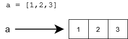
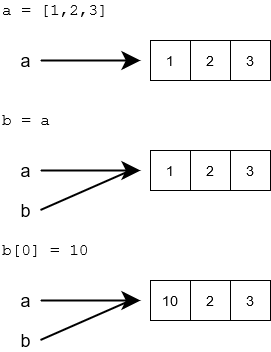

<text-box variant='learningObjectives' name='Oppimistavoitteet'>

Myös listoja on kätevä käsitellä funktioiden avulla. Listojen välitys parametrina voi kuitenkin erota mutatoitumattomien arvojen käytöstä.

Tämän osan suoritettuasi

- Tiedät mitä tarkoitetaan viittaustyyppisellä muuttujalla
- TIedät, että samaan olioon voi olla useampia viittauksia
- Osaat käyttää listoja funktioiden parametreina
- Tiedät mitä tarkoitetaan funktion sivuvaikutuksella

</text-box>

Olemme tähän asti ajatelleet että muuttuja on eräänlainen "laatikko", joka sisältää muutujan tallettaman arvon. Teknisesti ottaen tämä ei pitä paikkaansa, Pythonissa muuttujat eivät sisällä tallettamaansa arvoa vaan ne _viittaavat_ arvona olevaan  _olioon_, kuten lukuun, merkkijonoon tai listaan.


Käytännössä tämä tarkoittaa, että muuttujaan _ei talleta_ tietoa muuttujan arvosta, vaan tiedon siitä paikasta mistä tallennettu arvo löytyy.

Yleensä viittausta kuvataan nuolena muuttujasta sen varsinaiseen arvoon:



Viittaus siis kertoo mistä varsinainen arvo löytyy. Muuttujan "varsinaiseen" arvoon eli viittaukseen pääsee käsiksi funktiolla `id`

```python
a = [1,2,3]
print(id(a))
b = "Tämäkin on viittaus"
print(id(a))
```

<sample-output>

4538357072
4537788912

</sample-output>

Viittaus eli muuttujan id on numero, jonka voi ajatela olevan muuttujan arvon sijainnin osoite tietokoneen muistissa.

Monet Pythonin "sisäänrakennetut" tyypit, kuten `str` ovat _mutatoitumattomia_. Tämä tarkoittaa, että olion arvo ei voi koskaan muuttua. Sen sijaan se voidaan korvata uudella arvolla:


Pythonissa on myös monia tyyppejä, jotka ovat mutatoituvia. Esimerkiksi listan sisältö voi muuttua ilman että tarvitsee luoda kokonaan uusi lista:


Hieman yllättävää on että myös lukuja ja totuusarvoja edustavat perustietotyypit `int`, `float` ja `bool` ovat mutatoitumattomia, eli jos suoritetaan esimerkiksi seuraava ohjelma

```python
luku = 1
luku = 2
luku = luku + 10
```

vaikka vaikuttaakin siltä, että ohjelma manipuloi saman kokonaisluvun sisältöä, teknisesti ottaen ei näin ole, jokainen komento luo uuden kokonaisluvun!

Seuraavan ohjelman tulostus on mielenkiintoinen

```python
luku = 1
print(id(luku))
luku = luku + 10
print(id(luku))
a = 1
print(id(a))
```

<sample-output>

4535856912
4535856944
4535856912

</sample-output>

Aluksi muuttuja `luku` viittaa paikkaan 4535856912 ja kun muuttujan arvo muuttuu, se alkaa viitata paikkaan 4535856944. Kun muuttujaan `a` sijoitetaan arvo 1, se alkaa viitata samaan paikkaan mihin `luku` viittasi kun sen arvo oli 1!

Vaikuttaakin siltä että Python on tallentanut luvun 1 paikkaan 4535856912 ja aina kun jonkun muuttujan arvona on 1, _viittaa_ muuttuja tuohon paikkaan "tietokoneen muistissa".

Vaikka perustietotyypit `int`, `float` ja `bool` ovatkin viittauksia, ei ohjelmoijan oikeastaan tarvitse välittää asiasta.

## Useampi viittaus samaan listaan

Tarkastellaan esimerkkinä listamuuttujan arvon kopiointia:

```python
a = [1,2,3]
b = a
b[0] = 10
```

Sijoitus `b = a` kopioi muuttujan `b` arvon muuttujaan `a`. On tärkeä kuitenkin huomata se, että muuttujan arvona _ei ole lista_ vaan _viittaus listaan_.

**Sijoitus `b = a` siis kopioi viittauksen.**

Tämä tarkoittaa, että kopioinnin jälkeen samaan listaan on kaksi viittausta:



Listaa voidaan käsitellä kumman tahansa viittauksen avulla:

```python
lista = [1,2,3,4]
lista2 = lista

lista[0] = 10
lista2[1] = 20

print(lista)
print(lista2)
```

<sample-output>

[10, 20, 3, 100]
[10, 20, 3, 100]

</sample-output>

Mikäli samaan listaan on useampia viittauksia, sitä voidaan käsitellä minkä tahansa viittauksen kautta samalla tavalla.

## Listan kopiointi

Jos haluamme tehdä oikean kopion, voimme luoda uuden listan ja lisätä siihen jokaisen aluperäisen listan alkion:

```python
lista = [1, 2, 3, 3, 5]

kopio = []
for alkio in lista:
  kopio.append(alkio)

kopio[0] = 10
kopio.append(6)
print("alkup " + str(lista))
print("kopio " + str(kopio))
```

<sample-output>

alkup [1, 2, 3, 3, 5]
kopio [10, 2, 3, 3, 5, 6]

</sample-output>

Helpompi tapa listan kopiomiseen on hyödyntää `[]`-operaattoria, joka toimii listoille samalla tavalla kuin merkkijonoille.

```python
lista = [1,2,3,4,5,6,7,8]
osa = lista[2:5]
print(osa)
osa.append(10)
osa.append(11)
print(osa)
print(lista)
```

<sample-output>

[3, 4, 5]
[3, 4, 5, 10, 11]
[1, 2, 3, 4, 5, 6, 7, 8]

</sample-output>

`[]`-operaattori siis luo kopion, minkä sisällöksi tulee parametrien määritelemä osa alkuperäisen listan sisällöstä.

Voimmekin hyödyntää erikoistapausta, missä `[]`-operaattorille ei anneta ollenkaan kopion aloitus- ja lopetuspistettä, näin kopio luodaan koko listasta:

```python
lista = [1,2,3,4]
kopio = lista[:]

lista[0] = 10
kopio[1] = 20

print(lista)
print(kopio)
```

<sample-output>

[10, 2, 3, 4]
[1, 20, 3, 4]

</sample-output>

Merkintä `[:]` siis tarkoittaa, että erotamme listasta osan, joka alkaa listan alusta ja päättyy listan loppuun (samaan tapaan kuin `[2:5]` tarkoittaa, että erotamme osan, joka alkaa kohdasta 2 ja päättyy ennen kohtaa 5). Tämän sivuvaikutuksena listasta syntyy kopio.

## Lista funktion parametrina

Kun lista välitetään parametrina funktiolle, välitetään viittaus listaan. Tämä tarkoittaa, että funktio voi muuttaa parametrinaan saamaansa listaa.

Esimerkiksi seuraava funktio lisää uuden alkion parametrinaan saamaansa listaan:

```python
def lisaa_alkio(lista: list):
    lista.append(10)

lista = [1,2,3]
print(lista)
lisaa_alkio(lista)
print(lista)
```

<sample-output>
[1, 2, 3]
[1, 2, 3, 10]
</sample-output>

Huomaa, että funktio `lisaa_alkio` ei palauta mitään, vaan muuttaa parametrinaan saamaansa listaa. Toinen tapa olisi luoda uusi lista ja palauttaa se:

```python
def lisaa_alkio(lista: list) -> list:
    kopio = lista[:]
    kopio.append(10)
    return kopio

luvut = [1,2,3]
luvut2 = lisaa_alkio(luvut)

print("Alkuperäinen lista:", luvut)
print("Uusi lista:", luvut2)
```

<sample-output>

Alkuperäinen lista: [1, 2, 3]
Uusi lista: [1, 2, 3, 10]

</sample-output>

<programming-exercise name='Sudoku: ruudukon tulostus ja luvun lisäys' tmcname='osa05-07_sudoku_osa5'>

Tässä tehtävässä toteutetaan vielä kaksi funktiota sudokua varten `tulosta` ja ``lisaa.

Funktio, `tulosta` saa parametriksi surokuruudukkoa esittävän kaksiulotteisen taulukon ja tulostaa sen alla olevan esimerkkituostuksen mukaisessa muodossa.

Funktio, `lisays` saa parametriksi surokuruudukkoa esittävän kaksiulotteisen taulukon, rivi- ja sarakenumerot sekä luvun väliltä 1-9. Funktio lisää luvun parametrien ilmoittamaan kohtaan sudokuruudukkoa.

```python
sudoku  = [
    [ 0, 0, 0, 0, 0, 0, 0, 0, 0 ],
    [ 0, 0, 0, 0, 0, 0, 0, 0, 0 ],
    [ 0, 0, 0, 0, 0, 0, 0, 0, 0 ],
    [ 0, 0, 0, 0, 0, 0, 0, 0, 0 ],
    [ 0, 0, 0, 0, 0, 0, 0, 0, 0 ],
    [ 0, 0, 0, 0, 0, 0, 0, 0, 0 ],
    [ 0, 0, 0, 0, 0, 0, 0, 0, 0 ],
    [ 0, 0, 0, 0, 0, 0, 0, 0, 0 ],
    [ 0, 0, 0, 0, 0, 0, 0, 0, 0 ],
]

tulosta(sudoku)
lisays(sudoku, 0, 0, 2)
lisays(sudoku, 1, 2, 7)
lisays(sudoku, 5, 7, 3)
print()
print("kolme numeroa lisätty:")
print()
tulosta(sudoku)
```

<sample-output>

<pre>
_ _ _  _ _ _  _ _ _
_ _ _  _ _ _  _ _ _
_ _ _  _ _ _  _ _ _

_ _ _  _ _ _  _ _ _
_ _ _  _ _ _  _ _ _
_ _ _  _ _ _  _ _ _

_ _ _  _ _ _  _ _ _
_ _ _  _ _ _  _ _ _
_ _ _  _ _ _  _ _ _

kolme numeroa lisätty:

2 _ _  _ _ _  _ _ _
_ _ 7  _ _ _  _ _ _
_ _ _  _ _ _  _ _ _

_ _ _  _ _ _  _ _ _
_ _ _  _ _ _  _ _ _
_ _ _  _ _ _  _ 3 _

_ _ _  _ _ _  _ _ _
_ _ _  _ _ _  _ _ _
_ _ _  _ _ _  _ _ _

</pre>

</sample-output>

</programming-exercise>

## Funktioiden sivuvaikutukset

Koska funktio saa parametrinaan viittauksen listaan, se voi muuttaa tätä listaa. Jos funktion varsinaisena tarkoituksena ei ole muuttaa listaa, muutokset voivat aiheuttaa ongelmia toisaalla ohjelmassa.

Tarkastellaan esimerkkinä funktiota, jonka tarkoituksena on etsiä listan toiseksi pienin alkio:

```python
def toiseksi_pienin(lista: list) -> int:
    # järjestetyn listan toiseksi pienin alkio on kohdassa 1
    lista.sort()
    return lista[1]

luvut = [1,4,2,5,3,6,4,7]
print(toiseksi_pienin(luvut))
print(luvut)
```

<sample-output>
2
[1, 2, 3, 4, 4, 5, 6, 7]
</sample-output>

Funktio kyllä etsii ja löytää toiseksi pienimmän alkion, mutta sen lisäksi se muuttaa listan alkioiden järjestyksen. Jos järjestyksellä on merkitystä muualla ohjelmassa, funktion kutsuminen todennäköisesti aiheuttaa virheitä. Esimerkin kaltaista muutosta viittauksena saatuun olioon kutsutaan funktion _sivuvaikutukseksi_.

Sama esimerkki ilman sivuvaikutuksia:

```python
def toiseksi_pienin(lista: list) -> int:
    kopio = sorted(lista)
    return kopio[1]

luvut = [1,4,2,5,3,6,4,7]
print(toiseksi_pienin(luvut))
print(luvut)
```

<sample-output>

2
[1, 4, 2, 5, 3, 6, 4, 7]

</sample-output>

Koska funktio `sorted` palauttaa uuden järjestetyn listan, toiseksi pienimmän alkion etsiminen ei enää sotke listan alkuperäistä järjestystä.

Useimmiten pidetään hyvänä asiana että funktiot eivät aiheuta sivuvaikutuksia, sillä niiden takia ohjelmien toimivuuden varmistaminen muuttuu huomattavasti hankalammaksi.

Sivuvaikutuksettomia funktioita kutsutaan myös _puhtaiksi funktioiksi_ ja erityisesti ns. funktionaalista ohjelmointityyliä käytettäessä funktiot pyritään rakentamaan juuri näin. Palaamme aiheeseen tarkemmin Ohjelmoinnin jatkokurssilla.
