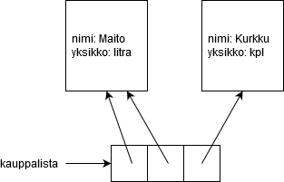

<text-box variant='learningObjectives' name='Oppimistavoitteet'>

Tämän osion jälkeen

- Tiedät miten olioita voi tallentaa tietorakenteisiin
- Tiedät miten olioiden välitys parametrina toimii

</text-box>

Pythonissa kaikki arvot ovat olioita. Niinpä myös omista luokista luotuja olioita voi käsitellä kuin mitä tahansa muitakin olioita: niitä on esimerkiksi helppo tallentaa listaan:

```python

from datetime import date

# Esimerkkiluokka mallintaa kurssisuoritusta
class Kurssisuoritus:

    def __init__(self, kurssi: str, opintopisteet: int, suorituspvm: date):
        self.kurssi = kurssi
        self.opintopisteet = opintopisteet
        self.suorituspvm = suorituspvm


if __name__ == "__main__":
    # Luodaan pari kurssisuoritusta ja lisätään listaan
    suoritukset = []

    matikka = Kurssisuoritus("Matematiikka 1", 5, date(2020, 3, 11))
    ohj1 = Kurssisuoritus("Ohjelmointi 1", 6, date(2019, 12, 17))

    suoritukset.append(matikka)
    suoritukset.append(ohj1)

    # Lisätään suoraan listaan muutama
    suoritukset.append(Kurssisuoritus("Fysiikka 2", 4, date(2019, 11, 10)))
    suoritukset.append(Kurssisuoritus("Ohjelmointi 2", 5, date(2020, 5, 19)))

    # Käydään läpi kaikki suoritukset, tulostetaan nimet ja lasketaan opintopisteet yhteen
    pisteet = 0
    for suoritus in suoritukset:
        print(suoritus.kurssi)
        pisteet += suoritus.opintopisteet

    print("Pisteitä yhteensä:", pisteet)
```

<sample-output>

Matematiikka 1
Ohjelmointi 1
Fysiikka 2
Ohjelmointi 2
Pisteitä yhteensä: 20

</sample-output>

<programming-exercise name='Nopein auto' tmcname='osa09-01_nopein_auto'>

Tehtäväpohjassa oleva luokka `Auto` mallintaa autoa kahden attribuutin avulla: `merkki (str)` ja `huippunopeus (int)`.

Kirjoita funktio `nopein_auto(autot: list)`, joka saa parametrikseen listan Auto-luokan olioita.

Funktio palauttaa listassa olevista autoista nopeimman auton merkin. Älä muuta alkuperäistä listaa tai luokkaa Auto.

Esimerkki funktion testauksesta:

```python
if __name__ == "__main__":
    auto1 = Auto("Mersu", 195)
    auto2 = Auto("Lada", 110)
    auto3 = Auto("Ferrari", 280)
    auto4 = Auto("Trabant", 85)

    autot = [auto1, auto2, auto3, auto4]
    print(nopein_auto(autot))
```

<sample-output>

Ferrari

</sample-output>

</programming-exercise>

<programming-exercise name='Hyväksytyt suoritukset' tmcname='osa09-02_hyvaksytyt_suoritukset'>

Tehtäväpohjasta löytyy luokka `Koesuoritus`, joka mallintaa nimensä mukaisesti koesuoritusta. Sillä on kaksi attribuuttia, `suorittaja (str)` ja `pisteet (int)`.

Kirjoita funktio `hyvaksytyt(suoritukset: list, pisteraja: int)`, joka saa parametrikseen listan koesuorituksia ja alimman hyväksytyn pistemäärän kokonaislukuna.

Funktio muodostaa ja palauttaa uuden listan, johon on tallennettu ainoastaan hyväksytyt suoritukset listalta.

Älä muuta alkuperäistä listaa tai luokkaa Koesuoritus!

Esimerkki funktion käytöstä:

```python
if __name__ == "__main__":
    s1 = Koesuoritus("Pekka", 12)
    s2 = Koesuoritus("Pirjo", 19)
    s3 = Koesuoritus("Pauli", 15)
    s4 = Koesuoritus("Pirkko", 9)
    s5 = Koesuoritus("Petriina", 17)

    hyv = hyvaksytyt([s1, s2, s3, s4, s5], 15)
    for hyvaksytty in hyv:
        print(hyvaksytty)
```

<sample-output>

Koesuoritus (suorittaja: Pirjo, pisteet: 19)
Koesuoritus (suorittaja: Pauli, pisteet: 15)
Koesuoritus (suorittaja: Petriina, pisteet: 17)

</programming-exercise>

Listaan ei itse asiassa oikeasti tallenneta olioita, vaan _viittauksia olioihin_. Niinpä sama olio voi esiintyä listassa useaan kertaan (eli käytännössä samaan olioon voidaan viitata useaan kertaan listassa ja sen ulkoupuolella):

Esimerkiksi

```python
class Tuote:
    def __init__(self, nimi: int, yksikko: str):
        self.nimi = nimi
        self.yksikko = yksikko


if __name__ == "__main__":
    kauppalista = []
    maito = Tuote("Maito", "litra")

    kauppalista.append(maito)
    kauppalista.append(maito)
    kauppalista.append(Tuote("Kurkku", "kpl"))
```



Jos samaan olioon on useampi kuin yksi viittaus, on lopputuloksen kannalta yhdentekevää mitä viittauksista käytetään:

```python

class Koira:

    def __init__(self, nimi):
        self.nimi = nimi

    def __repr__(self):
        return self.nimi


k = Koira("Musti")
lista = (k, k, Koira("Musti"))
print(k)
print(lista)

print("Muutetaan arvoa...")
k.nimi = "Rekku"
print(k)
print(lista)

print("Muutetaan arvoa listasta...")
lista[0].nimi = "Fifi"
print(k)
print(lista)

print("Viimeinen olio listassa on eri olio kuin muut")
lista[2].nimi = "Turre"
print(k)
print(lista)

```

<sample-output>

Musti
(Musti, Musti, Musti)
Muutetaan muuttujan k kautta arvoa...
Rekku
(Rekku, Rekku, Musti)
Muutetaan arvoa listasta...
Fifi
(Fifi, Fifi, Musti)
Viimeinen olio listassa on eri olio kuin muut
Fifi
(Fifi, Fifi, Turre)

</sample-output>

Listan kaksi ensimmäistä alkiota viittaavat samaan Koira-luokan olioon kuin muuttuja `k`. Niinpä olion sisältöä voidaan muuttaa minkä tahansa näistä viittauksista avulla. Viimeinen alkio listassa on viittaus kokonaan toiseen olioon - niinpä muutokset eivät vaikuta siihen (lukuunottamatta viimeistä muokkausta, joka kohdistuu tähän olioon).

Muista, että operaattorilla `is` voidaan tutkia onko kyseessä sama olio, ja operaattorilla `==` onko kyseessä samantyylinen olio.

Niinpä esimerkiksi


```python
lista1 = [1,2,3]
lista2 = [1,2,3]
lista3 = lista1

print(lista1 is lista2)
print(lista1 is lista3)
print(lista2 is lista3)

print()

print(lista1 == lista2)
print(lista1 == lista3)
print(lista2 == lista3)
```

<sample-output>

False
True
False

True
True
True

</sample-output>

Omista luokista muodostettuja olioita voi myös tallentaa esimerkiksi sanakirjaan (tai mihin tahansa tietorakenteeseen):

```python

class Opiskelija:
    def __init__(self, nimi: str, op: int):
        self.nimi = nimi
        self.op = op

if __name__ == "__main__":
    # Käytetään avaimena opiskelijanumeroa ja
    # arvona Opiskelija-oliota
    opiskelijat = {}
    opiskelijat["12345"] = Opiskelija("Olli Opiskelija", 10)
    opiskelijat["54321"] = Opiskelija("Outi Opiskelija", 67)

```

## Oliot funktioiden parametrina

Koska omista luoduista luodut oliot ovat (yleensä) muuttuvia eli mutatoituvia, niiden toiminta parametrina välitettäessä muistuttaa listoista tuttua tapaa. Funktio, jolle olio välitetäään parametrina, voi muuttaa saamaansa oliota (edellyttäen että olio tarjoaa asiakkailleen muuttaamiseen tarvittavat operaatiot).

Tarkastellaan yksinkertaista esimerkkiä, jossa funktiolle välitetään Opiskelija-luokasta luotu olio. Funktion sisällä muutetaan opiskelijan nimi, ja muutos näkyy myös pääohjelmassa (koska molemmissa tilanteissa viitataan samaan olioon):

```python

class Opiskelija:

    def __init__(self, nimi: str, opiskelijanumero: str, opintopisteet: int):
        self.nimi = nimi
        self.opiskelijanumero = opiskelijanumero
        self.opintopisteet = opintopisteet

    def __repr__(self):
        return f"Opiskelija, nimi: {self.nimi}, opiskelijanumero: {self.opiskelijanumero}, opintopisteet: {self.opintopisteet}"


# Huomaa, että tyyppivihjeenä käytetään nyt oman luokan nimeä
def muuta_nimi(opiskelija: Opiskelija):
    opiskelija.nimi = "Olli Opiskelija"

# Luodaan opiskelijaolio
o = Opiskelija("Olli Oppilas", "12345", 10)

print(o)
muuta_nimi(o)
print(o)

```

<sample-output>

Opiskelija, nimi: Olli Oppilas, opiskelijanumero: 12345, opintopisteet: 10
Opiskelija, nimi: Olli Opiskelija, opiskelijanumero: 12345, opintopisteet: 10

</sample-output>


Olion voi myös luoda funktiossa. Mikäli funktio palauttaa viittauksen olioon, on muodostettu olio käytettävissä myös pääohjelmassa:

```python

from random import randint, choice

class Opiskelija:

    def __init__(self, nimi: str, opiskelijanumero: str, opintopisteet: int):
        self.nimi = nimi
        self.opiskelijanumero = opiskelijanumero
        self.opintopisteet = opintopisteet

    def __repr__(self):
        return f"Opiskelija, nimi: {self.nimi}, opiskelijanumero: {self.opiskelijanumero}, opintopisteet: {self.opintopisteet}"


# Metodi luo ja palauttaa Opiskelija-olion, jolla on satunnainen nimi, opiskelijanumero ja pistemäärä
def uusi_opiskelija():
    etunimet = ["Arto","Pekka","Minna","Mari"]
    sukunimet = ["Virtanen", "Lahtinen", "Leinonen", "Pythonen"]

    # arvo nimi
    nimi = choice(etunimet) + " " + choice(sukunimet)

    # Arvo opiskelijanumero
    opnro = str(randint(10000,99999))

    # Arvo opintopistemääärä
    op = randint(0,300)

    # Luo ja palauta opiskelijaolio
    return Opiskelija(nimi, opnro, op)


if __name__ == "__main__":
    # kutsutaan metodia viidesti, tallennetaan tulokset listaan
    opiskelijat = []
    for i in range(5):
        opiskelijat.append(uusi_opiskelija())

    # Tulostetaan
    for opiskelija in opiskelijat:
        print(opiskelija)

```

<sample-output>

Opiskelija, nimi: Mari Lahtinen, opiskelijanumero: 36213, opintopisteet: 257
Opiskelija, nimi: Arto Virtanen, opiskelijanumero: 11859, opintopisteet: 55
Opiskelija, nimi: Mari Pythonen, opiskelijanumero: 77330, opintopisteet: 261
Opiskelija, nimi: Arto Pythonen, opiskelijanumero: 86451, opintopisteet: 263
Opiskelija, nimi: Minna Pythonen, opiskelijanumero: 86211, opintopisteet: 290

</sample-output>

## Oliot metodien parametrina

Olito toimivat normaaliin tapaan myös _metodeinen_ parametrina. Tarkastellaan seuraavaa esimerkkiä:

```python
class Henkilo:

    def __init__(self, nimi: str, pituus: int):
        self.nimi = nimi
        self.pituus = pituus

class Huvipuistolaite:
    def __init__(self, nimi: str, pituusraja: int):
        self.kavijoita = 0
        self.nimi = nimi
        self.pituusraja = pituusraja

    def ota_kyytiin(self, henkilo: Henkilo):
        if henkilo.pituus<self.pituusraja:
            return False

        self.kavijoita += 1
        return True

    def __repr__(self):
        return f"laite: {self.nimi}, kävijöitä {self.kavijoita}"
```

Huvipuistolaitteen metodi `ota_kyytiin` saa nyt parametrina luokan `Henkilo` olion. Metodi tarkistaa onko parametrina oleva henkilö liian lyhyt laitteeseen, ja palauttaa tässä tapauksessa `False`. Jos henkilö on riittävän pitkä, kasvattaa huvipuistolaite kävijämäärää yhdellä ja metodi palauttaa `True`. Seuraavassa esimerkkisuoritus:

```python
hurjakuru = Huvipuistolaite("hurjakuru", 120)
jarkko = Henkilo("Jarkko", 172)
venla = Henkilo("Venla", 105)

ok = hurjakuru.ota_kyytiin(jarkko)
if ok:
    print(f"{jarkko.nimi} pääsi kyytiin")
else:
    print(f"{jarkko.nimi} liian lyhyt :(")

ok = hurjakuru.ota_kyytiin(venla)
if ok:
    print(f"{venla.nimi} pääsi kyytiin")
else:
    print(f"{venla.nimi} liian lyhyt :(")

print(hurjakuru)
```

<sample-output>

Jarkko pääsi kyytiin
Venla liian lyhyt :(
laite: hurjakuru, kävijöitä 1

</sample-output>

<programming-exercise name='Kasvatuslaitos' tmcname='osa09-03_kasvatuslaitos'>

Tehtäväpohjassasi on valmiina jo luokka `Henkilo` sekä runko luokalle `Kasvatuslaitos`. Kasvatuslaitosoliot käsittelevät ihmisiä eri tavalla, esim. punnitsevat ja syöttävät ihmisiä. Rakennamme tässä tehtävässä kasvatuslaitoksen. Luokan `Henkilo` koodiin ei tehtävässä ole tarkoitus koskea!

## Henkilöiden punnitseminen

Kasvatuslaitoksen luokkarungossa on valmiina runko metodille punnitse:

```python
class Kasvatuslaitos:
    def punnitse(self, henkilo: Henkilo):
        # palautetaan parametrina annetun henkilön paino
        return -1
```

Metodi saa parametrina henkilön ja metodin on tarkoitus palauttaa kutsujalleen parametrina olevan henkilön paino. Paino selviää kutsumalla parametrina olevan henkilön henkilo sopivaa metodia. Eli täydennä metodin koodi!


Seuraavassa on pääohjelma jossa kasvatuslaitos punnitsee kaksi henkilöä:

```python
haagan_neuvola = Kasvatuslaitos()

eero = Henkilo("Eero", 1, 110, 7)
pekka = Henkilo("Pekka", 33, 176, 85)

print(f"{eero.nimi}: paino {haagan_neuvola.punnitse(eero)} kg")
print(f"{pekka.nimi}: paino {haagan_neuvola.punnitse(pekka)} kg")
```

<sample-output>

Eero paino: 7 kiloa
Pekka paino: 85 kiloa

</sample-output>

## Syöttäminen

Parametrina olevan olion tilaa on mahdollista muuttaa. Tee kasvatuslaitokselle metodi `syota(henkilo: Henkilo)` joka kasvattaa parametrina olevan henkilön painoa yhdellä.

Seuraavassa esimerkki, jossa henkilöt ensin punnitaan, ja tämän jälkeen neuvolassa syötetään eeroa kolme kertaa. Tämän jälkeen henkilöt taas punnitaan:

```python
haagan_neuvola = Kasvatuslaitos()

eero = Henkilo("Eero", 1, 110, 7)
pekka = Henkilo("Pekka", 33, 176, 85)

print(f"{eero.nimi}: paino {haagan_neuvola.punnitse(eero)} kg")
print(f"{pekka.nimi}: paino {haagan_neuvola.punnitse(pekka)} kg")

haagan_neuvola.syota(eero)
haagan_neuvola.syota(eero)
haagan_neuvola.syota(eero)

print(f"{eero.nimi}: paino {haagan_neuvola.punnitse(eero)} kg")
print(f"{pekka.nimi}: paino {haagan_neuvola.punnitse(pekka)} kg")
```

Tulostuksen pitäisi paljastaa että Eeron paino on noussut kolmella:

<sample-output>

Eero paino: 7 kiloa
Pekka paino: 85 kiloa

Eero paino: 10 kiloa
Pekka paino: 85 kiloa

</sample-output>

## Punnitusten laskeminen

Tee kasvatuslaitokselle metodi `punnitukset()` joka kertoo kuinka monta punnitusta kasvatuslaitos on ylipäätään tehnyt. Huom! Tarvitset uuden oliomuuttujan punnitusten lukumäärän laskemiseen! Testipääohjelma:

```python

haagan_neuvola = Kasvatuslaitos()

eero = Henkilo("Eero", 1, 110, 7)
pekka = Henkilo("Pekka", 33, 176, 85)

print(f"punnituksia tehty {haagan_neuvola.punnitukset()}")

haagan_neuvola.punnitse(eero)
haagan_neuvola.punnitse(eero)

print(f"punnituksia tehty {haagan_neuvola.punnitukset()}")

haagan_neuvola.punnitse(eero)
haagan_neuvola.punnitse(eero)
haagan_neuvola.punnitse(eero)
haagan_neuvola.punnitse(eero)

print(f"punnituksia tehty {haagan_neuvola.punnitukset()}")
```

<sample-output>

punnituksia tehty 0
punnituksia tehty 2
punnituksia tehty 6

</sample-output>

</programming-exercise>

<programming-exercise name='Maksukortti ja kassapääte' tmcname='osa09-04_maksukortti_ja_kassapaate'>

Teimme edellisessä osassa luokan Maksukortti. Kortilla oli metodit edullisesti ja maukkaasti syömistä sekä rahan lataamista varten.

Edellisen osan tyylillä tehdyssä Maksukortti-luokassa oli kuitenkin ongelma. Kortti tiesi lounaiden hinnan ja osasi sen ansiosta vähentää saldoa oikean määrän. Entä kun hinnat nousevat? Tai jos myyntivalikoimaan tulee uusia tuotteita? Hintojen muuttaminen tarkoittaisi, että kaikki jo käytössä olevat kortit pitäisi korvata uusilla, uudet hinnat tuntevilla korteilla.

Parempi ratkaisu on tehdä kortit "tyhmiksi", hinnoista ja myytävistä tuotteista tietämättömiksi pelkän saldon säilyttäjiksi. Kaikki äly kannattaakin laittaa erillisiin olioihin, kassapäätteisiin.

## "Tyhmä" Maksukortti

Toteutetaan ensin Maksukortista "tyhmä" versio. Kortilla on ainoastaan metodit saldon kysymiseen, rahan lataamiseen ja rahan ottamiseen. Täydennä alla (ja tehtäväpohjassa) olevaan luokkaan metodin `ota_rahaa(maara)` ohjeen mukaan:

```python
class Maksukortti:
    def __init__(self, saldo: float):
        self.saldo = saldo

    def lataa_rahaa(self, lisays: float):
        self.saldo += lisays

    def ota_rahaa(self, maara: float):
        pass
        # toteuta metodi siten että se ottaa kortilta rahaa vain jos saldo on vähintään maara
        # onnistuessaan metodi palauttaa True ja muuten False
```

Testipääohjelma:

```python
if __name__ == "__main__":
    kortti = Maksukortti(10)
    print("rahaa", kortti.saldo
    onnistuiko = kortti.ota_rahaa(8)
    print("onnistuiko otto:" ,onnistuiko)
    print("rahaa", kortti.saldo
    onnistuiko = kortti.ota_rahaa(4)
    print("onnistuiko otto:" ,onnistuiko)
    print("rahaa", kortti.saldo)
```

<sample-output>

rahaa 10.0
onnistuiko otto: True
rahaa 2.0
onnistuiko otto: False
rahaa 2.0

</sample-output>

## Kassapääte ja käteiskauppa

Unicafessa asioidessa asiakas maksaa joko käteisellä tai maksukortilla. Myyjä käyttää kassapäätettä kortin velottamiseen ja käteismaksujen hoitamiseen. Tehdään ensin kassapäätteestä käteismaksuihin sopiva versio.

Kassapäätteen runko. Metodien kommentit kertovat halutun toiminnallisuuden:

```python
class Kassapaate:
    def __init__(self):
        # kassassa on aluksi 1000 euroa rahaa
        self.rahaa = 1000
        self.edulliset = 0
        self.maukkaat = 0

    def syo_edullisesti(self, maksu: float):
        # edullinen lounas maksaa 2.50 euroa.
        # kasvatetaan kassan rahamäärää edullisen lounaan hinnalla ja palautetaan vaihtorahat
        # jos parametrina annettu maksu ei ole riittävän suuri, ei lounasta myydä ja metodi palauttaa koko summan

    def syo_maukkaasti(self, maksu: float):
        # maukas lounas maksaa 4.30 euroa.
        # kasvatetaan kassan rahamäärää maukkaan lounaan hinnalla ja palautetaan vaihtorahat
        # jos parametrina annettu maksu ei ole riittävän suuri, ei lounasta myydä ja metodi palauttaa koko summan

    def __repr__(self):
        return f"kassassa rahaa {self.rahaa} edullisia lounaita myyty {self.edulliset} maukkaita lounaita myyty {self.maukkaat}"

```

Käyttöesimerkki

```python
unicafe_exactum = Kassapaate()

vaihtorahaa = unicafe_exactum.syo_edullisesti(10)
print("vaihtorahaa jäi", vaihtorahaa)

vaihtorahaa = unicafe_exactum.syo_edullisesti(5)
print("vaihtorahaa jäi", vaihtorahaa)

vaihtorahaa = unicafe_exactum.syo_maukkaasti(4.3)
print("vaihtorahaa jäi", vaihtorahaa)

print(unicafe_exactum)
```

<sample-output>

vaihtorahaa jäi 7.5
vaihtorahaa jäi 2.5
vaihtorahaa jäi 0.0
kassassa rahaa 1009.3 edullisia lounaita myyty 2 maukkaita lounaita myyty 1

</sample-output>

## Kortilla maksaminen

Laajennetaan kassapäätettä siten että myös kortilla voi maksaa. Teemme kassapäätteelle siis metodit joiden parametrina kassapääte saa maksukortin jolta se vähentää valitun lounaan hinnan. Seuraavassa uusien metodien rungot ja ohje niiden toteuttamiseksi:

```python
class Kassapaate:
    # ...

    def syo_edullisesti_kortilla(self, kortti:Maksukortti):
        # edullinen lounas maksaa 2.50 euroa.
        # jos kortilla on tarpeeksi rahaa, vähennetään hinta kortilta ja palautetaan True
        # muuten palautetaan False


    def syo_maukkaasti_kortilla(self, kortti:Maksukortti):
        # maukas lounas maksaa 4.30 euroa.
        # jos kortilla on tarpeeksi rahaa, vähennetään hinta kortilta ja palautetaan True
        # muuten palautetaan False
```

**Huom:** kortilla maksaminen ei lisää kassapäätteessä olevan käteisen määrää.

Seuraavassa testipääohjelma ja haluttu tulostus:

```python

unicafe_exactum = Kassapaate()

vaihtorahaa = unicafe_exactum.syo_edullisesti(10)
print("vaihtorahaa jäi " + vaihtorahaa)

kortti = Maksukortti(7)

onnistuiko = unicafe_exactum.syo_maukkaasti_kortilla(kortti)
print("riittikö raha:", onnistuiko)
onnistuiko = unicafe_exactum.syo_maukkaasti_kortilla(kortti)
print("riittikö raha:", onnistuiko)
onnistuiko = unicafe_exactum.syo_edullisesti_kortilla(kortti)
print("riittikö raha:", onnistuiko)

printunicafe_exactum)

```

<sample-output>

vaihtorahaa jäi 7.5
riittikö raha: True
riittikö raha: False
riittikö raha: True
kassassa rahaa 1002.5 edullisia lounaita myyty 2 maukkaita lounaita myyty 1

</sample-output>

## Rahan lataaminen

Lisätään vielä kassapäätteelle metodi jonka avulla kortille voidaan ladata lisää rahaa. Muista, että rahan lataamisen yhteydessä ladattava summa viedään kassapäätteeseen. Metodin runko:

```python

def lataa_rahaa_kortille(self, kortti: Maksukortti, summa:float ):
    pass
```

Testipääohjelma ja esimerkkisyöte:

```python
unicafe_exactum = Kassapaate()
print(unicafe_exactum)

antin_kortti = Maksukortti(2)

print(f"kortilla rahaa {antin_kortti.saldo} euroa")

onnistuiko = unicafe_exactum.syo_maukkaasti_kortilla(antin_kortti)
print("riittikö raha:", onnistuiko)

unicafe_exactum.lataa_rahaa_kortille(antin_kortti, 100)

onnistuiko = unicafe_exactum.syo_maukkaasti_kortilla(antin_kortti)
print("riittikö raha:", onnistuiko)

print(f"kortilla rahaa {antin_kortti.saldo} euroa")

print(unicafe_exactum)
```

<sample-output>

kassassa rahaa 1000.0 edullisia lounaita myyty 0 maukkaita lounaita myyty 0
kortilla rahaa 2.0 euroa
riittikö raha: False
riittikö raha: True
kortilla rahaa 97.7 euroa
kassassa rahaa 1100.0 edullisia lounaita myyty 0 maukkaita lounaita myyty 1

</sample-output>

</programming-exercise>

## Saman luokan oliot metodien parametrina

Tarkastellaan jälleen kerran yhtä versiota luokasta Henkilo:

```python
class Henkilo:
    def __init__(self, nimi: str, syntynyt: int):
        self.nimi = nimi
        self.syntynyt = syntynyt

    def __repr__(self):
        return f"{self.nimi} syntynyt {self.syntynyt}"
```

Oletetaan että olemme tekemässä ohjelmaa, joka vertailee henkilöiden ikiä. Voisimme tehdä tarkoitusta varten erillisen funktion:

```python
def vanhempi_kuin(h1: Henkilo, h2: Henkilo):
    if h1.syntynyt < h2.syntynyt:
        return True
    else:
        return False

muhammad = Henkilo("Muhammad ibn Musa al-Khwarizmi", 780)
pascal = Henkilo("Blaise Pascal", 1623)
grace = Henkilo("Grace Hopper", 1906)

if vanhempi_kuin(muhammad, pascal):
    print(f"{muhammad} on vanhenmpi kuin {pascal}")
else:
    print(f"{muhammad} ei ole vanhenmpi kuin {pascal}")

if vanhempi_kuin(grace, pascal):
    print(f"{grace} on vanhenmpi kuin {pascal}")
else:
    print(f"{grace} ei ole vanhenmpi kuin {pascal}")
```

<sample-output>

Muhammad ibn Musa al-Khwarizmi on vanhempi kuin Blaise Pascal
Grace Hopper ei ole vanhenmpi kuin  Blaise Pascal

</sample-output>

Olio-ohjelmoinnin henkeen kuuluu kuitenkin sijoittaa oliota käsittelevät "funktiot" luokan metodeiksi. Voisimmekin tehdä henkilölle metodin, jonka avulla henkilön ikää voidaan verrata _toiseen_ hebkilöön:

```python
class Henkilo:
    def __init__(self, nimi: str, syntynyt: int):
        self.nimi = nimi
        self.syntynyt = syntynyt

def vanhempi_kuin(self, toinen: Henkilo):
    if self.syntynyt < toinen.syntynyt:
        return True
    else:
        return False

    def __repr__(self):
        return f"{self.nimi} syntynyt {self.syntynyt}"
```

Nyt siis olio itse on _self_ ja _toinen_ on henkilöolio, joka toimii vertailukohtana.

Huomaa miten metodin kutsuminen eroaa funktion kutsumisesta:

```python
muhammad = Henkilo("Muhammad ibn Musa al-Khwarizmi", 780)
pascal = Henkilo("Blaise Pascal", 1623)
grace = Henkilo("Grace Hopper", 1906)

if muhammad.vanhempi_kuin(pascal):
    print(f"{muhammad} on vanhenmpi kuin {pascal}")
else:
    print(f"{muhammad} ei ole vanhenmpi kuin {pascal}")

if grace.vanhempi_kuin(pascal):
    print(f"{grace} on vanhenmpi kuin {pascal}")
else:
    print(f"{grace} ei ole vanhenmpi kuin {pascal}")
```

Pisteen vasemmalla puolella on siis se ketä verrataan, eli se olio mihin metodin suorituksessa viittaa muuttuja `self`, parametrina taas on vertailukohta, eli metodin suoritukssa muuttujan `toinen` viittaama olio.

Ohjelman tulostus on sama kuin edellisessä funktiota käyttäneessä esimerkissä.

Huomaa, että if-else-rakenne metodissa `vanhempi_kuin` on oikeastaan ihan turha, sillä vertailun arvona on suoraan haluamamme totuusarvo. Voimme siis yksinkertaistaa metodia seuraavasti:

```python
class Henkilo:
    def __init__(self, nimi: str, syntynyt: int):
        self.nimi = nimi
        self.syntynyt = syntynyt

def vanhempi_kuin(self, toinen: Henkilo):
    return self.syntynyt < toinen.syntynyt:

    def __repr__(self):
        return f"{self.nimi} syntynyt {self.syntynyt}"
```


<programming-exercise name='Asuntovertailu' tmcname='osa09-05_asuntovertailu'>

Asuntovälitystoimiston tietojärjestelmässä kuvataan myynnissä olevaa asuntoa seuraavasta luokasta tehdyillä olioilla:

```python
class Asunto:
    def __init__(self, huoneita: int , nelioita: int , neliohinta:int):
        self.huoneita = huoneita
        self.nelioita = nelioita
        self.neliohinta = neliohinta
```

Tehtävänä on toteuttaa muutama metodi, joiden avulla myynnissä olevia asuntoja voidaan vertailla.

## Onko suurempi

Tee metodi `suurempi(self, verrattava)` joka palauttaa True jos asunto-olio, jolle metodia kutsutaan, on pinta-alaltaan suurempi kuin verrattavana oleva asunto-olio.

Esimerkki metodin toiminnasta:

```python
eira_yksio = Asunto(1, 16, 5500)
kallio_kaksio = Asunto(2, 38, 4200)
jakomaki_kolmio = Asunto(3, 78, 2500)

print(eira_yksio.suurempi(kallio_kaksio))
print(jakomaki_kolmio.suurempi(kallio_kaksio))
```

<sample-output>

False
True

</sample-output>

## Hintaero

Tee metodi `hintaero(self, verrattava)` joka palauttaa asunto-olion jolle metodia kutsuttiin ja parametrina olevan asunto-olion hintaeron. Hintaero on asuntojen hintojen erotuksen (hinta lasketaan kertomalla neliöhinta neliöillä) itseisarvo.

Esimerkki metodin toiminnasta:

```python
eira_yksio = Asunto(1, 16, 5500)
kallio_kaksio = Asunto(2, 38, 4200)
jakomaki_kolmio = Asunto(3, 78, 2500)

print(eira_yksio.hintaero(kallio_kaksio))
print(jakomaki_kolmio.hintaero(kallio_kaksio))
```

<sample-output>

71600
35400

</sample-output>

## Onko kalliimpi

Tee metodi `kalliimpi(self, verrattava)` joka palauttaa True jos asunto-olio, jolle metodia kutsutaan on kalliimpi kuin verrattavana oleva asunto-olio.

Esimerkki metodin toiminnasta:

```python
eira_yksio = Asunto(1, 16, 5500)
kallio_kaksio = Asunto(2, 38, 4200)
jakomaki_kolmio = Asunto(3, 78, 2500)

print(eira_yksio.kalliimpi(kallio_kaksio))
print(jakomaki_kolmio.kalliimpi(kallio_kaksio))
```

<sample-output>

False
True

</sample-output>

</programming-exercise>
