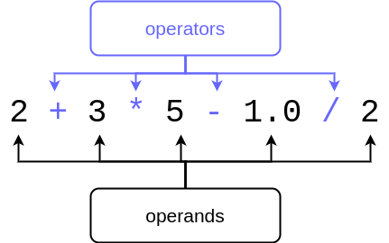

<text-box variant='learningObjectives' name="Learning objectives">

After this section

- You will be able to use variables in various arithmetic operations
- You will know how to deal with numbers in user input
- You will know how to cast values into other fundamental data types

</text-box>

In the previous sections you've seen examples with basic arithmetics. In the following table you can see the most common arithmetic operators in Python, with examples:

| Operator      | Purpose       | Example      | Result |
|:-------------:|---------------|--------------|-------|
| `+`           | Addition      | `2 + 4`      |`6`    |
| `-`           | Subtraction   | `10 - 2.5`   |`7.5`  |
| `*`           | Multiplication | `-2 * 123`  |`-246` |
| `/`           | Division (floating point result) | `9 / 2`     | `4.5` |
| `//`          | Division (integer result)              | `9 // 2`    | `4`   |
| `%`           | Modulo        | `9 % 2`      |`1`    |
| `**`          | Exponentiation | `2 ** 3`    |`8`    |

The order of operations is familiar from mathematics: first calculate the exponents, then multiplication and division, and finally addition and subtraction. The order can be changed with parentheses.

For example this bit of code

```python
print(2 + 3 * 3)
print((2 + 3) * 3)
```

prints out

<sample-output>

11
15

</sample-output>

## Operands, operators and data types

A calculation usually consists of *operands* and *operators*:



The data type of an operand usually determines the data type of the result: if two integers are added together, the result will also be an integer. If a floating point number is subtracted from another floating point number, the result is a floating point number. In fact, if a single one of the operands in an expression is a floating point number, the result will also be a floating point number, regardless of the other operands.

Division `/` is an exception to this rule. Its result is a floating point number, even if the operands are integers. For example `1 / 5` will result in the floating point number `0.2`.

Example:

```python
height = 172.5
weight = 68.55

# the Body Mass Index, or BMI, is calculated by dividing body mass with the square of height
# height is converted into metres in the formula
bmi = weight / (height / 100) ** 2

print(f"The BMI is {bmi}")
```

This program prints out the following:

<sample-output>

The BMI is 23.037177063642087

</sample-output>

Notice Python also has an integer division operator `//`. If the operands are integers, it will produce an integer. The result is rounded down to the nearest integer. For example this program

```python
x = 3
y = 2

print(f"/ operator {x/y}")
print(f"// operator {x//y}")
```

prints out

<sample-output>

/ operator 1.5
// operator 1

</sample-output>

## Numbers as input

We have already used the `input` command to read in strings from the user. The same function can be used to read in numbers, but the string produced by the function must then be converted to a numeric data type in the program code. In the previous section we cast integers as strings with the `str` function. The same basic principle applies here, but the name of the casting function will be different.

A string can be converted into an integer with the function `int`. The following program asks the user for their year of birth and stores it in the variable `input_str`. The program then creates another variable `year`, which contains the year converted into an integer. After this the calculation `2021-year` is possible, using the user-supplied value.

```python
input_str = input("Which year were you born? ")
year = int(input_str)
print(f"Your age at the end of the year 2021: {2021 - year}" )
```
<sample-output>

Which year were you born? **1995**
Your age at the end of the year 2021: 26

</sample-output>

Usually you do not need to create two separate variables (like `input_str` and `year` above) to read a number value from the user. Instead, reading the input with the `input` function and converting it with the `int` function can be achieved in one go:

```python
year = int(input("Which year were you born? "))
print(f"Your age at the end of the year 2021: {2021 - year}" )
```

Similarly, a string can be converted into a floating point number with the function `float`. This programs asks the user for their height and weight, and uses these to calculate their BMI:

```python
height = float(input("What is your height? "))
weight = float(input("What is your weight? "))

height = height / 100
bmi = weight / height ** 2

print(f"The BMI is {bmi}")
```

An example printout from the program:

<sample-output>

What is your height? **163**
What is your weight? **74.45**
The BMI is 28.02137829801649

</sample-output>

<in-browser-programming-exercise name="Times five" tmcname="part01-13_times_five">

Please write a program which asks the user for a number. The program then prints out the number multiplied by five.

The program should function as follows:

<sample-output>

Please type in a number: **3**
3 times 5 is 15

</sample-output>

</in-browser-programming-exercise>

<in-browser-programming-exercise name="Name and age" tmcname="part01-14_name_and_age">

Please write a program which asks the user for their name and year of birth. The program then prints out a message as follows:

<sample-output>

What is your name? **Frances Fictitious**
Which year were you born? **1990**
Hi Frances Fictitious, you will be 31 years old at the end of the year 2021

</sample-output>

</in-browser-programming-exercise>

## Using variables

Let's have a look at a program which calculates the sum of three numbers given by the user:

```python
number1 = int(input("First number: "))
number2 = int(input("Second number: "))
number3 = int(input("Third number: "))

sum = number1 + number2 + number3
print(f"The sum of the numbers: {sum}")
```

An example execution of the program:

<sample-output>

First number: **5**
Second number: **21**
Third number: **7**
The sum of the numbers: 33

</sample-output>

The program uses four different variables, but two would easily suffice in this case:

```python
sum = 0

number = int(input("First number: "))
sum = sum + number

number = int(input("Second number: "))
sum = sum + number

number = int(input("Third number: "))
sum = sum + number

print(f"The sum of the numbers: {sum}")
```

Now all inputs from the user are read into the one and the same variable `number`. The value of the variable `sum` is _increased_ by the value of the variable `number` each time the user inputs a new number.

Let's take a closer look at this command:

```python
sum = sum + number
```

Here, the value of the variable `sum` and the value of the variable `number` are added together, and the result is stored back in the variable `sum`. For example, if before the command the value of `sum` is 3 and the value of `number` is 2, after the command is executed, the value of `sum` is 5.

Increasing the value of a variable is a very common operation. As such, there is a commonly used shorthand notation which achieves the same result as the explicit summing up above:

```python
sum += number
```

This allows us to write the above program a little more concisely:

```python
sum = 0

number = int(input("First number: "))
sum += number

number = int(input("Second number: "))
sum += number

number = int(input("Third number: "))
sum += number

print(f"The sum of the numbers: {sum}")
```

In fact, we don't necessarily need the variable `number` at all. The inputs from the user can also be processed like this:

```python
sum = 0

sum += int(input("First number: "))
sum += int(input("Second number: "))
sum += int(input("Third number: "))

print(f"The sum of the numbers: {sum}")
```

Of course, it will depend on the context how many variables are needed. If it is required to remember each value the user inputs, it will not be possible to "reuse" the same variable to read different values from the user. Consider the following:

```python
number1 = int(input("First number: "))
number2 = int(input("Second number: "))

print(f"{number1} + {number2} = {number1+number2}")
```

<sample-output>

First number: **2**
Second number: **3**
2 + 3 = 5

</sample-output>

On the other hand, the above program does not have a named variable for storing the sum of the two values.

"Reusing" a variable only makes sense when there is a need to temporarily store things of a similar type and purpose, for example when summing numbers.

In the following example the variable `data` is used to first store the name of the user, and then their age. This is not at all sensible.

```python
data = input("What is your name? ")
print("Hi " + data + "!")

data = int(input("What is your age? "))
# program continues...
```

A better idea is to use separate variables, with _descriptive_ names:

```python
name = input("What is your name? ")
print("Hi " + name + "!")

age = int(input("What is your age? "))
# program continues...
```

<in-browser-programming-exercise name="Seconds in a day" tmcname="part01-15_seconds_in_a_day">

Please write a program which asks the user for a number of days. The program then prints out the number of seconds in the amount of days given.

The program should function as follows:

<sample-output>

How many days? **1**
Seconds in that many days: 86400

</sample-output>

Another example:

<sample-output>

How many days? **7**
Seconds in that many days: 604800

</sample-output>

</in-browser-programming-exercise>


<in-browser-programming-exercise name="Fix the code: Product" tmcname="part01-16_product">

This program asks the user for three numbers. The program then prints out their product, that is, the numbers multiplied by each other. There is, however, something wrong with the program - it doesn't work quite right, as you can see if you run it. Please fix it.

An example of the expected execution of the program:

<sample-output>

Please type in the first number: **2**
Please type in the second number: **3**
Please type in the third number: **5**
The product is 30

</sample-output>

</in-browser-programming-exercise>

<in-browser-programming-exercise name="Sum and product" tmcname="part01-17_sum_and_product">

Please write a program which asks the user for two numbers. The program will then print out the sum and the product of the two numbers.

The program should function as follows:

<sample-output>

Number 1: **3**
Number 2: **7**
The sum of the numbers: 10
The product of the numbers: 21

</sample-output>

</in-browser-programming-exercise>


<in-browser-programming-exercise name="Sum and mean" tmcname="part01-18_sum_and_mean">

Please write a program which asks the user for four numbers. The program then prints out the sum and the mean of the numbers.

The program should function as follows:

<sample-output>

Number 1: **2**
Number 2: **1**
Number 3: **6**
Number 4: **7**
The sum of the numbers is 16 and the mean is 4.0

</sample-output>

</in-browser-programming-exercise>


<in-browser-programming-exercise name="Food expenditure" tmcname="part01-19_food_expenditure">

Please write a program which estimates a user's typical food expenditure.

The program asks the user how many times a week they eat at the student cafeteria. Then it asks for the price of a typical student lunch, and for money spent on groceries during the week.

Based on this information the program calculates the user's typical food expenditure both weekly and daily.

The program should function as follows:

<sample-output>

How many times a week do you eat at the student cafeteria? **4**
The price of a typical student lunch? **2.5**
How much money do you spend on groceries in a week? **28.5**

Average food expenditure:
Daily: 5.5 euros
Weekly: 38.5 euros

</sample-output>

</in-browser-programming-exercise>

<in-browser-programming-exercise name="Students in groups" tmcname="part01-20_students_in_groups">

Please write a program which asks for the number of students on a course and the desired group size. The program will then print out the number of groups formed from the students on the course. If the division is not even, one of the groups may have fewer members than specified.

If you can't get your code working as expected, it is absolutely okay to move on and come back to this exercise later. The topic of the next section is [conditional statements](/part-1/5-conditional-statements). This exercise can also be solved using a conditional construction.

<sample-output>

How many students on the course? **8**
Desired group size? **4**
Number of groups formed: 2

</sample-output>

<sample-output>

How many students on the course? **11**
Desired group size? **3**
Number of groups formed: 4

</sample-output>

Hint: the integer division operator `//` could come in handy here.

</in-browser-programming-exercise>

<!--

A quiz to review the contents of this section:

<quiz id="d781d54e-9792-5a79-a018-168940390580"></quiz>

-->
