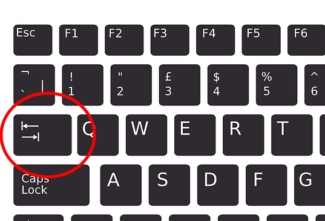

<text-box variant='learningObjectives' name="Learning objectives">

After this section

- You will be able to use a simple conditional statement in programming
- You will know what a Boolean value is
- You will be able to express conditionals with comparison operators

</text-box>

Thus far, every program we have written has been executed line by line in order. Instead of executing every line of code every single time a program is run, it is often useful to create sections of the program which are are only executed in certain situations.

For example, the following code checks whether the user is of age:

```python
age = int(input("How old are you? "))

if age > 17:
    print("You are of age!")
    print("Here's a copy of GTA6 for you.")

print("Next customer, please!")
```

When the user is over the age of 17, the execution of the program should look like this:

<sample-output>

How old are you? **18**
You are of age!
Here's a copy of GTA6 for you.
Next customer, please!

</sample-output>

If the user is 17 or under, only this is printed out:

<sample-output>

How old are you? **16**
Next customer, please!

</sample-output>

These examples show us that the value given as input affects which parts of the program are executed. The program contains a _conditional statement_ with a block of code which is executed only if the condition in the statement is true.


In a conditional statement the keyword `if` is followed by a _condition_, such as a comparison of two values. The code block following this header line is only executed if the condition is true.

Notice the colon character following the `if` header. In the following code there is no colon:

```python
age = 10

# no colon at the end of the following line
if age > 17
    print("You are of age.")
```

Upon execution this causes an error:

<sample-output>
<pre>
File "program.py", line 3
  if age > 17
            ^
SyntaxError: invalid syntax
</pre>
</sample-output>

## Comparison operators

Very typically conditions consist of comparing two values. Here is a table with the most common comparison operators used in Python:

| Operator | Purpose        | Example  |
|:--------:|----------------|----------|
| `==`     | Equal to       | `a == b` |
| `!=`     | Not equal to   | `a != b` |
| `>`      | Greater than   | `a > b`  |
| `>=`     | Greater than or equal to | `a >= b` |
| `<`      | Less than      | `a < b`  |
| `<=`     | Less than or equal to    | `a <= b` |

Let's have a look at a program which prints out different things based on whether the number the user inputs is negative, positive, or equal to zero:

```python
number = int(input("Please type in a number: "))

if number < 0:
    print("The number is negative.")

if number > 0:
    print("The number is positive.")

if number == 0:
    print("The number is zero.")
```

Examples of how the program functions with three different inputs:

<sample-output>

Please type in a number: **15**
The number is positive.

</sample-output>

<sample-output>

Please type in a number: **-18**
The number is negative.

</sample-output>

<sample-output>

Please type in a number: **0**
The number is zero.

</sample-output>

## Indentation

Python recognises that a block of code is part of a conditional statement if each line of code in the block is _indented_ the same. That is, there should be a bit of whitespace at the beginning of every line of code within the code block. Each line should have the same amount of whitespace.

For example:

````python
password = input("Please type in a password: ")

if password == "kittycat":
    print("You knew the password!")
    print("You must be either the intended user...")
    print("...or quite an accomplished hacker.")

print("The program has finished its execution. Thanks and bye!")
````

You can use the Tab key, short for _tabulator_ key, to insert a set amount of whitespace.



Many text editors will automatically indent the following line when the Enter key is pressed after a colon character. When you want to end an indented code block you can use the `Backspace` key to return to the beginning of the line.


<small><center>
The source of the keyboard pictures:
 <a href="https://pixabay.com/users/Clker-Free-Vector-Images-3736/?utm_source=link-attribution&amp;utm_medium=referral&amp;utm_campaign=image&amp;utm_content=311803">Clker-Free-Vector-Images</a> from <a href="https://pixabay.com/?utm_source=link-attribution&amp;utm_medium=referral&amp;utm_campaign=image&amp;utm_content=311803">Pixabay</a>
</center></small>

<in-browser-programming-exercise name="Orwell" tmcname="part01-21_orwell">

Please write a program which asks the user for an integer number. The program should print out "Orwell" if the number is exactly 1984, and otherwise do nothing.

<sample-output>

Please type in a number: **2020**

</sample-output>

<sample-output>

Please type in a number: **1984**
Orwell

</sample-output>

</in-browser-programming-exercise>

<in-browser-programming-exercise name="Absolute value" tmcname="part01-22_absolute_value">

Please write a program which asks the user for an integer number. If the number is less than zero, the program should print out the number multiplied by -1. Otherwise the program prints out the number as is. Please have a look at the examples of expected behaviour below.

<sample-output>

Please type in a number: **-7**
The absolute value of this number is 7

</sample-output>

<sample-output>

Please type in a number: **1**
The absolute value of this number is 1

</sample-output>

<sample-output>

Please type in a number: **-99**
The absolute value of this number is 99

</sample-output>

</in-browser-programming-exercise>


<in-browser-programming-exercise name="Soup or no soup" tmcname="part01-23_soup_or_no_soup">

Please write a program which asks for the user's name. If the name is anything but "Jerry", the program then asks for the number of portions and prints out the total cost. The price of a single portion is 5.90.

Two examples of the program's execution:

<sample-output>

Please tell me your name: **Kramer**
How many portions of soup? **2**
The total cost is 11.8
Next please!

</sample-output>

<sample-output>

Please tell me your name: **Jerry**
Next please!

</sample-output>

</in-browser-programming-exercise>


<in-browser-programming-exercise name="Order of magnitude" tmcname="part01-24_order_of_magnitude">

Please write a program which asks the user for an integer number. The program should then print out the magnitude of the number according to the following examples.

<sample-output>

Please type in a number: **950**
This number is smaller than 1000
Thank you!

</sample-output>

<sample-output>

Please type in a number: **59**
This number is smaller than 1000
This number is smaller than 100
Thank you!

</sample-output>

<sample-output>

Please type in a number: **2**
This number is smaller than 1000
This number is smaller than 100
This number is smaller than 10
Thank you!

</sample-output>

<sample-output>

Please type in a number: **1123**
Thank you!

</sample-output>


</in-browser-programming-exercise>


## Boolean values and Boolean expressions

Any condition used in a conditional statement will result in a truth value, that is, either true or false. For example, the condition `a < 5` is true if `a` is less than 5, and false if `a` is equal to or greater than 5.

These types of values are often called _Boolean_ values, named after the English mathematician George Boole. In Python they are handled by the `bool` data type. Variables of type `bool` can only have two values: `True` or `False`.

Any bit of code that results in a Boolean value is called a _Boolean expression_. For example, the condition in a conditional statement is always a Boolean expression, and the words _condition_ and _Boolean expression_ can often be used interchangeably.

The result of a Boolean expression can be stored in a variable just like the result of any numerical calculation:

```python
a = 3
condition = a < 5
print(condition)
if condition:
    print("a is less than 5")
```

<sample-output>

True
a is less than 5

</sample-output>

The Python keywords `True` and `False` can also be used directly. In the following example the `print` command is executed every time, because the value of the condition is `True`:

```python
condition = True
if condition:
    print("This is printed every time.")
```

<sample-output>

This is printed every time.

</sample-output>

A program like this is not very useful, but later on during the course you will see examples of Boolean variables coming in very handy.

<in-browser-programming-exercise name="Calculator" tmcname="part01-25_calculator">

Please write a program which asks the user for two numbers and an operation. If the operation is _add_, _multiply_ or _subtract_, the program should calculate and print out the result of the operation with the given numbers. If the user types in anything else, the program should print out nothing.

Some examples of expected behaviour:

<sample-output>

Number 1: **10**
Number 2: **17**
Operation: **add**

10 + 17 = 27

</sample-output>

<sample-output>

Number 1: **4**
Number 2: **6**
Operation: **multiply**

4 * 6 = 24

</sample-output>

<sample-output>

Number 1: **4**
Number 2: **6**
Operation: **subtract**

4 - 6 = -2

</sample-output>

</in-browser-programming-exercise>

<in-browser-programming-exercise name="Temperatures" tmcname="part01-26_temperatures">

Please write a program which asks the user for a temperature in degrees Fahrenheit, and then prints out the same in degrees Celsius. If the converted temperature falls below zero degrees Celsius, the program should also print out "Brr! It's cold in here!".

The formula for converting degrees Fahrenheit to degrees Celsius can be found easily by any search engine of your choice.

Two examples of expected behaviour:

<sample-output>

Please type in a temperature (F): **101**
101 degrees Fahrenheit equals 38.333333333333336 degrees Celsius

Please type in a temperature (F): **21**
21 degrees Fahrenheit equals -6.111111111111111 degrees Celsius
Brr! It's cold in here!

</sample-output>

</in-browser-programming-exercise>

<in-browser-programming-exercise name="Daily wages" tmcname="part01-27_daily_wages">

Please write a program which asks for the hourly wage, hours worked, and the day of the week. The program should then print out the daily wages, which equal hourly wage multiplied by hours worked, except on Sundays when the hourly wage is doubled.

<sample-output>

Hourly wage: **8.5**
Hours worked: **3**
Day of the week: **Monday**
Daily wages: 25.5 euros

</sample-output>

<sample-output>

Hourly wage: **12.5**
Hours worked: **10**
Day of the week: **Sunday**
Daily wages: 250.0 euros

</sample-output>

</in-browser-programming-exercise>

<in-browser-programming-exercise name="Loyalty bonus" tmcname="part01-28_loyalty_bonus">

This program calculates the end of year bonus a customer receives on their loyalty card. The bonus is calculated with the following formula:

* If there are less than a hundred points on the card, the bonus is 10 %
* In any other case the bonus is 15 %

The program should work like this:

<sample-output>

How many points are on your card? **55**
Your bonus is 10 %
You now have 60.5 points

</sample-output>

But there is a problem with the program, so with some inputs it doesn't work quite right:

<sample-output>

How many points are on your card? **95**
Your bonus is 10 %
Your bonus is 15 %
You now have 120.175 points

</sample-output>

Please fix the program so that there is always either a 10 % or a 15 % bonus, but never both.

</in-browser-programming-exercise>

<in-browser-programming-exercise name="What to wear tomorrow" tmcname="part01-29_what_to_wear_tomorrow">

Please write a program which asks for tomorrow's weather forecast and then suggests weather-appropriate clothing.

The suggestion should change if the temperature (measured in degrees Celsius) is over 20, 10 or 5 degrees, and also if there is rain on the radar.

Some examples of expected behaviour:

<sample-output>

What is the weather forecast for tomorrow?
Temperature: **21**
Will it rain (yes/no): **no**
Wear jeans and a T-shirt

</sample-output>

<sample-output>

What is the weather forecast for tomorrow?
Temperature: **11**
Will it rain (yes/no): **no**
Wear jeans and a T-shirt
I recommend a jumper as well

</sample-output>

<sample-output>

What is the weather forecast for tomorrow?
Temperature: **7**
Will it rain (yes/no): **no**
Wear jeans and a T-shirt
I recommend a jumper as well
Take a jacket with you

</sample-output>

<sample-output>

What is the weather forecast for tomorrow?
Temperature: **3**
Will it rain (yes/no): **yes**
Wear jeans and a T-shirt
I recommend a jumper as well
Take a jacket with you
Make it a warm coat, actually
I think gloves are in order
Don't forget your umbrella!

</sample-output>

</in-browser-programming-exercise>

<in-browser-programming-exercise name="Solving a quadratic equation" tmcname="part01-30_quadratic_formula">

In the Python `math` module there is the function `sqrt`, which calculates the square root of a number. You can use it like so:

```python
from math import sqrt

print(sqrt(9))
```

This should print out

<sample-output>

3.0

</sample-output>

We will return to the concept of a _module_ and the `import` statement later. For now, it is sufficient to understand that the line `from math import sqrt` allows us to use the `sqrt` function in our program.

Please write a program for solving a quadratic equation of the form ax²+bx+c. The program asks for values a, b and c. It should then use the quadratic formula to solve the equation. The quadratic formula expressed with the Python `sqrt` function is as follows:

x = (-b ± sqrt(b²-4ac))/(2a).

You can assume the equation will always have two real roots, so the above formula will always work.

An example of expected behaviour:

<sample-output>

Value of a: **1**
Value of b: **2**
Value of c: **-8**

The roots are 2.0 and -4.0

</sample-output>

</in-browser-programming-exercise>

<!--

A quiz to review the contents of this section:

<quiz id="bc7e500f-a91e-5709-8ae6-34637ff01737"></quiz>

-->

Please respond to a quick questionnaire on this week's materials. The questionnaire is worth one exercise point.

<quiz id="9606c6c1-70f4-5236-bd3e-7208b56e7b9e"></quiz>
