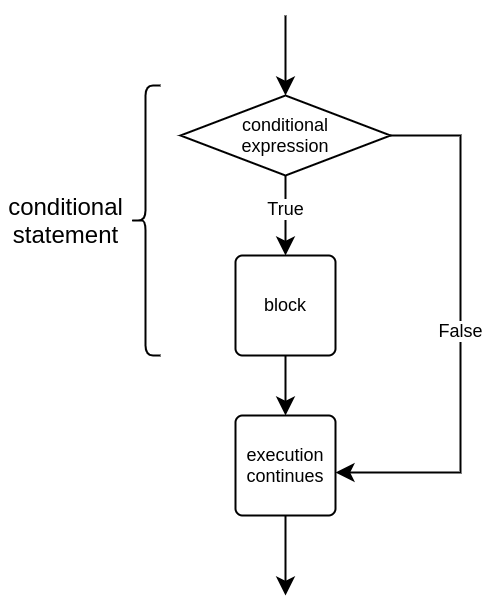

<text-box variant='learningObjectives' name='Oppimistavoitteet'>

Tämän osion jälkeen

- Osaat käyttää yksinkertaista ehtorakennetta ohjelmoinnissa
- Tiedät, mitä tarkoitetaan totuusarvoilla
- Osaat muodostaa ehtoja vertailuoperaattoreiden avulla

</text-box>

Tähän mennessä kaikissa ohjelmissamme on suoritettu samat rivit samassa järjestyksessä.
Usein on kuitenkin tarpeen määritellä ohjelmaan osia, jotka suoritetaan vain tietyissä tilanteissa.

Tarkastellaan ensin esimerkkiä, joka tarkastelee, onko henkilö täysi-ikäinen:

```python
ika = int(input("Kuinka vanha olet? "))

if ika > 17:
    print("Olet täysi-ikäinen.")
    print("Tässä siis sinulle ikiomaksi GTA6.")

print("Seuraava asiakas, kiitos!")
```

Ohjelman suoritus näyttää tältä, kun ikä on suurempi kuin 17:

<sample-output>

Kuinka vanha olet? **18**
Olet täysi-ikäinen!
Tässä siis sinulle ikiomaksi GTA6.
Seuraava asiakas, kiitos!

</sample-output>

Jos kuitenkin ikä ei ole suurempi kuin 17, käy näin:

<sample-output>

Kuinka vanha olet? **16**
Seuraava asiakas, kiitos!

</sample-output>

Esimerkkejä tarkastelemalla huomataan, että syötteenä annettu arvo vaikuttaa nyt siihen, mitkä osat ohjelmasta suoritetaan. Ohjelmassa on käytössä _ehtorakenne_, jonka sisällä oleva koodi suoritetaan vain, kun annettu ehto on tosi.



Ehtorakenteessa avainsanaa `if` seuraa jokin _ehto_, kuten kahden arvon vertailu. Tämän jälkeen tuleva koodi suoritetaan vain, jos ehto pitää paikkansa.

Huomaa, että ehtorakenteen ensimmäisen rivin lopussa on kaksoispiste. Seuraavassa koodissa kaksoispiste on unohtunut:

```python
ika = 10

# kaksoispiste unohtui seuraavan rivin lopusta
if ika > 17
    print("Olet täysi-ikäinen.")
```

Tämän seurauksena koodi antaa virheen:

<sample-output>
<pre>
File "ohjelma.py", line 3
  if ika > 17
            ^
SyntaxError: invalid syntax
</pre>
</sample-output>

## Vertailuoperaattorit

Tyypillinen ehto on kahden arvon vertailu. Pythonin vertailuoperaattorit ovat:

| Operaattori | Merkitys       | Esimerkki    |
|:-----------:|----------------|--------------|
| `==` | Yhtä suuri    | `a == b` |
| `!=` | Eri suuri | `a != b` |
| `>` | Suurempi | `a > b` |
| `>=` | Suurempi tai yhtä suuri | `a >= b` |
| `<` | Pienempi | `a < b` |
| `<=` | Pienempi tai yhtä suuri | `a <= b` |

Tarkastellaan esimerkkinä ohjelmaa, joka tulostaa tiedon siitä, onko käyttäjän syöttämä luku negatiivinen, positiivinen vai nolla:

```python
luku = int(input("Anna luku: "))

if luku < 0:
    print("Luku on negatiivinen.")

if luku > 0:
    print("Luku on positiivinen.")

if luku == 0:
    print("Luku on nolla.")
```

Ohjelma suoritettuna kolme kertaa eri syötteillä:

<sample-output>

Anna luku: **15**
Luku on positiivinen.

</sample-output>

<sample-output>

Anna luku: **-18**
Luku on negatiivinen.

</sample-output>

<sample-output>

Anna luku: **0**
Luku on nolla.

</sample-output>

## Sisentäminen

Python tunnistaa ehtorakenteen sisällä olevan koodin siitä, että jokainen rivi on _sisennetty_ samalla tavalla. Tämä tarkoittaa, että ehtorakenteen sisällä olevan koodin alussa on tyhjää tilaa. Jokaisella rivillä tulee olla yhtä paljon tyhjää tilaa.

Esimerkiksi:

````python
salasana = input("Anna salasana: ")

if salasana == "kissa":
    print("Tiesit salasanan!")
    print("Olet siis joko oikea käyttäjä...")
    print("...tai melkoinen hakkerivelho.")

print("Ohjelman suoritus päättyi. Kiitos ja hei!")
````

Tyhjä tila saadaan aikaan _tabulaattorilla_, jonka saat Tab-näppäimestä.


Suurin osa editoreista osaa automaattisesti sisentää rivin, kun edellinen rivi päättyy kaksoispisteeseen. Voit lopettaa sisentämisen editorissa painamalla rivin alussa `Backspace`-näppäintä.


<small><center>
Näppäimistökuvien alkuperä:
 <a href="https://pixabay.com/users/Clker-Free-Vector-Images-3736/?utm_source=link-attribution&amp;utm_medium=referral&amp;utm_campaign=image&amp;utm_content=311803">Clker-Free-Vector-Images</a> from <a href="https://pixabay.com/?utm_source=link-attribution&amp;utm_medium=referral&amp;utm_campaign=image&amp;utm_content=311803">Pixabay</a>
</center></small>

<in-browser-programming-exercise name="Orwell" tmcname="osa01-21_orwel">

Tee ohjelma, joka kysyy käyttäjältä kokonaisluvun ja tulostaa merkkijonon "Orwell" jos luku on täsmälleen 1984. Muussa tapauksessa ohjelma ei tulosta mitään.

<sample-output>

Anna luku: **2020**

</sample-output>

<sample-output>

Anna luku: **1984**
Orwell

</sample-output>

</in-browser-programming-exercise>

<in-browser-programming-exercise name="Itseisarvo" tmcname="osa01-22_itseisarvo">

Kirjoita ohjelma, joka lukee käyttäjältä kokonaisluvun. Mikäli luku on pienempi kuin 0, ohjelma tulostaa luvun kerrottuna luvulla -1. Muulloin ohjelma tulostaa käyttäjän syöttämän luvun. Alla on muutamia esimerkkejä ohjelman odotetusta toiminnasta.

<sample-output>

Anna luku: **-7**
Luvun itseisarvo on 7

</sample-output>

<sample-output>

Anna luku: **1**
Luvun itseisarvo on 1

</sample-output>

<sample-output>

Anna luku: **-99**
Luvun itseisarvo on 99

</sample-output>

</in-browser-programming-exercise>


<in-browser-programming-exercise name="Keittoa vai ei" tmcname="osa01-23_keittoa_vai_ei">

Kirjoita ohjelma, joka kysyy ensin käyttäjän nimen. Jos nimi on mikä tahansa muu kuin "Jerry", ohjelma kysyy keittoannosten lukumäärän ja kertoo sitten kokonaishinnan. Yksi annos maksaa 5,90.

Kaksi esimerkkisuoritusta:

<sample-output>

Mikä on nimesi: **Kramer**
Kuinka monta annosta keittoa: **2**
Kokonaishinta on 11.8
Seuraava!

</sample-output>

<sample-output>

Mikä on nimesi: **Jerry**
Seuraava!

</sample-output>

</in-browser-programming-exercise>


<in-browser-programming-exercise name="Luvun suuruusluokka" tmcname="osa01-24_luvun_suuruusluokka">

Tee ohjelma, joka lukee käyttäjältä kokonaisluvun ja kertoo sitten sen suuruusluokan oheisten esimerkkisuoritusten mukaisesti:

<sample-output>

Anna luku: **950**
Luku on pienempi kuin 1000
Kiitos!

</sample-output>

<sample-output>

Anna luku: **59**
Luku on pienempi kuin 1000
Luku on pienempi kuin 100
Kiitos!

</sample-output>

<sample-output>

Anna luku: **2**
Luku on pienempi kuin 1000
Luku on pienempi kuin 100
Luku on pienempi kuin 10
Kiitos!

</sample-output>

<sample-output>

Anna luku: **1123**
Kiitos!

</sample-output>


</in-browser-programming-exercise>


## Totuusarvot

Ehtorakenteessa käytettävä ehto saa totuusarvon `True` (tosi) tai `False` (epätosi). Esimerkiksi ehto `a < 5` on tosi jos `a` on alle 5 ja epätosi jos `a` on 5 tai suurempi.

Voimme asettaa ehdon tuloksen muuttujan arvoksi samaan tapaan kuin laskutoimituksen tuloksen:

```python
a = 3
ehto = a < 5
print(ehto)
if ehto:
    print("a on pienempi kuin 5")
```

<sample-output>

True
a on pienempi kuin 5

</sample-output>

Voimme käyttää koodissa myös sanoja `True` ja `False`. Esimerkiksi seuraava koodi suorittaa `print`-komennon aina, koska ehdon arvona on `True`:

```python
ehto = True
if ehto:
    print("Tänne tullaan aina")
```

<sample-output>

Tänne tullaan aina

</sample-output>

Tällainen ohjelma ei ole sinänsä kovin hyödyllinen, mutta myöhemmin kurssilla näemme, mitä hyötyä on totuusarvoista muuttujissa.

<in-browser-programming-exercise name="Laskin" tmcname="osa01-25_laskin">

Tee ohjelma, joka kysyy käyttäjältä ensin kaksi lukua ja sen jälkeen komennon. Jos komento on joko _summa_, _tulo_ tai _erotus_, ohjelma laskee syötteille kyseisen operaation tuloksen. Muussa tapauksessa ohjelma ei tulosta mitään.

Esimerkkitulostuksia:

<sample-output>

Luku 1: **10**
Luku 2: **17**
Komento: **summa**

10 + 17 = 27

</sample-output>

<sample-output>

Luku 1: **4**
Luku 2: **6**
Komento: **tulo**

4 * 6 = 24

</sample-output>

<sample-output>

Luku 1: **4**
Luku 2: **6**
Komento: **erotus**

4 - 6 = -2

</sample-output>

</in-browser-programming-exercise>

<in-browser-programming-exercise name="Lämpötilat" tmcname="osa01-26_lampotilat">

Tee ohjelma, joka kysyy käyttäjältä lämpötilan fahrenheit-asteina, ja tulostaa sitten lämpötilan celsius-asteina. Jos lämpötila celsius-asteina on pienempi kuin 0, ohjelma tulostaa lisäksi viestin "Paleltaa!".

Kaavan fahrenheit-asteiden muuntamiseksi celsius-asteiksi voit etsiä esimerkiksi googlaamalla.

Kaksi esimerkkisuoritusta:

<sample-output>

Anna lämpötila (F): **101**
101 fahrenheit-astetta on 38.333333333333336 celsius-astetta

Anna lämpötila (F): **21**
21 fahrenheit-astetta on -6.111111111111111 celsius-astetta
Paleltaa!

</sample-output>

</in-browser-programming-exercise>

<in-browser-programming-exercise name="Palkka" tmcname="osa01-27_palkka">

Tee ohjelma, joka kysyy tuntipalkkaa, työskenneltyjen tuntien määrää ja viikonpäivää. Ohjelma tulostaa palkan, joka on tuntipalkka kertaa tuntien määrä muina päivinä paitsi sunnuntaisin, jolloin tuntipalkka on kaksinkertainen.

<sample-output>

Tuntipalkka: **8.5**
Työtunnit: **3**
Viikonpäivä: **maanantai**
Palkka 25.5 euroa

</sample-output>

<sample-output>

Tuntipalkka: **12.5**
Työtunnit: **10**
Viikonpäivä: **sunnuntai**
Palkka 250.0 euroa

</sample-output>

</in-browser-programming-exercise>

<in-browser-programming-exercise name="Korjaa ohjelma: Korkoa kortille" tmcname="osa01-28_korjaaa_ohjelma_korkoa_kortille">

Ohjelmassa lasketaan bonuskortin saldoon vuoden lopussa lisättävä bonuspistemäärä seuraavan kaavan mukaisesti:

* Jos bonuspisteitä on alle sata, korkona saa 10 % lisää pisteitä
* Muussa tapauksessa korkona saa 15 % lisää pisteitä

Ohjelma siis toimii esim. näin:

<sample-output>

Kuinka paljon pisteitä? **55**
Sait 10 % bonusta
Pisteitä on nyt 60.5

</sample-output>

Ohjelma toimii kuitenkin jollain syötteillä oudosti:

<sample-output>

Kuinka paljon pisteitä? **95**
Sait 10 % bonusta
Sait 15 % bonusta
Pisteitä on nyt 120.175

</sample-output>

Korjaa ohjelma niin, että bonusta tulee joko 10 % tai 15 %, ei koskaan molempia.

</in-browser-programming-exercise>

<in-browser-programming-exercise name="Huomiset vaatteet" tmcname="osa01-29_huomisen_vaatteet">

Tee ohjelma, joka kysyy huomisen sääennusteen ja suosittelee sen mukaista pukeutumista.

Suositus vaihtelee sen mukaan, onko lämpötila yli 20 astetta, yli 10 astetta vai yli 5 astetta. Myös sade vaikuttaa suositukseen.

Ohjelma toimii seuraavasti:

<sample-output>

Kerro huominen sääennuste:
Lämpötila: **21**
Sataako (kyllä/ei): **ei**
Pue housut ja t-paita

</sample-output>

<sample-output>

Kerro huominen sääennuste:
Lämpötila: **11**
Sataako (kyllä/ei): **ei**
Pue housut ja t-paita
Ota myös pitkähihainen paita

</sample-output>

<sample-output>

Kerro huominen sääennuste:
Lämpötila: **7**
Sataako (kyllä/ei): **ei**
Pue housut ja t-paita
Ota myös pitkähihainen paita
Pue päälle takki

</sample-output>

<sample-output>

Kerro huominen sääennuste:
Lämpötila: **3**
Sataako (kyllä/ei): **kyllä**
Pue housut ja t-paita
Ota myös pitkähihainen paita
Pue päälle takki
Suosittelen lämmintä takkia
Kannattaa ottaa myös hanskat
Muista sateenvarjo!

</sample-output>

</in-browser-programming-exercise>

<in-browser-programming-exercise name="Toisen asteen yhtälön ratkaiseminen" tmcname="osa01-30_toisen_asteen_yhtalo">

Pythonin `math`-moduulissa on funktio `sqrt`, jolla voi laskea luvun neliöjuuren. Voit käyttää sitä ohjelmassa seuraavasti:

```python
from math import sqrt

print(sqrt(9))
```

Ohjelma tulostaa:

<sample-output>

3.0

</sample-output>

Kirjoita ohjelma, joka ratkaisee toisen asteen yhtälön ax²+bx+c. Ohjelmalle annetaan arvot a, b ja c, ja sen tulee laskea juuret (eli ratkaisut) kaavalla

x = (-b ± sqrt(b²-4ac))/(2a).

Voit olettaa, että yhtälöllä on kaksi juurta, jolloin yllä oleva kaava toimii.

Esimerkkituloste:

<sample-output>

Anna a: **1**
Anna b: **2**
Anna c: **-8**

Juuret ovat 2.0 ja -4.0

</sample-output>

</in-browser-programming-exercise>

Kertauskysely tämän osan asioihin liittyen:

<quiz id="bc7e500f-a91e-5709-8ae6-34637ff01737"></quiz>

Vastaa lopuksi kyselyyn tämän viikon materiaaleista. Saat kyselyyn vastaamisesta yhden pisteen:

<quiz id="1d2102eb-0c2f-5185-a240-9814db357c8a"></quiz>
