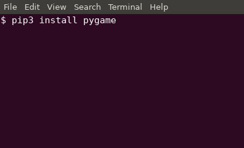
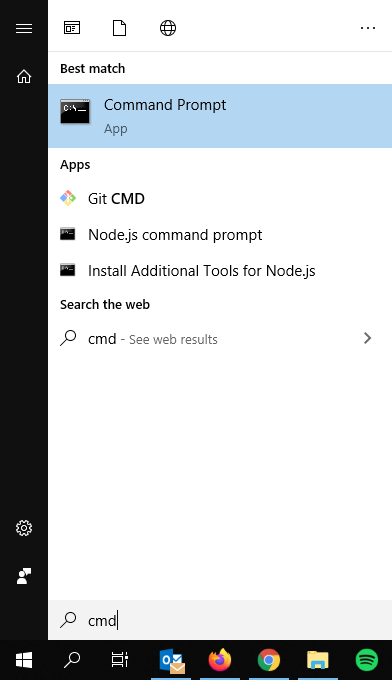
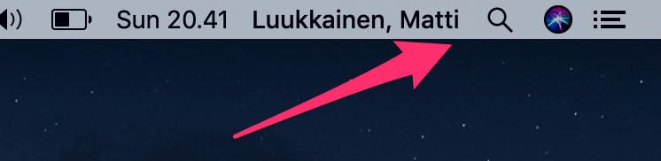
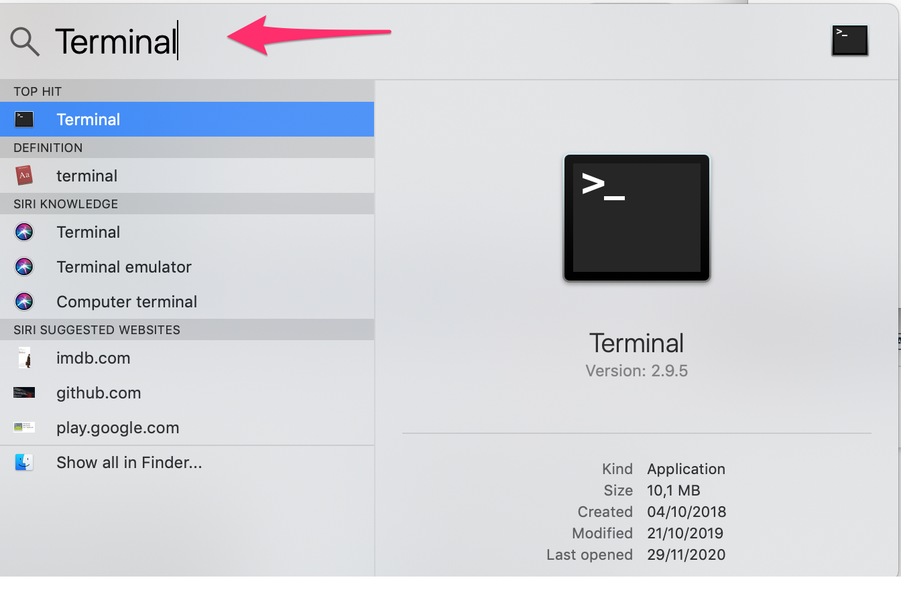
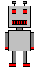
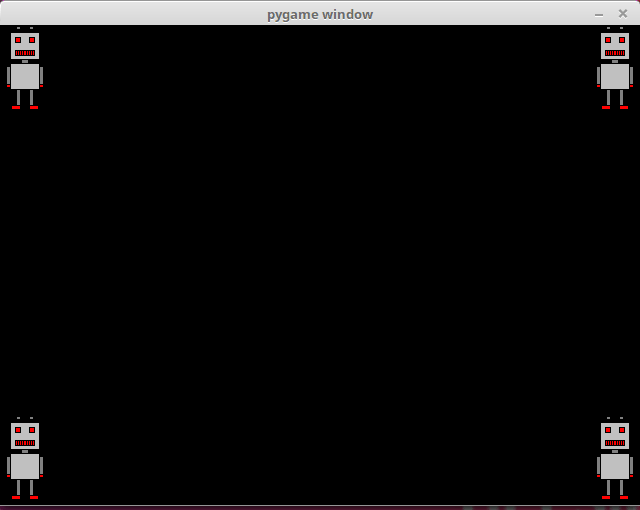
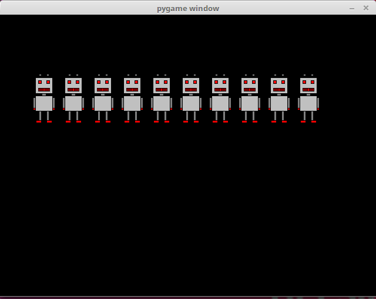

<text-box variant='learningObjectives' name="Learning objectives">

After this section

- You will have installed the pygame library on your computer
- You will know how to create a pygame window and how to exit a program
- You will be able to use an image stored in a file in a pygame window

</text-box>

In these last two parts of this course material we will get to grips with the pygame library. It is a Python library for programming games. It helps you create graphical elements, handle events from the keyboard and the mouse, and implement other features necessary in games.

## Installing pygame

### Linux

Open a command line, type in `pip3 install pygame` an press `enter`.



This should install the pygame library on your computer.

### Windows

Open the Windows terminal by opening the menu, typing in `cmd` and pressing `enter`:



The command line interpreter window should open. Type in `pip3 install pygame` and press `enter`.

This should install the pygame library on your computer.

Installation may require system administrator privileges. If the above doesn't work, you can try running the terminal application as an administrator: open the Windows menu, find the CMD application, right-click it and choose "Run as administrator".

Installing and accessing pygame requires that your Python installation is added to path, as instructed [here](https://www.mooc.fi/en/installation/vscode/#python3).

### Mac

Open the _Terminal_, for example through the magnifying glass symbol in the top right corner:



The search tool should open. Type in `terminal` and press `enter`:



Type in the following and press `enter`:

`pip3 install pygame`


This should install the pygame library on your computer.

## Your first program

Here is a simple program for checking your pygame installation works correctly:

```python
import pygame

pygame.init()
window = pygame.display.set_mode((640, 480))

window.fill((0,0,0))
pygame.display.flip()

while True:
    for event in pygame.event.get():
        if event.type == pygame.QUIT:
            exit()
```

When this program is run, it should display a window:


The program only consists of displaying a window, and it runs until the user closes the window.

Let's take a closer look at the steps required to achieve this. The first line takes the pygame library into use: `import pygame`. The next command `pygame.init` initializes the pygame modules, and the next one creates a window with the function `pygame.display.set_mode`.

```python
pygame.init()
window = pygame.display.set_mode((640, 480))
```

The `set_mode` function takes the window dimensions as an argument. The tuple `(640, 480)` indicates that the window is 640 pixels wide and 480 pixels high. The variable name `window` can be used later to access the window, for example to draw something in it.

The following two commands do just that:

```python
window.fill((0, 0, 0))
pygame.display.flip()
```

The `fill` method fills the window with the colour passed as an argument. In this case the colour is black, passed as an RGB value in the tuple `(0, 0, 0)`. The `pygame.display.flip` updates the contents of the window.

After these initialization commands the _main loop_ of the program begins:

```python
while True:
    for event in pygame.event.get():
        if event.type == pygame.QUIT:
            exit()
```

The main loop handles all events the operating system passes to the program. With each iteration the function `pygame.event.get` returns a list of any events collected since the previous iteration.

In the example above the program only handles events of type `pygame.QUIT`. This event is raised by, for example, clicking on the exit button in the corner of the window. If the `pygame.QUIT` event is raised, the program exits through the `exit` function.

You can try and see what happens if your program doesn't handle the `pygame.QUIT` event. This should mean that clicking on the exit button does nothing, which would be confusing for the user. As the program is run from the command line, you can still stop it from the command line with Control+C.

## Add an image

Let's add an image to the window:

```python
import pygame

pygame.init()
window = pygame.display.set_mode((640, 480))

robot = pygame.image.load("robot.png")

window.fill((0, 0, 0))
window.blit(robot, (100, 50))
pygame.display.flip()

while True:
    for event in pygame.event.get():
        if event.type == pygame.QUIT:
            exit()
```

The program uses this image of a robot, which is stored in the file `robot.png`:



The file `robot.png` has to be in the same directory with the source code of the your program, or the program won't be able to find it. In the exercise templates for this part the images are waiting in the exercise directory.

The window should now look like this:


The function `pygame.image.load` loads the image in the file `robot.png` and stores a reference to it in the variable named `robot`. The method `blit` draws the image at the location `(100, 50)`, and the function `pygame.display.flip` updates the window contents, as before. The location `(100, 50)` means that the _top left corner_ of the image is at that location within the window.

In pygame the origo point `(0, 0)` is in the top left corner of the window. The x coordinates increase to the right, and the y coordinates increase downwards, so that the bottom right corner has the coordinates `(640, 480)`. This is contrary to how coordinates are usually handled in e.g. mathematics, but it is quite common in a programming context, and worth getting used to.

Once you have loaded an image, you can use it many times within the same window. The following code draws the image of the robot at three different locations:

```python
window.blit(robot, (0, 0))
window.blit(robot, (300, 0))
window.blit(robot, (100, 200))
```

The window should look like this as a result:


Here we set the location of the image so that it lies at the centre of the window:

```python
width = robot.get_width()
height = robot.get_height()
window.blit(robot, (320-width/2, 240-height/2))
```

The window should now look like this:


The method `get_width` returns the width of the image, and the method `get_height` returns its height, both in pixels. The centre of the window is at half its width and height, so at `(320, 240)`, which we can use to calculate a suitable location for the top left corner of the image, so that it lies exactly at the centre.

<text-box variant='hint' name='Pygame exercises'>

The exercises in this part of the course have no automated tests, as the results as visually verified. The tests grant points automatically as you submit your solution to the server, no matter what your implementation. Only submit your solution when you are ready, and your solution matches the exercise description. The exercises may not have automatic tests, but the course staff will still see your solution. Also submitting incomplete solution to TMC Paste grants points automatically, so it should not be used when asking for help with the exercises in this part. You can use [Pastebin.com](https://pastebin.com/) or some another internet pastebin service when asking for help in the course's support channels.

If your solution clearly does not match the exercise description, you may lose the points granted for the exercises in this part.

</text-box>

<programming-exercise name='Four robots' tmcname='part13-01_four_robots'>

Please write a program which draws a robot in each of the four corners of the window. The end result should look like this:



</programming-exercise>

<programming-exercise name='Robots in a row' tmcname='part13-02_robots_row'>

Please write a program which draws ten robots in a row. The end result should look like this:



</programming-exercise>

<programming-exercise name='A hundred robots' tmcname='part13-03_hundred_robots'>

Please write a program which draws a hundred robots: ten rows with ten robots in each row. The end result should look like this:


</programming-exercise>

<programming-exercise name='Random robots' tmcname='part13-04_random_robots'>

Please write a program which draws _a thousand_ robots in random places. The end result should look like this:


</programming-exercise>
