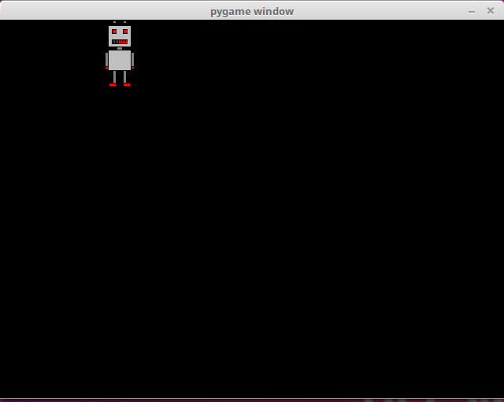
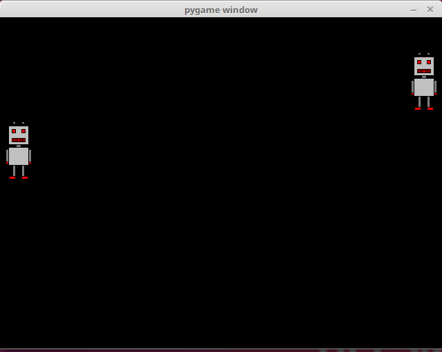

<text-box variant='learningObjectives' name="Learning objectives">

After this section

- You will know how to create an animation with pygame
- You will be able to use a clock to set the speed of your program
- You will be able to use basic trigonometric functions in your animations

</text-box>

Many games have moving characters, so a logical next step is creating animations. We can create the illusion of movement by drawing the same image in different locations on the screen and timing the changes appropriately.

## Creating an animation

The following code creates an animation where a robot moves from left to right in a pygame window:

```python
import pygame

pygame.init()
window = pygame.display.set_mode((640, 480))

robot = pygame.image.load("robot.png")

x = 0
y = 0
clock = pygame.time.Clock()

while True:
    for event in pygame.event.get():
        if event.type == pygame.QUIT:
            exit()

    window.fill((0, 0, 0))
    window.blit(robot, (x, y))
    pygame.display.flip()

    x += 1
    clock.tick(60)
```

When this is executed, the result should look like this:


Let's take a closer look at the commands involved. If we want to trace the movement of the image on the screen, we need to know its location, which is why we have two variables for the coordinates of the top left corner of the image:

```python
x = 0
y = 0
```

We also have a clock, which we use to make sure the speed of the animation is just right:

```python
clock = pygame.time.Clock()
```

The main loop draws the image at its current location with each iteration:

```python
    window.fill((0, 0, 0))
    window.blit(robot, (x, y))
    pygame.display.flip()
```

First the method `fill` fills the window with black, as before. The colour is passed as a tuple containing the RGB values for the colour. In this case the argument is `(0, 0, 0)`, which means that all three components - red, green and blue - have value 0. Each component can have a value between 0 and 255. So, if we passed `(255, 255, 255)` as the argument, we'd get a white window, and with `(255, 0, 0)` we'd get a red window. RGB colour codes form the backbone of digital colouring, and there are many tools online for working with them, for example [RGB Color Codes Chart](https://www.rapidtables.com/web/color/RGB_Color.html).

After the window is filled with colour the image is drawn at the given location with the `blit` method. Then the contents of the window are updated with the function `pygame.display.flip`.

Finally, the value stored in `x` is incremented, which makes the image move one pixel to the right with each iteration:

```python
    x += 1
```

The clock method `tick` is called at the end:

```python
    clock.tick(60)
```

The method `tick` takes care of the speed of the animation. The argument `60` dictates that the loop should be executed 60 times a second, which means that the image moves 60 pixels to the right each second. This approximately matches the _FPS_ or _frames per second_ value used with games.

In principle, the `tick` method makes sure that the animation runs at the same speed on every computer. If there was no such timing involved, the speed of the animation would depend on the speed of the computer.

## Bouncing off a wall

The previous animation was otherwise excellent, but as the robot reached a wall, it just kept going out of sight. Let's make the robot bounce off the wall.

```python
import pygame

pygame.init()
window = pygame.display.set_mode((640, 480))

robot = pygame.image.load("robot.png")

x = 0
y = 0
velocity = 1
clock = pygame.time.Clock()

while True:
    for event in pygame.event.get():
        if event.type == pygame.QUIT:
            exit()

    window.fill((0, 0, 0))
    window.blit(robot, (x, y))
    pygame.display.flip()
    
    x += velocity
    if velocity > 0 and x+robot.get_width() >= 640:
        velocity = -velocity
    if velocity < 0 and x <= 0:
        velocity = -velocity

    clock.tick(60)
```

Running the above code should look like this:


There is a new variable `velocity` which determines the direction of the movement. If the value is above zero, movement is to the right, and if it is below zero, movement is to the left. More precisely in this case, if the value is `1`, the robot moves to the right, and if it is `-1`, the robot moves to the left.

The following lines make the robot bounce off the side walls:

```python
    if velocity > 0 and x+robot.get_width() >= 640:
        velocity = -velocity
    if velocity < 0 and x <= 0:
        velocity = -velocity
```

If the velocity is above zero so that the robot is moving to the right, and the right edge if the image goes beyond the right edge of the window, the direction is reversed and the robot starts moving to the left. Similarly, if the velocity is below zero so that the robot is moving to the left, and the left edge of the image reaches the left edge of the window, the direction is again reversed and the robot starts moving to the right again.

This makes the robot move on a path from the left edge of the window to the right edge, and back to the left, and then to the right again, repeated ad infinitum.

## Rotation

Let's create one more animation. This time the robot should _rotate_ in a circle around the centre of the window:

```python
import pygame
import math

pygame.init()
window = pygame.display.set_mode((640, 480))

robot = pygame.image.load("robot.png")

angle = 0
clock = pygame.time.Clock()

while True:
    for event in pygame.event.get():
        if event.type == pygame.QUIT:
            exit()

    x = 320+math.cos(angle)*100-robot.get_width()/2
    y = 240+math.sin(angle)*100-robot.get_height()/2

    window.fill((0, 0, 0))
    window.blit(robot, (x, y))
    pygame.display.flip()

    angle += 0.01
    clock.tick(60)
```

Running the above code should look like this:


Rotation in a relatively precise circle is achieved with the help of some basic trigonometric functions. The varible `angle` contains the angle of the robots location in relation to the centre of the window and the horizontal line running through it. The sine and cosine functions from the Python math library are used to calculate the coordinates of the robot's location:

```python
        x = 320+math.cos(angle)*100-robot.get_width()/2
        y = 240+math.sin(angle)*100-robot.get_height()/2
```

The robot rotates around a circle of radius 100 around the centre of the window. The hypotenuse in this scenario is the radius of the circle. The cosine function gives the length of the _adjacent_ side of a right triangle in relation to the hypotenuse, which means that it gives us the `x` coordinate of the location. The sine function gives the length of the _opposite_ side, i.e. the `y` coordinate. The location is then adjusted for the size of the image, so that the centre of the circle is at the centre of the window.

With each iteration the size of the `angle` is incremented by 0.01:llä. As we are using radians, a full circle is 2π, which equals about 6.28. It takes about 628 iterations for the robot to go a full circle, and at 60 iterations per second this takes just over 10 seconds.

<programming-exercise name='Vertical movement' tmcname='part13-05_vertical_movement'>

Please create an animation where the robot moves up and down in an endless loop. The end result should look like this:


</programming-exercise>

<programming-exercise name='Round the perimeter' tmcname='part13-06_round_the_perimeter'>

Please create an animation where the robot traces the perimeter of the window. The end result should look like this:



</programming-exercise>

<programming-exercise name='Two robots' tmcname='part13-07_two_robots'>

Please create an animation where two robots move back and forth to the left and right. The lower robot should move at double the speed of the upper one. The end result should look like this:



</programming-exercise>

<programming-exercise name='Robots in a circle' tmcname='part13-08_robot_circle'>

Please create an animation where ten robots go round in a circle. The end result should look like this:


</programming-exercise>

<programming-exercise name='Bouncing ball' tmcname='part13-09_bouncing_ball'>

Please create an animation where a ball bounces from the edges of the window. The end result should look like this:


The exercise template contains the image `ball.png`.

</programming-exercise>

<programming-exercise name='Robot invasion' tmcname='part13-10_robot_invasion'>

Please create an animation where robots fall from the sky randomly. When a robot reaches the ground, it starts moving to the left or to the right, and finaly disappears off the screen. The end result should look like this:


</programming-exercise>
