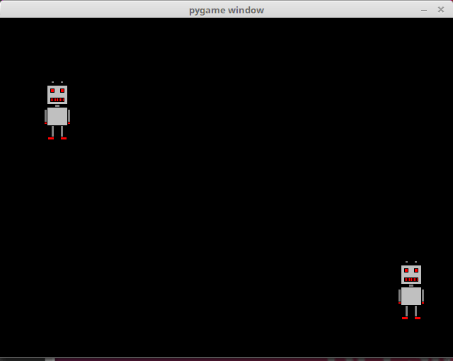
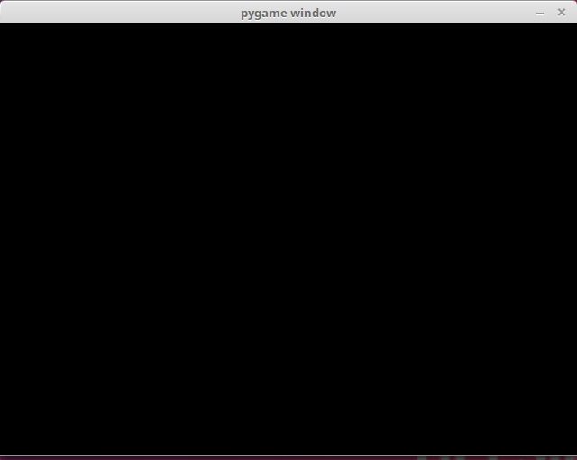
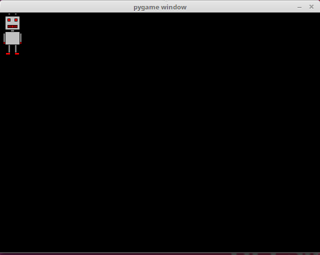

<text-box variant='learningObjectives' name="Learning objectives">

After this section

- You will be familiar with pygame events
- You will be able to write a program which reacts to key presses
- You will be able to write a program which reacts to mouse events

</text-box>

Thus far our main loops have only executed predetermined animations and reacted to only `pygame.QUIT` type events, even though the loop gets a list of all events from the operating system. Let's get to grips with some other types of events, then.

## Handling events

This program prints out information about all the events passed by the operating system to the pygame program, while it is running:

```python
import pygame

pygame.init()
window = pygame.display.set_mode((640, 480))

while True:
    for event in pygame.event.get():
        print(event)
        if event.type == pygame.QUIT:
            exit()
```

Let's assume the program was left running for a while, and then the exit button was clicked. The program prints out the following info:

```x
<Event(4-MouseMotion {'pos': (495, 274), 'rel': (495, 274), 'buttons': (0, 0, 0), 'window': None})>
<Event(4-MouseMotion {'pos': (494, 274), 'rel': (-1, 0), 'buttons': (0, 0, 0), 'window': None})>
<Event(4-MouseMotion {'pos': (492, 274), 'rel': (-2, 0), 'buttons': (0, 0, 0), 'window': None})>
<Event(4-MouseMotion {'pos': (491, 274), 'rel': (-1, 0), 'buttons': (0, 0, 0), 'window': None})>
<Event(5-MouseButtonDown {'pos': (491, 274), 'button': 1, 'window': None})>
<Event(6-MouseButtonUp {'pos': (491, 274), 'button': 1, 'window': None})>
<Event(2-KeyDown {'unicode': 'a', 'key': 97, 'mod': 0, 'scancode': 38, 'window': None})>
<Event(3-KeyUp {'key': 97, 'mod': 0, 'scancode': 38, 'window': None})>
<Event(2-KeyDown {'unicode': 'b', 'key': 98, 'mod': 0, 'scancode': 56, 'window': None})>
<Event(3-KeyUp {'key': 98, 'mod': 0, 'scancode': 56, 'window': None})>
<Event(2-KeyDown {'unicode': 'c', 'key': 99, 'mod': 0, 'scancode': 54, 'window': None})>
<Event(3-KeyUp {'key': 99, 'mod': 0, 'scancode': 54, 'window': None})>
<Event(12-Quit {})>
```

The first few events concern mouse usage, ten there are some events from the keyboard, and finally the last event closes the program. Each event has at least a type, but they may also offer some other identifying info, such as the location of the mouse cursor or the key that was pressed.

You can look for event descriptions in the [pygame documentation](https://www.pygame.org/docs/ref/event.html), but it can sometimes be easier to print out events with the code above, and look for the event that occurs when something you want to react to happens.

## Keyboard events

This program can process events where the user presses the arrow key either to the right or to the left on their keyboard. The program prints out which key was pressed.

```python
import pygame

pygame.init()
window = pygame.display.set_mode((640, 480))

while True:
    for event in pygame.event.get():
        if event.type == pygame.KEYDOWN:
            if event.key == pygame.K_LEFT:
                print("left")
            if event.key == pygame.K_RIGHT:
                print("right")

        if event.type == pygame.QUIT:
            exit()
```

The constants `pygame.K_LEFT` and `pygame.K_RIGHT` refer to the arrow keys to the left and right. The pgyame key constants for the different keys on a keyboard are listed in the [pygame documentation](https://www.pygame.org/docs/ref/key.html#key-constants-label).

For example, if the user presses the arrow key to the right twice, then the left one once, and then the right one once more, the program prints out

```x
right
right
left
right
```

We now have all the tools needed to move a character, or _sprite_, on the screen to the right and left with the arrow keys. The following code will achieve this:

```python
import pygame

pygame.init()
window = pygame.display.set_mode((640, 480))

robot = pygame.image.load("robot.png")
x = 0
y = 480-robot.get_height()

while True:
    for event in pygame.event.get():
        if event.type == pygame.KEYDOWN:
            if event.key == pygame.K_LEFT:
                x -= 10
            if event.key == pygame.K_RIGHT:
                x += 10

        if event.type == pygame.QUIT:
            exit()

    window.fill((0, 0, 0))
    window.blit(robot, (x, y))
    pygame.display.flip()
```

Depending on how you use your arrow keys, running the program could look like this:


In the code above we have the variables `x` and `y` which contain the coordinate location for the sprite. The variable `y` is set so that the sprite appears at the bottom of the window. The `y` value does not change throughout the execution of the program. The `x` value, however, increases by 10 whenever the user presses the arrow key to the right, and decreases by 10 whenever the left arrow key is pressed.

The program works otherwise quite well, but the key needs to be pressed again each time we want to move again. It would be better if the movement was continuous as the key was held down. The following program offfers this functionality:

```python
import pygame

pygame.init()
window = pygame.display.set_mode((640, 480))

robot = pygame.image.load("robot.png")
x = 0
y = 480-robot.get_height()

to_right = False
to_left = False

clock = pygame.time.Clock()

while True:
    for event in pygame.event.get():
        if event.type == pygame.KEYDOWN:
            if event.key == pygame.K_LEFT:
                to_left = True
            if event.key == pygame.K_RIGHT:
                to_right = True

        if event.type == pygame.KEYUP:
            if event.key == pygame.K_LEFT:
                to_left = False
            if event.key == pygame.K_RIGHT:
                to_right = False

        if event.type == pygame.QUIT:
            exit()

    if to_right:
        x += 2
    if to_left:
        x -= 2

    window.fill((0, 0, 0))
    window.blit(robot, (x, y))
    pygame.display.flip()

    clock.tick(60)
```

The code now contains the variables `to_right` and `to_left`. These contain knowledge of whether the sprite should be moving to the right or to the left at any given moment. When the user presses down an arrow key, the value stored in the relevant variable become `True`. When the key is released, the value changes to `False`.

The clock is used to time the movements of the sprite, so that they potentially happen 60 times each second. If an arrow key is pressed, the sprite moves two pixels to the right or to the left. This means the sprite moves 120 pixels per second if the key is kept pressed down.

<programming-exercise name='Four directions' tmcname='part13-11_four_directions'>

Please write a program where the player can move a robot in four directions with the arrow keys on the keyboard. The end result should look like this:


</programming-exercise>

<programming-exercise name='Four walls' tmcname='part13-12_four_walls'>

Please improve the program in the previous exercise so that the robot cannot pass outside the window in any of the four directions. The end result should look like this:


</programming-exercise>

<programming-exercise name='Two players' tmcname='part13-13_two_players'>

Please write a program where two players each direct their own robot. One of the players should use the arrow keys while the other could use, for example, the w-s-a-d keys. The end result should look like this:



</programming-exercise>

## Mouse events

The following code reacts to events where a mouse button is pressed down while the cursor is within the window area:

```python
import pygame

pygame.init()
window = pygame.display.set_mode((640, 480))

while True:
    for event in pygame.event.get():
        if event.type == pygame.MOUSEBUTTONDOWN:
            print("you pressed the button number", event.button, "at location", event.pos)

        if event.type == pygame.QUIT:
            exit()
```

The execution of this program should look more or less like this:

```x
you pressed the button number 1 at location (82, 135)
you pressed the button number 1 at location (369, 135)
you pressed the button number 1 at location (269, 297)
you pressed the button number 3 at location (515, 324)
```

Button number 1 refers to the left mouse button and button number 3 refers to the right mouse button. 

This next program combines mouse event handling and drawing an image on the screen. When the user presses a mouse button while the mouse cursor is within the bounds of the window, an image of a robot is drawn at that location. 

```python
import pygame

pygame.init()
window = pygame.display.set_mode((640, 480))

robot = pygame.image.load("robot.png")

while True:
    for event in pygame.event.get():
        if event.type == pygame.MOUSEBUTTONDOWN:
            x = event.pos[0]-robot.get_width()/2
            y = event.pos[1]-robot.get_height()/2

            window.fill((0, 0, 0))
            window.blit(robot, (x, y))
            pygame.display.flip()

        if event.type == pygame.QUIT:
            exit()
```

The execution of the program could look like this:



The following program contains an animation where the robot sprite follows the mouse cursor.The location of the sprite is stored in the variables `robot_x` and `robot_y`. When the mouse moves, its location is stored in the variables `target_x` ja `target_y`. If the robot is not at this location, it moves to the approproate direction.

```python
import pygame

pygame.init()
window = pygame.display.set_mode((640, 480))

robot = pygame.image.load("robot.png")

robot_x = 0
robot_y = 0
target_x = 0
target_y = 0

clock = pygame.time.Clock()

while True:
    for event in pygame.event.get():
        if event.type == pygame.MOUSEMOTION:
            target_x = event.pos[0]-robot.get_width()/2
            target_y = event.pos[1]-robot.get_height()/2

        if event.type == pygame.QUIT:
            exit(0)

    if robot_x > target_x:
        robot_x -= 1
    if robot_x < target_x:
        robot_x += 1
    if robot_y > target_y:
        robot_y -= 1
    if robot_y < target_y:
        robot_y += 1

    window.fill((0, 0, 0))
    window.blit(robot, (robot_x, robot_y))
    pygame.display.flip()

    clock.tick(60)
```

The program's execution should look more or less like this:



<programming-exercise name='Robot and mouse' tmcname='part13-14_robot_and_mouse'>

Please write a program where the robot follows the mouse cursor so that the centre of the robot is always directly at the mouse cursor. The end result should look like this:


</programming-exercise>

<programming-exercise name='The location of the robot' tmcname='part13-15_robot_location'>

Please write a program where the robot appears at a random location within the window. When the player clicks on the robot with the mouse, the robot moves to a new location. The end result should look like this:


</programming-exercise>
