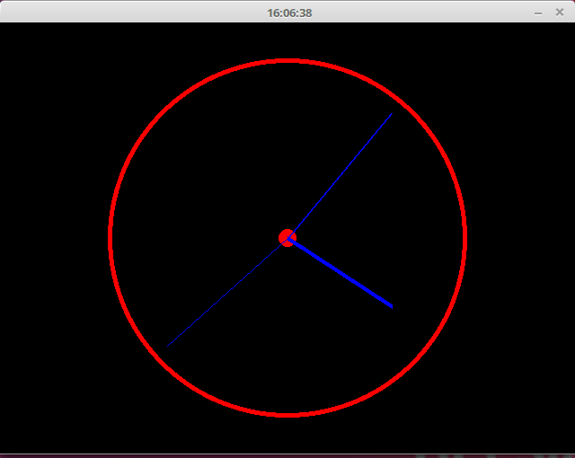
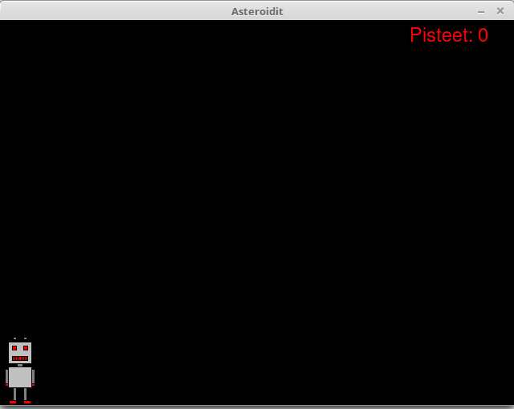

<text-box variant='learningObjectives' name='Oppimistavoitteet'>

Tämän osion jälkeen

- Tiedät, miten ikkunan otsikkoa voi muuttaa
- Osaat piirtää kuvioita Pygamessa
- Osaat piirtää ikkunaan myös tekstiä

</text-box>

## Ikkunan otsikko

Ohjelma näyttää ammattimaisemmalta, jos ikkunan otsikkopalkissa ei lue "pygame window" vaan ohjelman todellinen nimi. Tämä onnistuu näin:

```python
pygame.display.set_caption("Suuri seikkailu")
```

## Kuvioiden piirtäminen

Seuraava ohjelma luo kuvan, jossa on suorakulmio, ympyrä ja viiva:

```python
import pygame

pygame.init()
naytto = pygame.display.set_mode((640, 480))
naytto.fill((0, 0, 0))

pygame.draw.rect(naytto, (0, 255, 0), (50, 100, 200, 250))
pygame.draw.circle(naytto, (255, 0, 0), (200, 150), 40)
pygame.draw.line(naytto, (0, 0, 255), (80, 120), (300, 160), 2)

pygame.display.flip()

while True:
    for tapahtuma in pygame.event.get():
        if tapahtuma.type == pygame.QUIT:
            exit()
```

Ohjelman tulos näyttää tältä:


## Tekstin piirtäminen

Tekstin piirtäminen tapahtuu Pygame-kirjastossa niin, että ensin luodaan tekstiä vastaava kuva ja sen jälkeen piirretään kuva näytölle. Seuraava ohjelma esittelee asiaa:

```python
import pygame

pygame.init()
naytto = pygame.display.set_mode((640, 480))
naytto.fill((0, 0, 0))

fontti = pygame.font.SysFont("Arial", 24)
teksti = fontti.render("Moikka!", True, (255, 0, 0))
naytto.blit(teksti, (100, 50))
pygame.display.flip()

while True:
    for tapahtuma in pygame.event.get():
        if tapahtuma.type == pygame.QUIT:
            exit()
```

Ohjelman suoritus näyttää seuraavalta:


Tässä metodi `pygame.font.SysFont` luo fonttiolion, joka käyttää järjestelmän fonttia Arial kokona 24. Tämän jälkeen olion metodi `render` luo kuvan, jossa lukee teksti "Moikka!" punaisella värillä, ja tämä kuva piirretään ikkunaan.

Huomaa, että eri järjestelmissä on saatavilla eri fontit. Jos järjestelmässä ei ole fonttia Arial (mikä tosin on yleinen fontti), yllä oleva koodi käyttää sen sijasta järjestelmän oletusfonttia. Toinen mahdollisuus on käyttää metodia `pygame.font.Font`, jolle annetaan hakemistossa olevan fonttitiedoston nimi.

## Tehtävät

Tässä on pari vaikeampaa tehtävää, joiden avulla voit harjoitella lisää tämän luvun asioita.

<programming-exercise name='Kello' tmcname='osa13-16_kello'>

Tee ohjelma, joka näyttää graafisesti kellonajan. Ohjelman suorituksen tulee näyttää tältä:



</programming-exercise>

<programming-exercise name='Asteroidit' tmcname='osa13-17_asteroidit'>

Tee peli, jossa pelaaja ohjaa robottia vasemmalle ja oikealle ja tavoitteena on kerätä taivaalta putoavia asteroideja. Pelaaja saa pisteen jokaisesta kerätystä asteroidista, ja pistemäärä näytetään ikkunan ylälaidassa. Peli päättyy, kun pelaaja ei saa kiinni asteroidia. Pelin tulisi näyttää tältä:



Tehtäväpohjassa on asteroidia varten kuvatiedosto `kivi.png`.

</programming-exercise>


Vastaa lopuksi osion loppukyselyyn:

<quiz id="2e8af177-a920-55d2-89e5-6701d7384cc6"></quiz>


