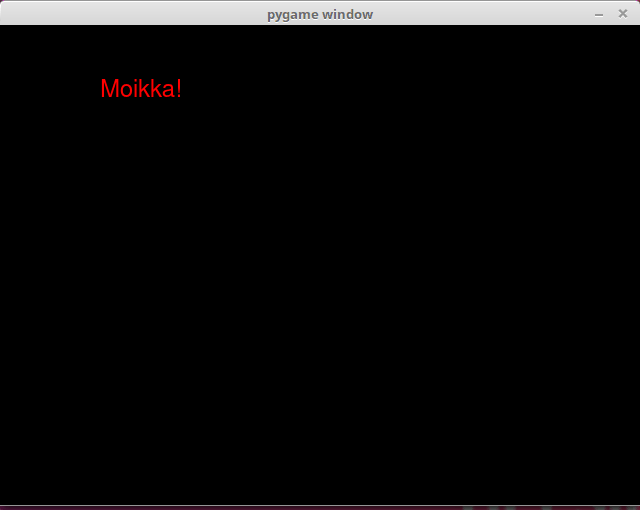

<text-box variant='learningObjectives' name="Learning objectives">

After this section

- You will know how the title of the pygame window
- You will be able to draw shapes with pygame
- You will know how to display text in your window

</text-box>

## The window title

Your programs will look more professional if instead of "pygame window" the window title contains the actual name of the program.The title is set with the `pygame.display.set_caption` function:

```python
pygame.display.set_caption("Great Adventure")
```

## Drawing shapes

The following program draws a rectangle, a circle and a line on the screen:

```python
import pygame

pygame.init()
display = pygame.display.set_mode((640, 480))
display.fill((0, 0, 0))

pygame.draw.rect(display, (0, 255, 0), (50, 100, 200, 250))
pygame.draw.circle(display, (255, 0, 0), (200, 150), 40)
pygame.draw.line(display, (0, 0, 255), (80, 120), (300, 160), 2)

pygame.display.flip()

while True:
    for event in pygame.event.get():
        if event.type == pygame.QUIT:
            exit()
```

Running the above code should look like this:


## Drawing text

Text in pygame is drawn in two steps: first we create an image containing the desired text, and then this image is drawn on the screen. It works like this:

```python
import pygame

pygame.init()
display = pygame.display.set_mode((640, 480))
display.fill((0, 0, 0))

game_font = pygame.font.SysFont("Arial", 24)
text = game_font.render("Moikka!", True, (255, 0, 0))
display.blit(text, (100, 50))
pygame.display.flip()

while True:
    for event in pygame.event.get():
        if event.type == pygame.QUIT:
            exit()
```

Running the above code should look like this:



Here the method `pygame.font.SysFont` creates a font object, which uses the system font Arial in size 24. The the method `render` creates an image of the specified text in the given colour. This image is drawn on the window with the `blit` method, just as before.

NB: different systems will have different fonts available. If the system this program is exeuted on doesn't have the Arial font, even though Arial is a very common font available on most systems, the default system font is used instead. If you need to have a specific font available for your game, you can include the font file in the game directory and specify its location for the `pygame.font.Font` method.

## Exercises

Here are some more advanced exercises for practicing what you have learned in this part of the course material.

<programming-exercise name='Clock' tmcname='part13-16_clock'>

Please write a program which displays a clock face which displays the system time. The end result should look like this:


</programming-exercise>

<programming-exercise name='Asteroids' tmcname='part13-17_asteroids'>

Please create a game where asteroids fall from the sky. The player moves a robot left and right and tries to collect the falling rocks. The player gets a point for each asteroid collected, and the points total is shown at the top of the window. The game ends when the player misses an asteroid. The end result should look like this:


NB: the above animation is from the Finnish version of the course. You may use the word "Points" instead of the Finnish equivalent "Pisteet" depicted above.

The exercise template contains the image `rock.png` for the asteroid.

</programming-exercise>

Please respond to a quick questionnaire on this part of the course.

<quiz id="8add719a-efe5-5198-b76c-679fa430c229"></quiz>


