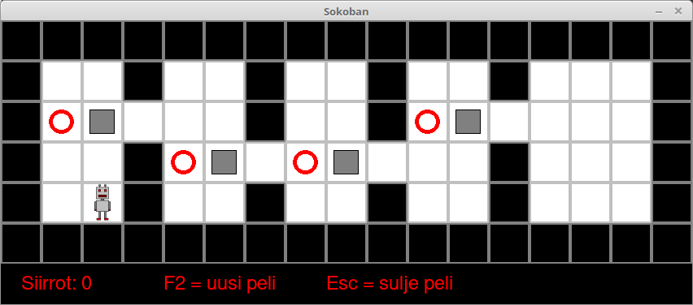

In this part we will use pygame to create a somewhat larger game. It is a variation of the classic Sokoban game, where the player moves a robot on a grid and pushes boxes into correct locations with as few moves as possible.

The end result will look like this:



## The game map

Let's begin by drawing the map used in the game. The game is implemented in the class `Sokoban`, which will contain all functionality required to play the game. In this first stage the contents of the class are as follows:

```python
import pygame

class Sokoban:
    def __init__(self):
        pygame.init()
        
        self.load_images()
        self.new_game()
        
        self.height = len(self.map)
        self.width = len(self.map[0])
        self.scale = self.images[0].get_width()

        window_height = self.scale * self.height
        window_width = self.scale * self.width
        self.window = pygame.display.set_mode((window_width, window_height))

        pygame.display.set_caption("Sokoban")

        self.main_loop()

    def load_images(self):
        self.images = []
        for name in ["floor", "wall", "target", "box", "robot", "done", "target_robot"]:
            self.images.append(pygame.image.load(name + ".png"))

    def new_game(self):
        self.map = [[1, 1, 1, 1, 1, 1, 1, 1, 1, 1, 1, 1, 1, 1, 1, 1, 1],
                    [1, 0, 0, 1, 0, 0, 1, 0, 0, 1, 0, 0, 1, 0, 0, 0, 1],
                    [1, 2, 3, 0, 0, 0, 1, 0, 0, 1, 2, 3, 0, 0, 0, 0, 1],
                    [1, 0, 0, 1, 2, 3, 0, 2, 3, 0, 0, 0, 1, 0, 0, 0, 1],
                    [1, 0, 4, 1, 0, 0, 1, 0, 0, 1, 0, 0, 1, 0, 0, 0, 1],
                    [1, 1, 1, 1, 1, 1, 1, 1, 1, 1, 1, 1, 1, 1, 1, 1, 1]]

    def main_loop(self):
        while True:
            self.check_events()
            self.draw_window()

    def check_events(self):
        for event in pygame.event.get():
            if event.type == pygame.QUIT:
                exit()

    def draw_window(self):
        self.window.fill((0, 0, 0))

        for y in range(self.height):
            for x in range(self.width):
                square = self.map[y][x]
                self.window.blit(self.images[square], (x * self.scale, y * self.scale))

        pygame.display.flip()

if __name__ == "__main__":
    Sokoban()
```

Running the program should display a window with the initial state of the game. Let's take a closer look at the code which achieves this.

## The constructor

The constructor of the class initializes the pygame modules and the essential variables and data structures involved in the game. It also calls the main loop method of the game.

```python
    def __init__(self):
        pygame.init()
        
        self.load_images()
        self.new_game()
        
        self.height = len(self.map)
        self.width = len(self.map[0])
        self.scale = self.images[0].get_width()

        window_height = self.scale * self.height
        window_width = self.scale * self.width
        self.window = pygame.display.set_mode((window_width, window_height))

        pygame.display.set_caption("Sokoban")

        self.main_loop()
```

The `load_images` method loads the images used in the game into a list named `images`. The `new_game` method creates a two-dimensional list named `map`, which contains the state of the game grid in the beginning of the game.

The variables `height` and `width` are initialized based on the dimensions of the game grid. The variable `scale` contains the length of the side of one square in the grid. As each image is a square of the exact same size, the size of all squares is covered by this one variable, and the width of the first image will do just fine for the value. This same value can be used to calculate the width and height of the entire grid, which lets us create a window of the appropriate size to display the game grid.

## Loading images

The `load_images` method loads all the images used in the game:

```python
    def load_images(self):
        self.images = []
        for name in ["floor", "wall", "target", "box", "robot", "done", "target_robot"]:
            self.images.append(pygame.image.load(name + ".png"))
```

The game makes use of the following images:

### Floor square


* Filename: `floor.png`
* Position in list: 0

### Wall square


* Filename: `wall.png`
* Position in list: 1

### Target square


* Filename: `target.png`
* Position in list: 2
* The robot should move some box to this square

### Box


* Filename: `box.png`
* Position in list: 3

### Robot


* Filename: `robot.png`
* Position in list: 4

### Box on a target square


* Filename: `done.png`
* Position in list: 5
* The box has been moved to the target square

### Robot on a target square


* Filename: `target_robot.png`
* Position in list: 6
* The robot can also be on an empty target square 

## Creating the grid

The `new_game` method creates the initial state of the game grid:

```python
    def new_game(self):
        self.map = [[1, 1, 1, 1, 1, 1, 1, 1, 1, 1, 1, 1, 1, 1, 1, 1, 1],
                    [1, 0, 0, 1, 0, 0, 1, 0, 0, 1, 0, 0, 1, 0, 0, 0, 1],
                    [1, 2, 3, 0, 0, 0, 1, 0, 0, 1, 2, 3, 0, 0, 0, 0, 1],
                    [1, 0, 0, 1, 2, 3, 0, 2, 3, 0, 0, 0, 1, 0, 0, 0, 1],
                    [1, 0, 4, 1, 0, 0, 1, 0, 0, 1, 0, 0, 1, 0, 0, 0, 1],
                    [1, 1, 1, 1, 1, 1, 1, 1, 1, 1, 1, 1, 1, 1, 1, 1, 1]]
```

The method creates a two.dimensional list named `map` which uses the numbered positions of the images in _their_ list to mark up which image goes where. This way the game contains a record of the state of the game grid at all times.

NB: in the beginning all spaces on the grid contain a number between 0 and 4. The numbers 5 and 6 are not included, as in the beginning no box or robot is on a target square.

## The main loop

The `main_loop` method is rather short. With each iteration it calls two methods: `check_events` goes through any events collected since the previous iteration, and the `draw_window` method updates the contents of the window.

```python
    def main_loop(self):
        while True:
            self.check_events()
            self.draw_window()

    def check_events(self):
        for event in pygame.event.get():
            if event.type == pygame.QUIT:
                exit()

    def draw_window(self):
        self.window.fill((0, 0, 0))

        for y in range(self.height):
            for x in range(self.width):
                square = self.map[y][x]
                self.window.blit(self.images[square], (x * self.scale, y * self.scale))

        pygame.display.flip()
```

At this stage the only event actually handled by the game is closing the game window, e.g. from the exit button. The game then exits by calling the Python `exit` function.

Each time `draw_window` method is called the entire game grid is matrix is traversed, and the image corresponding to each square in the grid is drawn in the correct location.

NB: the coordinates x and y are used in two different ways in the game. When dealing with the indexes of a two-dimensional list, it is logical to give the y coordinate first, as the y refers to the number of the row while x is the number of the column. On the other hand, when using pygame methods, x is usually passed first, as it quite often is when dealing with graphics, and also in mathematical contexts.
