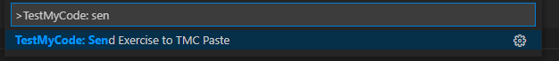

## The last programming exercise

The final programming exercise on this course is creating a small game of your own with pygame. The exercise template contains some images for you to use. Please don't use any other images in your game, or others will not be able to test your game based on the source code alone.

The subject of the game is up to you, but it should be about as complicated as the Sokoban example in this part of the material. The game should contain the following features:

* The game has a sprite the player can move in some way
* The game has some collectable items and/or enemies 
* The player needs to be set a clear task in the game
* The game contains a counter which tells the player how they are doing in the game
* The source code for the game is divided into functions like in the Sokoban example

When the game is finished, submit it for peer revies with the following form. After this, familiarize yourself with the games of two of your coursemates, give the games a grade you deem appropriate,a dn write a short review of the game. Please take into account both how interesting and playable the game was, and how readable the program code is, when grading and reviewing the games.

### Submitting the game

You should submit the source code of your game through the TMC Paste feature, and include the link you receive in the form below. 

With your solution open in the editor, click the TMC menu button in Visual Studio Code (next to the eye symbol). This opens a menu where you can look for the TMC Paste feature by typing in `send`:

Select the option `Send Exercise to TMC Paste`, and there should be a notification in the bottom right hand corner of the window telling you that the source code has been sent to the TMC server:

You can copy the link by clicking on the `Open URL` button in the notification. A popup should appear, and it should contain the option to `Copy`:

This is the link your should paste in the form below.

## How part 14 is graded

The goal of this part is to build a small, working game. As this part contains only a single task, *you get points for effort*. Please submit your game even if you can't get it to work quite the way you wanted to.

If your game doesn't work the way you intended, please include comments in your code about how it _should_ work, or any features you think are missing but did not manage to implement.

If a game you are reviewing is incomplete or doesn't work quite right, please include comments about what you think could have been done to make it work, if at all possible.

## Some game ideas

It is completely up to you what your game will be about, but here are some ideas to help you get started. Remember the material in part 13; those examples can help you work on your ideas, too.

### A collecting game

* The player moves the robot with the arrow keys.
* A coin appears in a random location on the screen. When the robot reaches it, the coin moves to a new location.
* There are also monsters on the screen, and the robot must avoid them.

### A rain of coins

* The player moves the robot to the left and right along the bottom of the screen.
* Coins rain from the sky. The robot must collect these.
* Also monsters rain from the sky. The robot must avoid these.

## Peer review

You should assess the game based on the following criteria:

* What does the game look like?
* Is the game *playable*? Is it fun to play and easy to use?
* Is the game idea interesting?
* How well is it programmed? Is the code readable, and does it make appropriate use of classes and functions?

A good review usually points out both good features and some suggestions for improvements.

<quiz id="8435be7f-180e-5d13-b693-306ddaeb45cd"></quiz>

## Questionnaires to finish off

First, please respond to a quick questionnaire on this part of the course.

<quiz id="7ac28d6b-e62a-57ed-ad90-c58e01d8fff4"></quiz>

Please also respond to the course feedback questionnaire. The questionnaire results help us improve the course.

<quiz id="6b11bbd5-f5f1-5ee9-afdb-012e52ee7ab0"></quiz>

