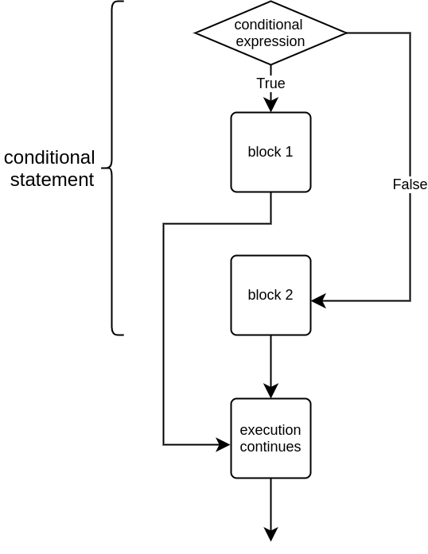
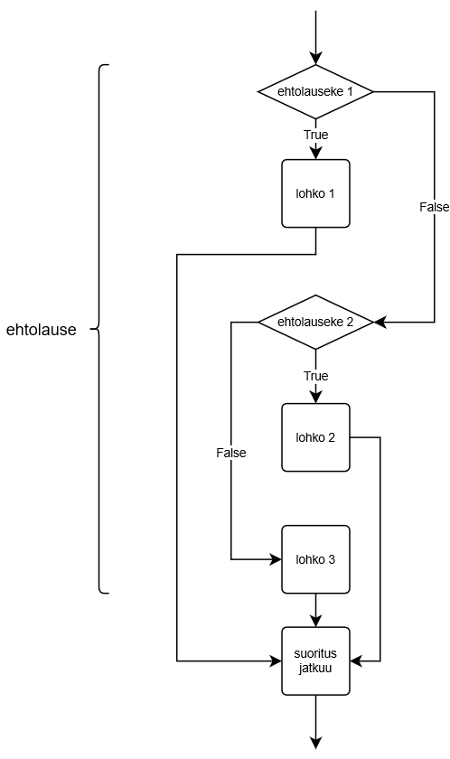

<text-box variant='learningObjectives' name='Oppimistavoitteet'>

Tämän osion jälkeen

- Osaat luoda vaihtoehtoisia haaroja toistolauseisiin
- Ymmärrät `if`-, `elif`- ja `else`-lauseiden merkityksen ehtolauseessa
- Osaat soveltaa jakojäännöstä `%` ehdoissa

</text-box>

Tarkastellaan ohjelmaa, joka tulostaa tiedon siitä, onko käyttäjän syöte negatiivinen vai positiivinen tai nolla:

```python
luku = int(input("Anna luku: "))

if luku < 0:
    print("Luku on negatiivinen")

if luku >= 0:
    print("Luku on positiivinen tai nolla")
```

Ohjelma on hiukan kömpelö. Jokaisen mahdollisen syötteen kohdalla halutaan suorittaa vain toinen lohkoista, koska aina pätee joko `luku < 0` tai `luku >= 0`. Ensimmäinen vertailu sisältää tavallaan kaiken olennaisen: jos tulos on tosi, luku on negatiivinen, ja jos se on epätosi, luku on positiivinen tai nolla.

Toisen vertailun sijasta onkin usein näppärämpää luoda vaihtoehtoinen haara, joka suoritetaan, _jos ehto on epätosi_. Tätä tarkoitusta varten käytetään `else`-lausetta.

Edellinen esimerkki kirjoitettuna uudestaan:

```python
luku = int(input("Anna luku: "))

if luku < 0:
    print("Luku on negatiivinen")
else:
    print("Luku on positiivinen tai nolla")
```

Kun käytetään if-else-rakennetta, suoritetaan vaihtoehtoisista lohkoista aina jompikumpi. Seuraava kuva havainnollistaa asiaa:



Huomaa, että else-haaraa ei voi olla olemassa ilman edeltävää if-haaraa. Koko if-else-rakenne lohkoineen muodostaa yhden _ehtolauseen_.

Seuraava esimerkki tutkii, onko käyttäjän syöttämä luku parillinen vai ei. Parillisuuden selvittämiseen käytetään jakojäännösoperaattoria `%`. Jakojäännöksellä on kätevä testata luvun parillisuutta: jos luvun jakojäännös kahdella on nolla, luku on parillinen, ja muuten pariton.

```python
luku = int(input("Anna luku: "))

if luku % 2 == 0:
    print("Luku on parillinen")
else:
    print("Luku on pariton")
```

<sample-output>

Anna luku: **5**
Luku on pariton

</sample-output>

Kolmas esimerkki, jossa vertaillaan merkkijonojen samuutta:

```python
oikea = "kissa"
salasana = input("Anna salasana: ")

if salasana == oikea:
    print("Tervetuloa")
else:
    print("Pääsy kielletty")
```

Kaksi esimerkkisuoritusta eri syötteillä:

<sample-output>

Anna salasana: **kissa**
Tervetuloa

</sample-output>

<sample-output>

Anna salasana: **apina**
Pääsy kielletty

</sample-output>


<in-browser-programming-exercise name="Age of maturity" tmcname="part02-04_age_of_maturity" height="400px">

Please write a program which asks the user for their age. The program should then print out a message based on whether the user is of age or not, using 18 as the age of maturity.

Some examples of expected behaviour:

<sample-output>

How old are you? **12**
You are not of age!

</sample-output>


<sample-output>

How old are you? **32**
You are of age!

</sample-output>

</in-browser-programming-exercise>

## Vaihtoehtoiset haarat elif-lauseella

Usein vaihtoehtoja on kuitenkin enemmän kuin kaksi. Esimerkiksi jalkapallo-ottelun lopputulosta käsitellessä olisi hyvä varautua kolmeen vaihtoehtoiseen lopputulokseen kotijoukkueen kannalta: voitto, häviö tai tasapeli.

Ehtolausetta voidaan laajentaa `elif`-haaralla. Se on lyhenne sanoista "else if", ja tarkoittaa nimensä mukaisesti vaihtoehtoa alkuperäiselle ehdolle.



Tarkastellaan esimerkkiä, jossa selvitetään ottelun voittaja:

```python
maalit_koti = int(input("Kotijoukkueen maalimäärä: "))
maalit_vieras = int(input("Vierasjoukkueen maalimäärä: "))

if maalit_koti > maalit_vieras:
    print("Kotijoukkue voitti!")
elif maalit_vieras > maalit_koti:
    print("Vierasjoukkue voitti!")
else:
    print("Tasapeli!")
```

Kolme esimerkkitulosta eri syötteillä:

<sample-output>

Kotijoukkueen maalimäärä: **4**
Vierasjoukkueen maalimäärä: **2**
Kotijoukkue voitti!

</sample-output>

<sample-output>

Kotijoukkueen maalimäärä: **0**
Vierasjoukkueen maalimäärä: **6**
Vierasjoukkue voitti!

</sample-output>

<sample-output>

Kotijoukkueen maalimäärä: **3**
Vierasjoukkueen maalimäärä: **3**
Tasapeli!

</sample-output>

Esimerkissä ehtolauseessa on siis kolme vaihtoehtoista haaraa, joista suoritetaan aina yksi. Ehtolauseessa `elif`-haaroja voi olla useampia, eikä `else`-haara ole pakollinen.

Esimerkiksi:

```python
print("Joulukalenteri")
pvm = input("Mikä päivä nyt on? ")

if pvm == "24.12.":
    print("Nyt on jouluaatto")
elif pvm == "25.12.":
    print("Nyt on joulupäivä")
elif pvm == "26.12.":
    print("Nyt on tapaninpäivä")

print("Kiitos ja hei.")
```

<sample-output>

Joulukalenteri
Mikä päivä nyt on? **25.12.**
Nyt on joulupäivä
Kiitos ja hei.

</sample-output>

Huomaa, että ehtolauseessa ei edellisessä esimerkissä ole ollenkaan else-haaraa. Jos käyttäjä syöttää jonkin sellaisen päivämäärän, jota ei täytä ehtoa jossain `if`- tai `elif`-lauseessa, ohjelmassa ei suoriteta mitään ehtolauseen kolmesta lohkosta.

<sample-output>

Joulukalenteri
Mikä päivä nyt on? **1.1.**
Kiitos ja hei.

</sample-output>

<in-browser-programming-exercise name="Greater than or equal to" tmcname="part02-05_greater_or_equal"  height="400px">

Please write a program which asks for two integer numbers. The program should then print out whichever is greater. If the numbers are equal, the program should print a different message.

Some examples of expected behaviour:

<sample-output>

Please type in the first number: **5**
Please type in another number: **3**
The greater number was: 5

</sample-output>

<sample-output>

Please type in the first number:: **5**
Please type in another number: **8**
The greater number was: 8

</sample-output>

<sample-output>

Please type in the first number: **5**
Please type in another number: **5**
The numbers are equal!

</sample-output>

</in-browser-programming-exercise>


<in-browser-programming-exercise name="The elder" tmcname="part02-06_elder" height="550px">

Please write a program which asks for the names and ages of two persons. The program should then print out the name of the elder.

Some examples of expected behaviour:

<sample-output>

Person 1:
Name: **Alan**
Age: **26**
Person 2:
Name: **Ada**
Age: **27**
The elder is Ada

</sample-output>

<sample-output>

Person 1:
Name: **Bill**
Age: **1**
Person 2:
Name: **Jean**
Age: **1**
Bill and Jean are the same age

</sample-output>

</in-browser-programming-exercise>

<in-browser-programming-exercise name="Alphabetically last" tmcname="part02-07_alphabetically_last"  height="500px">

In addition to numbers, you can also use Python comparison operators on strings. The string a is smaller than string b if it comes alphabetically before b. Notice however that the comparison is only reliable if 
- the characters compared are of the same case, i.e. both UPPERCASE or both lowercase
- only the standard English alphabet of a to z, or A to Z, is used.

Please write a program which asks the user for two words. The program should then print out whichever of the two comes alphabetically last. 

You can assume all words will be typed in lowercase entirely.

Some examples of expected behaviour:

<sample-output>

Please type in the 1st word: **car**
Please type in the 2nd word: **scooter**
scooter comes alphabetically last.

</sample-output>

<sample-output>

Please type in the 1st word: **zorro**
Please type in the 2nd word: **batman**
zorro comes alphabetically last.

</sample-output>

<sample-output>

Please type in the 1st word: **python**
Please type in the 2nd word: **python**
You gave the same word twice.

</sample-output>

</in-browser-programming-exercise>

A quiz to review the contents of this section:

<quiz id="82f644fe-5d89-5153-842a-11d5d11bc059"></quiz>
