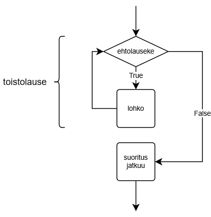
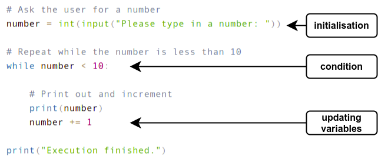
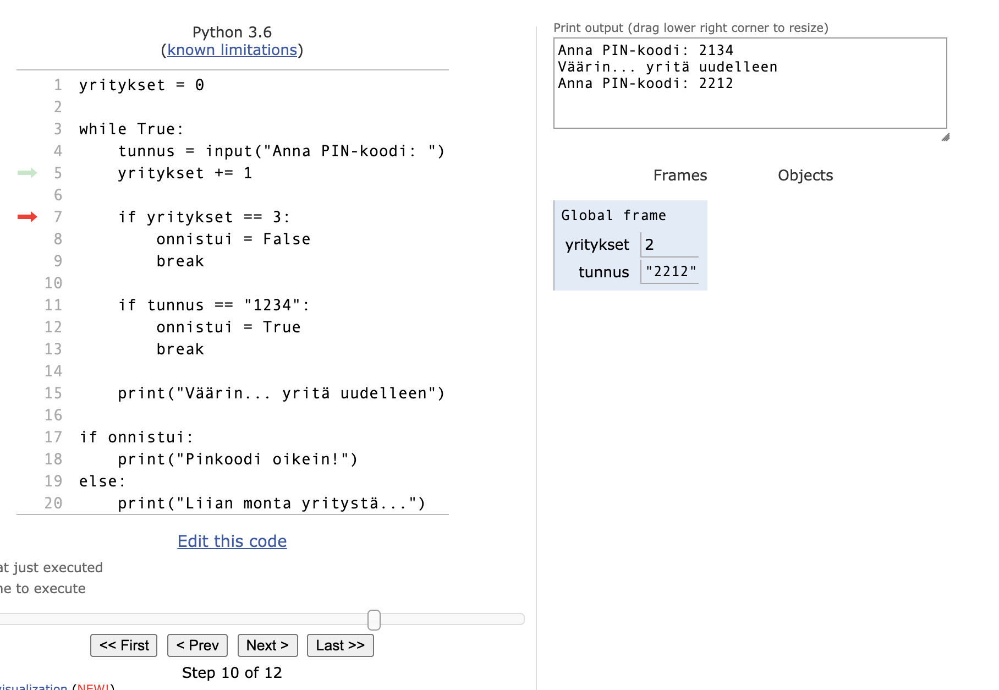

<text-box variant='learningObjectives' name="Learning objectives">

After this section

- You will be able to create a while loop with a condition
- You will know what roles initialisation, condition and updating variables perform in a loop
- You will be able to create loops with different kinds of conditions

</text-box>

<text-box variant='hint' name="About the exercises on this course">

Becoming a proficient programmer requires a lot of practice, sometimes even quite mechanical practice. It also requires developing problem solving skills and applying intuition. This is why there are a lot of exercises in this course. Some of them ask you to quite straightforwardly apply what you have learnt in the material, but some of them are intentionally more challenging and open-ended.

Some of the exercises might at first seem overwhelming, but this is nothing to worry about. None of the exercises is strictly mandatory, and in fact _only 25 % of the points in each part is required to pass the course._ You can find more details about passing the course on the page [on grading](/grading-and-exams).

**The exercises are not in any specific order of difficulty.** Each section usually introduces some new programming concepts, and these are then practiced with both simpler and more complicated exercises. **If you come across an exercise that feels too difficult, move on to the next one.** You can always come back to the more difficult exercises if you have time later.

When the going inevitably gets tough, a word of consolation: a task that seems impossibly difficult this week will likely feel rather easy in about four weeks' time.

</text-box>

In the previous section we learnt to use the `while True` loop to repeat sections of code. In that construction the condition of the loop is `True`, so the condition is fulfilled every time and the loop must be exited from in some other way. For example:

```python
# Print numbers until the variable a equals 5
a = 1
while True:
    print(a)
    a += 1
    if a == 5:
        break
```

<sample-output>

1
2
3
4

</sample-output>

Of course the condition doesn't always have to be true, but instead any Boolean expression can be used as the condition. The general structure of the `while` statement is as follows:

```python
while <condition>:
    <block>
```

The idea here is that the execution goes back and forth, checking if the condition is true and executing the code within the block, over and over again. If the condition at any point is false, execution of the program continues from the line after the `while` statement.



In the following loop we have the condition `number < 10`. The block within the loop is executed only if the variable number is less than 10.

```python
number = int(input("Please type in a number: "))

while number < 10:
    print(number)
    number += 1

print("Execution finished.")
```

This could print out:

<sample-output>

Please type in a number: **4**
4
5
6
7
8
9
Execution finished.

</sample-output>

The condition is checked always before the block within the loop is executed. It is thus possible the block doesn't ever get executed, like so:

<sample-output>

Please type in a number: **12**
Execution finished.

</sample-output>

12 is not less than 10, so the program doesn't print out a single number.

## Initialisation, condition and update

To create a loop you'll often need to include three distinct steps: initialisation, condition, and updating the iteration variables.

_Initialisation_ refers to setting the initial value(s) of the variable(s) used within the condition of the loop. This is performed before the loop is first entered. The _condition_ defines how long the loop is to be executed. It is set out at the very beginning of the loop. Finally, within each iteration of the loop the iteration variables are _updated_, so that each iteration brings the loop one step closer to its conclusion. The following image illustrates these steps:



If any one of these three components is missing the loop will likely not function correctly. A typical error is omitting the update step:

```python
number = 1

while number < 10:
    print(number)

print("Execution finished.")
```

Here, the value of the variable `number` never changes. The program is stuck in an infinite loop, and the exact same bit of code is repeated over and over again until the user stops the execution, for example by pressing `Control` + `C`:

<sample-output>

1
1
1
1
1
(continued ad infinitum...)

</sample-output>

<in-browser-programming-exercise name="Tulosta luvut" tmcname="osa03-00_tulosta_luvut">

Kirjoita ohjelma, joka tulostaa silmukassa luvut kahdesta kolmeenkymmeneen kahden luvun välein. Jokainen luku tulostetaan omalle rivilleen.

Ohjelman tulosteen alku näytää siis tältä:

<sample-output>
2
4
6
8
jne...
</sample-output>

</in-browser-programming-exercise>


<in-browser-programming-exercise name="Lähtölaskenta" tmcname="osa03-01_lahtolaskenta">

Korjaa tehtäväpohjassa oleva ohjelma

```python
print("Valmiina?")
luku = int(input("Anna luku: "))
while luku = 0:
print(luku)
print("Nyt!")
```

siten että se toimii seuraavasti:

<sample-output>

Valmiina?
Anna luku: **5**
5
4
3
2
1
Nyt!

</sample-output>

Älä tällä kertaa käytä `while True` -silmukkaa!


</in-browser-programming-exercise>

## Ehdoista tarkemmin

Silmukan ehtona voidaan käyttää mitä tahansa ehtolauseketta. Esimerkiksi seuraava ohjelma tulostaa lukuja kolmen välein niin kauan kuin luku on pienempi kuin 100 eikä se ole jaollinen 5:llä:

```python
luku = int(input("Anna luku: "))

while luku < 100 and luku % 5 != 0:
    print(luku)
    luku += 3
```

Kaksi esimerkkitulostusta eri syötteillä:

<sample-output>

Anna luku: **28**
28
31
34
37

</sample-output>

<sample-output>

Anna luku: **96**
96
99

</sample-output>

Luvun 28 kohdalla silmukka päättyy lukuun 37, koska seuraava luku 40 on jaollinen 5:llä. Luvun 96 kohdalla silmukka päättyy lukuun 99, koska seuraava luku 102 ei ole alle 100.

Silmukan ehtoa kirjoittaessa on tärkeä varmistua siitä, että silmukan suoritus päättyy. Esimerkiksi seuraava ohjelma on joko päättyvä tai ei-päättyvä riippuen alkuarvosta:

```python
luku = int(input("Anna luku: "))

while luku != 10:
    print(luku)
    luku += 2
```

Jos syötteenä on parillinen luku, joka on enintään 10, silmukan suoritus päättyy:

<sample-output>

Anna luku: **4**
4
6
8

</sample-output>

Muissa tapauksissa silmukka on kuitenkin ikuinen, koska muuttuja ei koskaan saavuta arvoa 10. Tällaisia syötteitä ovat esimerkiksi 3 ja 12.

<in-browser-programming-exercise name="Luvut" tmcname="osa03-02_luvut">

Tee ohjelma, joka tulostaa kaikki käyttäjän antamaa lukua pienemmät luvut alkaen luvusta yksi.

<sample-output>

Mihin asti: **5**
1
2
3
4

</sample-output>

Älä käytä tässä tehtävässä while-komennon ehtona arvoa `True`!

</in-browser-programming-exercise>

## Lisää debuggauksesta

Hieman haastavampaa ohjelmaa, esim. seuraavaksi vuorossa olevaa tehtävää _Kahden potenssit_, koodatessa voitaisiin lähteä liikkeelle seuraavasti:

```python
asti = int(input("Mihin asti"))
luku = 1
while luku == asti:
   # koodia
```

Tässä on aloitettu syötteen lukemisesta, minkä jälkeen ruvetaan miettimään silmukan lopetusehtoa sekä silmukan toimintaa.

Todennäköisesti ohjelma ei ensimmäisillä kokeilukerroilla toimi halutulla tavalla ja koodia on testailtava kymmeniä tai jopa satoja kertoja ennen kuin se alkaa toimia.

Koska koodi lukee syötteitä käyttäjältä, sen toiminnan kokeileminen on hidasta ja vaivalloista, koska jokaisella testauskerralla on ohjelmalle annettava näppäimistöltä käsin sen haluamat syötteet.

Yksi tapa toimia on "kovakoodata" syöte aluksi:

```python
# kovakoodataan syötteen arvo aluksi
asti = 8 # int(input("Mihin asti"))
luku = 1
while luku == asti:
   # koodia
```

Kun ohjelma toimii yhdellä syötteellä, sitä on helppo kokeilla muilla kovakoodatuilla syötteillä ja lopulta lukemalla syöte käyttäjältä.

Vastaava kikka toimii myös kurssien tehtäviin liittyvien testien ongelmatilanteita selvitellessä. Jos testi kertoo, että ohjelmasi toimii väärin, kun syöte on vaikkapa 42, niin kovakoodataan se syötteeksi bugin etsinnän ajaksi:

```python
# testi ilmoitti että koodi toimii väärin kun syöte on 42
asti = 42 # int(input("Mihin asti"))
luku = 1
while luku == asti:
   # koodia
```

Kurssin [edellisessä osassa](/osa-2) oli jo pariinkin otteeseen puhetta tulostuskomennon avulla tapahtuvasta debuggaamisesta. Kurssin aikana vastaan tulevat ohjelmat muuttuvat koko ajan haastavammiksi ja debuggauksen tarve tulee kasvamaan entisestään. Esimerkiksi silmukoiden lopetusehtojen saaminen toimimaan kaikissa tapauksissa voi olla haastavaa.

Tulostuskomentoihin perustuva debuggaus kannattaa ottaa omaan työkalupakkiin viimeistään nyt. Kertaa tarvittaessa edellisen osan [ensimmäisessä ](/osa-2/1-ohjelmoinnin-termeja) ja [neljännessä](/osa-2/4-yksinkertainen-silmukka) luvussa olleet debuggausohjeet.

Tulostamisen lisäksi on olemassa muitakin debuggaukseen sopivia työkaluja. Eräs tälläinen on sivuston [Python Tutor](http://www.pythontutor.com/) tarjoama [visualisointityökalu](http://www.pythontutor.com/visualize.html#mode=edit), jonka avulla oman ohjelman koodia on mahdollista suorittaa komento komennolta havainnoiden samalla, mitä arvoja ohjelman muuttujat saavat.

Seuraavassa kuvassa Python Tutorilla visualisoidaan [edellisen osan](/osa-2/4-yksinkertainen-silmukka) debuggausmateriaalissa olevan hieman rikkinäisen koodin toimintaa:



Punainen nuoli kertoo, missä kohtaa ohjelman suoritus on menossa. Visualisaattori näyttää, mitä ohjelma on tulostanut ruudulle ja mitkä ovat ohjelman muuttujien arvot kullakin suorituksen hetkellä. Koodin suoritus etenee komento komennolta painiketta _Next>_ painellessa.

Visualisaattorin käyttö on erittäin helppoa, koska riittää että tarkasteltava koodi kopioidaan [koodi-ikkunaan](http://www.pythontutor.com/visualize.html#mode=edit). Huomaa, että visualisaattori ei saalli ääkkösten käyttämistä muuttujien eikä funktioiden nimissä.

Kokeneemmat ohjelmoijat tuskin käyttävät visualisaattoria koskaan, mutta aloittelijalle se voi olla oiva apuväline. Ohjelmointi ei nimittäin voi perustua tuuriin tai sattumaan. Ohjelmoijan on koko ajan tiedettävä tarkalleen, mitä muuttujien arvot ohjelman suorituksen aikana ovat. Jos muuttujien arvot eivät vastaakaan ohjelmoijan olettamaa, on tuloksena mitä suurimmalla todennäköisyydellä bugi.

Visualisaattori ja debuggaustulostukset ovat erinomainen väline siihen, että ohjelmoija voi omin silmin varmistaa, että ohjelma todellakin toimii kuten sen olettaa toimivan.

<in-browser-programming-exercise name="Kahden potenssit" tmcname="osa03-03_kahden_potenssit">

Tee ohjelma, joka tulostaa ensin luvun 1 ja sen jälkeen kerta toisensa jälkeen aina kaksi kertaa suuremman luvun. Ohjelma siis tulostaa luvun kaksi potensseja.

Ohjelman suoritus päättyy, kun on tulostettu luku, joka on korkeintaan käyttäjän syötteen suuruinen. Yhtään käyttäjän syötettä suurempaa lukua ei siis tulosteta!

<sample-output>

Mihin asti: **8**
1
2
4
8

</sample-output>

<sample-output>

Mihin asti: **20**
1
2
4
8
16

</sample-output>

<sample-output>

Mihin asti: **100**
1
2
4
8
16
32
64

</sample-output>

Älä käytä tässä tehtävässä `while`-komennon ehtona arvoa `True`!

**Miten kahden potenssit lasketaan?** Ensimmäinen kahden potenssi on luku 1. Seuraava saadaan kertomalla 1 luvulla 2, eli se on 2. Sitä seuraava saadaan taas kertomalla edellinen kahden potenssi kahdella, eli kyseessä on 2 \* 2 eli 4, ja seuraava saadaan kertomalla kahdella 4 \* 2 eli kyseessä on 8, jne...

</in-browser-programming-exercise>

<in-browser-programming-exercise name="Luvun n potenssit" tmcname="osa03-04_luvun_n_potenssit">

Muuta edellistä ohjelmaa siten, että käyttäjä saa määrätä kertoimen (edellisessä ohjelmassa kerroin oli aina 2), eli sen, minkä luvun potensseja ohjelma tulostaa.

<sample-output>

Mihin asti: **27**
Mikä kerroin: **3**
1
3
9
27

</sample-output>

<sample-output>

Mihin asti: **1234567**
Mikä kerroin: **10**
1
10
100
1000
10000
100000
1000000

</sample-output>

Älä käytä tässä tehtävässä `while`-komennon ehtona arvoa `True`!

</in-browser-programming-exercise>

<in-browser-programming-exercise name="Peräkkäisten summa, versio 1" tmcname="osa03-04a_perakkaisten_summa_helpompi">

Tee ohjelma, joka laskee peräkkäisten lukujen summaa 1 + 2 + 3 + ... kunnes sen arvo on vähintään käyttäjän syöttämä luku. Ohjelma toimii seuraavasti:

<sample-output>

Mihin asti: **2**
3

</sample-output>

<sample-output>

Mihin asti: **10**
10

</sample-output>

<sample-output>

Mihin asti: **18**
21

</sample-output>

Voit olettaa, että käyttäjän antama luku on 2 tai suurempi.

</in-browser-programming-exercise>

## Merkkijonon rakentaminen paloista

Jo kurssin [ensimetreillä](/osa-1/2-tietoa-kayttajalta) opimme, että merkkijono on mahdollista "rakentaa" useammasta pienemmästä merkkijonosta +-operaattorin avulla. Esimerkiksi

```python
sanat = "suo"
sanat = sanat + ", kuokka"
sanat = sanat + " ja python"

print(sanat)
```

<sample-output>

suo, kuokka ja python

</sample-output>

Huomaa, että edellinen on mahdollista kirjoittaa hieman tiiviimmin operaattorin += avulla:

```python
sanat = "suo"
sanat += ", kuokka"
sanat += " ja python"

print(sanat)
```

Yhdistettävä merkkijonon pätkä voi olla myös f-merkkijono. Tämä saattaa olla kätevää, jos rakennettavaan merkkijonoon lisätään muuttujissa olevia arvoja. Voimme siis tehdä esim. seuraavasti:

```python
kurssi = "Ohjelmoinnin perusteet"
arvosana = 4

lausunto = "Olet saanut "
lausunto += f"kurssilta {kurssi} "
lausunto += f"arvosanan {arvosana}"

print(lausunto)
```

<sample-output>

Olet saanut kurssilta Ohjelmoinnin perusteet arvosanan 4

</sample-output>

Edellisessä tehtävässä laskettiin lukujen summaa kasvattamalla sen arvoa silmukan sisällä.

Täsmälleen samalla idealla on mahdollista rakentaa myös merkkijonoa siten, että siihen lisätään yksi osa kerrallaan silmukassa...

<in-browser-programming-exercise name="Peräkkäisten summa, versio 2" tmcname="osa03-05_perakkaisten_summa">

Tee edellisestä ohjelmasta hieman kehittyneempi versio, joka tulostaa lopputuloksen lisäksi myös sen miten kyseinen summa lasketaan:

<sample-output>

Mihin asti: **2**
Laskettiin 1 + 2 = 3

</sample-output>

<sample-output>

Mihin asti: **10**
Laskettiin 1 + 2 + 3 + 4 = 10

</sample-output>

<sample-output>

Mihin asti: **18**
Laskettiin 1 + 2 + 3 + 4 + 5 + 6 = 21

</sample-output>

Voit olettaa, että käyttäjän antama luku on 2 tai suurempi.

</in-browser-programming-exercise>

A quiz to review the contents of this section:

<quiz id="900c0293-b14c-5736-b1a3-68d4fa01ac43"></quiz>
