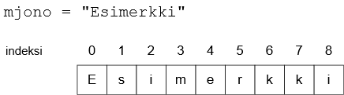
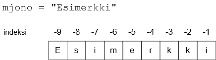
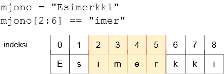
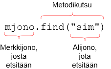

<text-box variant='learningObjectives' name="Learning objectives">

After this section

- You will be able to use the operators `+` and `*` with strings
- You will know how to find out the length of a string
- You will know what is meant by string indexing
- You will know how to look for substrings within a string

</text-box>

## String operations

Strings can be combined, or _concatenated_, with the `+` operator:

```python
begin = "ex"
end = "ample"
word = begin+end
print(word)
```

<sample-output>

example

</sample-output>

The `*` operator can also be used with a string, when the other operand is an integer. The string operand is then repeated the number of times specified by the integer. For example this would work:

```python
word = "banana"
print(word*3)
```

<sample-output>

bananabananabanana

</sample-output>

Using string operations together with a loop we can write a program which draws a pyramid:

```python
n = 10 # number of layers in the pyramid
row = "*"

while n > 0:
    print(" " * n + row)
    row += "**"
    n -= 1
```

This prints out the following:

```x
          *
         ***
        *****
       *******
      *********
     ***********
    *************
   ***************
  *****************
 *******************
```

The `print` command within the loop prints a line, which begins with `n` spaces, followed by whatever is stored in the variable `row`. Then two stars are added to the end of the variable `row`, and the value of the variable `n` is decreased by 1.

<in-browser-programming-exercise name="String multiplied" tmcname="part03-08_string_multiplied">

Please write a program which asks the user for a string and an amount. The program then prints out the string as many times as specified by the amount. The printout should all be on one line, with no extra spaces or symbols added.

An example of expected behaviour:

<sample-output>

Please type in a string: **hiya**
Please type in an amount: **4**
hiyahiyahiyahiya

</sample-output>

</in-browser-programming-exercise>

## The length and index of a string

The function `len` returns the number of characters in a string, which is always an integer value. For example, `len("hey")` returns 3, because there are three characters in the string `hey`.

The following program asks the user for a string and then prints it "underlined". The program prints a second line with as many `-` characters as is the length of the input:

```python
input_string = input("Please type in a string: ")
print(input_string)
print("-"*len(input_string))
```

<sample-output>

Please type in a string: **Hi there!**

<pre>
Hi there!
---------
</pre>

</sample-output>

The length of a string includes all the characters in the string, including whitespace. For example, the length of the string `bye bye` is 7.

<in-browser-programming-exercise name="The longer string" tmcname="part03-09_longer_string">

Please write a program which asks the user for two strings and then prints out whichever is the longer of the two - that is, whichever has the more characters. If the strings are of equal length, the program should print out "The strings are equally long".

Some examples of expected behaviour:

<sample-output>

Please type in string 1: **hey**
Please type in string 2: **hiya**
hiya is longer

</sample-output>

<sample-output>

Please type in string 1: **howdy doody**
Please type in string 2: **hola**
howdy doody is longer

</sample-output>

<sample-output>

Please type in string 1: **hey**
Please type in string 2: **bye**
The strings are equally long

</sample-output>

</in-browser-programming-exercise>

As strings are essentially sequences of characters, any single character in a string can also be retrieved. The operator `[]` finds the character with the _index_ specified within the brackets. 

The index refers to a position in the string, counting up from zero. The first character in the string has index 0, the second character has index 1, and so forth.



For example, this program

```python

input_string = input("Please type in a string: ")
print(input_string[0])
print(input_string[1])
print(input_string[3])

```

would print out this:

<sample-output>

Please type in a string: **monkey**
m
o
k

</sample-output>

Since the first character in a string has the index 0, the last character has the index _length - 1_. The following program prints out the first and the last characters of a string:

```python
input_string = input("Please type in a string: ")
print("First character: " + input_string[0])
print("Last character: " + input_string[len(input_string) - 1])
```

<sample-output>

Please type in a string: **testing**
First character: t
Last character: g

</sample-output>

The following program loops through all the characters in a string from first to last:

```python
input_string = input("Please type in a string: ")
index = 0
while index < len(input_string):
    print(input_string[index])
    index += 1
```

<sample-output>

Please type in a string: **test**
t
e
s
t

</sample-output>

You can also use negative indexing to access characters counting from the end of the string. The last character in a string is at index -1, the second to last character is at index -2, and so forth. You can think of `input_string[-1]` as shorthand for `input_string[len(input_string) - 1]`.



The example from above can be simplified with negative indexing:

```python
input_string = input("Please type in a string: ")
print("First character: " + input_string[0])
print("Last character: " + input_string[-1])
```

<sample-output>

Please type in a string: **testing**
First character: t
Last character: g

</sample-output>

## IndexError: string index out of range

If you tried the above examples for yourself, you may already have come across the error message _IndexError: string index out of range_. This error appears if you try to access an index which is not present in the string.

```python
input_string = input("Please type in a string: ")
print("The tenth character: " + input_string[9])
```

<sample-output>

Please type in a string: **introduction to programming**
The tenth character: i

</sample-output>

<sample-output>

Please type in a string: **python**

Traceback (most recent call last):
  File "<stdin>", line 1, in <module>
IndexError: string index out of range

</sample-output>

Sometimes an indexing error is caused by a bug in the code. For example, it is quite common to index too far when trying to access the last character in a string:

```python
input_string = input("Please type in a string: ")
print("Last character: " + input_string[len(input_string)])
```

Since string indexing begins at zero, the last character is at index `len(input_string) - 1`, not at `len(input_string)`.

There are situations where the program should prepare for errors caused by input from the user:

```python
input_string = input("Please type in a string: ")
if len(input_string) > 0:
    print("First character: " + input_string[0])
else:
    print("The input string is empty. There is no first character.")
```

In the example above, if the programmer hadn't included a check for the length of the input string, a string of length zero would have caused an error. A string of length zero is also called an empty string, and here it would be achieved by just pressing Enter at the input prompt.

<in-browser-programming-exercise name="End to beginning" tmcname="part03-10_end_to_beginning">

Please write a program which asks the user for a string. The program then prints out the input string in reversed order, from end to beginning. Each character should be on a separate line.

An example of expected behaviour:

<sample-output>

Please type in a string: **hiya**
a
y
i
h

</sample-output>

</in-browser-programming-exercise>

<in-browser-programming-exercise name="Second and second to last characters" tmcname="part03-11_second_and_second_to_last">

Please write a program which asks the user for a string. The program then prints out a message based on whether the second character and the second to last character are the same or not. See the examples below.

<sample-output>

Please type in a string: **python**
The second and the second to last characters are different

</sample-output>

<sample-output>

Please type in a string: **pascal**
The second and the second to last characters are a

</sample-output>

</in-browser-programming-exercise>

<in-browser-programming-exercise name="A line of hashes" tmcname="part03-12_line_of_hashes">

Please write a program which prints out a line of hash characters, the width of which is chosen by the user.

<sample-output>

Width: **3**
<pre>
###
</pre>

</sample-output>

<sample-output>

Width: **8**
<pre>
########
</pre>

</sample-output>

</in-browser-programming-exercise>

<in-browser-programming-exercise name="A rectangle of hashes" tmcname="part03-13_rectangle_of_hashes">

Please modify the previous program so that it also asks for the height, and prints out a rectangle of hash characters accordingly.

<sample-output>

Width: **10**
Height: **3**
##########
##########
##########

</sample-output>

</in-browser-programming-exercise>

<in-browser-programming-exercise name="Underlining" tmcname="part03-14_underlining">

Please write a program which asks the user for strings using a loop. The program prints out each string underlined as shown in the examples below. The execution ends when the user inputs an empty string - that is, just presses Enter at the prompt.

<sample-output>

Please type in a string: **Hi there!**
<pre>
Hi there!
---------
</pre>
Please type in a string: **This is a test**
<pre>
This is a test
--------------
</pre>
Please type in a string: **a**
<pre>
a
-
</pre>
Please type in a string:

</sample-output>

</in-browser-programming-exercise>

<in-browser-programming-exercise name="Right-aligned" tmcname="part03-15_right_aligned">

Please write a program which asks the user for a string and then prints it out so that exactly 20 characters are displayed. If the input is shorter than 20 characters, the beginning of the line is filled in with `*` characters.

You may assume the input string is at most 20 characters long.

<sample-output>

Please type in a string: **python**
<pre>
**************python
</pre>

</sample-output>

<sample-output>

Please type in a string: **alongerstring**
<pre>
*******alongerstring
</pre>

</sample-output>

<sample-output>

Please type in a string: **averyverylongstring**
<pre>
*averyverylongstring
</pre>

</sample-output>


</in-browser-programming-exercise>

<in-browser-programming-exercise name="A framed word" tmcname="part03-16_framed_word">

Please write a program which asks the user for a string and then prints out a frame of `*` characters with the word in the centre. The width of the frame should be 30 characters. You may assume the input string will always fit inside the frame.

If the length of the input string is an odd number, you may print out the word in either of the two possible centre locations.

<sample-output>

Word: **testing**
<pre>
******************************
*          testing           *
******************************
</pre>

</sample-output>

<sample-output>

Word: **python**
<pre>
******************************
*           python           *
******************************
</pre>

</sample-output>

</in-browser-programming-exercise>


## Substrings and slices

A _substring_ of a string is a sequence of characters that forms a part of the string. For example, the string `example` contains the substrings `exam`, `amp` and `ple`, among others. In Python programming, the process of selecting substrings is usually called _slicing_, and a substring is often referred to as a _slice_ of the string. The two terms can often be used interchangeably.

If you know the beginning and end indexes of the slice you wish to extract, you can do so with the notation `[a:b]`. This means the slice begins at the index `a` and ends at the last character before index `b` - that is, including the first, but excluding the last. You can think of the indexes as separator lines drawn on the left side of the indexed character, as illustrated in the image below:



Let's have a closer look at some sliced strings:

```python
input_string = "presumptious"

print(input_string[0:3])
print(input_string[4:10])

# if the beginning index is left out, it defaults to 0
print(input_string[:3])

# if the end index is left out, it defaults to the length of the string
print(input_string[4:])
```

<sample-output>

pre
umptio
pre
umptious

</sample-output>

<text-box variant='hint' name='Half open intervals'>

In Python string processing the interval `[a:b]` is _half open_, which in this case means that the character at the beginning index `a` is included in the interval, but the character at the end index `b` is left out. Why is that?

There is no profound reason for this feature. Rather it is a convention inherited from other programming languages.

Half open intervals may feel unintuitive, but in practice they do have some advantages. For example, you can easily calculate the length of a slice with `b-a`. On the other hand, you must always remember that the character at the end index `b` will not be included in the slice.

</text-box>

<in-browser-programming-exercise name="Substrings, part 1" tmcname="part03-17_substrings_part_1">

Please write a program which asks the user to type in a string. The program then prints out all the substrings which begin with the first character, from the shortest to the longest. Have a look at the example below.

<sample-output>

Please type in a string: **test**
t
te
tes
test

</sample-output>

</in-browser-programming-exercise>

<in-browser-programming-exercise name="Substrings, part 2" tmcname="part03-18_substrings_part_2">

Please write a program which asks the user to type in a string. The program then prints out all the substrings which end with the last character, from the shortest to the longest. Have a look at the example below.

<sample-output>

Please type in a string: **test**
t
st
est
test

</sample-output>

</in-browser-programming-exercise>

## Searching for substrings

The `in` operator can tell us if a string contains a particular substring. The Boolean expression `a in b` is true, if `b` contains the substring `a`.

For example, this bit of code

```python
input_string = "test"

print("t" in input_string)
print("x" in input_string)
print("es" in input_string)
print("ets" in input_string)
```

prints out the following:

<sample-output>

True
False
True
False

</sample-output>

The program below lets the user search for substrings within a string hardcoded into the program:

```python
input_string = "perpendicular"

while True:
    substring = input("What are you looking for? ")
    if substring in input_string:
        print("Found it")
    else:
        print("Not found")
```

<sample-output>

What are you looking for? **perp**
Found it
What are you looking for? **abc**
Not found
What are you looking for? **pen**
Found it
...

</sample-output>

<in-browser-programming-exercise name="Does it contain vowels" tmcname="part03-19_does_it_contain_vowels">

Please write a program which asks the user to input a string. The program then prints out different messages if the string contains any of the vowels a, e or o.

You may assume the input will be in lowercase entirely. Have a look at the examples below.

<sample-output>

Please type in a string: **hello there**
a not found
e found
o found

</sample-output>

<sample-output>

Please type in a string: **hiya**
a found
e not found
o not found

</sample-output>


</in-browser-programming-exercise>

The operator `in` returns a Boolean value, so it will only tell us _if_ a substring exists in a string, but it will not be useful in finding out _where_ exactly it is. Instead, the Python string method `find` can be used for this purpose. It takes the substring searched for as an argument, and returns either the first index where it is found, or `-1` if the substring is not found within the string. 

The image below illustrates how it is used:



Some examples of how `find` is used:

```python
input_string = "test"

print(input_string.find("t"))
print(input_string.find("x"))
print(input_string.find("es"))
print(input_string.find("ets"))
```

<sample-output>

0
-1
1
-1

</sample-output>

The above substring search example implemented with `find`:

```python
input_string = "perpendicular"

while True:
    substring = input("What are you looking for? ")
    index = input_string.find(substring)
    if index >= 0:
        print(f"Found it at the index {index}")
    else:
        print("Not found")
```

<sample-output>

What are you looking for? **perp**
Found it at the index 0
What are you looking for? **abc**
Not found
What are you looking for? **pen**
Found it at the index 3
...

</sample-output>

<text-box variant='hint' name='Methods'>

Above we used the string _method_ `find`. Methods work quite similarly to the _functions_ covered in the previous part. What distinguishes them from functions is that methods are always attached to the _object_ they are called on. The object is the entity named before the method in the method call. In the case of `find` the object is the string where the method looks for the substring it has as an argument.

</text-box>

<in-browser-programming-exercise name="Find the first substring" tmcname="part03-20_find_first_substring">

Please write a program which asks the user to type in a string and a single character. The program then prints the first three character slice which begins with the character specified by the user. You may assume the input string is at least three characters long. The program must print out three characters, or else nothing. 

Pay special attention to when there are less than two characters left in the string after the first occurrence of the character looked for. In that case nothing should be printed out, and there should not be any indexing errors when executing the program.

<sample-output>

Please type in a word: **mammoth**
Please type in a character: **m**
mam

</sample-output>

<sample-output>

Please type in a word: **banana**
Please type in a character: **n**
nan

</sample-output>

<sample-output>

Please type in a word: **tomato**
Please type in a character: **x**

</sample-output>

<sample-output>

Please type in a word: **python**
Please type in a character: **n**

</sample-output>

</in-browser-programming-exercise>

<in-browser-programming-exercise name="Find all the substrings" tmcname="part03-21_find_all_substrings">

Please make an extended version of the previous program, which prints out _all the substrings which are at least three characters long_, and which begin with the character specified by the user. You may assume the input string is at least three characters long.

<sample-output>

Please type in a word: **mammoth**
Please type in a character: **m**
mam
mmo
mot

</sample-output>

<sample-output>

Please type in a word: **banana**
Please type in a character: **n**
nan

</sample-output>

**Hint** the following example may give you some inspiration as to how this exercise could be tackled:

```python
word = input("Word: ")
while True:
    if len(word) == 0:
        break
    print(word)
    word = word[2:]
```

<sample-output>

Word: **mammoth**
mammoth
mmoth
oth
h

</sample-output>

</in-browser-programming-exercise>

<in-browser-programming-exercise name="The second occurrence" tmcname="part03-22_second_occurrence">

Please write a program which finds the _second_ occurrence of a substring. If there is no second (or first) occurrence, the program should print out a message accordingly.

In this exercise the occurrences _cannot_ overlap. For example, in the string `aaaa` the second occurrence of the substring `aa` is at index 2.

Some examples of expected behaviour:

<sample-output>

Please type in a string: **abcabc**
Please type in a substring: **ab**
The second occurrence of the substring is at index 3.

</sample-output>

<sample-output>

Please type in a string: **methodology**
Please type in a substring: **o**
The second occurrence of the substring is at index 6.

</sample-output>

<sample-output>

Please type in a string: **aybabtu**
Please type in a substring: **ba**
The substring does not occur twice in the string.

</sample-output>

</in-browser-programming-exercise>

<!---
A quiz to review the contents of this section:

<quiz id="6bfa7eab-80de-52e2-afe5-285af914099f"></quiz>
-->
