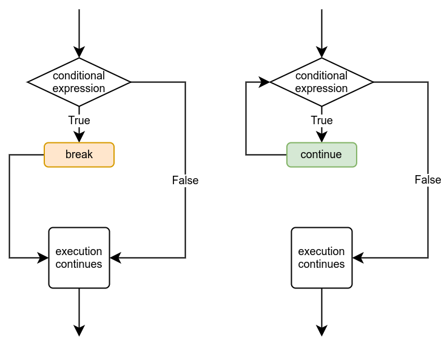

<text-box variant='learningObjectives' name="Learning objectives">

After this section

- You will understand when the `break` command is needed to break out of loops
- You will be able to use the `continue` command to move to the next iteration
- You will understand how nested loops work

</text-box>

## The break command

You have already come across the `break` command. It can be used to stop the execution of a loop immediately. A typical example of where it is used is a situation where the program asks the user for input, and the execution ends only when a specific input is received.

The same functionality can be achieved without the `break` command, using a suitable condition. The two programs below both ask the user to type in numbers, and calculate the sum of the numbers until the user types in -1.

```python
# 1st version using the break command

sum = 0

while True:
    number = int(input("Please type in a number, -1 to exit: "))
    if number == -1:
        break
    sum += number

print (f"The sum is {sum}")
```

```python
# 2nd version without the break command

sum = 0
number = 0

while number != -1:
    number = int(input("Please type in a number, -1 to exit: "))
    if number != -1:
        sum += number

print (f"The sum is {sum}")
```

Both programs print out the same thing with the same inputs, for example:

<sample-output>

Please type in a number, -1 to exit: **2**
Please type in a number, -1 to exit: **4**
Please type in a number, -1 to exit: **5**
Please type in a number, -1 to exit: **3**
Please type in a number, -1 to exit: **-1**
The sum is 14

</sample-output>

So, the two programs are functionally practically identical. However, the first method is often easier, as the condition `number == -1` appears only once, and the variable `number` doesn't have to be initialised outside the loop.

The `break` command and a suitable condition can also be used together in a while loop. For example, the following loop is repeated as long as the sum of the numbers is at most 100, but it also stops if the user types in the number -1.

```python
sum = 0

while sum <= 100:
    number = int(input("Please type in a number, -1 to exit: "))
    if number == -1:
        break
    sum += number

print (f"The sum is {sum}")
```

Some examples of the program's execution:

<sample-output>

Please type in a number, -1 to exit: **15**
Please type in a number, -1 to exit: **8**
Please type in a number, -1 to exit: **21**
Please type in a number, -1 to exit: **-1**
The sum is 44

</sample-output>

<sample-output>

Please type in a number, -1 to exit: **15**
Please type in a number, -1 to exit: **8**
Please type in a number, -1 to exit: **21**
Please type in a number, -1 to exit: **45**
Please type in a number, -1 to exit: **17**
The sum is 106

</sample-output>

In the first example the execution of the loop stops because the user types in the number -1. In the second example it stops because the sum of the numbers exceeds 100.

As always in programming, there are many ways to reach the same functionality. The following program is functionally identical to the above:

```python
sum = 0

while True:
    number = int(input("Please type in a number, -1 to exit: "))
    if number == -1:
        break
    sum += number
    if sum > 100:
        break

print (f"The sum is {sum}")
```
## The continue command

Another way to change the way a loop is executed is the `continue` command. It causes the execution of the loop to jump straight to the beginning of the loop, where the condition of the loop is. Then the execution continues normally with checking the condition:



For example, the following program sums up numbers from input, but it only includes the numbers which are smaller than 10. If the number is 10 or greater, the execution jumps to the beginning of the loop and the number is not added to the sum.

```python
sum = 0

while True:
    number = int(input("Please type in a number, -1 to exit: "))
    if number == -1:
        break
    if number >= 10:
        continue
    sum += number

print (f"The sum is {sum}")
```

<sample-output>

Please type in a number, -1 to exit: **4**
Please type in a number, -1 to exit: **7**
Please type in a number, -1 to exit: **99**
Please type in a number, -1 to exit: **5**
Please type in a number, -1 to exit: **-1**
The sum is 16

</sample-output>

## Nested loops

Just like `if` statements, loops can also be placed inside other loops. For example, the following program uses a loop to ask the user to input numbers. It then uses another loop inside the first one to print a countdown from the given number down to 1:

```python
while True:
    number = int(input("Please type in a number: "))
    if number == -1:
        break
    while number > 0:
        print(number)
        number -= 1
```

<sample-output>

Please type in a number: **4**
4
3
2
1
Please type in a number: **3**
3
2
1
Please type in a number: **6**
6
5
4
3
2
1
Please type in a number: **-1**

</Sample-output>

When there are nested loops, `break` and `continue` commands only affect the innermost loop which they are a part of. The previous example could also be written like this:

```python
while True:
    number = int(input("Please type in a number: "))
    if number == -1:
        break
    while True:
        if number <= 0:
            break
        print(number)
        number -= 1
```

Here the latter `break` command only stops the innermost loop, which is used to print the numbers. 

## More helper variables with loops

We've already used helper variables, which increase or decrease with every iteration of a loop, many times before, so the following program should look quite familiar in structure. The program prints out all even numbers above zero until it reaches a limit set by the user:

```python
limit = int(input("Please type in a number: "))
i = 0
while i < limit:
    print(i)
    i += 2
```

<sample-output>

Please type in a number: **8**
0
2
4
6

</sample-output>

The helper variable `i` is set to 0 before the loop, and it increases by two with every iteration.

Using nested loops sometimes necessitates a separate helper variable for the inner loop. The program below prints out a "number pyramid" based on a number given by the user:

```python
number = int(input("Please type in a number: "))
while number > 0:
    i = 0
    while i < number:
        print(f"{i} ", end="")
        i += 1
    print()
    number -= 1
```

<sample-output>

Please type in a number: **5**
0 1 2 3 4
0 1 2 3
0 1 2
0 1
0

</sample-output>

In this program the outer loop uses the helper variable `number`, which decreases by 1 with each iteration until it reaches 0. The helper variable `i` is set to 0 just before the inner loop is entered, each time the outer loop repeats.

The inner loop uses the helper variable `i`, which increases by 1 with each iteration of the inner loop. The inner loop repeats until `i` is equal to `number`, and prints out each value of `i` on the same line, separated by a space character. When the inner loop finishes, the `print` command in the outer loop starts a new line.

Now remember that with each iteration of the outer loop the value of `number` decreases, so the amount of times the inner loop repeats also decreases. With each repetition the line of numbers gets shorter, and thus we get the pyramid shape.

Nested loops can get confusing fast, but understanding the way they work is essential. You may well find the Python Tutor [visualisation tool](http://www.pythontutor.com/visualize.html#mode=edit) helpful in understanding how this example works. Copy the above code into the code window of the tool and follow the formation of the printout and the changing values of the helper variables as the execution progresses.

<in-browser-programming-exercise name="Multiplication" tmcname="part03-23_multiplication">

Please write a program which asks the user for a positive integer number. The program then prints out a list of multiplication operations until both operands reach the number given by the user. See the examples below for details:

<sample-output>

Please type in a number: 2
1 x 1 = 1
1 x 2 = 2
2 x 1 = 2
2 x 2 = 4

</sample-output>

<sample-output>

Please type in a number: 3
1 x 1 = 1
1 x 2 = 2
1 x 3 = 3
2 x 1 = 2
2 x 2 = 4
2 x 3 = 6
3 x 1 = 3
3 x 2 = 6
3 x 3 = 9

</sample-output>

</in-browser-programming-exercise>


<in-browser-programming-exercise name="First letters of words" tmcname="part03-24_first_letters_of_words">

Please write a program which asks the user to type in a sentence. The program then prints out the first letter of each word in the sentence, each letter on a separate line.

An example of expected behaviour:

<sample-output>

Please type in a sentence: **Humpty Dumpty sat on a wall**
H
D
s
o
a
w

</sample-output>

</in-browser-programming-exercise>

<in-browser-programming-exercise name="Factorial" tmcname="part03-25_factorial">

Please write a program which asks the user to type in an integer number. If the user types in a number equal to or below 0, the execution ends. Otherwise the program prints out the factorial of the number.

The factorial of a number involves multiplying the number by all the positive integers smaller than itself. In other words, it is the product of all positive integers less than or equal to the number. For example, the factorial of 5 is 1 * 2 * 3 * 4 * 5 = 120.

Some examples of expected behaviour:

<sample-output>

Please type in a number: **3**
The factorial of the number 3 is 6
Please type in a number: **4**
The factorial of the number 4 is 24
Please type in a number: **-1**
Thanks and bye!

</sample-output>

<sample-output>

Please type in a number: **1**
The factorial of the number 1 is 1
Please type in a number: **0**
Thanks and bye!

</sample-output>

</in-browser-programming-exercise>

<in-browser-programming-exercise name="Flip the pairs" tmcname="part03-26_flip_the_pairs">

Please write a program which asks the user to type in a number. The program then prints out all the positive integer values from 1 up to the number. However, the order of the numbers is changed so that each pair or numbers is flipped. That is, 2 comes before 1, 4 before 3 and so forth. See the examples below for details.

<sample-output>

Please type in a number: **5**
2
1
4
3
5

</sample-output>

<sample-output>

Please type in a number: **6**
2
1
4
3
6
5

</sample-output>

</in-browser-programming-exercise>

<in-browser-programming-exercise name="Taking turns" tmcname="part03-27_taking_turns">

Please write a program which asks the user to type in a number. The program then prints out the positive integers between 1 and the number itself, alternating between the two ends of the range as in the examples below.

<sample-output>

Please type in a number: **5**
1
5
2
4
3

</sample-output>

<sample-output>

Please type in a number: **6**
1
6
2
5
3
4

</sample-output>

</in-browser-programming-exercise>

<!---
A quiz to review the contents of this section:

<quiz id="b1118ae8-8dd4-563a-b6a5-0c274136535c"></quiz>
-->
