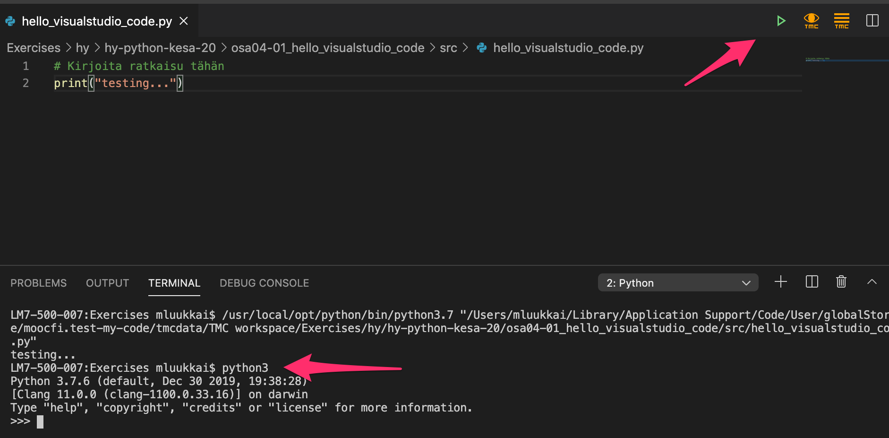
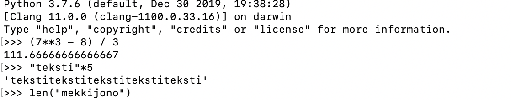
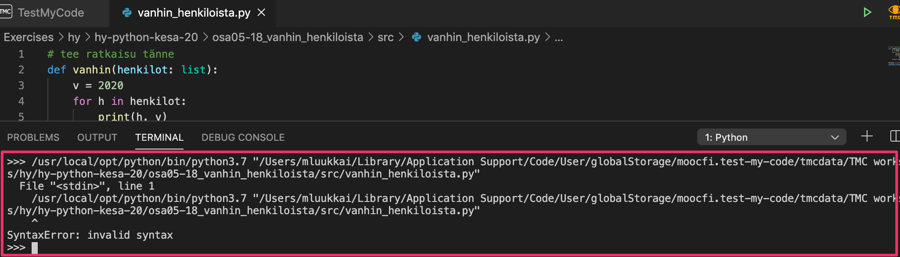
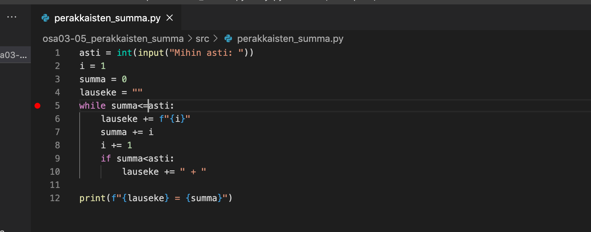
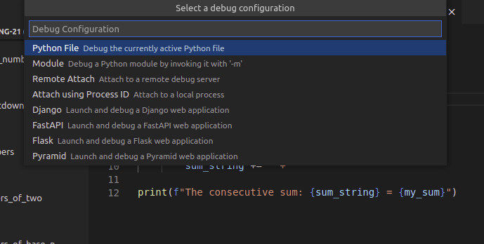
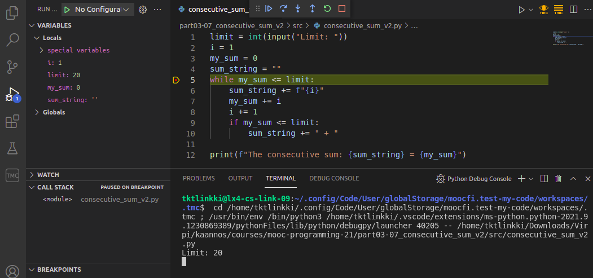
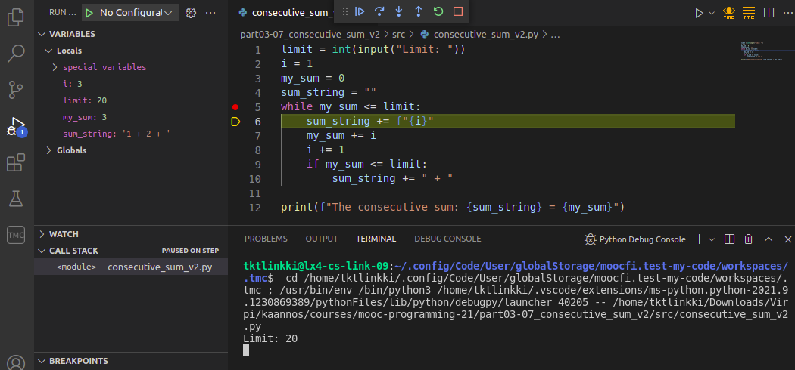
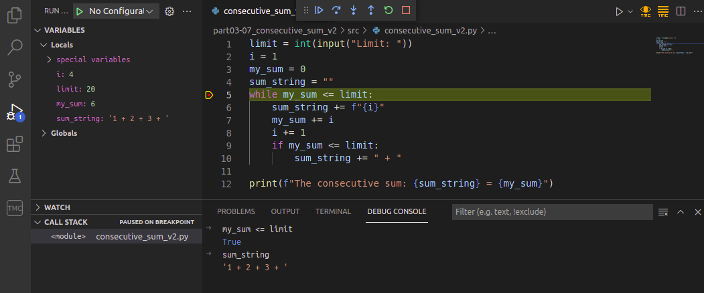

<text-box variant='learningObjectives' name="Learning objectives">

After this section

- You will be equipped to use the Visual Studio Code editor to complete exercises on this course
- You will be familiar with the interactive Python interpreter, and will be able to use it to run code

</text-box>

Thus far all the exercises on this course have been completed directly on the course pages in embedded editor windows. Programming in the browser is very suitable for the very first steps in programming, but now it is time to start using a separate editor especially made for programming.

There are dozens of different editors that are suited to programming. On this course we will use the [Visual Studio Code](https://code.visualstudio.com/) editor, which has been gaining traction in recent years.

Please install the Visual Studio Code editor on your own computer now. You may also need to install Python and the Visual Studio Code plugin for Python. You will also need the TMC plugin, which will take care of running the tests that go with the exercises. In the TMC plugin, select **MOOC** as the organization and **Python Programming 2023** as the course.

[Here is a guide](https://www.mooc.fi/en/installation/vscode) to installing and running all of these. Read the instructions on working on and submitting exercises, and then complete the task below:

<programming-exercise name='Hello Visual Studio Code' tmcname='part04-01_hello_visual_studio_code'>

Please write a program which asks the user which editor they are using. The program should keep on asking until the user types in _Visual Studio Code_.

Have a look at the example of expected behaviour below:

<sample-output>

Editor: **Emacs**
not good
Editor: **Vim**
not good
Editor: **Word**
awful
Editor: **Atom**
not good
Editor: **Visual Studio Code**
an excellent choice!

</sample-output>

If the user types in Word or Notepad, the program counters with _awful_. Other unacceptable editor choices receive the reply _not good_.

The program should be case-insensitive in its reactions. That is, the same user input in lowercase, uppercase or mixed case should trigger the same reaction:

<sample-output>

Editor: **NOTEPAD**
awful
Editor: **viSUal STudiO cODe**
an excellent choice!

</sample-output>

Hint: The simplest way to achieve this is converting all characters to the same case. The Python string method `lower` converts a string to lowercase entirely. An example of its use:

```python
mystring = "Visual Studio CODE"
if "visual studio code" == mystring.lower():
    print("this was the string I was looking for!")
```

**NB:** this exercise doesn't ask you to write any functions, so you should __not__ place any code within an `if __name__ == "__main__"` block. The same applies to any upcoming exercises that don't explicitly ask for functions.

</programming-exercise>

## Executing code

In Visual Studio Code, the easiest way to execute your code is clicking on the triangle in the upper right hand corner. Sometimes it happens that some program is left running in the background, maybe waiting for input from the user or stuck in an infinite loop, without you realising it. You might only notice this when trying to execute the next program, which simply will not run because the previous execution is still hogging up resources. A quick fix is pressing on the keys _Control_+_C_ at the same time, which stops the execution of any ongoing process. The next program should now run fine.

## The interactive Python interpreter

One of the most important tools for any Python programmer is the interactive Python interpreter.

Starting up the interpreter may depend on your platform. In a Linux or Mac system, you can type in `python3` in the terminal. In Windows, the command on the command line might be `python`. Firing up the interpreter on a Mac looks like this:


It is also possible to start the interpreter inside Visual Studio Code. First you should execute a program by clicking on the triangle. This should open a _Terminal_ section on your screen, where you can now type in `python3` (or `python`):



You can also try a browser-based Python interpreter, such as <https://www.python.org/shell/>.

The interpreter is a way of executing Python code line by line as soon as you write it. When you write a line of code and press _Enter_, the interpreter executes the code right away and shows you the results:



Any Python code that can be written in a file can also be written in the interpreter. You can even assign variables and define methods:

```python
>>> t = [1,2,3,4,5]
>>> for number in t:
...   print(number)
...
1
2
3
4
5
>>> def absolute_value(number):
...   if number<0:
...      number = -number
...   return number
...
>>> x = 10
>>> y = -7
>>> absolute_value(number)
Traceback (most recent call last):
  File "<stdin>", line 1, in <module>
NameError: name 'number' is not defined
>>> absolute_value(x)
10
>>> absolute_value(y)
7
>>>
```

The interpreter is best suited to making small checks. For instance, you can try out functions and methods, or check if they exist at all:

```python
>>> "TextYteXt".toupper()
Traceback (most recent call last):
  File "<stdin>", line 1, in <module>
AttributeError: 'str' object has no attribute 'toupper'
>>> "TextYteXt".upper()
'TEXTYTEXT'
>>>
```

If there is a method you need, and you can _almost_ remember its name, it's sometimes faster to skip Google and use the `dir` function in the interpreter. It tells you which methods are available to use on a given object:

```python
>>> dir("this is a string")
['__add__', '__class__', '__contains__', '__delattr__', '__dir__', '__doc__', '__eq__',
'__format__', '__ge__', '__getattribute__', '__getitem__', '__getnewargs__', '__gt__',
'__hash__', '__init__', '__init_subclass__', '__iter__', '__le__', '__len__', '__lt__',
'__mod__', '__mul__', '__ne__', '__new__', '__reduce__', '__reduce_ex__', '__repr__',
'__rmod__', '__rmul__', '__setattr__', '__sizeof__', '__str__', '__subclasshook__',
'capitalize', 'casefold', 'center', 'count', 'encode', 'endswith', 'expandtabs', 'find',
'format', 'format_map', 'index', 'isalnum', 'isalpha', 'isascii', 'isdecimal', 'isdigit',
'isidentifier', 'islower', 'isnumeric', 'isprintable', 'isspace', 'istitle', 'isupper', 'join',
'ljust', 'lower', 'lstrip', 'maketrans', 'partition', 'replace', 'rfind', 'rindex', 'rjust','rpartition', 'rsplit', 'rstrip', 'split', 'splitlines', 'startswith', 'strip', 'swapcase',
'title', 'translate', 'upper', 'zfill']
```

Python strings have a lot of methods available, as you can see above. At this point it might be best to ignore any methods that have underscores in their names, but the rest may well prove useful. Some of them you can figure out by trying them out, and the rest you can search for online.

Python lists don't have quite so many methods:

```python
>>> dir([])
['__add__', '__class__', '__contains__', '__delattr__', '__delitem__', '__dir__', '__doc__',
'__eq__', '__format__', '__ge__', '__getattribute__', '__getitem__', '__gt__', '__hash__',
'__iadd__', '__imul__', '__init__', '__init_subclass__', '__iter__', '__le__', '__len__',
'__lt__', '__mul__', '__ne__', '__new__', '__reduce__', '__reduce_ex__', '__repr__',
'__reversed__', '__rmul__', '__setattr__', '__setitem__', '__sizeof__', '__str__',
'__subclasshook__', 'append', 'clear', 'copy', 'count', 'extend', 'index', 'insert', 'pop',
'remove', 'reverse', 'sort']
>>>
```

Let's try a few of them, `reverse` and `clear` seem promising:

```python
>>> numbers = [1,2,3,4,5]
>>> numbers.reverse()
>>> numbers
[5, 4, 3, 2, 1]
>>> numbers.clear()
>>> numbers
[]
```

As you can see, these methods do pretty much what you would expect based on their names.

Notice how the interpreter doesn't print out anything when you run the command `numbers.reverse()`. This is because the interpreter prints something out only if the line of code has a value. The `reverse()` method here doesn't return any value.

In the above example we printed out the value of the list `numbers` by typing in just the name of the variable. In fact, it is rarely necessary to explicitly type in `print` commands in the interpreter. You can include them if you want to, however.

Remember to close the interpreter when you are finished. The commands `quit()` or `exit()` will close it, as will the key combo _Control_+_D_ (Linux/Mac) or _Control_+_Z_ (Windows). Especially in Visual Studio Code this is important, as trying to execute another Python program while the interpreter is still running results in a rather cryptic error message:



## The built-in debugger

We have already spent a fair amount of time and effort on developing debugging skills, mainly through print statement debugging. The Visual Studio Code editor has another tool at your disposal: a built-in _visual debugger_.

To start debugging, first you have to define a _breakpoint_ in your code. A breakpoint is a point in your program where the debugger halts execution. You can set a breakpoint by clicking on the left edge of any line in your program.

The following example is a slightly faulty attempt at solving the exercise _The sum of consecutive numbers_ in the [previous part](/part-3/1-loops-with-conditions). There is a breakpoint on line 5:



After the breakpoint has been set, choose _Start debugging_ from the _Run_ menu. This opens a list of options, where you should select _Python File_:



This starts the debugger, which executes your code as usual until the execution reaches a breakpoint and halts. If your code asks for input, remember to type that in in the terminal:



On the left there is now the _Variables_ view, which contains the current values of all variables active in the code. You can proceed with the execution line by line by clicking on the down arrow, which is labelled _Step into_.

In the image below the loop in the code has already been repeated a few times:



The debugger has a _Debug console_ tab, which lets you evaluate expressions with the current values stored in the variables. For example, you can check the value of the Boolean expression in the condition of the loop:



You can include several breakpoints in your program code. When execution has halted, you can start it again by clicking on the blue triangle. Execution proceeds until it reaches the next breakpoint.

The built-in visual debugger is a good alternative to debugging print statements. It is up to you which you choose to employ more in the future. Each programmer has their own preferences, but it's always a good idea to try different options before settling on any single solution.
