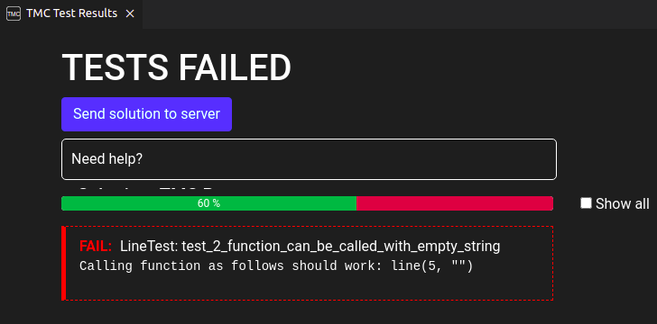
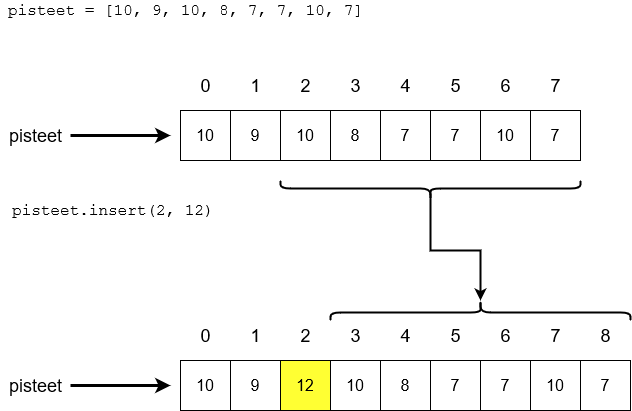

<text-box variant='learningObjectives' name="Learning objectives">

After this section

- You will know more about the arguments and parameters of functions
- You will know how to return values from functions, and how to use the values in your code
- You will be able to add type hints for parameters and return values

</text-box>

Let's quickly recap Python functions. Functions are defined with the keyword `def`:

```python
def message():
    print("This message was brought to you by a function")
```

This function can be called in your program code like this:

```python
message()
```

Your program would then print out

<sample-output>

This message was brought to you by a function

</sample-output>

## The parameters and arguments of a function

A function can take one or more arguments. When the function is called, the arguments are assigned to variables, which are defined in the function definition. These variables are called parameters, and they are listed inside the parentheses after the function name.

In the following code the function `greet` has one parameter defined, while the function `sum` has two.

```python
def greet(name):
    print("Hello there,", name)

def sum(a, b):
    print("The sum of the arguments is", a + b)
```

```python
greet("Emily")
sum(2, 3)
```

<sample-output>

Hello there, Emily
The sum of the arguments is 5

</sample-output>

<text-box variant='hint' name='Formal vs actual, parameter vs argument'>

The terminology around data passed to functions can feel confusing. To make matters worse, some sources refer to what we have called parameters and arguments as _formal_ and _actual parameters_. Other sources call them _formal_ and _actual arguments_. [The Python documentation](https://docs.python.org/3/glossary.html#term-argument) specifies only the terms _argument_ and _parameter_, so that is what we will use as well.

What actually happens when the function call `greet("Emily")` is executed?

In the function definition `greet(name)` the parameter `name` behaves for all intents and purposes just like a normal variable. We can use it within the function just like we have used variables in the many main functions in our programs thus far.

In the function call `greet("Emily")` the argument `"Emily"` is just like any other string we have come across before. For example, we can assign it to a variable.

So, when the function call is executed, the value of the argument, `"Emily"`, is assigned to the parameter variable `name`. For the duration of _this execution_ of the function, `name = "Emily"`. When the function is called with a different argument, the value of `name` will be different.

This terminology may all seem a bit superfluous, but computer science as a discipline does aim to be as exact a science as possible. Using well defined terminology helps.

</text-box>

## Error messages when running tests

Most exercises on this course have automatic tests attached to them. If your program doesn't work as specified in the task, the tests will show an error message, which may or may not be helpful. It is usually worth the trouble to read the error message carefully. 

In some situations the error message might not tell you very much at all. In the next exercise below you may come across this error message:



The message just states that you should be able to call the function `line` with the specified arguments:
```python
line(5, "")
```

The actual issue becomes clear when we try executing the function call specified in the error message. You can do this by copying the function call into your program and clicking on the triangle:



The last lines produced by the execution, highlighted in the above image, tell us that line 4 of our code causes the error _IndexError: string index out of range_. In the [previous part](/part-3/2-working-with-strings) there was a similar example, where we tried to use an index that fell outside the scope of the string. This time the error appears because we are trying to access the first character of an empty string, that is, a string of length 0.

<programming-exercise name='Line' tmcname='part04-02_line'>

Please write a function named `line`, which takes two arguments: an integer and a string. The function prints out a line of text, the length of which is specified by the first argument. The character used to draw the line should be the first character in the second argument. If the second argument is an empty string, the line should consist of stars.

An example of expected behaviour:

```python
line(7, "%")
line(10, "LOL")
line(3, "")
```

<sample-output>

<pre>
%%%%%%%
LLLLLLLLLL
***
</pre>

</sample-output>

</programming-exercise>

## Function calls within function calls

You can call a function from within another function. In fact, we have done so many times before, when we called the `print` function within our own functions in the previous part. Our own functions are functionally no different. In the following example the function `greet_many_times` calls the function `greet` as many times as specified by the argument `times`:

```python
def greet(name):
    print("Hello there,", name)

def greet_many_times(name, times):
    while times > 0:
        greet(name)
        times -= 1

greet_many_times("Emily", 3)
```

<sample-output>

Hello there, Emily
Hello there, Emily
Hello there, Emily

</sample-output>

<programming-exercise name='A box of hashes' tmcname='part04-03_box_of_hashes'>

Please write a function named `box_of_hashes`, which prints out a rectangle of hash characters. The function takes one argument, which specifies the height of the rectangle. The rectangle should be ten characters wide.

The function should call the function `line` from the exercise above for the actual printing out. Copy your solution to that exercise above the code for this exercise. Please don't change anything in your `line` function.

Some examples of how the function should work:

```python
box_of_hashes(5)
print()
box_of_hashes(2)
```

<sample-output>

<pre>
##########
##########
##########
##########
##########

##########
##########
</pre>

</sample-output>

</programming-exercise>

<programming-exercise name='A square of hashes' tmcname='part04-04_square_of_hashes'>

Please write a function named `square_of_hashes`, which draws a square of hash characters. The function takes one argument, which determines the length of the side of the square.

The function should call the function `line` from the exercise above for the actual printing out. Copy your solution to that exercise above the code for this exercise. Please don't change anything in the `line` function.

Some examples:

```python
square_of_hashes(5)
print()
square_of_hashes(3)
```

<sample-output>

<pre>
#####
#####
#####
#####
#####

###
###
###
</pre>

</sample-output>

</programming-exercise>

<programming-exercise name='A square' tmcname='part04-05_square'>

Please write a function named `square`, which prints out a square of characters, and takes two arguments. The first parameter specifies the length of the side of the square. The second parameter specifies the character used to draw the square.

The function should call the function `line` from the exercise above for the actual printing out. Copy your solution to that exercise above the code for this exercise. Please don't change anything in the `line` function.

Some examples:

```python
square(5, "*")
print()
square(3, "o")
```

<sample-output>

<pre>
*****
*****
*****
*****
*****

ooo
ooo
ooo
</pre>

</sample-output>

</programming-exercise>

<programming-exercise name='A triangle' tmcname='part04-06_triangle'>

Please write a function named `triangle`, which draws a triangle of hashes, and takes one argument. The triangle should be as tall and as wide as the value of the argument.

The function should call the function `line` from the exercise above for the actual printing out. Copy your solution to that exercise above the code for this exercise. Please don't change anything in the `line` function.

Some examples:

```python
triangle(6)
print()
triangle(3)
```

<sample-output>

<pre>
#
##
###
####
#####
######

#
##
###
</pre>

</sample-output>

</programming-exercise>

<programming-exercise name='A shape' tmcname='part04-07_shape'>

Please write a function named `shape`, which takes four arguments. The first two parameters specify a triangle, as above, and the character used to draw it. The first parameter also specifies the width of a rectangle, while the third parameter specifies its height. The fourth parameter specifies the filler character of the rectangle. The function prints first the triangle, and then the rectangle below it.

The function should call the function `line` from the exercise above for the actual printing out. Copy your solution to that exercise above the code for this exercise. Please don't change anything in the `line` function.

Some examples:

```python
shape(5, "X", 3, "*")
print()
shape(2, "o", 4, "+")
print()
shape(3, ".", 0, ",")
```

<sample-output>

<pre>
X
XX
XXX
XXXX
XXXXX
*****
*****
*****

o
oo
++
++
++
++

.
..
...
</pre>

</sample-output>

**Hint**

Don't try and solve this exercise "all at once". A good first step would be to make sure you can print the triangle reliably. Then you can try adding the rectangle.

This is one of the most important skills of a programmer: **concentrate on small, tangible sections of the problem at a time**. Solve and verify partial solutions, and use them to build towards a complete solution.

</programming-exercise>

<programming-exercise name='A spruce' tmcname='part04-08_spruce'>

Please write a function named `spruce`, which takes one argument. The function prints out the text `a spruce!`, and the a spruce tree, the size of which is specified by the argument.

Calling `spruce(3)` should print out

<sample-output>

<pre>
a spruce!
  *
 ***
*****
  *
</pre>

</sample-output>

Calling `spruce(5)` should print out

<sample-output>

<pre>
a spruce!
    *
   ***
  *****
 *******
*********
    *
</pre>

</sample-output>

**NB: to the left of the spruce there should be exactly the right amount of whitespace**. If the shape of the spruce looks correct, but the left edge of the tree is not touching the left edge of the text area in the terminal, the tests will not accept the solution.

</programming-exercise>

## The return value of a function

Functions can also return values. For instance, the built-in Python function `input` _returns_ an input string typed in by the user. The value returned by a function can be stored in a variable:

```python
word = input("Please type in a word: ")
```

When you want an integer value from the user, the input from the user has to be converted into an integer. The function we've used for this purpose is `int`, and it also returns a value:

```python
number = int(input("Please type in an integer: "))
```

The function `int` takes the string returned by `input` as its argument, and returns an integer type value, if an integer can be parsed from the string.

## The return statement

The functions you define yourself can also return values. To do this you need the `return` statement. For example, the following function `my_sum` returns the sum of its parameters:

```python
def my_sum(a, b):
    return a + b

result = my_sum(2, 3)

print("Sum:", result)
```

<sample-output>

Sum: 5

</sample-output>

Here's another example of a return value. This function asks for the user's name and returns the string the user types in:

```python
def ask_for_name():
    name = input("What is your name? ")
    return name

name = ask_for_name()
print("Hello there,", name)
```

<sample-output>

What is your name? **Anna**
Hello there, Anna

</sample-output>

The `return` statement ends the execution of the function immediately. The following is a nifty way to create a comparison function:

```python
def smallest(a,b):
    if a < b:
        return a
    return b

print(smallest(3, 7))
print(smallest(5, 2))
```

The idea here is that if `a` is smaller than `b`, the function returns `a` and exits immediately. If not, the execution continues to the next line, where the value `b` is returned. A function can never execute two separate `return` statements with a single function call.

<sample-output>

3
2

</sample-output>

You can make use of the `return` statement even if the function doesn't return a value. It's purpose then is to end the execution of the function:

```python
def greet(name):
    if name == "":
        print("???")
        return
    print("Hello there,", name)

greet("Emily")
greet("")
greet("Mark")
```

If the argument (which gets stored in the variable `name`) is an empty string, the function prints out `???` and exits.

<sample-output>

Hello there, Emily
???
Hello there, Mark

</sample-output>

## Using return values from functions

We already know that the return values of functions can be stored in variables:

```python
def my_sum(a, b):
    return a + b

result = my_sum(4, 6)
print("The sum is", result)
```

<sample-output>

The sum is 10

</sample-output>

The return value of a function is a value just like any other. It is not necessary to store it in a variable in order give it as an argument to the `print` command:

```python
print("The sum is", my_sum(4, 6))
```

The return value of a function can become the argument of another function:

```python
def my_sum(a, b):
    return a+b

def difference(a, b):
    return a-b

result = difference(my_sum(5, 2), my_sum(2, 3))
print("The result is", result)
```

<sample-output>

The result is 2

</sample-output>

In this case the inner function calls `my_sum(5, 2)` and `my_sum(2, 3)` are executed first. The values they return (7 and 5) are used as the arguments of the outer function call.

The outer function call `difference(7, 5)` returns the value 2, which is stored in the variable `result` and printed out.

In summary, values returned by functions work exactly like any other value in Python. They can be printed out, stored in variables, used in expressions and used as arguments in other function calls.

## The difference between return and print

Sometimes the difference between a function _returning_ a value and a _print statement_ within a function can be confusing. Let's have a look at two different ways of implementing a function for working out which of two values is greater:

```python
def max1(a, b):
    if a > b:
        return a
    else:
        return b

def max2(a, b):
    if a > b:
        print(a)
    else:
        print(b)

result = max1(3, 5)
print(result)

max2(7, 2)
```

<sample-output>

5
7

</sample-output>

Both versions seem to be working just fine, as the maximum values are printed correctly. There is a fundamental difference between the two, however. The first of the two functions, `max1`, does not print out anything on its own, but instead it _returns_ the value which is greater. If we execute the following line

```python
max1(3, 5)
```

nothing seems to happen. The return value of the function has to be _used_ in some way in the code which called the function. For instance, it can be store in a variable and printed out:

```python
result = max1(3, 5)
print(result)
```

The second version, `max2`, uses the `print` command _within the function_ to print out the greater value. If we want to see the value, it is enough to call the function

```python
max2(7, 5)
```

and the greater value is printed out. The downside of this handy function is that the value worked out by the function is not available for use in the program which called it. That is why functions which return values are often the better option.

<programming-exercise name='The greatest number' tmcname='part04-09_greatest_number'>

Please write a function named  `greatest_number`, which takes three arguments. The function returns the greatest in value of the three.

An example of how the function is used:

```python
print(greatest_number(3, 4, 1)) # 4
print(greatest_number(99, -4, 7)) # 99
print(greatest_number(0, 0, 0)) # 0
```

</programming-exercise>

<programming-exercise name='Same characters' tmcname='part04-10_same_characters'>

Please write a function named `same_chars`, which takes one string and two integers as arguments. The integers refer to indexes within the string. The function should return `True` if the two characters at the indexes specified are the same. Otherwise, and especially if either of the indexes falls outside the scope of the string, the function returns `False`.

Some examples of how the function is used:

```python
# same characters m and m
print(same_chars("programmer", 6, 7)) # True

# different characters p and r
print(same_chars("programmer", 0, 4)) # False

# the second index is not within the string
print(same_chars("programmer", 0, 12)) # False
```

</programming-exercise>

<programming-exercise name='First, second and last words' tmcname='part04-11_first_second_last'>

Please write three functions: `first_word`, `second_word` and `last_word`. Each function takes a string argument.

As their names imply, the functions return either the first, the second or the last word in the sentence they receive as their string argument.

In each case you may assume the argument string contains at least two separate words, and all words are separated by exactly one space character. There will be no spaces in the beginning or at the end of the argument strings.

```python
sentence = "it was a dark and stormy python"

print(first_word(sentence)) # it
print(second_word(sentence)) # was
print(last_word(sentence)) # python
```

<sample-output>

it
was
python

</sample-output>

```python
sentence = "it was"

print(second_word(sentence)) # was
print(last_word(sentence)) # was
```

</programming-exercise>

## The type of the argument

A quick recap of the data types we've come across so far:

Type          | Python data type | Example
:-------------|:----------------:|------
integer       | `int`            | `23`
floating point number | `float`  | `-0.45`
string        | `str`            | `"Peter Python"`
Boolean value | `bool`           | `True`

When you call a function, it will only work correctly if the arguments you give it are of the right type. Let's have a look at an example:

```python
def print_many_times(message, times):
    while times > 0:
        print(message)
        times -= 1
```

The function works as expected if we call it like this:

```python
print_many_times("Hello there", 5)
```

<sample-output>

Hello there
Hello there
Hello there
Hello there
Hello there

</sample-output>

However, if we give the function an argument of the wrong type, it will not work:

```python
print_many_times("Hello there", "Emily")
```

<sample-output>

TypeError: '>' not supported between instances of 'str' and 'int'

</sample-output>

The problem here is that the second parameter `times` is compared to an integer, `0`, on line 2 of the function definition. The argument given was `"Emily"`, which is a string, not an integer. Strings and integers cannot be compared so simply, so an error ensues.

To avoid issues like this you can include _type hints_ in your function definitions. The type hint specifies the type of the argument intended for the function:

```python
def print_many_times(message : str, times : int):
    while times > 0:
        print(message)
        times -= 1
```

This tells anyone using the function that the argument stored in `message` is supposed to be a string, and the argument stored in `times` is supposed to be an integer.

Similarly, the return value of a function can be hinted at in the function definition:

```python
def ask_for_name() -> str:
    name = input("Mikä on nimesi? ")
    return name
 ```

This tells the user of the function that the function is supposed to return a string.

**NB:** Type hinting is literally just hinting about the type of the argument or the return value. It is not a guarantee of type, and definitely not a safeguard against type errors. If a function receives an argument or returns a value of the wrong type, the function is still executed, but it might not work correctly.

<!---
A quiz to review the contents of this section:

<quiz id="fb289a3b-288a-5a9f-b3d2-07ceae5866ea"></quiz>
-->
