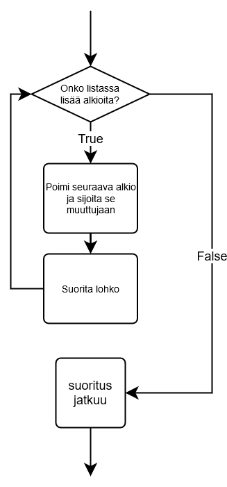

<text-box variant='learningObjectives' name="Learning objectives">

After this section

- You will know what lists are in Python
- You will be able access a specified item within a list
- You will know how to add items to a list, and how to remove them
- You will be familiar with built-in list functions and methods

</text-box>

Thus far in our programs we have stored data with variables, each bit of data usually having its own named variable. This obviously has some limitations, as it can get cumbersome to define separate variables for everything when there is a lot of data to handle. 

A Python _list_ is a collection of values which is accessed via a single variable name. The contents of the list are written within square brackets. The values contained in the list are called _items_, or sometimes _elements_.

The following command creates a new, empty list

```python
my_list = []
```

whereas this command creates a list with five items in it:

```python
my_list = [7, 2, 2, 5, 2]
```

## Accessing items in a list

The items in a list are indexed in exactly the same way as characters in a string. Indexing starts from zero, and the last index is the length of the list minus 1:



A single list item can be accessed just like a single character in a string is accessed, with square brackets:

```python
my_list = [7, 2, 2, 5, 2]

print(my_list[0])
print(my_list[1])
print(my_list[3])

print("The sum of the first two items:", my_list[0] + my_list[1])
```

<sample-output>

7
2
5
The sum of the first two items: 9

</sample-output>

The entire contents of the list can also be printed out:

```python
my_list = [7, 2, 2, 5, 2]
print(my_list)
```

<sample-output>

[7, 2, 2, 5, 2]

</sample-output>

Unlike strings, lists are mutable, which means their contents can change. You can assign a new value to an item within a list, just like you can assign a new value to a variable:

```python
my_list = [7, 2, 2, 5, 2]
print(my_list)
my_list[1] = 3
print(my_list)
```

<sample-output>

[7, 2, 2, 5, 2]
[7, 3, 2, 5, 2]

</sample-output>

The function `len` gives you the number of items in a list:

```python
my_list = [7, 2, 2, 5, 2]
print(len(my_list))
```

<sample-output>

5

</sample-output>


<programming-exercise name='Change the value of an item' tmcname='part04-12_change_value_of_item'>

Please write a program which initialises a list with the values `[1, 2, 3, 4, 5]`. Then the program should ask the user for an index and a new value, replace the value at the given index, and print the list again. This should be looped over until the user gives -1 for the index. You can assume all given index values will fall within your list.

An example execution of the program:

<sample-output>

Index: **0**
New value: **10**
[10, 2, 3, 4, 5]
Index: **2**
New value: **250**
[10, 2, 250, 4, 5]
Index: **4**
New value: **-45**
[10, 2, 250, 4, -45]
Index: **-1**

</sample-output>

**NB:** this exercise doesn't ask you to write any functions, so you should __not__ place any code within an `if __name__ == "__main__"` block.

</programming-exercise>

## Adding items to a list

The `append` method adds items to the end of a list. It works like this:

```python
numbers = []
numbers.append(5)
numbers.append(10)
numbers.append(3)
print(numbers)
```

<sample-output>

[5, 10, 3]

</sample-output>

The following example makes use of two separate lists:

```python
numbers = []
shoe_sizes = []

numbers.append(5)
numbers.append(10)
numbers.append(3)

shoe_sizes.append(37)
shoe_sizes.append(44)
shoe_sizes.append(40)
shoe_sizes.append(28)

print("Numbers:")
print(numbers)

print("Shoe sizes:")
print(shoe_sizes)
```

The item is appended to the list on which the method is called:

<sample-output>

Numbers:
[5, 10, 3]
Shoe sizes:
[37, 44, 40, 28]

</sample-output>

<programming-exercise name='Add items to a list' tmcname='part04-13_add_items_to_list'>

Please write a program which first asks the user for the number of items to be added. Then the program should ask for the given number of values, one by one, and add them to a list in the order they were typed in. Finally, the list is printed out.

An example of expected behaviour:

<sample-output>

How many items: **3**
Item 1: **10**
Item 2: **250**
Item 3: **34**
[10, 250, 34]

</sample-output>

**NB:** this exercise doesn't ask you to write any functions, so you should __not__ place any code within an `if __name__ == "__main__"` block.

</programming-exercise>

## Adding to a specific location

If you want to specify a location in the list where an item should be added, you can use the `insert` method. The method adds an item at the specified index. All the items already in the list with an index equal to or higher than the specified index are moved one index further, "to the right":


So, for instance this program

```python
numbers = [1, 2, 3, 4, 5, 6]
numbers.insert(0, 10)
print(numbers)
numbers.insert(2, 20)
print(numbers)
```

prints out this:

<sample-output>

[10, 1, 2, 3, 4, 5, 6]
[10, 1, 20, 2, 3, 4, 5, 6]

</sample-output>

## Removing items from a list

There are two different approaches to removing an item from a list:

* If the _index_ of the item is known, you can use the method `pop`.
* If the _contents_ of the item are known, you can use the method `remove`.

So, the method `pop` takes the index of the item you want to remove as its argument. The following program removes items at indexes 2 and 3 from the list. Notice how the indexes of the remaining items change when one is removed.

```python
my_list = [1, 2, 3, 4, 5, 6]

my_list.pop(2)
print(my_list)
my_list.pop(3)
print(my_list)
```

<sample-output>

[1, 2, 4, 5, 6]
[1, 2, 4, 6]

</sample-output>

It's useful to remember that the method `pop` also _returns_ the removed item:

```python
my_list = [4, 2, 7, 2, 5]

number = my_list.pop(2)
print(number)
print(my_list)
```

<sample-output>

7
[4, 2, 2, 5]

</sample-output>

The method `remove`, on the other hand, takes the value of the item to be removed as its argument. For example, this program

```python
my_list = [1, 2, 3, 4, 5, 6]

my_list.remove(2)
print(my_list)
my_list.remove(5)
print(my_list)
```

prints out this:

<sample-output>

[1, 3, 4, 5, 6]
[1, 3, 4, 6]

</sample-output>

The method removes the _first_ occurrence of the value in the list, much like the string function `find` returns the first occurrence of a substring:

```python
my_list = [1, 2, 1, 2]

my_list.remove(1)
print(my_list)
my_list.remove(1)
print(my_list)
```

<sample-output>

[2, 1, 2]
[2, 2]

</sample-output>

<programming-exercise name='Addition and removal' tmcname='part04-14_addition_and_removal'>

Please write a program which asks the user to choose between addition and removal. Depending on the choice, the program _adds an item to_ or _removes an item from_ the end of a list. The item that is added must always be one greater than the last item in the list. The first item to be added must be 1.

The list is printed out in the beginning and after each operation. Have a look at the example execution below:

<sample-output>

The list is now []
a(d)d, (r)emove or e(x)it: **d**
The list is now [1]
a(d)d, (r)emove or e(x)it: **d**
The list is now [1, 2]
a(d)d, (r)emove or e(x)it: **d**
The list is now [1, 2, 3]
a(d)d, (r)emove or e(x)it: **r**
The list is now [1, 2]
a(d)d, (r)emove or e(x)it: **d**
The list is now [1, 2, 3]
a(d)d, (r)emove or e(x)it: **x**
Bye!

</sample-output>

You may assume that, if the list is empty, there will not be an attempt to remove items.

**NB:** this exercise doesn't ask you to write any functions, so you should __not__ place any code within an `if __name__ == "__main__"` block.

</programming-exercise>

If the specified item is not in the list, the `remove` function causes an error. Just like with strings, we can check for the presence of an item with the `in` operator:

```python
my_list = [1, 3, 4]

if 1 in my_list:
    print("The list contains item 1")

if 2 in my_list:
    print("The list contains item 2")
```

<sample-output>

The list contains item 1

</sample-output>

<programming-exercise name='Same word twice' tmcname='part04-15_same_word_twice'>

Please write a program which asks the user for words. If the user types in a word for the second time, the program should print out the number of different words typed in, and exit.

<sample-output>

Word: **once**
Word: **upon**
Word: **a**
Word: **time**
Word: **upon**
You typed in 4 different words

</sample-output>

**NB:** this exercise doesn't ask you to write any functions, so you should __not__ place any code within an `if __name__ == "__main__"` block.

</programming-exercise>

## Sorting lists

The items in a list can be _sorted_ from smallest to greatest with the method `sort`.

```python
my_list = [2,5,1,2,4]
my_list.sort()
print(my_list)
```

<sample-output>

[1, 2, 2, 4, 5]

</sample-output>

Notice how the method modifies the list itself. Sometimes we don't want to change the original list, so we use the function `sorted` instead. It _returns_ a sorted list:

```python
my_list = [2,5,1,2,4]
print(sorted(my_list)))
```

<sample-output>

[1, 2, 2, 4, 5]

</sample-output>

Remember the difference between the two: `sort` changes the order of the original list in place, whereas `sorted` creates a new, ordered copy of the list. With `sorted` we can preserve the original order of the list:

```python
original = [2, 5, 1, 2, 4]
in_order = sorted(original)
print(original)
print(in_order)
```

<sample-output>

[2, 5, 1, 2, 4]
[1, 2, 2, 4, 5]

</sample-output>

<programming-exercise name='List twice' tmcname='part04-16_list_twice'>

Please write a program which asks the user to type in values and adds them to a list. After each addition, the list is printed out in two different ways:
- in the order the items were added
- ordered from smallest to greatest

The program exits when the user types in 0.

An example of expected behaviour:

<sample-output>

New item: **3**
The list now: [3]
The list in order: [3]
New item: **1**
The list now: [3, 1]
The list in order: [1, 3]
New item: **9**
The list now: [3, 1, 9]
The list in order: [1, 3, 9]
New item: **5**
The list now: [3, 1, 9, 5]
The list in order: [1, 3, 5, 9]
New item: **0**
Bye!

</sample-output>

**NB:** this exercise doesn't ask you to write any functions, so you should __not__ place any code within an `if __name__ == "__main__"` block.

</programming-exercise>

## Maximum, minimum and sum

The functions `max` and `min`, short for maximum and minimum, return the greatest and smallest item in a list, respectively. The function `sum` returns the sum of all items in a list.

```python
my_list = [5, 2, 3, 1, 4]

greatest = max(my_list))
smallest = min(my_list))
list_sum = sum(my_list))

print("Smallest:", smallest)
print("Greatest:", greatest)
print("Sum:", list_sum)
```

<sample-output>

Smallest: 1
Greatest: 5
Sum: 15

</sample-output>

## Methods vs functions

There are two different ways of processing lists in Python, which can get confusing. For the most part you will use list _methods_, such as `append` and `sort`. They are used with the dot `.` operator on the list variable:

```python
my_list = []

# method calls
my_list.append(3)
my_list.append(1)
my_list.append(7)
my_list.append(2)

# another method call
my_list.sort()
```

Some _functions_ are happy to take a list as an argument. Above we saw the functions `max`,  `min`, `len` and `sorted` do just that:

```python
my_list = [3, 2, 7, 1]

# function calls take the list as an argument
greatest = max(my_list))
smallest = min(my_list))
length = len(my_list))

print("Smallest:", smallest)
print("Greatest:", greatest)
print("Length of the list:", length)

# another function call 
# the list itself is an argument, the function returns a sorted copy
in_order = sorted(my_list))
print(in_order)
```

<sample-output>

Smallest: 1
Greatest: 7
Length of the list: 4
[1, 2, 3, 7]

</sample-output>

## A list as an argument or a return value

Just like the built-in functions above, our own functions can also take a list as an argument and produce a list as a return value. The following function works out the central value in an ordered list, also called the _median_ value:

```python
def median(my_list: list):
    ordered = sorted(my_list))
    list_centre = len(ordered) // 2
    return ordered[list_centre]
```

The function creates an ordered version of the list given as an argument and returns the item in the very middle. Notice the integer division operator `//` used here. The index of a list should always be an integer.

The function works like this:

```python
shoe_sizes = [45, 44, 36, 39, 40]
print("The median of the shoe sizes is", median(shoe_sizes))

ages = [1, 56, 34, 22, 5, 77, 5]
print("The median of the ages is", median(ages))
```

<sample-output>

The median of the shoe sizes is 40
The median of the ages is 22

</sample-output>

A function can also return a list. The following function asks the user to type in integers and returns the input as a list:

```python
def input_numbers():
    numbers = []
    while True:
        user_input = input("Please type in an integer, leave empty to exit: ")
        if len(user_input) == 0:
            break
        numbers.append(int(user_input))
    return numbers
```

The function makes use of a helper variable `numbers`, which is a list. All the numbers typed in by the user are added to the list. When the loop is exited from, the function returns the list with the statement `return numbers`.

Calling the function like this

```python 
numbers = input_numbers()

print("The greatest number is", max(numbers))
print("The median of the numbers is", median(numbers))
```

could print this, for example:

<sample-output>

Please type in an integer, leave empty to exit: **5**
Please type in an integer, leave empty to exit: **-22**
Please type in an integer, leave empty to exit: **4**
Please type in an integer, leave empty to exit: **35**
Please type in an integer, leave empty to exit: **1**
Please type in an integer, leave empty to exit:
The greatest number is 35
The median of the numbers is 4

</sample-output>

This small example demonstrates one of the most important uses of functions: they can help you divide your code into smaller, easily understandable and logical wholes.

Of course the same functionality could be achieved without writing any of our own functions:

```python
numbers = []
while True:
    user_input = input("Please type in an integer, leave empty to exit: ")
    if len(user_input) == 0:
        break
    numbers.append(int(user_input))

ordered = sorted(numbers)
list_centre = len(ordered) // 2
median = ordered[list_centre]

print("The greatest number is", max(numbers))
print("The median of the numbers is", median)
```

In this version, following the programming logic is more difficult, as it is no longer clear which commands are a part of which functionality. The code fulfils the same purposes - reading in input, calculating the median value, and so on - but the structure is less clear.

Organising your code into separate functions will improve you program's readability, but also make it easier to handle logical wholes. This in turn helps you that verify the program works as intended, as each function can be tested separately.

Another important use for functions is making code _reusable_. If you need to achieve some functionality twice is your program, it is a good idea to create your own function and name it appropriately:

```python
print("Shoe sizes:")
shoe_sizes = input_numbers()

print("Weights:")
weights = input_numbers()

print("Heights:")
heights = input_numbers()
```

<programming-exercise name='The length of a list' tmcname='part04-17_length_of_list'>

Please write a function named `length` which takes a list as its argument and returns the length of the list.

```python
my_list = [1, 2, 3, 4, 5]
result = length(my_list))
print("The length is", result)

# the list given as an argument doesn't need to be stored in any variable
result = length([1, 1, 1, 1])
print("The length is", result)
```

<sample-output>

The length is 5
The length is 4

</sample-output>

</programming-exercise>

<programming-exercise name='Arithmetic mean' tmcname='part04-18_mean'>

Please write a function named `mean`, which takes a list of integers as an argument. The function returns the arithmetic mean of the values in the list.

```python
my_list = [1, 2, 3, 4, 5]
result = mean(my_list))
print("mean value is", result)
```

<sample-output>

mean value is 3.0

</sample-output>

</programming-exercise>

<programming-exercise name='The range of a list' tmcname='part04-19_range_of_list'>

Please write a function named  `range_of_list`, which takes a list of integers as an argument. The function returns the difference between the smallest and the largest value in the list.


```python
my_list = [1, 2, 3, 4, 5]
result = range_of_list(my_list))
print("The range of the list is", result)
```

<sample-output>

The range of the list is 4

</sample-output>

</programming-exercise>


There are many more ways to use lists in Python. The Python [documentation](https://docs.python.org/3/tutorial/datastructures.html) is a good place to start if you want to know more.

<!---
A quiz to review the contents of this section:

<quiz id="4849cd69-1938-5f4f-8805-8445f0f5c015"></quiz>
-->
