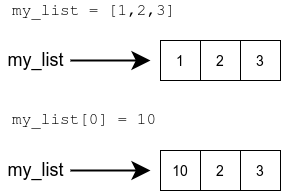

<text-box variant='learningObjectives' name="Learning objectives">

After this section

- You will know the difference between definite and indefinite iteration 
- You will know how a Python `for` loop works
- You will be able to use a `for` loop to iterate through lists and strings

</text-box>

You can use a `while` loop to go through the items in a list, just like we used while loops to go through strings. The following program prints out the items in the list, each on a separate line:

```python
my_list = [3, 2, 4, 5, 2]

index = 0
while index < len(my_list):
    print(my_list[index])
    index += 1
```

<sample-output>

3
2
4
5
2

</sample-output>

This obviously works, but it is a rather complicated way of going through a list, as you have to use a helper variable `index` to remember which item in the list you're at. Fortunately, Python offers a more intuitive way of traversing through lists, strings and other similar structures.

## The for loop

When you want to go through some ready collection of items, the Python `for` loop will do this for you. For instance, the loop can go through all items in a list from first to last.

When using a `while` loop the program doesn't "know" beforehand how many iterations the loop will perform. It will repeat until the condition becomes false, or the loop is otherwise broken out of. That is why it falls under _indefinite iteration_. With a for loop the number of iterations is determined when the loop is set up, and so it falls under _definite iteration_.

The idea is that the `for` loop takes the items in the collection one by one and performs the same actions on each. The programmer does not have to worry about which item is being handled when. The syntax of the for loop is as follows:

```python
for <variable> in <collection>:
    <block>
```

The `for` loop takes an item in the collection, assigns it to the variable, processes the block of code, and moves on to the next item. When all items in the collection have been processed, execution of the program continues from the line after the loop.



The following program prints out all the items in a list using a `for` loop:

```python
my_list = [3, 2, 4, 5, 2]

for item in my_list:
    print(item)
```

<sample-output>

3
2
4
5
2

</sample-output>

Compared to the example at the beginning of this section, the structure is much easier to understand. A `for` loop makes straightforward traversal through a collection of items very simple.

The same principle applies to characters in a string:

```python
name = input("Please type in your name: ")

for character in name:
    print(character)
```

<sample-output>

Please type in your name: **Grace**
G
r
a
c
e

</sample-output>

<programming-exercise name='Star-studded' tmcname='part04-20_star_studded'>

Please write a program which asks the user to type in a string. The program then prints each input character on a separate line. After each character there should be a star (*) printed on its own line.

This is how it should work:

<sample-output>

Please type in a string: **Python**
P
*
y
*
t
*
h
*
o
*
n
*

</sample-output>

**NB:** this exercise doesn't ask you to write any functions, so you should __not__ place any code within an `if __name__ == "__main__"` block.

</programming-exercise>

## The function `range`

Often you know how many times you want to repeat a certain bit of code. You might, for example, wish to go through all the numbers between 1 and 100. The `range` function plugged into a `for` loop will do this for you.

There are a few different ways to call the range function. The simplest way is to give the function just one argument, which signifies the end-point of the range. The end-point itself is excluded, just like with string slices. In other words, the function call `range(n)` provides a loop with a range from 0 to `n-1`:

```python
for i in range(5):
    print(i)
```

<sample-output>

0
1
2
3
4

</sample-output>

With two arguments, the function will return a range between the two numbers. The function `range(a,b)` provides a range starting from `a` and ending at `b-1`:

```python
for i in range(3, 7):
    print(i)
```

<sample-output>

3
4
5
6

</sample-output>

Finally, with a third argument you can also specify the size of the _step_ the range takes between each value. The function call `range(a, b, c)` provides a range starting from `a`, ending at `b-1`, and changing by `c` with every step:

```python
for i in range(1, 9, 2):
    print(i)
```

<sample-output>

1
3
5
7

</sample-output>

A step can also be negative. Then the range will be in reversed orded. Notice the first two arguments are also flipped here:

```python
for i in range(6, 2, -1):
    print(i)
```

<sample-output>

6
5
4
3

</sample-output>

<programming-exercise name='From negative to positive' tmcname='part04-21_negative_to_positive'>

Please write a program which asks the user for a positive integer N. The program then prints out all numbers between -N and N inclusive, but _leaves out the number 0_. Each number should be printed on a separate line.

An example of expected behaviour:

<sample-output>

Please type in a positive integer: **4**
-4
-3
-2
-1
1
2
3
4

</sample-output>

**NB:** this exercise doesn't ask you to write any functions, so you should __not__ place any code within an `if __name__ == "__main__"` block.

</programming-exercise>

## From a range to a list

The function `range` returns a range object, which in many ways behaves like a list, but isn't actually one. If you try printing out the value the function returns, you will only see a description of a range object:

```python
numbers = range(2, 7)
print(numbers)
```

<sample-output>

range(2, 7)

</sample-output>

The function `list` will convert a range into a list. The list will contain all the values that are in the range. The Advanced Course in Programming course, which follows this one, will shed more light on this subject.

```python
numbers = list(range(2, 7))
print(numbers)
```

<sample-output>

[2, 3, 4, 5, 6]

</sample-output>

## A reminder of the demands of the automatic tests

So far, when the exercises have asked you to write functions, the templates have looked like this:

```python
# Write your solution here
# You can test your function by calling it within the following block
if __name__ == "__main__":
    sentence = "it was a dark and stormy python"
    print(first_word(sentence))
    print(second_word(sentence))
    print(last_word(sentence))
```

From now on there will be no more reminders in the templates to use the `if __name__ == "__main__"` block. However, the automatic tests will still demand its use, so you will have to add the block yourself when you test your function within the main function of your program.

**NB:** some exercises, like the _Palindromes_ exercise coming up in this section, expect you to also write code which calls the function you wrote. This code should _not_ be placed within an `if __name__ == "__main__"` block. The automatic tests will not execute any code within that block, so your solution will not be complete if you place your function calls there.

<programming-exercise name='List of stars' tmcname='part04-22_list_of_stars'>

Please write a function named `list_of_stars`, which takes a list of integers as its argument. The function should print out lines of star characters. The numbers in the list specify how many stars each line should contain.

For example, with the function call `list_of_stars([3, 7, 1, 1, 2])` the following should be printed out:

<sample-output>

<pre>
***
*******
*
*
**
</pre>

</sample-output>

<!-- **Huomaa** että tällä hetkellä Windowsissa on ongelmia joidenkin tehtävien testien suorittamisessa. Jos törmäät seuraavaan virheilmoitukseen


voit suorittaa testit lähettämällä ne palvelimelle valitsemalla testien suoritusnapin oikealla puolella olevasta symbolista avautuvasta TMC-valikosta _Submit solutions_.

Ongelman saa korjattua menemällä laajennuksen asennusvalikkoon ja muuttamalla "TMC Data" -kohdassa tehtävien sijainnin johonkin toiseen sijaintiin, jonka tiedostopolku on lyhempi, allaolevassa kuvassa nappi _change path_. Siirrossa saattaa kestää hetken, joten odotathan operaation päättymistä.


Ongelmaan pyritään saamaan parempi ratkaisu lähipäivinä. -->

</programming-exercise>

<programming-exercise name='Anagrams' tmcname='part04-23_anagrams'>

Please write a function named `anagrams`, which takes two strings as arguments. The function returns `True` if the strings are anagrams of each other. Two words are anagrams if they contain exactly the same characters.

Some examples of how the function should work:

```python
print(anagrams("tame", "meta")) # True
print(anagrams("tame", "mate")) # True
print(anagrams("tame", "team")) # True
print(anagrams("tabby", "batty")) # False
print(anagrams("python", "java")) # False
```

Hint: the function `sorted` can be used on strings as well.

</programming-exercise>

<programming-exercise name='Palindromes' tmcname='part04-24_palindromes'>

Please write a function named `palindromes`, which takes a string argument and returns `True` if the string is a palindrome. Palindromes are words which are spelled exactly the same backwards and forwards.

Please also write a main function which asks the user to type in words until they type in a palindrome:

<sample-output>

Please type in a palindrome: **python**
that wasn't a palindrome
Please type in a palindrome: **java**
that wasn't a palindrome
Please type in a palindrome: **oddoreven**
that wasn't a palindrome
Please type in a palindrome: **neveroddoreven**
neveroddoreven is a palindrome!

</sample-output>

**NB:**, the main function **should not be** within an `if __name__ == "__main__":` block

</programming-exercise>

<programming-exercise name='The sum of positive numbers' tmcname='part04-25_sum_of_positives'>

Please write a function named `sum_of_positives`, which takes a list of integers as its argument. The function returns the sum of the positive values in the list.

```python
my_list = [1, -2, 3, -4, 5]
result = sum_of_positives(my_list)
print("The result is", result)
```

<sample-output>

The result is 9

</sample-output>

</programming-exercise>

In these exercises we will be using lists as arguments and return values. This was covered in the [previous section](/part-4/3-lists#a-list-as-an-argument-or-a-return-value), if you need a refresher.

<programming-exercise name='Even numbers' tmcname='part04-26_even_numbers'>

Please write a function named `even_numbers`, which takes a list of integers as an argument. The function returns a new list containing the even numbers from the original list.

```python
my_list = [1, 2, 3, 4, 5]
new_list = even_numbers(my_list)
print("original", my_list)
print("new", new_list)
```

<sample-output>

original [1, 2, 3, 4, 5]
new [2, 4]

</sample-output>

</programming-exercise>

<programming-exercise name='The sum of lists' tmcname='part04-27_sum_of_lists'>

Please write a function named `list_sum` which takes two lists of integers as arguments. The function returns a new list which contains the sums of the items at each index in the two original lists. You may assume both lists have the same number of items. 

An example of the function at work:

```python
a = [1, 2, 3]
b = [7, 8, 9]
print(list_sum(a, b)) # [8, 10, 12]
```

</programming-exercise>

<programming-exercise name='Distinct numbers' tmcname='part04-28_distinct_numbers'>

Please write a function named `distinct_numbers`, which takes a list of integers as its argument. The function returns a new list containing the numbers from the original list in order of magnitude, and so that each distinct number is present only once.

```python
my_list = [3, 2, 2, 1, 3, 3, 1]
print(distinct_numbers(my_list)) # [1, 2, 3]
```

</programming-exercise>

## Finding the best or the worst item in a list

A very common programming task is finding the best or worst item in a list, according to some criteria. A simple solution is using a helper variable to "remember" which of the items processed so far was the most suitable. This temporary best choice is then compared to each item in turn, and at the end of the iteration the variable contains the best of the bunch.

A rough draft which doesn't quite compile yet:

```python
best = initial_value # The initial value depends on the situation
for item in my_list:
    if item is better than best:
        best = item

# We now have the best one figured out!
```

The details of the final program code depend on the type of the items in the list, and also on the criteria for choosing the best (or worst) item. Sometimes you may need more than one helper variable.

Let's practice this method a little.

<programming-exercise name='The length of the longest in the list' tmcname='part04-29_length_of_longest'>

Please write a function named `length_of_longest`, which takes a list of strings as its argument. The function returns the length of the longest string.

```python
my_list = ["first", "second", "fourth", "eleventh"]

result = length_of_longest(my_list)
print(result)
```

```python
my_list = ["adele", "mark", "dorothy", "tim", "hedy", "richard"]

result = length_of_longest(my_list)
print(result)
```

<sample-output>

8
7

</sample-output>

</programming-exercise>

<programming-exercise name='The shortest in the list' tmcname='part04-30_shortest_in_list'>

Please write a function named `shortest`, which takes a list of strings as its argument. The function returns whichever of the strings is the shortest. If more than one are equally short, the function can return any of the shortest strings (there will be no such situation in the tests). You may assume there will be no empty strings in the list.


```python
my_list = ["first", "second", "fourth", "eleventh"]

result = shortest(my_list)
print(result)
```

```python
my_list = ["adele", "mark", "dorothy", "tim", "hedy", "richard"]

result = shortest(my_list)
print(result)
```

<sample-output>

first
tim

</sample-output>

</programming-exercise>

<programming-exercise name='All the longest in the list' tmcname='part04-31_all_longest_in_list'>

Please write a function named `all_the_longest`, which takes a list of strings as its argument. The function should return a new list containing the longest string in the original list. If more than one are equally long, the function should return all of the longest strings.

The order of the strings in the returned list should be the same as in the original.

```python
my_list = ["first", "second", "fourth", "eleventh"]

result = all_the_longest(my_list)
print(result) # ['eleventh']
```

```python
my_list = ["adele", "mark", "dorothy", "tim", "hedy", "richard"]

result = all_the_longest(my_list)
print(result) # ['dorothy', 'richard']
```

</programming-exercise>

<!---
A quiz to review the contents of this section:

<quiz id="b1a91143-3137-5833-a771-6801f541a43b"></quiz>
-->
