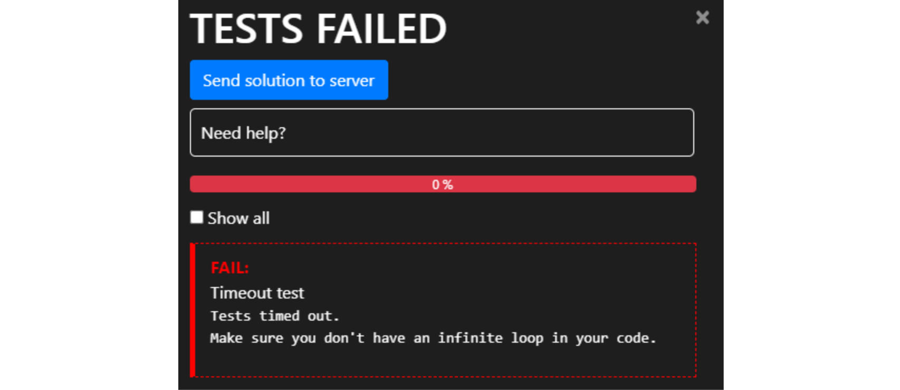

<text-box variant='learningObjectives' name="Learning objectives">

After this section

- You will be familiar with more methods for slicing strings and lists
- You will understand what immutability of strings means
- You will be able to use the methods `count` and `replace`

</text-box>

You are already familiar with the `[]` syntax for accessing a part of a string:

```python
my_string = "exemplary"
print(my_string[3:7])
```

<sample-output>

mpla

</sample-output>

The same syntax works with lists. Lists can be sliced just like strings:

```python
my_list = [3,4,2,4,6,1,2,4,2]
print(my_list[3:7])
```

<sample-output>

[4, 6, 1, 2]

</sample-output>

## More slices

In fact, the `[]` syntax works very similarly to the `range` function, which means we can also give it a step:

```python
my_string = "exemplary"
print(my_string[0:7:2])
my_list = [1,2,3,4,5,6,7,8]
print(my_list[6:2:-1])
```

<sample-output>

eepa
[7, 6, 5, 4]

</sample-output>

If we omit either of the indexes, the operator defaults to including everything. Among other things, this allows us to write a very short program to reverse a string:

```python
my_string = input("Please type in a string: ")
print(my_string[::-1])
```

<sample-output>

Please type in a string: **exemplary**
yralpmexe

</sample-output>

<!--a similar warning is in sections 3-4, 4-6 and 5-1, check them all if you're changing this-->
## Warning: using global variables within functions

We know it is possible to assign new variables within function definitions, but the function can also see variables assigned outside it, in the main function. Such variables are called _global_ variables.

Using global variables from within functions is usually a bad idea. Among other issues, doing so may cause bugs which are difficult to trace.

Below is an example of a function which uses a global variable "by mistake":

```python
def print_reversed(names: list):
    # using the global variable instead of the parameter by accident
    i = len(name_list) - 1
    while i >= 0:
        print(name_list[i])
        i -= 1

# here the global variable is assigned
name_list = ["Steve", "Jean", "Katherine", "Paul"]
print_reversed(name_list)
print()
print_reversed(["Huey", "Dewey", "Louie"])
```

<sample-output>

Paul
Katherine
Jean
Steve

Paul
Katherine
Jean
Steve

</sample-output>

Even though both function calls have the right kind of argument, the function always prints out what is stored in the global variable `name_list`.

To make matters even more muddled, remember that all code for testing your functions should be placed within the `if __name__ == "__main__":` block for the automatic tests. The previous example should be modified:

```python
def print_reversed(names: list):
    # using the global variable instead of the parameter by accident
    i = len(name_list) - 1
    while i>=0:
        print(name_list[i])
        i -= 1

# All the code for testing the function should be within this block
if __name__ == "__main__":
    # here the global variable is assigned
    name_list = ["Steve", "Jean", "Katherine", "Paul"]
    print_reversed(name_list)
    print()
    print_reversed(["Huey", "Dewey", "Louie"])
```

Notice the global variable is assigned within the `if` block now.

The automatic tests in the TMC system are executed without running any of the code in the `if` block. So, in this latter example the function wouldn't even theoretically work, since it refers to the variable `name_list`, which doesn't exist at all when the tests are executed.

<programming-exercise name='Everything reversed' tmcname='part04-33_everything_reversed'>

Please write a function named `everything_reversed`, which takes a list of strings as its argument. The function returns a new list with all of the items on the original list reversed. Also the order of items should be reversed on the new list.

An example of how the function should work:

```python
my_list = ["Hi", "there", "example", "one more"]
new_list = everything_reversed(my_list)
print(new_list)
```

<sample-output>

['erom eno', 'elpmaxe', 'ereht', 'iH']

</sample-output>

</programming-exercise>

## Strings are immutable

Strings and lists have a lot in common, especially in the way they behave with different operators. The main difference is that strings are _immutable_. That means they cannot be changed.

```python
my_string = "exemplary"
my_string[0] = "a"
```

Strings cannot be changed, so the execution of this program causes an error:

<sample-output>

TypeError: 'str' object does not support item assignment

</sample-output>

A similar error follows if you try to sort a string with the `sort` method.

Strings themselves are immutable, but the variables holding them are not. A string can be replaced by another string.

The following two examples are thus fundamentally different:

```python
my_list = [1,2,3]
my_list[0] = 10
```


```python
my_string = "Hey"
my_string = my_string + "!"
```


The first example changes the contents of the referenced list. The second example replaces the reference to the original string with a reference to another string. The original string is still somewhere in computer memory, but there is no reference to it, and it cannot be used in the program any longer.

We will return to this subject in the next part, where references to lists are explored in more detail.

## More methods for lists and strings

The method `count` counts the number of times the specified item or substring occurs in the target. The method works similarly with both strings and lists:

```python
my_string = "How much wood would a woodchuck chuck if a woodchuck could chuck wood"
print(my_string.count("ch"))

my_list = [1,2,3,1,4,5,1,6]
print(my_list.count(1))
```

<sample-output>

5
3

</sample-output>

The method will not count overlapping occurrences. For example, in the string `aaaa` the method counts only two occurrences of the substring `aa`, even though there would actually be three if overlapping occurrences were allowed.

The method `replace` creates a new string, where a specified substring is replaced with another string:

```python
my_string = "Hi there"
new_string = my_string.replace("Hi", "Hey")
print(new_string)
```

<sample-output>

Hey there

</sample-output>

The method will replace all occurrences of the substring:

```python
sentence = "sheila sells seashells on the seashore"
print(sentence.replace("she", "SHE"))
```

<sample-output>

SHEila sells seaSHElls on the seashore

</sample-output>

When using the `replace` method, a typical mistake is forgetting that strings are immutable:

```python
my_string = "Python is fun"

# Replaces the substring but doesn't store the result...
my_string.replace("Python", "Java")
print(my_string)
```

<sample-output>

Python is fun

</sample-output>

If the old string is no longer needed, the new string can be assigned to the same variable:

```python
my_string = "Python is fun"

# Replaces the substring and stores the result in the same variable
my_string = my_string.replace("Python", "Java")
print(my_string)
```

<sample-output>

Java is fun

</sample-output>

<programming-exercise name='Most common character' tmcname='part04-34_most_common_character'>

Please write a function named `most_common_character`, which takes a string argument. The function returns the character which has the most occurrences within the string. If there are many characters with equally many occurrences, the one which appears first in the string should be returned.

An example of expected behaviour:

```python
first_string = "abcdbde"
print(most_common_character(first_string))

second_string = "exemplaryelementary"
print(most_common_character(second_string))
```

<sample-output>

b
e

</sample-output>

</programming-exercise>


<programming-exercise name='No vowels allowed' tmcname='part04-35_no_vowels_allowed'>

Please write a function named `no_vowels`, which takes a string argument. The function returns a new string, which should be the same as the original but with all vowels removed.

You can assume the string will contain only characters from the lowercase English alphabet a...z.

An example of expected behaviour:

```python
my_string = "this is an example"
print(no_vowels(my_string))
```

<sample-output>

ths s n xmpl

</sample-output>

</programming-exercise>


<programming-exercise name='No shouting allowed' tmcname='part04-36_no_shouting_allowed'>

The Python string method `isupper()` returns `True` if a string consists of _only_ uppercase characters.

Some examples:

```python
print("XYZ".isupper())

is_it_upper = "Abc".isupper()
print(is_it_upper)
```

<sample-output>

True
False

</sample-output>

Please use the `isupper` method to write a function named `no_shouting`, which takes a list of strings as an argument. The function returns a new list, containing only those items from the original which do not consist of solely uppercase characters.

An example of expected behaviour:

```python
my_list = ["ABC", "def", "UPPER", "ANOTHERUPPER", "lower", "another lower", "Capitalized"]
pruned_list = no_shouting(my_list)
print(pruned_list)
```

<sample-output>

['def', 'lower', 'another lower', 'Capitalized']

</sample-output>

</programming-exercise>

<programming-exercise name='Neighbours in a list' tmcname='part04-37_neighbours_in_list'>

Given a list of integers, let's decide that two consecutive items in the list are neighbours if their difference is 1. So, items 1 and 2 would be neighbours, and so would items 56 and 55.

Please write a function named `longest_series_of_neighbours`, which looks for the longest series of neighbours within the list, and returns its length.

For example, in the list `[1, 2, 5, 4, 3, 4]` the longest list of neighbours would be  `[5, 4, 3, 4]`, with a length of 4.

An example function call:

```python
my_list = [1, 2, 5, 7, 6, 5, 6, 3, 4, 1, 0]
print(longest_series_of_neighbours(my_list))
```

<sample-output>

4

</sample-output>

</programming-exercise>

## Developing a larger programming project

This fourth part culminates in a slightly larger programming project, where you get to apply many of the techniques learnt so far.

Rule No. 1 in tackling any programming project is not trying to solve everything at once. The program should be built out of smaller sections, such as helper functions. You should verify the operation of each part before moving on to the next. If you try to handle too much at once, most likely only chaos ensues.

To do this you will need a way of testing your functions outside the main function. You can achieve this by defining a main function explicitly, and calling this function from outside any other function in the program. A single function call is then easy to comment out for testing. The first steps in building the following programming project could look like this:

```python
def main():
    points = []
    # your program code goes here

main()
```

Now the helper functions can be tested without running the main function:

```python
# helper function for determining the grade based on the amount of points
def grade(points):
    # more code

def main():
    all_points = []
    # your program code goes here

# comment out the main function
#main()

# test the helper function
student_points = 35
result = grade(student_points)
print(result)
```

## Passing data from one function to another

<!--- see also section 6-4, some significant overlap-->
When a program contains multiple functions, the question arises: how do you pass data from one function to another?

The following example asks the user for some integer values. The program then prints out these values and performs an "analysis" on them. The program is divided into three separate functions:

```python
def input_from_user(how_many: int):
    print(f"Please type in {how_many} numbers:")
    numbers = []

    for i in range(how_many):
        number = int(input(f"Number {i+1}: "))
        numbers.append(number)

    return numbers

def print_result(numbers: list):
    print("The numbers are: ")
    for number in numbers:
        print(number)

def analyze(numbers: list):
    mean = sum(numbers) / len(numbers)
    return f"There are altogether {len(numbers)} numbers, the mean is {mean}, the smallest is {min(numbers)} and the greatest is {max(numbers)}"

# the "main function" using these functions
inputs = input_from_user(5)
print_result(inputs)
analysis_result = analyze(inputs)
print(analysis_result)
```

When the program is executed, it could go like this:

<sample-output>

Please type in 5 numbers:
Number 1: **10**
Number 2: **34**
Number 3: **-32**
Number 4: **99**
Number 5: **-53**
The numbers are:
10
34
-32
99
-53
There are altogether 5 numbers, the mean is 11.6, the smallest is -53 and the greatest is 99

</sample-output>

The idea here is that the main function "saves" all data processed by the program. In this case all that is needed is the input from the user in the variable `inputs`.

If the input is needed in a function, it is passed as an argument. This happens with the functions `print_result` and `analyze`. If the function produces data that is needed elsewhere in the program, the function returns it with the `return` command, and it is stored in a variable in the main function. This happens with the functions `input_from_user` and `analyze`.

You could use the global variable `inputs` from the main function directly in the helper functions. We have already covered why that is a bad idea, but [here is another explanation](https://softwareengineering.stackexchange.com/questions/148108/why-is-global-state-so-evil). If functions are able to change a global variable, unexpected things may start happening in the program, especially when the number of functions grows large.

Passing data into and out of functions is best handled by arguments and return values.

You could also separate the implicit main function in the example above into its own function. Then the variable `inputs` would no longer be a global variable, but instead a local variable within the `main` function:

```python
# your main function goes here
def main():
    inputs = input_from_user(5)
    print_result(inputs)
    analysis_result = analyze(inputs)

    print(analysis_result)

# run the main function
main()
```

<programming-exercise name='Grade statistics' tmcname='part04-38_grade_statistics'>

In this exercise you will write a program for printing out grade statistics for a university course.

The program asks the user for results from different students on the course. These include exam points and numbers of exercises completed. The program then prints out statistics based on the results.

Exam points are integers between 0 and 20. The number of exercises completed is an integer between 0 and 100.

The program kees asking for input until the user types in an empty line. You may assume all lines contain valid input, which means that there are two integers on each line, or the line is empty.

And example of how the data is typed in:

<sample-output>

Exam points and exercises completed: **15 87**
Exam points and exercises completed: **10 55**
Exam points and exercises completed: **11 40**
Exam points and exercises completed: **4 17**
Exam points and exercises completed:
Statistics:

</sample-output>

When the user types in an empty line, the program prints out statistics. They are formulated as follows:

The exercises completed are converted into _exercise points_, so that completing at least 10% of the exercises grants one point, 20% grants two points, and so forth. Completing all 100 exercises grants 10 exercise points. The number of exercise points granted is an integer value, rounded down.

The grade for the course is determined based on the following table:

exam points + exercise points   | grade
:--:|:----:
0–14 | 0 (i.e. fail)
15–17 | 1
18–20 | 2
21–23 | 3
24–27 | 4
28–30 | 5

There is also an exam cutoff threshold. If a student received less than 10 points from the exam, they automatically fail the course, regardless of their total number of points.

With the example input from above the program would print out the following statistics:

<sample-output>

<pre>
Statistics:
Points average: 14.5
Pass percentage: 75.0
Grade distribution:
  5:
  4:
  3: *
  2:
  1: **
  0: *
</pre>

</sample-output>

Floating point numbers should be printed out with one decimal precision.

**NB:** this exercise doesn't ask you to write any specific functions, so you should __not__ place any code within an `if __name__ == "__main__"` block. If any functionality in your program is e.g. in the `main` function, you should include the code calling this function normally, and not contain it in an `if` block like in the exercises which specify certain functions.

**Hint:**

The user input in this program consists of lines with two integer values:

<sample-output>

Exam points and exercises completed: **15 87**

</sample-output>

You have to first split the input line in two and then convert the sections into integers with the `int` function. Splitting the input can be achieved in the same way as in the exercise [First, second and last words](/part-4/2-more-functions#programming-exercise-first-second-and-last-words), but there is a simpler way as well. The string method `split` will chop the input up nicely. You will find more information by searching for *python string split* online.

<!-- **Huomaa** että tällä hetkellä Windowsissa on ongelmia joidenkin tehtävien testien suorittamisessa. Jos törmäät seuraavaan virheilmoitukseen



voit suorittaa testit lähettämällä ne palvelimelle valitsemalla testien suoritusnapin oikealla puolella olevasta symbolista avautuvasta TMC-valikosta _Submit solutions_.

Ongelman saa korjattua menemällä laajennuksen asennusvalikkoon ja muuttamalla "TMC Data" -kohdassa tehtävien sijainnin johonkin toiseen sijaintiin, jonka tiedostopolku on lyhempi, allaolevassa kuvassa nappi _change path_. Siirrossa saattaa kestää hetken, joten odotathan operaation päättymistä.


Ongelmaan pyritään saamaan parempi ratkaisu lähipäivinä. -->

</programming-exercise>

<!---
A quiz to review the contents of this section:

<quiz id="925f1715-d762-5e44-a812-be13bff1aa44"></quiz>
-->

Please respond to a quick questionnaire on this week's materials.

<quiz id="9d17d1bc-4920-5d47-8f21-0dfaf6983147"></quiz>
