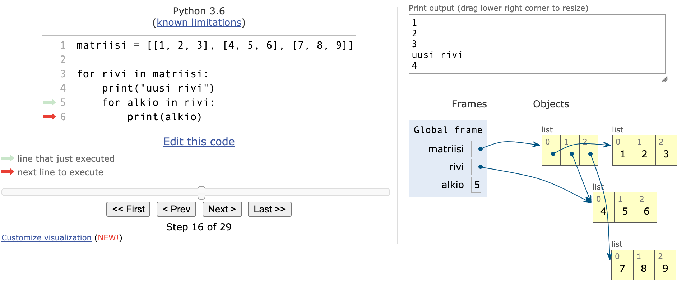

<text-box variant='learningObjectives' name="Learning objectives">

After this section

- You will be able to create lists with different types of items
- You will know how to use lists to organise data
- You will be able to store a matrix as a two-dimensional list

</text-box>

<!--the same text is in sections 3-1, 5-1 and 6-1, check them all if you're changing this-->
<text-box variant='hint' name="About the exercises on this course">

Becoming a proficient programmer requires a lot of practice, sometimes even quite mechanical practice. It also involves developing problem solving skills and applying intuition. This is why there are a lot of exercises of different kinds on this course. Some of them ask you to quite straightforwardly apply what you have learnt in the material, but some of them are intentionally more challenging and open-ended.

Some of the exercises might at first seem overwhelming, but this is nothing to worry about. None of the exercises is strictly mandatory, and in fact _only 25 % of the points in each part is required to pass the course._ You can find more details about passing the course on the [page on grading](/grading-and-exams).

**The exercises are not in any specific order of difficulty.** Each section usually introduces some new programming concepts, and these are then practised with both simpler and more complicated exercises. **If you come across an exercise that feels too difficult, move on to the next one.** You can always come back to the more difficult exercises if you have time later.

When the going inevitably gets tough, a word of consolation: a task that seems impossibly difficult this week will likely feel rather easy in about four weeks' time.

</text-box>

## Lists with different types of data

In the previous part we mainly handled lists with integer items, but in fact any types of values can be stored in lists. A list of strings could look like this:

```python
names = ["Marlyn", "Ruth", "Paul"]
print(names)
names.append("David")
print(names)

print("Number of names on the list:", len(names))
print("Names in alphabetical order:")
names.sort()
for name in names:
  print(name)
```

<sample-output>

['Marlyn', 'Ruth', 'Paul']
['Marlyn', 'Ruth', 'Paul', 'David']
Number of names on the list: 4
Names in alphabetical order:
David
Marlyn
Paul
Ruth

</sample-output>

Floating point numbers are also valid list items:

```python
measurements = [-2.5, 1.1, 7.5, 14.6, 21.0, 19.2]

for measure in measurements:
    print(measure)

mean = sum(measurements) / len(measurements)

print("The mean is:", mean)
```

<sample-output>

-2.5
1.1
7.5
14.6
21.0
19.2
The mean is: 10.15

</sample-output>

<!--a similar warning is in sections 3-4, 4-6 and 5-1, check them all if you're changing this-->
## Reminder: using global variables within functions

We know it is possible to assign new variables within function definitions, but the function can also see variables assigned outside it, in the main function. Such variables are called _global_ variables.

Using global variables from within functions is usually a bad idea. Among other issues, doing that may cause bugs that are difficult to trace.

Below is an example of a function that uses a global variable "by mistake":

```python
def print_reversed(names: list):
    # using the global variable instead of the parameter by accident
    i = len(name_list) - 1
    while i >= 0:
        print(name_list[i])
        i -= 1

# here the global variable is assigned
name_list = ["Steve", "Jean", "Katherine", "Paul"]
print_reversed(name_list)
print()
print_reversed(["Huey", "Dewey", "Louie"])
```

<sample-output>

Paul
Katherine
Jean
Steve

Paul
Katherine
Jean
Steve

</sample-output>

Even though the function calls both have the right kind of arguments, the function always prints out what is stored in the global variable `name_list`.

To make matters even more muddled, remember that all code for testing your functions should be placed within the `if __name__ == "__main__":` block for the automatic tests. The previous example should be modified:

```python
def print_reversed(names: list):
    # using the global variable instead of the parameter by accident
    i = len(name_list) - 1
    while i>=0:
        print(name_list[i])
        i -= 1

# All the code for testing the function should be within this block
if __name__ == "__main__":
    # here the global variable is assigned
    name_list = ["Steve", "Jean", "Katherine", "Paul"]
    print_reversed(name_list)
    print()
    print_reversed(["Huey", "Dewey", "Louie"])
```

Notice the global variable is assigned within the `if` block now.

The automatic tests in the TMC system are executed without running any of the code in the `if` block. So, in this latter example the function couldn't even theoretically work at all, since it refers to the variable `name_list`, which doesn't exist at all when the tests are executed.

## Warning: overwriting a parameter and returning too early

There are a couple of novel sources of bugs we should look at before jumping into the exercises in this part. Let's have a look at a function which tells us whether an integer is found within a list. Both are defined as parameters of the function:

```python
def number_in_list(numbers: list, number: int):
    for number in numbers:
        if number == number:
            return True
        else:
            return False
```

This function seems to always return `True`. The reason is that the `for` loop overwrites the value stored in the parameter `number`. Thus the condition in the `if` statement is always true.

Renaming the parameter solves the problem:

```python
def number_in_list(numbers: list, searched_number: int):
    for number in numbers:
        if number == searched_number:
            return True
        else:
            return False
```

Now the condition in the `if` statement looks better. But there is a new problem, since the function still doesn't seem to work correctly. Trying out the following manifests a bug:

```python
found = number_in_list([1, 2, 3, 4], 3)
print(found)  # prints out False
```

The issue here is that the function returns too early, without checking all the numbers in the list. In fact, the function takes only the first item in the list, and returns `True` or `False` depending on its value. We cannot know whether a number is _not present_ in the list until we have checked all the items in the list. The `return False` command should be placed outside the `for` loop:

```python
def number_in_list(numbers: list, searched_number: int):
    for number in numbers:
        if number == searched_number:
            return True

    return False
```

Let's have a look at another faulty function:

```python
def unique_numbers(numbers: list):
    # a helper variable to store all the numbers we've already checked
    numbers = []
    for number in numbers:
        # have we seen this number already?
        if number in numbers:
            return False
        numbers.append(number)

    return True

unique = unique_numbers([1, 2, 2])
print(unique)  # prints out True
```

This function is supposed to check whether all numbers in a list are distinct from each other, but it always returns `True`.

Here the function again overwrites the value stored in its parameter by mistake. The function tries to use the variable `numbers` to store all the numbers already checked, but this overwrites the original argument list. Renaming the helper variable is an easy fix:

```python
def unique_numbers(numbers: list):
    # a helper variable to store all the numbers we've already checked
    numbers_checked = []
    for number in numbers:
        # have we seen this number already?
        if number in numbers_checked:
            return False
        numbers_checked.append(number)

    return True

unique = unique_numbers([1, 2, 2])
print(unique)  # prints out False
```

Problems like this, and many others, can be located and fixed with the help of the debugger or the [visualisation tool](http://www.pythontutor.com/visualize.html#mode=edit). Learning to use these efficiently cannot be emphasised enough.

<programming-exercise name='The longest string' tmcname='part05-01_longest_string'>

Please write a function named `longest(strings: list)` which takes a list of strings as its argument. The function finds and returns the longest string in the list. You may assume there is always a single longest string in the list.

An example of expected behaviour:

```python

if __name__ == "__main__":
    strings = ["hi", "hiya", "hello", "howdydoody", "hi there"]
    print(longest(strings))

```

<sample-output>

howdydoody

</sample-output>

</programming-exercise>

## Lists within lists

The items in a list can be lists themselves:

```python
my_list = [[5, 2, 3], [4, 1], [2, 2, 5, 1]]
print(my_list)
print(my_list[1])
print(my_list[1][0])
```
<sample-output>

[[5, 2, 3], [4, 1], [2, 2, 5, 1]]
[4, 1]
4

</sample-output>

Why would lists within lists be useful?

Remember that lists can contain items of different types. You could store information about a person in a list. For instance, you could include their name as the first item, their age as the second item, and their height in meters as the third item:

```python
["Anu", 10, 1.38]
```

A database of persons could then be a list whose items would be lists containing information about a single person:

```python
persons = [["Betty", 10, 1.37], ["Peter", 7, 1.25], ["Emily", 32, 1.64], ["Alan", 39, 1.78]]

for person in persons:
  name = person[0]
  age = person[1]
  height = person[2]
  print(f"{name}: age {age} years, height {height} meters")
```

<sample-output>

Betty: age 10 years, height 1.37 meters
Peter: age 7 years, height 1.25 meters
Emily: age 32 years, height 1.64 meters
Alan: age 39 years, height 1.78 meters

</sample-output>

The `for` loop goes through the items in the outer list one by one. That is, each list containing information about a single person is assigned to the variable `person` in turn.

Lists arent always the best way to present data, such as information about a person. We will soon come across Python _dictionaries_, which are often better suited to such situations.

## Matrices

A two-dimensional table, or a _matrix_, is also a natural application of a list within a list.

For example, the following matrix


could be presented as a two-dimensional list in Python like so:

```python
my_matrix = [[1, 2, 3], [3, 2, 1], [4, 5, 6]]
```

Since a matrix is a list containing lists, the individual elements within the matrix can be accessed using consecutive square brackets. The first index refers to the row, and the second to the column. Indexing starts from zero, so for example `my_matrix[0][1]` refers to the second item on the first row.

```python
my_matrix = [[1, 2, 3], [3, 2, 1], [4, 5, 6]]

print(my_matrix[0][1])
my_matrix[1][0] = 10
print(my_matrix)
```

<sample-output>

2
[[1, 2, 3], [10, 2, 1], [4, 5, 6]]

</sample-output>

Like any other list, the rows of the matrix can be traversed wth a `for` loop. The following code prints out each row of the matrix on a separate line:

```python
my_matrix = [[1, 2, 3], [4, 5, 6], [7, 8, 9]]

for row in my_matrix:
    print(row)
```

<sample-output>

[1, 2, 3]
[4, 5, 6]
[7, 8, 9]

</sample-output>

Likewise, nested loops can be used to access the individual elements. The following code prints out each element in the matrix on a separate line with the help of two `for` loops:

```python
my_matrix = [[1, 2, 3], [4, 5, 6], [7, 8, 9]]

for row in my_matrix:
    print("a new row")
    for element in row:
        print(element)
```

<sample-output>

a new row
1
2
3
a new row
4
5
6
a new row
7
8
9

</sample-output>

## Visualising code containing lists within lists

Programs containing lists within lists can feel hard to grasp at first. The [visualisation tool](http://www.pythontutor.com/visualize.html) from Python Tutor is a great help in understanding how they work. The following is a visualisation of the example above:



The image above reveals that a 3 by 3 matrix technically consists of four lists. The first list represents the entire matrix. The three remaining lists are items in the first list, and represent the rows.

As multidimensional lists can be traversed with nested loops, it would be natural to think of the lists themselves as nested, but the image above shows us this isn't actually so. Instead, the list representing the whole matrix "points" to each individual list representing a row in the matrix. This is called a _reference_, and in the [following section](/part-5/2-references) the idea will be explored more thoroughly.

In the image above the execution has progressed to the second row of the matrix, and this list is what the variable `row` currently refers to. The variable `element` contains the element the execution is currently at. The value stored in `element` is the middle item in the list, i.e. 5.

## Lisää matriisin käsittelyä

Matriisin yksittäisten rivien käsittely on helppoa, riittää että valitaan haluttu rivi. Esimerkiksi seuraava funktio laskee halutun rivin alkioiden summan:

```python
def rivin_alkioiden_summa(matriisi, rivi_nro: int):
    # tarkasteluun valitaan yksi rivi
    rivi = matriisi[rivi_nro]
    summa = 0
    for alkio in rivi:
        summa += alkio

    return summa

m = [[4, 2, 3, 2], [9, 1, 12, 11], [7, 8, 9, 5], [2, 9, 15, 1]]

summa = rivin_alkioiden_summa(m, 1)
print(summa) # tulostuu 33 (saadaan laskemalla 9 + 1 + 12 + 11)
```

Jos taas haluttaisiin laskea tietyn sarakkeen eli "pystyrivin" alkioiden summa, tilanne olisi jo monimutkaisempi:

```python
def sarakkeen_alkioiden_summa(matriisi, sarake_nro: int):
    # summaan lisätään kaikkien rivien halutussa kohdassa oleva alkio
    summa = 0
    for rivi in matriisi:
        summa += rivi[sarake_nro]

    return summa

m = [[4, 2, 3, 2], [9, 1, 12, 11], [7, 8, 9, 5], [2, 9, 15, 1]]

summa = sarakkeen_alkioiden_summa(m, 2)
print(summa) # tulostuu 39 (saadaan laskemalla 3 + 12 + 9 + 15)
```

Tarkasteltava sarake siis koostuu _jokaisen rivin_ paikassa 2 olevasta alkiosta.

Näidenkin ohjelmien toiminta kannattaa ehdottomasti käydä läpi [visualisaattorilla](http://www.pythontutor.com/visualize.html)!

Matriisissa olevan yksittäisen arvon vaihtaminen on helppoa. Riittää että valitaan matriisin sisältä oikea rivi ja sen sisältä sarake:

```python
def vaihda_arvoon(matriisi, rivi_nro: int, sarake_nro: int, arvo: int):
    # haetaan oikea rivi
    rivi = matriisi[rivi_nro]
    # ja sen sisältä oikea kohta
    rivi[sarake_nro] = arvo

m = [[4, 2, 3, 2], [9, 1, 12, 11], [7, 8, 9, 5], [2, 9, 15, 1]]

print(m)
vaihda_arvoon(m, 2, 3, 1000)
print(m)
```

<sample-output>

[[4, 2, 3, 2], [9, 1, 12, 11], [7, 8, 9, 5], [2, 9, 15, 1]]
[[4, 2, 3, 2], [9, 1, 12, 11], [7, 8, 9, 1000], [2, 9, 15, 1]]

</sample-output>

Mikäli halutaan muuttaa matriisin sisältöä silmukan sisällä, ei ole mahdollista käyttää "normaalia" for-silmukkaa, sillä muutettaessa sisältöä on pakko tietää muutettavien alkioiden indeksit.

Tämä taas onnistuu `while`-silmukalla tai `for`-silmukalla hyödyntämällä `range`-funktiota iteroinnissa. Esimerkiksi seuraava koodi kasvattaa jokaista matriisin alkiota yhdellä:


```python
m = [[1,2,3], [4,5,6], [7,8,9]]

for i in range(len(m)):
    for j in range(len(m[i])):
        m[i][j] += 1

print(m)
```

<sample-output>

[[2, 3, 4], [5, 6, 7], [8, 9, 10]]

</sample-output>

Ulompi silmukka käy `range`-funktion avulla läpi arvot nollasta matriisin pituuteen (eli matriisin rivien määrään) ja sisempi silmukka jokaisen rivin alkiot nollasta rivin pituuteen.


<programming-exercise name='Number of elements' tmcname='part05-02_number_of_elements'>

Please write a function named `laske_alkiot(matriisi: list, alkio: int)`, joka saa parametrikseen kaksiulotteisen kokonaislukutaulukon. Funktio laskee, kuinka monta annetun alkion mukaista arvoa taulukosta löytyy.

Esimerkiksi

```python
m = [[1, 2, 1], [0, 3, 4], [1, 0, 0]]
print(laske_alkiot(m, 1))
```

<sample-output>

3

</sample-output>

</programming-exercise>

## Kaksiulotteinen taulukko pelin tietorakenteena

Matriisi sopii hyvin monien pelien tietorakenteeksi. Esim. sudokun ruudukko


voitaisiin esittää seuraavana matriisina:

```python
sudoku = [
  [9, 0, 0, 0, 8, 0, 3, 0, 0],
  [0, 0, 0, 2, 5, 0, 7, 0, 0],
  [0, 2, 0, 3, 0, 0, 0, 0, 4],
  [0, 9, 4, 0, 0, 0, 0, 0, 0],
  [0, 0, 0, 7, 3, 0, 5, 6, 0],
  [7, 0, 5, 0, 6, 0, 4, 0, 0],
  [0, 0, 7, 8, 0, 3, 9, 0, 0],
  [0, 0, 1, 0, 0, 0, 0, 0, 3],
  [3, 0, 0, 0, 0, 0, 0, 0, 2]
]
```

Arvolla nolla siis kuvataan tilanne, jossa ruutu on vielä tyhjä.

Seuraavassa vielä yksinkertainen versio sudokun tulostavasta metodista:

```python
def tulosta(sudoku):
    for rivi in sudoku:
        for ruutu in rivi:
            if ruutu > 0:
                print(f" {ruutu}", end="")
            else:
                print(" _", end="")
        print()

tulosta(sudoku)
```

Tulostus näyttää seuraavalta:

```x

 9 _ _ _ 8 _ 3 _ _
 _ _ _ 2 5 _ 7 _ _
 _ 2 _ 3 _ _ _ _ 4
 _ 9 4 _ _ _ _ _ _
 _ _ _ 7 3 _ 5 6 _
 7 _ 5 _ 6 _ 4 _ _
 _ _ 7 8 _ 3 9 _ _
 _ _ 1 _ _ _ _ _ 3
 3 _ _ _ _ _ _ _ 2

```

Vastaavalla tavalla on mahdollista kuvata moni tuttu peli (esim. shakki, miinaharava, laivan upotus, mastermind, ...) matriisina. Pelistä riippuu, mikä on sopiva tapa "koodata" pelin tilanne matriisiin.

<programming-exercise name='Go' tmcname='part05-03_go'>

Go-pelissä lisätään vuorotellen mustia ja valkoisia kiviä pelilaudalle. Pelin voittaa se pelaaja, joka saa omilla kivillään rajattua enemmän aluetta pelilaudalta.

Kirjoita funktio `kumpi_voitti(pelilauta: list)`, joka saa parametrikseen kaksiulotteisen taulukon, joka kuvaa pelilautaa. Taulukko koostuu kokonaisluvuista seuraavasti:

* 0: tyhjä ruutu
* 1: pelaajan 1 nappula
* 2: pelaajan 2 nappula

Esimerkissä pelilaudan koko voi olla mikä tahansa.

Funktio palauttaa arvon 1, jos pelaaja 1 on voittanut pelin, ja arvon 2, jos pelaaja 2 on voittanut pelin. Jos molemmilla pelaajilla on yhtä paljon nappuloita laudalla, funktio palauttaa arvon 0.

</programming-exercise>

<programming-exercise name='Sudoku: check row' tmcname='part05-04_sudoku_row'>

Please write a function named `rivi_oikein(sudoku: list, rivi_nro: int)`, joka saa parametriksi sudokuruudukkoa esittävän kaksiulotteisen taulukon ja rivin numeron kertovan kokonaisluvun (rivit on numeroitu nollasta alkaen). Metodi palauttaa tiedon, onko rivi oikein täytetty eli onko siinä kukin luvuista 1–9 korkeintaan kerran.

```python
sudoku = [
  [9, 0, 0, 0, 8, 0, 3, 0, 0],
  [2, 0, 0, 2, 5, 0, 7, 0, 0],
  [0, 2, 0, 3, 0, 0, 0, 0, 4],
  [2, 9, 4, 0, 0, 0, 0, 0, 0],
  [0, 0, 0, 7, 3, 0, 5, 6, 0],
  [7, 0, 5, 0, 6, 0, 4, 0, 0],
  [0, 0, 7, 8, 0, 3, 9, 0, 0],
  [0, 0, 1, 0, 0, 0, 0, 0, 3],
  [3, 0, 0, 0, 0, 0, 0, 0, 2]
]

print(rivi_oikein(sudoku, 0))
print(rivi_oikein(sudoku, 1))
```

<sample-output>

True
False

</sample-output>

</programming-exercise>

<programming-exercise name='Sudoku: check column' tmcname='part05-05_sudoku_column'>

Please write a function named `sarake_oikein(sudoku: list, sarake_nro: int)`, joka saa parametriksi sudokuruudukkoa esittävän kaksiulotteisen taulukon ja sarakkeen (eli pystyrivin) numeron kertovan kokonaisluvun. Metodi palauttaa tiedon, onko sarake oikein täytetty eli onko siinä kukin luvuista 1–9 korkeintaan kerran.

```python
sudoku = [
  [9, 0, 0, 0, 8, 0, 3, 0, 0],
  [2, 0, 0, 2, 5, 0, 7, 0, 0],
  [0, 2, 0, 3, 0, 0, 0, 0, 4],
  [2, 9, 4, 0, 0, 0, 0, 0, 0],
  [0, 0, 0, 7, 3, 0, 5, 6, 0],
  [7, 0, 5, 0, 6, 0, 4, 0, 0],
  [0, 0, 7, 8, 0, 3, 9, 0, 0],
  [0, 0, 1, 0, 0, 0, 0, 0, 3],
  [3, 0, 0, 0, 0, 0, 0, 0, 2]
]

print(sarake_oikein(sudoku, 0))
print(sarake_oikein(sudoku, 1))
```

<sample-output>

False
True

</sample-output>

</programming-exercise>

<programming-exercise name='Sudoku: check square' tmcname='part05-06_sudoku_square'>

Please write a function named `nelio_oikein(sudoku: list, rivi_nro: int, sarake_nro: int)`, joka saa parametriksi sudokuruudukkoa esittävän kaksiulotteisen taulukon sekä yhden ruudun paikan kertovat rivi- ja sarakenumerot.

Funktio kertoo onko parametrina saadusta rivi/sarakenumerosta alkava 3x3-kokoinen neliö oikein täytetty eli onko siinä kukin luvuista 1–9 korkeintaan kerran.

Huomaa, että tässä tehtävässä toteutettava funktio on hieman yleiskäyttöisempi kuin sudokussa oikeasti tarvitaan. Todellisuudessahan oikeassa sudokussa tarkastellaan ainoastaan kohdista (0, 0), (0, 3), (0, 6), (3, 0), (3, 3), (3, 6), (6, 0), (6, 3) ja (6, 6) alkavia neliöitä.

```python
sudoku = [
  [9, 0, 0, 0, 8, 0, 3, 0, 0],
  [2, 0, 0, 2, 5, 0, 7, 0, 0],
  [0, 2, 0, 3, 0, 0, 0, 0, 4],
  [2, 9, 4, 0, 0, 0, 0, 0, 0],
  [0, 0, 0, 7, 3, 0, 5, 6, 0],
  [7, 0, 5, 0, 6, 0, 4, 0, 0],
  [0, 0, 7, 8, 0, 3, 9, 0, 0],
  [0, 0, 1, 0, 0, 0, 0, 0, 3],
  [3, 0, 0, 0, 0, 0, 0, 0, 2]
]

print(nelio_oikein(sudoku, 0, 0))
print(nelio_oikein(sudoku, 1, 2))
```

<sample-output>

False
True

</sample-output>

Ensimmäisen funktiokutsun tarkastelema kohdasta 0, 0 alkava neliö on

<pre>
9 0 0
2 0 0
0 2 0
</pre>

Toisen funktiokutsun tarkastelema kohdasta riviltä 1 ja sarakkeesta 2 alkava neliö on

<pre>
0 2 5
0 3 0
4 0 0
</pre>

Tämä neliö on siis sellainen, jota oikeassa sudokussa ei tarkasteltaisi.

</programming-exercise>

<programming-exercise name='Sudoku: check grid' tmcname='part05-07_sudoku_grid'>

Please write a function named `sudoku_oikein(sudoku: list)`, joka saa parametriksi sudokuruudukkoa esittävän kaksiulotteisen taulukon. Funktio kertoo käyttäen edellisen kolmen tehtävän funktioita (kopioi ne tämän tehtävän koodin joukkoon), onko parametrina saatu ruudukko täytetty oikein, eli sen jokainen rivi, jokainen sarake sekä kaikki erilliset 3x3-neliöt sisältävät korkeintaan kertaalleen jokaisen luvuista 1–9.

Huom: ylempänä olevaan sudokuruudukkoa esittävään kuvaan on merkitty ne 3x3-neliöt, joita sudokua ratkaistessa tulee tarkastella.
Nämä ovat siis kohdista (0, 0), (0, 3), (0, 6), (3, 0), (3, 3), (3, 6), (6, 0), (6, 3) ja (6, 6) alkavat yhdeksän neliöä.

```python
sudoku1 = [
  [9, 0, 0, 0, 8, 0, 3, 0, 0],
  [2, 0, 0, 2, 5, 0, 7, 0, 0],
  [0, 2, 0, 3, 0, 0, 0, 0, 4],
  [2, 9, 4, 0, 0, 0, 0, 0, 0],
  [0, 0, 0, 7, 3, 0, 5, 6, 0],
  [7, 0, 5, 0, 6, 0, 4, 0, 0],
  [0, 0, 7, 8, 0, 3, 9, 0, 0],
  [0, 0, 1, 0, 0, 0, 0, 0, 3],
  [3, 0, 0, 0, 0, 0, 0, 0, 2]
]

print(sudoku_oikein(sudoku1))

sudoku2 = [
  [2, 6, 7, 8, 3, 9, 5, 0, 4],
  [9, 0, 3, 5, 1, 0, 6, 0, 0],
  [0, 5, 1, 6, 0, 0, 8, 3, 9],
  [5, 1, 9, 0, 4, 6, 3, 2, 8],
  [8, 0, 2, 1, 0, 5, 7, 0, 6],
  [6, 7, 4, 3, 2, 0, 0, 0, 5],
  [0, 0, 0, 4, 5, 7, 2, 6, 3],
  [3, 2, 0, 0, 8, 0, 0, 5, 7],
  [7, 4, 5, 0, 0, 3, 9, 0, 1]
]

print(sudoku_oikein(sudoku2))
```

<sample-output>

False
True

</sample-output>

</programming-exercise>

A quiz to review the contents of this section:

<quiz id="ccb6dcbf-1065-513f-9294-15f42a318300"></quiz>


