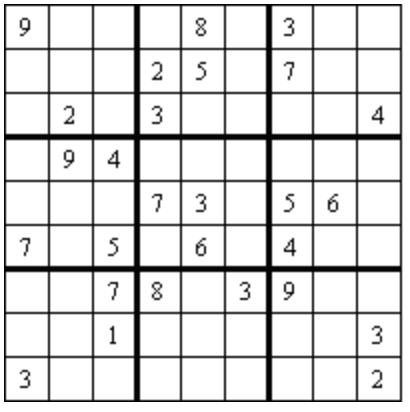
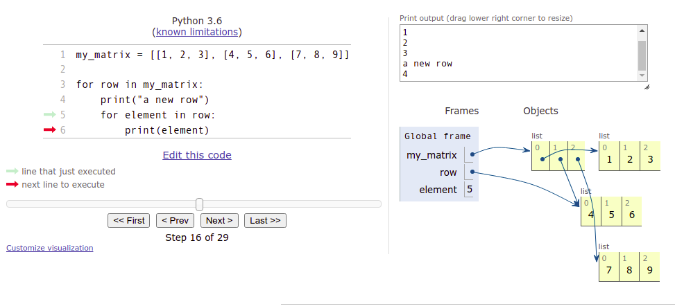

<text-box variant='learningObjectives' name="Learning objectives">

After this section

- You will be able to create lists with different types of items
- You will know how to use lists to organise data
- You will be able to store a matrix as a two-dimensional list

</text-box>

<!--the same text is in sections 3-1, 5-1 and 6-1, check them all if you're changing this-->
<text-box variant='hint' name="About the exercises on this course">

Becoming a proficient programmer requires a lot of practice, sometimes even quite mechanical practice. It also involves developing problem solving skills and applying intuition. This is why there are a lot of exercises of different kinds on this course. Some of them ask you to quite straightforwardly apply what you have learnt in the material, but some of them are intentionally more challenging and open-ended.

Some of the exercises might at first seem overwhelming, but this is nothing to worry about. None of the exercises is strictly mandatory, and in fact _only 25 % of the points in each part is required to pass the course._ You can find more details about passing the course on the [page on grading](/grading-and-exams).

**The exercises are not in any specific order of difficulty.** Each section usually introduces some new programming concepts, and these are then practised with both simpler and more complicated exercises. **If you come across an exercise that feels too difficult, move on to the next one.** You can always come back to the more difficult exercises if you have time later.

When the going inevitably gets tough, a word of consolation: a task that seems impossibly difficult this week will likely feel rather easy in about four weeks' time.

</text-box>

## Lists with different types of data

In the previous part we mainly handled lists with integer items, but any types of values can be stored in lists. A list of strings could look like this:

```python
names = ["Marlyn", "Ruth", "Paul"]
print(names)
names.append("David")
print(names)

print("Number of names on the list:", len(names))
print("Names in alphabetical order:")
names.sort()
for name in names:
  print(name)
```

<sample-output>

['Marlyn', 'Ruth', 'Paul']
['Marlyn', 'Ruth', 'Paul', 'David']
Number of names on the list: 4
Names in alphabetical order:
David
Marlyn
Paul
Ruth

</sample-output>

Floating point numbers are also valid list items:

```python
measurements = [-2.5, 1.1, 7.5, 14.6, 21.0, 19.2]

for measure in measurements:
    print(measure)

mean = sum(measurements) / len(measurements)

print("The mean is:", mean)
```

<sample-output>

-2.5
1.1
7.5
14.6
21.0
19.2
The mean is: 10.15

</sample-output>

<!--a similar warning is in sections 3-4, 4-6 and 5-1, check them all if you're changing this-->
## Reminder: using global variables within functions

We know it is possible to assign new variables within function definitions, but the function can also see variables assigned outside it, in the main function. Such variables are called _global_ variables.

Using global variables from within functions is usually a bad idea. Among other issues, doing so may cause bugs which are difficult to trace.

Below is an example of a function which uses a global variable "by mistake":

```python
def print_reversed(names: list):
    # using the global variable instead of the parameter by accident
    i = len(name_list) - 1
    while i >= 0:
        print(name_list[i])
        i -= 1

# here the global variable is assigned
name_list = ["Steve", "Jean", "Katherine", "Paul"]
print_reversed(name_list)
print()
print_reversed(["Huey", "Dewey", "Louie"])
```

<sample-output>

Paul
Katherine
Jean
Steve

Paul
Katherine
Jean
Steve

</sample-output>

Even though both function calls have the right kind of argument, the function always prints out what is stored in the global variable `name_list`.

To make matters even more muddled, remember that all code for testing your functions should be placed within the `if __name__ == "__main__":` block for the automatic tests. The previous example should be modified:

```python
def print_reversed(names: list):
    # using the global variable instead of the parameter by accident
    i = len(name_list) - 1
    while i>=0:
        print(name_list[i])
        i -= 1

# All the code for testing the function should be within this block
if __name__ == "__main__":
    # here the global variable is assigned
    name_list = ["Steve", "Jean", "Katherine", "Paul"]
    print_reversed(name_list)
    print()
    print_reversed(["Huey", "Dewey", "Louie"])
```

Notice the global variable is assigned within the `if` block now.

The automatic tests in the TMC system are executed without running any of the code in the `if` block. So, in this latter example the function wouldn't even theoretically work, since it refers to the variable `name_list`, which doesn't exist at all when the tests are executed.

## Warning: overwriting a parameter and returning too early

There are a couple of novel sources of bugs we should look at before jumping into the exercises in this part. Let's have a look at a function which tells us whether an integer is found within a list. Both are defined as parameters of the function:

```python
def number_in_list(numbers: list, number: int):
    for number in numbers:
        if number == number:
            return True
        else:
            return False
```

This function seems to always return `True`. The reason is that the `for` loop overwrites the value stored in the parameter `number`. Thus the condition in the `if` statement is always true.

Renaming the parameter solves the problem:

```python
def number_in_list(numbers: list, searched_number: int):
    for number in numbers:
        if number == searched_number:
            return True
        else:
            return False
```

Now the condition in the `if` statement looks better. But there is a new problem, since the function still doesn't seem to work correctly. Trying out the following manifests a bug:

```python
found = number_in_list([1, 2, 3, 4], 3)
print(found)  # prints out False
```

The issue here is that the function returns too early, without checking all the numbers in the list. In fact, the function takes only the first item in the list, and returns `True` or `False` depending on its value. We cannot know whether a number is _not present_ in the list until we have checked all the items in the list. The `return False` command should be placed outside the `for` loop:

```python
def number_in_list(numbers: list, searched_number: int):
    for number in numbers:
        if number == searched_number:
            return True

    return False
```

Let's have a look at another faulty function:

```python
def unique_numbers(numbers: list):
    # a helper variable to store all the numbers we've already checked
    numbers = []
    for number in numbers:
        # have we seen this number already?
        if number in numbers:
            return False
        numbers.append(number)

    return True

unique = unique_numbers([1, 2, 2])
print(unique)  # prints out True
```

This function is supposed to check whether all numbers in a list are distinct from each other, but it always returns `True`.

Here the function again overwrites the value stored in its parameter by mistake. The function tries to use the variable `numbers` to store all the numbers already checked, but this overwrites the original argument list. Renaming the helper variable is an easy fix:

```python
def unique_numbers(numbers: list):
    # a helper variable to store all the numbers we've already checked
    numbers_checked = []
    for number in numbers:
        # have we seen this number already?
        if number in numbers_checked:
            return False
        numbers_checked.append(number)

    return True

unique = unique_numbers([1, 2, 2])
print(unique)  # prints out False
```

Problems like this, and many others, can be located and fixed with the help of the debugger or the [visualisation tool](http://www.pythontutor.com/visualize.html#mode=edit). Learning to use these efficiently cannot be emphasised enough.

<programming-exercise name='The longest string' tmcname='part05-01_longest_string'>

Please write a function named `longest(strings: list)`, which takes a list of strings as its argument. The function finds and returns the longest string in the list. You may assume there is always a single longest string in the list.

An example of expected behaviour:

```python

if __name__ == "__main__":
    strings = ["hi", "hiya", "hello", "howdydoody", "hi there"]
    print(longest(strings))

```

<sample-output>

howdydoody

</sample-output>

</programming-exercise>

## Lists within lists

The items in a list can be lists themselves:

```python
my_list = [[5, 2, 3], [4, 1], [2, 2, 5, 1]]
print(my_list)
print(my_list[1])
print(my_list[1][0])
```
<sample-output>

[[5, 2, 3], [4, 1], [2, 2, 5, 1]]
[4, 1]
4

</sample-output>

Why would lists within lists be useful?

Remember that lists can contain items of different types. You could store information about a person in a list. For instance, you could include their name as the first item, their age as the second item, and their height in meters as the third item:

```python
["Anne", 12, 1.45]
```

A database of persons could then be a list, whose items would be lists containing information about a single person:

```python
persons = [["Betty", 10, 1.37], ["Peter", 7, 1.25], ["Emily", 32, 1.64], ["Alan", 39, 1.78]]

for person in persons:
  name = person[0]
  age = person[1]
  height = person[2]
  print(f"{name}: age {age} years, height {height} meters")
```

<sample-output>

Betty: age 10 years, height 1.37 meters
Peter: age 7 years, height 1.25 meters
Emily: age 32 years, height 1.64 meters
Alan: age 39 years, height 1.78 meters

</sample-output>

The `for` loop goes through the items in the outer list one by one. That is, each list containing information about a single person is, in turn, assigned to the variable `person`.

Lists arent always the best way to present data, such as information about a person. We will soon come across Python _dictionaries_, which are often better suited to such situations.

## Matrices

A two-dimensional array, or a _matrix_, is also a natural application of a list within a list.

For example, the following matrix



could be presented as a two-dimensional list in Python like so:

```python
my_matrix = [[1, 2, 3], [3, 2, 1], [4, 5, 6]]
```

Since a matrix is a list containing lists, the individual elements within the matrix can be accessed using consecutive square brackets. The first index refers to the row, and the second to the column. Indexing starts from zero, so for example `my_matrix[0][1]` refers to the second item on the first row.

```python
my_matrix = [[1, 2, 3], [3, 2, 1], [4, 5, 6]]

print(my_matrix[0][1])
my_matrix[1][0] = 10
print(my_matrix)
```

<sample-output>

2
[[1, 2, 3], [10, 2, 1], [4, 5, 6]]

</sample-output>

Like any other list, the rows of the matrix can be traversed wth a `for` loop. The following code prints out each row of the matrix on a separate line:

```python
my_matrix = [[1, 2, 3], [4, 5, 6], [7, 8, 9]]

for row in my_matrix:
    print(row)
```

<sample-output>

[1, 2, 3]
[4, 5, 6]
[7, 8, 9]

</sample-output>

Likewise, nested loops can be used to access the individual elements. The following code prints out each element in the matrix on a separate line with the help of two `for` loops:

```python
my_matrix = [[1, 2, 3], [4, 5, 6], [7, 8, 9]]

for row in my_matrix:
    print("a new row")
    for element in row:
        print(element)
```

<sample-output>

a new row
1
2
3
a new row
4
5
6
a new row
7
8
9

</sample-output>

## Visualising code containing lists within lists

Programs containing lists within lists can feel hard to grasp at first. The [visualisation tool](http://www.pythontutor.com/visualize.html) from Python Tutor is a great help in understanding how they work. The following is a visualisation of the example above:



The image above reveals that a 3 by 3 matrix technically consists of four lists. The first list represents the entire matrix. The three remaining lists are items in the first list, and represent the rows.

As multidimensional lists can be traversed with nested loops, it would be natural to think of the lists themselves as nested, but the image above shows us this isn't actually so. Instead, the list representing the whole matrix "points" to each individual list representing a row in the matrix. This is called a _reference_, and in the [following section](/part-5/2-references) the idea will be explored more thoroughly.

In the image above the execution has progressed to the second row of the matrix, and this list is what the variable `row` currently refers to. The variable `element` contains the element the execution is currently at. The value stored in `element` is the middle item in the list, i.e. 5.

## Accessing items in a matrix

Accessing a single row within a matrix is simple - just choose the desired row. The following function calculates the sum of the elements on a chosen row:

```python
def sum_of_row(my_matrix, row_no: int):
    # choose the desired row from within the matrix
    row = my_matrix[row_no]
    row_sum = 0
    for item in row:
        row_sum += item

    return row_sum

m = [[4, 2, 3, 2], [9, 1, 12, 11], [7, 8, 9, 5], [2, 9, 15, 1]]

my_sum = sum_of_row(m, 1)
print(my_sum) # prints out 33 (which equals 9 + 1 + 12 + 11)
```

Working with columns within a matrix is slightly more complicated, as the matrix is stored by rows: 

```python
def sum_of_column(my_matrix, column_no: int):
    # go through each row and select the item at the chosen position
    column_sum = 0
    for row in my_matrix:
        column_sum += row[column_no]

    return column_sum

m = [[4, 2, 3, 2], [9, 1, 12, 11], [7, 8, 9, 5], [2, 9, 15, 1]]

my_sum = sum_of_column(m, 2)
print(my_sum) # prints out 39 (which equals 3 + 12 + 9 + 15)
```

The column handled here consists of the elements at index 2 on _each row_.

[The visualisation tool](http://www.pythontutor.com/visualize.html) is definitely recommended for understanding how these functions work.

Changing the value of a single element within the matrix is simple: choose a row within the matrix, and then a column within the row:

```python
def change_value(my_matrix, row_no: int, column_no: int, new_value: int):
    # choose the desired row
    row = my_matrix[row_no]
    # select the correct item within the row
    row[column_no] = new_value

m = [[4, 2, 3, 2], [9, 1, 12, 11], [7, 8, 9, 5], [2, 9, 15, 1]]

print(m)
change_value(m, 2, 3, 1000)
print(m)
```

<sample-output>

[[4, 2, 3, 2], [9, 1, 12, 11], [7, 8, 9, 5], [2, 9, 15, 1]]
[[4, 2, 3, 2], [9, 1, 12, 11], [7, 8, 9, 1000], [2, 9, 15, 1]]

</sample-output>

Notice how above we used the indexes of the row and column to access a chosen element. If we want to change the contents of the matrix, we have to access the elements by their indexes. This means that we can't use a simple `for item in list` loop to traverse the matrix if we want to change the contents of the matrix.

Instead, we will have to keep track of the indexes of the elements, for example with a `while` loop, or a `for` loop using the `range` function. The following code increases the value of each element in the matrix by one:

```python
m = [[1,2,3], [4,5,6], [7,8,9]]

for i in range(len(m)): # using the number of rows in the matrix
    for j in range(len(m[i])): # using the number of items on each row 
        m[i][j] += 1

print(m)
```

<sample-output>

[[2, 3, 4], [5, 6, 7], [8, 9, 10]]

</sample-output>

The outer loop goes through indexes from zero to the length of the matrix, that is, the number of rows in the matrix. The inner loop goes through indexes from zero to the length of each row within the matrix.

<programming-exercise name='Number of matching elements' tmcname='part05-02_number_of_elements'>

Please write a function named `count_matching_elements(my_matrix: list, element: int)`, which takes a two-dimensional array of integers and a single integer value as its arguments. The function then counts how many elements within the matrix match the argument value.

An example of how the function should work:

```python
m = [[1, 2, 1], [0, 3, 4], [1, 0, 0]]
print(count_matching_elements(m, 1))
```

<sample-output>

3

</sample-output>

</programming-exercise>

## A two-dimensional array as a data structure in a game

A matrix can be a very useful data structure in many different games. For example, the grid of a sudoku game in the image below


can be represented in matrix form like so:

```python
sudoku = [
  [9, 0, 0, 0, 8, 0, 3, 0, 0],
  [0, 0, 0, 2, 5, 0, 7, 0, 0],
  [0, 2, 0, 3, 0, 0, 0, 0, 4],
  [0, 9, 4, 0, 0, 0, 0, 0, 0],
  [0, 0, 0, 7, 3, 0, 5, 6, 0],
  [7, 0, 5, 0, 6, 0, 4, 0, 0],
  [0, 0, 7, 8, 0, 3, 9, 0, 0],
  [0, 0, 1, 0, 0, 0, 0, 0, 3],
  [3, 0, 0, 0, 0, 0, 0, 0, 2]
]
```

Here the value zero represents an empty square, as zero is not an acceptable value in a finished sudoku puzzle.

Here is a simple function for printing out the above sudoku grid:

```python
def print_grid(sudoku):
    for row in sudoku:
        for square in row:
            if square > 0:
                print(f" {square}", end="")
            else:
                print(" _", end="")
        print()

print_grid(sudoku)
```

The printout should look like this::

```x

 9 _ _ _ 8 _ 3 _ _
 _ _ _ 2 5 _ 7 _ _
 _ 2 _ 3 _ _ _ _ 4
 _ 9 4 _ _ _ _ _ _
 _ _ _ 7 3 _ 5 6 _
 7 _ 5 _ 6 _ 4 _ _
 _ _ 7 8 _ 3 9 _ _
 _ _ 1 _ _ _ _ _ 3
 3 _ _ _ _ _ _ _ 2

```

Any common game with a gameboard layout can be modelled in a similar fashion. Among others, chess, Minesweeper, Battleship or Mastermind are all based on a two-dimensional grid. For sudoku, it is natural to use numbers to represent the game state, but for other games, different methods may be better.

<programming-exercise name='Go' tmcname='part05-03_go'>

In a game of Go two players take turns to place black and white stones on a game board. The winner is the player who manages to encircle a bigger area on the board with their own game pieces. 

Please write a function named `who_won(game_board: list)`, which takes a two-dimensional array as its argument. The array consists of integer values, which represent the following situations:

* 0: empty square
* 1: player 1 game piece
* 2: player 2 game piece

The scoring rules of Go can be quite complex, but in this exercise it is enough to compare the number of pieces each player has on the game board. Also, the size of the game board is not limited.

The function should return the value 1 if player 1 won, and the value 2 if player 2 won. If both players have the same number of pieces on the board, the function should return the value 0.

</programming-exercise>

<programming-exercise name='Sudoku: check row' tmcname='part05-04_sudoku_row'>

Please write a function named `row_correct(sudoku: list, row_no: int)`, which takes a two-dimensional array representing a sudoku grid, and an integer referring to a single row, as its arguments. Rows are indexed from 0.

The function should return `True` or `False`, depending on whether the row is filled in correctly, that is, whether it contains each of the numbers 1 to 9 at most once.

```python
sudoku = [
  [9, 0, 0, 0, 8, 0, 3, 0, 0],
  [2, 0, 0, 2, 5, 0, 7, 0, 0],
  [0, 2, 0, 3, 0, 0, 0, 0, 4],
  [2, 9, 4, 0, 0, 0, 0, 0, 0],
  [0, 0, 0, 7, 3, 0, 5, 6, 0],
  [7, 0, 5, 0, 6, 0, 4, 0, 0],
  [0, 0, 7, 8, 0, 3, 9, 0, 0],
  [0, 0, 1, 0, 0, 0, 0, 0, 3],
  [3, 0, 0, 0, 0, 0, 0, 0, 2]
]

print(row_correct(sudoku, 0))
print(row_correct(sudoku, 1))
```

<sample-output>

True
False

</sample-output>

</programming-exercise>

<programming-exercise name='Sudoku: check column' tmcname='part05-05_sudoku_column'>

Please write a function named `column_correct(sudoku: list, column_no: int)`, which takes a two-dimensional array representing a sudoku grid, and an integer referring to a single column, as its arguments. Columns are indexed from 0. 

The function should return `True` or `False`, depending on whether the column is filled in correctly, that is, whether it contains each of the numbers 1 to 9 at most once.

```python
sudoku = [
  [9, 0, 0, 0, 8, 0, 3, 0, 0],
  [2, 0, 0, 2, 5, 0, 7, 0, 0],
  [0, 2, 0, 3, 0, 0, 0, 0, 4],
  [2, 9, 4, 0, 0, 0, 0, 0, 0],
  [0, 0, 0, 7, 3, 0, 5, 6, 0],
  [7, 0, 5, 0, 6, 0, 4, 0, 0],
  [0, 0, 7, 8, 0, 3, 9, 0, 0],
  [0, 0, 1, 0, 0, 0, 0, 0, 3],
  [3, 0, 0, 0, 0, 0, 0, 0, 2]
]

print(column_correct(sudoku, 0))
print(column_correct(sudoku, 1))
```

<sample-output>

False
True

</sample-output>

</programming-exercise>

<programming-exercise name='Sudoku: check block' tmcname='part05-06_sudoku_block'>

Please write a function named `block_correct(sudoku: list, row_no: int, column_no: int)`, which takes a two-dimensional array representing a sudoku grid, and two integers referring to the row and column indexes of a single square, as its arguments. Rows and columns are indexed from 0. 

The function should return `True` or `False` depending on whether the 3 by 3 block to the right and down from the given indexes is filled in correctly. That is, whether the block contains each of the numbers 1 to 9 at most once.

Notice that this function does not strictly follow the rules of sudoku. In a real game of sudoku there are only 9 blocks to check, and these are located at indexes (0, 0), (0, 3), (0, 6), (3, 0), (3, 3), (3, 6), (6, 0), (6, 3) and (6, 6). Such restrictions on indexes should not be implemented here.

```python
sudoku = [
  [9, 0, 0, 0, 8, 0, 3, 0, 0],
  [2, 0, 0, 2, 5, 0, 7, 0, 0],
  [0, 2, 0, 3, 0, 0, 0, 0, 4],
  [2, 9, 4, 0, 0, 0, 0, 0, 0],
  [0, 0, 0, 7, 3, 0, 5, 6, 0],
  [7, 0, 5, 0, 6, 0, 4, 0, 0],
  [0, 0, 7, 8, 0, 3, 9, 0, 0],
  [0, 0, 1, 0, 0, 0, 0, 0, 3],
  [3, 0, 0, 0, 0, 0, 0, 0, 2]
]

print(block_correct(sudoku, 0, 0))
print(block_correct(sudoku, 1, 2))
```

<sample-output>

False
True

</sample-output>

The first function call should check the 3 by 3 block beginning with the square at indexes `0, 0`:

<pre>
9 0 0
2 0 0
0 2 0
</pre>

The second function call should check the 3 by 3 block beginning with the square at row 1, column 2:

<pre>
0 2 5
0 3 0
4 0 0
</pre>

This second block would not be checked in an actual game of sudoku, but your function should allow for it to be checked.

</programming-exercise>

<programming-exercise name='Sudoku: check grid' tmcname='part05-07_sudoku_grid'>

Please write a function named `sudoku_grid_correct(sudoku: list)`, which takes a two-dimensional array representing a sudoku grid as its argument. The function should use the functions from the three previous exercises to determine whether the complete sudoku grid is filled in correctly. Copy the functions from the exercises above into your Python code file for this exercise.

The function should check each of the nine rows, columns and 3 by 3 blocks in the grid. If all contain each of the numbers 1 to 9 at most once, the function returns `True`. If a single one is filled in incorrectly, the function returns `False`. 

The image of a sudoku grid above these exercises has the nine blocks within the grid indicated with thicker borders. These are the blocks the function should check, and they begin at the indexes (0, 0), (0, 3), (0, 6), (3, 0), (3, 3), (3, 6), (6, 0), (6, 3) and (6, 6). 

```python
sudoku1 = [
  [9, 0, 0, 0, 8, 0, 3, 0, 0],
  [2, 0, 0, 2, 5, 0, 7, 0, 0],
  [0, 2, 0, 3, 0, 0, 0, 0, 4],
  [2, 9, 4, 0, 0, 0, 0, 0, 0],
  [0, 0, 0, 7, 3, 0, 5, 6, 0],
  [7, 0, 5, 0, 6, 0, 4, 0, 0],
  [0, 0, 7, 8, 0, 3, 9, 0, 0],
  [0, 0, 1, 0, 0, 0, 0, 0, 3],
  [3, 0, 0, 0, 0, 0, 0, 0, 2]
]

print(sudoku_grid_correct(sudoku1))

sudoku2 = [
  [2, 6, 7, 8, 3, 9, 5, 0, 4],
  [9, 0, 3, 5, 1, 0, 6, 0, 0],
  [0, 5, 1, 6, 0, 0, 8, 3, 9],
  [5, 1, 9, 0, 4, 6, 3, 2, 8],
  [8, 0, 2, 1, 0, 5, 7, 0, 6],
  [6, 7, 4, 3, 2, 0, 0, 0, 5],
  [0, 0, 0, 4, 5, 7, 2, 6, 3],
  [3, 2, 0, 0, 8, 0, 0, 5, 7],
  [7, 4, 5, 0, 0, 3, 9, 0, 1]
]

print(sudoku_grid_correct(sudoku2))
```

<sample-output>

False
True

</sample-output>

</programming-exercise>

<!---
A quiz to review the contents of this section:

<quiz id="ccb6dcbf-1065-513f-9294-15f42a318300"></quiz>
-->
