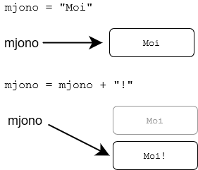
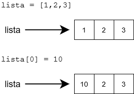
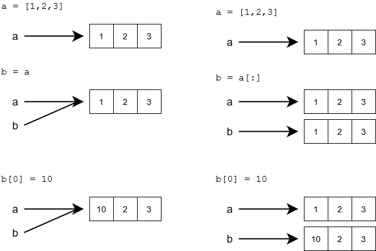
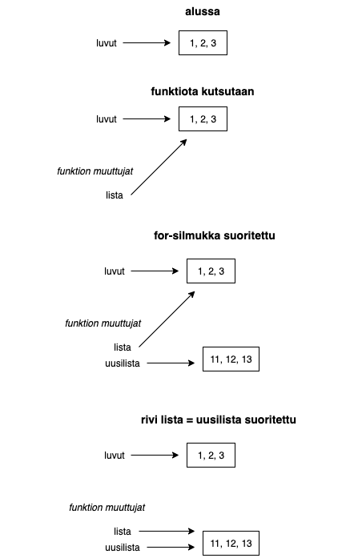
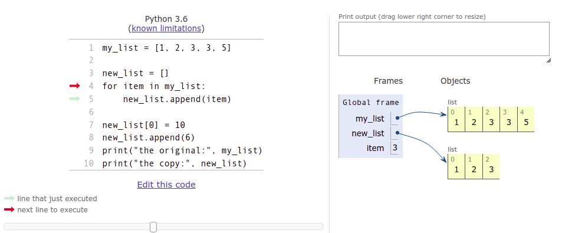
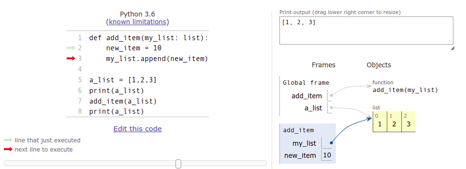
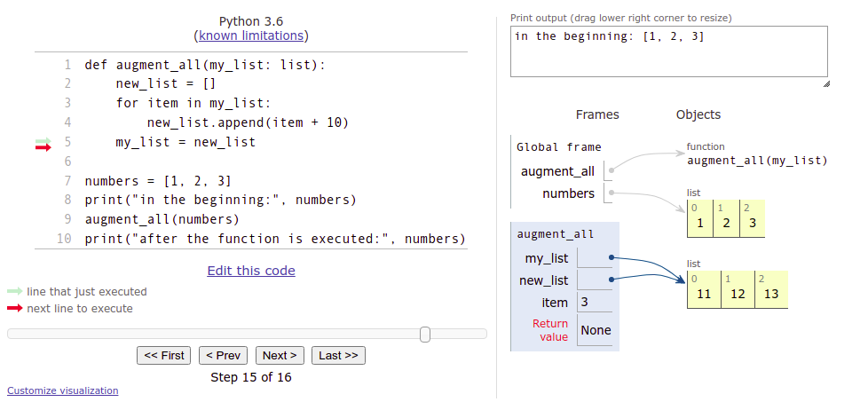

<text-box variant='learningObjectives' name="Learning objectives">

After this section

- You will know what is meant by a reference to a variable
- You will understand that there can be multiple references to the same object
- You will be able to use lists as parameters in functions
- You will know what is meant by a side effect of a function

</text-box>

Thus far we have thought of a variable as a sort of a "box" which contains the value of the variable. Technically this is not true in Python. What is stored in a variable is not the value per se, but a _reference_ to the _object_ which is the actual value of the variable. The object can be e.g. a number, a string or a list.

In practice, this means that the value of the variable _is not stored_ in the variable itself. Instead, there is information about the location in computer memory where the value can be found.

A reference is often represented by an arrow from the variable to the actual value in memory:


So, a reference tells us where the value can be found. The function `id` can be used to find out the exact location the variable points to:

```python
a = [1, 2, 3]
print(id(a))
b = "This is a reference, too"
print(id(b))
```

<sample-output>

4538357072
4537788912

</sample-output>

The reference, or the ID of the variable, is an integer, which can be thought of as the address in computer memory where the value of the variable is stored. If you execute the above code on your own computer, the result will likely be different, as your variables will point to different locations - the references will be different.

The Python Tutor visualisation tool also shows references as arrows from the variable to the actual content, as we saw in the [previous section](/part-5/1-more-lists#visualising-code-containing-lists-within-lists). The tool "cheats" a bit when it comes to strings, however. It displays strings as if they are stored in the variables themselves:



In reality, Python strings are handled very much like lists, with references to locations in memory.

Many of the builtin types in Python, such as `str`, are _immutable_. This means the value of the object, or any part of it, cannot change. The value can be replaced with a new value:



Some of Python types are _mutable_. For example, the contents of a list can change without needing to create a whole new list:


It may surprise you that also the basic data types `int`, `float` and `bool` are immutable in Python. Let's have a look at the following bit of code:

```python
number = 1
number = 2
number += 10
```

It seems that the commands above are just changing the value stored in the variable, but in fact each command creates a whole new number in the computer's memory.

The printout from the following program illuminates the situation:

```python
number = 1
print(id(number))
number += 10
print(id(number))
a = 1
print(id(a))
```

<sample-output>

4535856912
4535856944
4535856912

</sample-output>

At first, the variable `number` points to the memory location 4535856912. When `number` is assigned a new value, it points to the location 4535856944. Now, when the variable `a` is assigned the value 1, `a` points to the very same location where `number` was pointing, when it was also assigned the value 1.

It seems Python has stored the value 1 in the memory location 4535856912. Whenever a variable is assigned the value 1, it _refers_ to that location in computer memory.

It is good to keep in mind that _almost everything is a reference_ in Python, but all this is rarely relevant to everyday programming tasks. So let's get back to more practical matters.

## Multiple references to the same list

What actually happens when you assign a list variable to a new variable - is the list copied over?

```python
a = [1, 2, 3]
b = a
b[0] = 10
```

The assignment `b = a` copies the value stored in variable `a` to the variable `b`. However, the value stored in `a` is not the list _itself_, but a _reference_ to the list.

So, the assignment `b = a` copies the reference. As a result there are now two references to the same memory location containing the list.



The list can be accessed through either of the two references:

```python
list1 = [1, 2, 3, 4]
list2 = list1

list1[0] = 10
list2[1] = 20

print(list1)
print(list2)
```

<sample-output>

[10, 20, 3, 4]
[10, 20, 3, 4]

</sample-output>

If there is more than one reference to the same list, any one of the references can be used to access the list. On the other hand, a change made through any one of the references affects also the other references, as their target is the same.

The visualisation tool is again very useful in figuring out what is happening:



## Copying a list

If you want to create an actual separate copy of a list, you can create a new list and add each item from the original list in turn:


```python
my_list = [1, 2, 3, 3, 5]

new_list = []
for item in my_list:
    new_list.append(item)

new_list[0] = 10
new_list.append(6)
print("the original:", my_list)
print("the copy:", new_list)
```

<sample-output>

my_list [1, 2, 3, 3, 5]
new_list [10, 2, 3, 3, 5, 6]

</sample-output>

A snapshot of the copying process in the visualisation tool:



The variable `new_list` points to a different list than the variable `my_list`.

An easier way to copy a list is the bracket operator `[]`, which we used for slices previously. The notation `[:]` selects all items in the collection. As a side effect, it creates a copy of the list:

```python
my_list = [1,2,3,4]
new_list = my_list[:]

my_list[0] = 10
new_list[1] = 20

print(my_list)
print(new_list)
```

<sample-output>

[10, 2, 3, 4]
[1, 20, 3, 4]

</sample-output>

## Using lists as parameters in functions

When you pass a list as an argument to a function, you are passing a reference to that list. This means that the function can modify the list directly.

The following function takes a list as an argument and adds a new item to the end of the list:

```python
def add_item(my_list: list):
    new_item = 10
    my_list.append(new_item)

a_list = [1,2,3]
print(a_list)
add_item(a_list)
print(a_list)
```

<sample-output>
[1, 2, 3]
[1, 2, 3, 10]
</sample-output>

Notice the function `add_item` does not have a return value. It only changes the list it takes as an argument.

The visualisation tool may help you understand what is happening here:



_Global frame_ refers to the variables defined in the main function, whereas the *add_item* frame with a blue background represents the parameters and variables within that function. As you can see from the visualisation, the `add_item` function refers to the very same list as the main function. The changes made within the `add_item` function also affect the main function.

Another way to implement this functionality would be to create a new list within the function, and return that:

```python
def add_item(my_list: list) -> list:
    new_item = 10
    my_list_copy = my_list[:]
    my_list_copy.append(new_item)
    return my_list_copy

numbers = [1, 2, 3]
numbers2 = add_item(numbers)

print("original list:", numbers)
print("new list:", numbers2)
```

<sample-output>

original list: [1, 2, 3]
new list: [1, 2, 3, 10]

</sample-output>

If you aren't absolutely sure you understand what is happening in the code above, please go through it in the visualisation tool.

## Editing a list given as an argument

The following is an attempt at a function which should augment each item in a list by ten:

```python
def augment_all(my_list: list):
    new_list = []
    for item in my_list:
        new_list.append(item + 10)
    my_list = new_list

numbers = [1, 2, 3]
print("in the beginning:", numbers)
augment_all(numbers)
print("after the function is executed:", numbers)
```

<sample-output>

in the beginning: [1, 2, 3]
after the function is executed: [1, 2, 3]

</sample-output>

For some reason the function doesn't work, so what is going on?

The function takes a _reference_ to a list as an argument. This is stored in the variable `my_list`. The assignment `my_list = new_list` assigns a new value to that same variable. The variable `my_list` now points to the new list created inside the function, and the reference to the original list is no longer available within the function. This assignment has no effect outside the function, however.

<!---
The following sequence of images illustrates the states of the variables at different stages during the execution of the function:


-->

Furthermore, the variable `new_list`, which contains the new, augmented values, is not accessible from outside the function. It is "lost" as the execution of the function finishes, and focus returns to the main function. The variable `numbers` in the main function always points to the original list.

The visualisation tool is your friend here, too. Please go through the stages carefully, and see how the original list is not affected by the execution of the function at all:



One way to fix this is to copy all the items from the new list to the old list, one by one:

```python
def augment_all(my_list: list):
    new_list = []
    for item in my_list:
        new_list.append(item + 10)

    # copy items from the new list into the old list
    for i in range(len(my_list)):
        my_list[i] = new_list[i]
```

Python also has a nifty shorthand for assigning multiple items in a collection at once:

```python
>>> my_list = [1, 2, 3, 4]
>>> my_list[1:3] = [10, 20]
>>> my_list
[1, 10, 20, 4]
```

In the example above a slice of the list is assigned values from another collection.

As we know, a slice can include the entire collection:

```python
>>> my_list = [1, 2, 3, 4]
>>> my_list[:] = [100, 99, 98, 97]
>>> my_list
[100, 99, 98, 97]
```

The entire contents of the old list are replaced. Inspired by this, a working version of the augmenting function could look like this:

```python
def augment_all(my_list: list):
    new_list = []
    for item in my_list:
        new_list.append(item + 10)

    my_list[:] = new_list
```

Actually, there is no need to create a new list within the function at all. We can just assign the new values directly into the original list:

```python
def augment_all(my_list: list):
    for i in range(len(my_list)):
        my_list[i] += 10

```


<programming-exercise name='Items multiplied by two' tmcname='part05-08_items_multiplied_by_two'>

Please write a function named `double_items(numbers: list)`, which takes a list of integers as its argument.

The function should return a new list, which contains all values from the original list doubled. The function should _not_ change the original list.

An example of the function at work:

```python
if __name__ == "__main__":
    numbers = [2, 4, 5, 3, 11, -4]
    numbers_doubled = double_items(numbers)
    print("original:", numbers)
    print("doubled:", numbers_doubled)
```
<sample-output>

original: [2, 4, 5, 3, 11, -4]
doubled: [4, 8, 10, 6, 22, -8]

</sample-output>

</programming-exercise>


<programming-exercise name='Remove the smallest' tmcname='part05-09_remove_smallest'>

Please write a function named `remove_smallest(numbers: list)`, which takes a list of integers as its argument.

The functions should find and remove the smallest item in the list. You may assume there is a single smallest item in the list.

The function should not have a return value - it should directly modify the list it receives as a parameter.

An example of how the function works:

```python
if __name__ == "__main__":
    numbers = [2, 4, 6, 1, 3, 5]
    remove_smallest(numbers)
    print(numbers)
```
<sample-output>

[2, 4, 6, 3, 5]

</sample-output>

</programming-exercise>


<programming-exercise name='Sudoku: print out the grid and add a number' tmcname='part05-10_sudoku_print_and_add'>

In this exercise we will complete two more functions for the sudoku project from the previous section: `print_sudoku` and `add_number`.

The function `print_sudoku(sudoku: list)` takes a two-dimensional array representing a sudoku grid as its argument. The function should print out the grid in the format specified in the examples below.

The function `add_number(sudoku: list, row_no: int, column_no: int, number:int)` takes a two-dimensional array representing a sudoku grid, two integers referring to the row and column indexes of a single square, and a single digit between 1 and 9, as its arguments. The function should add the digit to the specified location in the grid.

```python
sudoku  = [
    [0, 0, 0, 0, 0, 0, 0, 0, 0],
    [0, 0, 0, 0, 0, 0, 0, 0, 0],
    [0, 0, 0, 0, 0, 0, 0, 0, 0],
    [0, 0, 0, 0, 0, 0, 0, 0, 0],
    [0, 0, 0, 0, 0, 0, 0, 0, 0],
    [0, 0, 0, 0, 0, 0, 0, 0, 0],
    [0, 0, 0, 0, 0, 0, 0, 0, 0],
    [0, 0, 0, 0, 0, 0, 0, 0, 0],
    [0, 0, 0, 0, 0, 0, 0, 0, 0]
]

print_sudoku(sudoku)
add_number(sudoku, 0, 0, 2)
add_number(sudoku, 1, 2, 7)
add_number(sudoku, 5, 7, 3)
print()
print("Three numbers added:")
print()
print_sudoku(sudoku)
```

<sample-output>

<pre>
_ _ _  _ _ _  _ _ _
_ _ _  _ _ _  _ _ _
_ _ _  _ _ _  _ _ _

_ _ _  _ _ _  _ _ _
_ _ _  _ _ _  _ _ _
_ _ _  _ _ _  _ _ _

_ _ _  _ _ _  _ _ _
_ _ _  _ _ _  _ _ _
_ _ _  _ _ _  _ _ _

Three numbers added:

2 _ _  _ _ _  _ _ _
_ _ 7  _ _ _  _ _ _
_ _ _  _ _ _  _ _ _

_ _ _  _ _ _  _ _ _
_ _ _  _ _ _  _ _ _
_ _ _  _ _ _  _ 3 _

_ _ _  _ _ _  _ _ _
_ _ _  _ _ _  _ _ _
_ _ _  _ _ _  _ _ _

</pre>

</sample-output>

**Hint**

Remember it is possible to call the `print` function without causing a line change:

```python
print("characters ", end="")
print("without carriage returns", end="")
```

<sample-output>

characters without carriage returns

</sample-output>

Sometimes you need just a new line, which a print statement without any argument will achieve:

```python
print()
```

</programming-exercise>

<programming-exercise name='Sudoku: add number to a copy of the grid' tmcname='part05-11_sudoku_add_to_copy'>

This is the very last sudoku task. This time we will create a slightly different version of the function for adding new numbers to the grid.

The function `copy_and_add(sudoku: list, row_no: int, column_no: int, number: int)` takes a two-dimensional array representing a sudoku grid, two integers referring to the row and column indexes of a single square, and a single digit between 1 and 9, as its arguments. The function should _return_ a copy of the original grid with the new digit added in the correct location. The function should _not_ change the original grid received as a parameter.

The `print_sudoku` function from the previous exercise could be useful for testing, and it is used in the example below:

```python
sudoku  = [
    [0, 0, 0, 0, 0, 0, 0, 0, 0],
    [0, 0, 0, 0, 0, 0, 0, 0, 0],
    [0, 0, 0, 0, 0, 0, 0, 0, 0],
    [0, 0, 0, 0, 0, 0, 0, 0, 0],
    [0, 0, 0, 0, 0, 0, 0, 0, 0],
    [0, 0, 0, 0, 0, 0, 0, 0, 0],
    [0, 0, 0, 0, 0, 0, 0, 0, 0],
    [0, 0, 0, 0, 0, 0, 0, 0, 0],
    [0, 0, 0, 0, 0, 0, 0, 0, 0]
]

grid_copy = copy_and_add(sudoku, 0, 0, 2)
print("Original:")
print_sudoku(sudoku)
print()
print("Copy:")
print_sudoku(grid_copy)
```

<sample-output>

<pre>
Original:
_ _ _  _ _ _  _ _ _
_ _ _  _ _ _  _ _ _
_ _ _  _ _ _  _ _ _

_ _ _  _ _ _  _ _ _
_ _ _  _ _ _  _ _ _
_ _ _  _ _ _  _ _ _

_ _ _  _ _ _  _ _ _
_ _ _  _ _ _  _ _ _
_ _ _  _ _ _  _ _ _

Copy:
2 _ _  _ _ _  _ _ _
_ _ _  _ _ _  _ _ _
_ _ _  _ _ _  _ _ _

_ _ _  _ _ _  _ _ _
_ _ _  _ _ _  _ _ _
_ _ _  _ _ _  _ _ _

_ _ _  _ _ _  _ _ _
_ _ _  _ _ _  _ _ _
_ _ _  _ _ _  _ _ _

</pre>

</sample-output>

**Hint** 
When dealing with nested lists you should be extra careful when copying. What all needs to be explicitly copied, and where do changes actually have an effect? The [visualisation tool](http://www.pythontutor.com/visualize.html#mode=edit) is a great help here, too, although the size of the sudoku grid will make the view less orderly than usual.

</programming-exercise>

<programming-exercise name='Tic-Tac-Toe' tmcname='part05-12_tic_tac_toe'>

Tic-Tac-Toe is played on a 3 by 3 grid, by two players who take turns inputting noughts and crosses. If either player succeeds in placing three of their own symbols on any row, column or diagonal, they win. If neither player manages this, it is a draw.

Please write a function named `play_turn(game_board: list, x: int, y: int, piece: str)`, which places the given symbol at the given coordinates on the board. The values of the coordinates on the board are between 0 and 2.

**NB:** when compared to the sudoku exercises, the arguments the function takes are the other way around here. The column `x` comes first, and the row `y` second.

The board consists of the following strings:

* `""`: empty square
* `"X"`: player 1 symbol
* `"O"`: player 2 symbol

The function should return `True` if the square was empty and the symbol was successfully placed on the game board. The function should return `False` if the square was occupied, or if the coordinates weren't valid.

An example execution of the function:

```python
game_board = [["", "", ""], ["", "", ""], ["", "", ""]]
print(play_turn(game_board, 2, 0, "X"))
print(game_board)
```

<sample-output>

True
[['', '', 'X'], ['', '', ''], ['', '', '']]

</sample-output>

</programming-exercise>

<programming-exercise name='Transpose a matrix' tmcname='part05-13_transpose_matrix'>

Please write a function named `transpose(matrix: list)`, which takes a two-dimensional integer array, i.e., a matrix, as its argument. The function should _transpose_ the matrix. Transposing means essentially flipping the matrix over its diagonal: columns become rows, and rows become columns.

You may assume the matrix is a square matrix, so it will have an equal number of rows and columns.

The following matrix

```python
1 2 3
4 5 6
7 8 9
```

transposed looks like this:

```python
1 4 7
2 5 8
3 6 9
```

The function should not have a return value. The matrix should be modified directly through the reference.

</programming-exercise>

## Side effects of functions

If a function takes a reference to a list as an argument, it will be able to modify that list. If direct modifications were not intended by the programmer, accidentally modifying the list received as a parameter could cause problems elsewhere in the program.

Let's take a look at a function which is supposed to find the second smallest item in a list:

```python
def second_smallest(my_list: list) -> int:
    # in an ordered list, the second smallest item is at index 1
    my_list.sort()
    return my_list[1]

numbers = [1, 4, 2, 5, 3, 6, 4, 7]
print(second_smallest(numbers))
print(numbers)
```

<sample-output>
2
[1, 2, 3, 4, 4, 5, 6, 7]
</sample-output>

The function does find the second smallest item reliably, but it additionally sorts the list in place, changing the order of the items. If the order is significant elsewhere in the program, calling the function could cause errors. Unintentional modifications to an object accessed through a reference is called a _side effect_ of a function.

We can avoid the side effect by making a small change to the function:

```python
def second_smallest(my_list: list) -> int:
    list_copy = sorted(my_list)
    return list_copy[1]

numbers = [1, 4, 2, 5, 3, 6, 4, 7]
print(second_smallest(numbers))
print(numbers)
```

<sample-output>

2
[1, 4, 2, 5, 3, 6, 4, 7]

</sample-output>

The function `sorted` returns a new, sorted copy of the list, so looking for the second smallest item no longer messes with the order of the original list.

It is generally considered a good programming practice to avoid causing side effects with functions. Side effects can make it more difficult to verify that the program functions as intended in all situations.

Functions free of side effects are also called _pure functions_. Especially when adhering to a functional programming style, this is a common ideal to follow. We will explore this topic further in _Advanced Course in Programming_, which is the course following this one.

<!---
A quiz to review the contents of this section:

<quiz id="b254a4f9-09bb-55c8-87c0-538f91e51ace"></quiz>
-->
