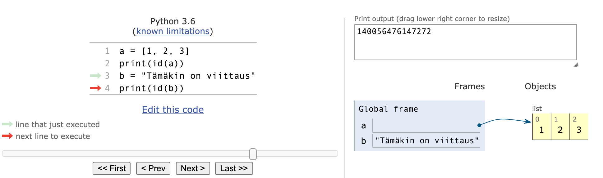
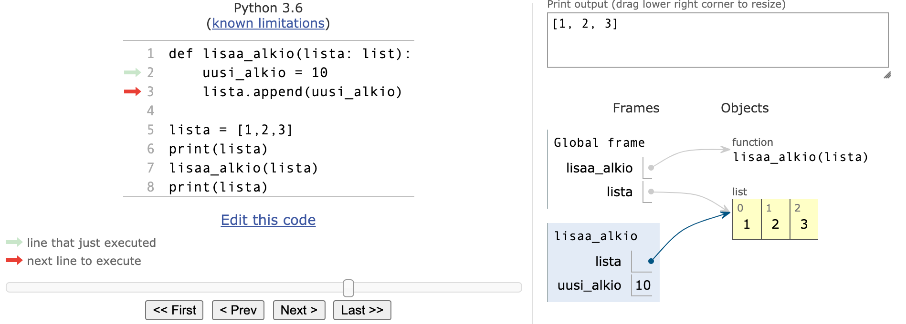
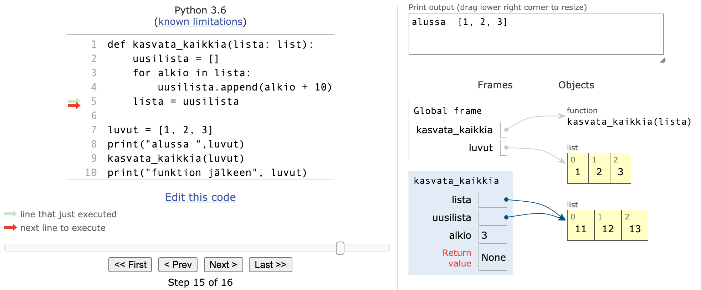

<text-box variant='learningObjectives' name="Learning objectives">

After this section

- Tiedät, mitä tarkoitetaan viittaustyyppisellä muuttujalla
- Tiedät, että samaan olioon voi olla useampia viittauksia
- Osaat käyttää listoja funktioiden parametreina
- Tiedät, mitä tarkoitetaan funktion sivuvaikutuksella

</text-box>

Thus far we have thought of a variable as a sort of "box" which contains the value of the variable. Technically this is not true in Python. What is stored in a variable is not the value per se, but a _reference_ to the _object_ which is the actual value of the variable. The object can be e.g. a number, a string or a list.

In practice this means that the value of the variable _is not stored_ in the variable itself. Instead there is information about the location in memory where the value can be found.

A reference is often depicted by an arrow from the variable to the actual value in memory:


In summary, a reference tells us where the value can be found. The function `id` can be used to find out the exact location the variable points to:

```python
a = [1, 2, 3]
print(id(a))
b = "This is a reference, too"
print(id(b))
```

<sample-output>

4538357072
4537788912

</sample-output>

The reference, or the ID of the variable, is an integer, which can be thought of as the address in computer memory where the value of the variable is stored. If you execute the above code on your own computer, the result will likely be different, as your variables will point to different locations - the references will be different.

Kuten jo [edellisen osan](/osa-5/1-lisaa-listoja#sisakkaisia-listoja-kayttavan-koodin-visualisointi) esimerkistä näimme, Python Tutorin visualisaattori näyttää viitteet "nuolina" varsinaiseen sisältöön. Visualisaattori kuitenkin "huijaa" merkkijonojen tapauksessa ja näyttää ne ikään kuin merkkijonon sisältö olisi tallennettu muuttujan sisälle:



Näin ei kuitaan ole todellisuudessa, vaan merkkijonotkin käsitellään Pythonin sisäisissä rakenteissa samaan tapaan kuin listat.

Monet Pythonin sisäänrakennetut tyypit, kuten `str`, ovat _muuttumattomia_. Tämä tarkoittaa, että olion arvo ei voi koskaan muuttua. Sen sijaan arvo voidaan korvata uudella arvolla:


Pythonissa on myös tyyppejä, jotka ovat muuttuvia. Esimerkiksi listan sisältö voi muuttua ilman, että tarvitsee luoda kokonaan uusi lista:


Hieman yllättäen myös lukuja ja totuusarvoja edustavat perustietotyypit `int`, `float` ja `bool` ovat muuttumattomia. Tarkastellaan esimerkkinä seuraavaa koodia:

```python
luku = 1
luku = 2
luku += 10
```

Vaikka vaikuttaa siltä, että koodi muuttaa lukua, teknisesti ottaen ei näin ole, vaan jokainen komento luo uuden luvun.

Seuraavan ohjelman tulostus on mielenkiintoinen:

```python
luku = 1
print(id(luku))
luku += 10
print(id(luku))
a = 1
print(id(a))
```

<sample-output>

4535856912
4535856944
4535856912

</sample-output>

Aluksi muuttuja `luku` viittaa paikkaan 4535856912, ja kun muuttujan arvo muuttuu, se alkaa viitata paikkaan 4535856944. Kun muuttujaan `a` sijoitetaan arvo 1, se alkaa viitata samaan paikkaan kuin mihin `luku` viittasi, kun sen arvo oli 1.

Vaikuttaakin siltä, että Python on tallentanut luvun 1 paikkaan 4535856912 ja aina kun jonkin muuttujan arvona on 1, muuttuja _viittaa_ tuohon paikkaan "tietokoneen muistissa".

Vaikka perustietotyypit `int`, `float` ja `bool` ovat viittauksia, ohjelmoijan ei oikeastaan tarvitse välittää asiasta.

## Useampi viittaus samaan listaan

Tarkastellaan esimerkkinä listamuuttujan arvon kopiointia:

```python
a = [1, 2, 3]
b = a
b[0] = 10
```

Sijoitus `b = a` kopioi muuttujan `a` arvon muuttujaan `b`. On tärkeä kuitenkin huomata, että muuttujan arvona _ei ole lista_ vaan _viittaus listaan_.

Sijoitus `b = a` siis kopioi viittauksen, minkä seurauksena kopioinnin jälkeen samaan listaan on kaksi viittausta:


Listaa voidaan käsitellä kumman tahansa viittauksen avulla:

```python
lista = [1, 2, 3, 4]
lista2 = lista

lista[0] = 10
lista2[1] = 20

print(lista)
print(lista2)
```

<sample-output>

[10, 20, 3, 4]
[10, 20, 3, 4]

</sample-output>

Mikäli samaan listaan on useampia viittauksia, sitä voidaan käsitellä minkä tahansa viittauksen kautta samalla tavalla. Toisaalta yhden viittauksen kautta tehtävä muutos heijastuu myös muihin viittauksiin.

Visualisaattori näyttää jälleen selkeästi mitä ohjelmassa tapahtuu:


## Listan kopiointi

Jos haluamme tehdä listasta erillisen kopion, voimme luoda uuden listan ja lisätä siihen jokaisen aluperäisen listan alkion:

```python
lista = [1, 2, 3, 3, 5]

kopio = []
for alkio in lista:
    kopio.append(alkio)

kopio[0] = 10
kopio.append(6)
print("lista", lista)
print("kopio", kopio)
```

<sample-output>

lista [1, 2, 3, 3, 5]
kopio [10, 2, 3, 3, 5, 6]

</sample-output>

Visualisaattorilla tarkastellen kopiointi näyttää seuraavalta:


Muuttuja `kopio` siis viittaa nyt eri listaan kuin muuttuja `lista`.

Helpompi tapa listan kopioimiseen on hyödyntää `[]`-operaattoria, johon tutustuimme aiemmin kurssilla. Merkintä `[:]` tarkoittaa, että listalta valitaan kaikki alkiot, ja tämän sivuvaikutuksena syntyy kopio listasta:

```python
lista = [1,2,3,4]
kopio = lista[:]

lista[0] = 10
kopio[1] = 20

print(lista)
print(kopio)
```

<sample-output>

[10, 2, 3, 4]
[1, 20, 3, 4]

</sample-output>

## Lista funktion parametrina

Kun lista välitetään parametrina funktiolle, välitetään viittaus listaan. Tämä tarkoittaa, että funktio voi muuttaa parametrinaan saamaansa listaa.

Esimerkiksi seuraava funktio lisää uuden alkion parametrinaan saamaansa listaan:

```python
def lisaa_alkio(lista: list):
    uusi_alkio = 10
    lista.append(uusi_alkio)

lista = [1,2,3]
print(lista)
lisaa_alkio(lista)
print(lista)
```

<sample-output>
[1, 2, 3]
[1, 2, 3, 10]
</sample-output>

Huomaa, että funktio `lisaa_alkio` ei palauta mitään, vaan muuttaa parametrinaan saamaansa listaa.

Visualisaattori havainnollistaa tilanteen seuraavasti:



_Global frame_ tarkoittaa pääohjelman muuttujia ja sinisellä oleva laatikko *lisaa_alkio* taas funktion parametreja ja muuttujia. Kuten visualisaatio havainnollistaa, funktio viittaa samaan listaan mihin pääohjelmakin viittaa, eli funktiossa listalle tehtävät muutokset näkyvät pääohjelmaan.

Toinen tapa olisi luoda uusi lista ja palauttaa se:

```python
def lisaa_alkio(lista: list) -> list:
    uusi_alkio = 10
    kopio = lista[:]
    kopio.append(uusi_alkio)
    return kopio

luvut = [1, 2, 3]
luvut2 = lisaa_alkio(luvut)

print("Alkuperäinen lista:", luvut)
print("Uusi lista:", luvut2)
```

<sample-output>

Alkuperäinen lista: [1, 2, 3]
Uusi lista: [1, 2, 3, 10]

</sample-output>

Jos et ole 100% varma mitä koodissa tapahtuu, käy sen toiminta läpi visualisaattorilla!

## Parametrina olevan listan muokkaaminen

Seuraavassa on yritys tehdä funktio, joka kasvattaa parametrina saamansa listan jokaista alkiota kymmenellä:

```python
def kasvata_kaikkia(lista: list):
    uusilista = []
    for alkio in lista:
        uusilista.append(alkio + 10)
    lista = uusilista

luvut = [1, 2, 3]
print("alussa ",luvut)
kasvata_kaikkia(luvut)
print("funktion jälkeen", luvut)
```

<sample-output>

alussa: [1, 2, 3]
funktion jälkeen: [1, 2, 3]

</sample-output>


Jostain syystä funktio ei kuitenkaan näytä toimivan. Mistä on kyse?

Funktiolle on välitetty parametrina _viite_ muutettavaan listaan. Sijoitus `lista = uusilista` saa aikaan sen, että parametriin talletettu viite muuttaa arvoaan funktion sisällä eli se alkaa viitata funktion sisällä luotuun uuteen listaan. Sijoitus ei kuitenkaan vaikuta funktion ulkopuolelle, siellä viitataan edelleen alkuperäiseen listaan.

Seuraava kuvasarja havainnollistaa, mihin eri muuttujat viittaavat ohjelman suorituksen aikana:


Funktion sisällä muutettu lista siis "kadotetaan" kun funktiosta palataan, ja muuttuja `luvut` viittaa koko ajan alkuperäiseen listaan.

Visualisaattori on tässäkin tapauksessa ystävä: se näyttää selkeästi, miten funktio ei koske alkuperäiseen listaan ollenkaan vaan luo uuden listan, johon muutokset tehdään:



Yksi tapa korjata ongelma on kopioida uuden listan kaikki alkiot takaisin vanhaan listaan:

```python
def kasvata_kaikkia(lista: list):
    uusilista = []
    for alkio in lista:
        uusilista.append(alkio + 10)

    # kopioidaan vanhaan listaan uuden listan arvot
    for i in range(len(lista)):
        lista[i] = uusilista[i]
```

Pythonissa on olemassa myös ovela tapa sijoittaa monta alkiota kerrallaan listaan:

```python
>>> lista = [1, 2, 3, 4]
>>> lista[1:3] = [10, 20]
>>> lista
[1, 10, 20, 4]
```

Esimerkissä siis sijoitetaan "osalistaan" eli listan kohtiin 1 ja 2 taulukollinen alkioita.

Osalistaksi voidaan myös valita koko lista:

```python
>>> lista = [1, 2, 3, 4]
>>> lista[:] = [100, 99, 98, 97]
>>> lista
[100, 99, 98, 97]
```

Eli näin tulee korvatuksi koko vanhan listan sisältö. Siispä eräs toimiva versio funktiosta näyttää seuraavalta:

```python
def kasvata_kaikkia(lista: list):
    uusilista = []
    for alkio in lista:
        uusilista.append(alkio + 10)

    lista[:] = uusilista
```

...tai ilman listan kopiontia yksinkertaisesti sijoittamalla uudet arvot heti vanhaan listaan:

```python
def kasvata_kaikkia(lista: list):
    for i in range(len(lista)):
        lista[i] += 10

```


<programming-exercise name='Items multiplied by two' tmcname='part05-08_items_multiplied_by_two'>

Tee funktio `double_items(numbers: list)`, joka saa parametrikseen lukuja sisältävän listan.

Funktio palauttaa uuden listan, jossa alkuperäisen listan alkiot on kerrottu kahdella. Funkto _ei_ saa muuttaa alkuperäistä listaa.

Esimerkki funktion kutsumisesta:

```python
if __name__ == "__main__":
    luvut = [2, 4, 5, 3, 11, -4]
    tuplaluvut = tuplaa_alkiot(luvut)
    print("alkuperäinen:", luvut)
    print("tuplattu:", tuplaluvut)
```
<sample-output>

alkuperäinen: [2, 4, 5, 3, 11, -4]
tuplattu: [4, 8, 10, 6, 22, -8]

</sample-output>

</programming-exercise>


<programming-exercise name='Remove the smallest' tmcname='part05-09_remove_smallest'>

Tee funktio `remove_smallest(numbers: list)`, joka saa parametrikseen lukuja sisältävän listan.

Funktio etsii ja poistaa listasta pienimmän alkion. Voit olettaa, että pienin alkio esiintyy listassa vain kerran.

Funktio ei siis palauta mitään, vaan muokkaa parametrinaan saamaansa listaa!

Esimerkki funktion kutsumisesta:

```python
if __name__ == "__main__":
    luvut = [2, 4, 6, 1, 3, 5]
    poista_pienin(luvut)
    print(luvut)
```
<sample-output>

[2, 4, 6, 3, 5]

</sample-output>

</programming-exercise>


<programming-exercise name='Sudoku: print out the grid and add a number' tmcname='part05-10_sudoku_print_and_add'>

Tässä tehtävässä toteutetaan vielä kaksi funktiota sudokua varten: `print_sudoku` ja `add_number`.

Funktio `print_sudoku` saa parametriksi sudokuruudukkoa esittävän kaksiulotteisen listan ja tulostaa sen alla olevan esimerkkitulostuksen mukaisessa muodossa.

Funktio `add_number(sudoku: list, row_no: int, column_no: int, number:int)` saa parametriksi sudokuruudukkoa esittävän kaksiulotteisen listan, rivi- ja sarakenumerot sekä luvun väliltä 1–9. Funktio lisää luvun parametrien ilmoittamaan kohtaan sudokuruudukkoa.

```python
sudoku  = [
    [0, 0, 0, 0, 0, 0, 0, 0, 0],
    [0, 0, 0, 0, 0, 0, 0, 0, 0],
    [0, 0, 0, 0, 0, 0, 0, 0, 0],
    [0, 0, 0, 0, 0, 0, 0, 0, 0],
    [0, 0, 0, 0, 0, 0, 0, 0, 0],
    [0, 0, 0, 0, 0, 0, 0, 0, 0],
    [0, 0, 0, 0, 0, 0, 0, 0, 0],
    [0, 0, 0, 0, 0, 0, 0, 0, 0],
    [0, 0, 0, 0, 0, 0, 0, 0, 0]
]

print_sudoku(sudoku)
add_number(sudoku, 0, 0, 2)
add_number(sudoku, 1, 2, 7)
add_number(sudoku, 5, 7, 3)
print()
print("Kolme numeroa lisätty:")
print()
tulosta(sudoku)
```

<sample-output>

<pre>
_ _ _  _ _ _  _ _ _
_ _ _  _ _ _  _ _ _
_ _ _  _ _ _  _ _ _

_ _ _  _ _ _  _ _ _
_ _ _  _ _ _  _ _ _
_ _ _  _ _ _  _ _ _

_ _ _  _ _ _  _ _ _
_ _ _  _ _ _  _ _ _
_ _ _  _ _ _  _ _ _

Kolme numeroa lisätty:

2 _ _  _ _ _  _ _ _
_ _ 7  _ _ _  _ _ _
_ _ _  _ _ _  _ _ _

_ _ _  _ _ _  _ _ _
_ _ _  _ _ _  _ _ _
_ _ _  _ _ _  _ 3 _

_ _ _  _ _ _  _ _ _
_ _ _  _ _ _  _ _ _
_ _ _  _ _ _  _ _ _

</pre>

</sample-output>

**Vihje**

Saatat tässä tehtävässä hyötyä siitä, että `print`-komentoa on mahdollista käyttää myös siten, että se ei aiheuta rivinvaihtoa:

```python
print("merkkejä ", end="")
print("ilman välejä", end="")
```

<sample-output>

merkkejä ilman välejä

</sample-output>

Joskus taas tarvitaan pelkkää rivinvaihtoa, ja se onnistuu seuraavasti:

```python
print()
```

</programming-exercise>

<programming-exercise name='Sudoku: add number to a copy of the grid' tmcname='part05-11_sudoku_add_to_copy'>

Viimeisessä sudokua käsittelevässä tehtävässä toteutetaan hieman erilainen versio funktiosta, jonka avulla sudokuruudukkoon lisätään uusia lukuja.

Funktio `copy_and_add(sudoku: list, row_no: int, column_no: int, number:int)` saa parametreikseen sudokuruudukkoa esittävän kaksiulotteisen listan, rivinumeron, sarakenumeron sekä luvun väliltä 1–9. Funktio _palauttaa_ parametrina saadusta sudokuruudukosta _kopion_, johon on lisätty parametrina saatu luku parametrina saatuun sijaintiin sijoitettuna. Funktio _ei saa muuttaa_ parametrina annettua sudokuruudukkoa.

Seuraavassa on edellisen tehtävän funktiota `print_sudoku` hyödyntävä käyttöesimerkki:

```python
sudoku  = [
    [0, 0, 0, 0, 0, 0, 0, 0, 0],
    [0, 0, 0, 0, 0, 0, 0, 0, 0],
    [0, 0, 0, 0, 0, 0, 0, 0, 0],
    [0, 0, 0, 0, 0, 0, 0, 0, 0],
    [0, 0, 0, 0, 0, 0, 0, 0, 0],
    [0, 0, 0, 0, 0, 0, 0, 0, 0],
    [0, 0, 0, 0, 0, 0, 0, 0, 0],
    [0, 0, 0, 0, 0, 0, 0, 0, 0],
    [0, 0, 0, 0, 0, 0, 0, 0, 0]
]

kopio = copy_and_add(sudoku, 0, 0, 2)
print("Alkuperäinen:")
print_sudoku(sudoku)
print()
print("Kopio:")
print_sudoku(kopio)
```

<sample-output>

<pre>
Alkuperäinen:
_ _ _  _ _ _  _ _ _
_ _ _  _ _ _  _ _ _
_ _ _  _ _ _  _ _ _

_ _ _  _ _ _  _ _ _
_ _ _  _ _ _  _ _ _
_ _ _  _ _ _  _ _ _

_ _ _  _ _ _  _ _ _
_ _ _  _ _ _  _ _ _
_ _ _  _ _ _  _ _ _

Kopio:
2 _ _  _ _ _  _ _ _
_ _ _  _ _ _  _ _ _
_ _ _  _ _ _  _ _ _

_ _ _  _ _ _  _ _ _
_ _ _  _ _ _  _ _ _
_ _ _  _ _ _  _ _ _

_ _ _  _ _ _  _ _ _
_ _ _  _ _ _  _ _ _
_ _ _  _ _ _  _ _ _

</pre>

</sample-output>

**Vihje** tässä tehtävässä pitää olla tarkkana mitä kaikkea tulee kopioida, ja mihin lisäys lopulta kohdistuu. Kuten yleensäkin, [visualisaattori](http://www.pythontutor.com/visualize.html#mode=edit) auttaa myös nyt. Sudokuruudukon koon takia näkymä tosin on hieman normaalia sekavampi.

</programming-exercise>

<programming-exercise name='Tic-Tac-Toe' tmcname='part05-12_tic_tac_toe'>

Ristinollaa pelataan 3 x 3 -kokoisella ruudukolla, johon pelaajat merkitsevät vuorotellen ristin tai nollan. Pelin voittaa se pelaaja, joka saa ensimmäisenä kolme merkkiä pystyyn, vaakaan tai kulmittain. Peli päättyy tasapeliin, jos kumpikaan pelaaja ei saa kolmen sarjaa.

Kirjoita funktio `play_turn(game_board: list, x: int, y: int, piece: str)`, jossa sijoitetaan annettu pelinappula annettuihin koordinaatteihin pelilaudalla. Koordinaattien arvot ovat väliltä 0..2.

**Huomaa** että tässä tehtävässä parametrit ovat eri päin kuin sudokussa, ensin annetaan saraketta kuvaava `x` ja sen jälkeen riviä kuvaava `y`.

Pelilauta koostuu merkkijonoista seuraavasti:

* `""`: tyhjä ruutu
* `"X"`: pelaajan 1 merkki
* `"O"`: pelaajan 2 merkki

Funktio palauttaa arvon `True`, jos nappula saatiin sijoitettua laudalle (eli jos paikka oli tyhjä), ja arvon `False`, jos paikka oli varattu TAI jos koordinaatin arvo oli liian pieni tai suuri (eli ei väliltä 0..2).

Esimerkiksi:

```python
lauta = [["", "", ""], ["", "", ""], ["", "", ""]]
print(play_turn(lauta, 2, 0, "X"))
print(lauta)
```

<sample-output>

True
[['', '', 'X'], ['', '', ''], ['', '', '']]

</sample-output>

</programming-exercise>

<programming-exercise name='Transpose a matrix' tmcname='part05-13_transpose_matrix'>

Kirjoita funktio `transpose(matrix: list)`, joka saa parametrikseen kaksiulotteisen kokonaislukuja sisältävän taulukon eli matriisin. Funktio _transponoi_ matriisin eli muuntaa rivit sarakkeiksi ja päinvastoin.

Voit olettaa, että matriisissa on yhtä monta riviä kuin sarakettakin (eli matriisi on _neliömatriisi_).

Esimerkiksi matriisista

```python
1 2 3
4 5 6
7 8 9
```

tulisi transponoinnin jälkeen tällainen:

```python
1 4 7
2 5 8
3 6 9
```

Funktio ei palauta mitään, vaan muokkaa parametrinaan saamaansa matriisia.

</programming-exercise>

## Funktioiden sivuvaikutukset

Koska funktio saa parametrinaan viittauksen listaan, se voi muuttaa tätä listaa. Jos funktion varsinaisena tarkoituksena ei ole muuttaa listaa, muutokset voivat aiheuttaa ongelmia toisaalla ohjelmassa.

Tarkastellaan esimerkkinä funktiota, jonka tarkoituksena on etsiä listan toiseksi pienin alkio:

```python
def second_smallest(my_list: list) -> int:
    # järjestetyn listan toiseksi pienin alkio on kohdassa 1
    lista.sort()
    return lista[1]

luvut = [1, 4, 2, 5, 3, 6, 4, 7]
print(second_smallest(luvut))
print(luvut)
```

<sample-output>
2
[1, 2, 3, 4, 4, 5, 6, 7]
</sample-output>

Funktio kyllä etsii ja löytää toiseksi pienimmän alkion, mutta sen lisäksi se muuttaa listan alkioiden järjestyksen. Jos järjestyksellä on merkitystä muualla ohjelmassa, funktion kutsuminen voi aiheuttaa virheitä. Esimerkin kaltaista muutosta viittauksena saatuun olioon kutsutaan funktion _sivuvaikutukseksi_.

Voimme toteuttaa funktion ilman sivuvaikutuksia näin:

```python
def second_smallest(my_list: list) -> int:
    kopio = sorted(lista)
    return kopio[1]

luvut = [1, 4, 2, 5, 3, 6, 4, 7]
print(second_smallest(luvut))
print(luvut)
```

<sample-output>

2
[1, 4, 2, 5, 3, 6, 4, 7]

</sample-output>

Koska funktio `sorted` palauttaa uuden järjestetyn listan, toiseksi pienimmän alkion etsiminen ei enää sotke listan alkuperäistä järjestystä.

Usein pidetään hyvänä asiana, että funktiot eivät aiheuta sivuvaikutuksia, sillä sivuvaikutukset voivat hankaloittaa ohjelmien toimivuuden varmistamista.

Sivuvaikutuksettomia funktioita kutsutaan myös _puhtaiksi funktioiksi_ ja erityisesti funktionaalista ohjelmointityyliä käytettäessä funktiot pyritään rakentamaan näin. Palaamme aiheeseen tarkemmin _Ohjelmoinnin jatkokurssilla_.

A quiz to review the contents of this section:

<quiz id="b254a4f9-09bb-55c8-87c0-538f91e51ace"></quiz>
