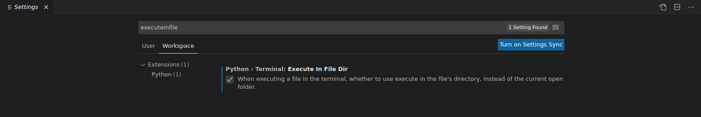
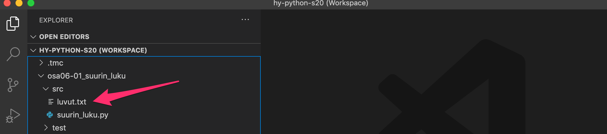

<text-box variant='learningObjectives' name="Learning objectives">

After this section

- Tiedät, miten tiedoston sisällön voi lukea Pythonissa
- Tiedät, mitä ovat tekstitiedosto ja CSV-tiedosto
- Osaat purkaa ja käsitellä CSV-tiedoston sisällön ohjelmassa

</text-box>

<!--the same text is in sections 3-1, 5-1 and 6-1, check them all if you're changing this-->
<text-box variant='hint' name="About the exercises on this course">

Becoming a proficient programmer requires a lot of practice, sometimes even quite mechanical practice. It also involves developing problem solving skills and applying intuition. This is why there are a lot of exercises of different kinds on this course. Some of them ask you to quite straightforwardly apply what you have learnt in the material, but some of them are intentionally more challenging and open-ended.

Some of the exercises might at first seem overwhelming, but this is nothing to worry about. None of the exercises is strictly mandatory, and in fact _only 25 % of the points in each part is required to pass the course._ You can find more details about passing the course on the [page on grading](/grading-and-exams).

**The exercises are not in any specific order of difficulty.** Each section usually introduces some new programming concepts, and these are then practised with both simpler and more complicated exercises. **If you come across an exercise that feels too difficult, move on to the next one.** You can always come back to the more difficult exercises if you have time later.

When the going inevitably gets tough, a word of consolation: a task that seems impossibly difficult this week will likely feel rather easy in about four weeks' time.

</text-box>

Yksi tavallinen ohjelmoinnin käyttötarkoitus on käsitellä tiedostoissa olevaa tietoa. Ohjelmat voivat lukea tietoa tiedostoista ja tallentaa tuloksia tiedostoihin. Tiedostojen avulla voimme käsitellä suuriakin aineistoja helposti automaattisesti.

Oletamme tällä kurssilla, että käsiteltävät tiedostot ovat _tekstitiedostoja_ eli ne muodostuvat riveistä, joilla on tekstiä. Esimerkiksi kurssilla käytetty Visual Studio Code -editori käsittelee tekstitiedostoja. Huomaa, että esimerkiksi Word-dokumentti ei ole tekstitiedosto, vaan siinä on tekstin lisäksi muotoilutietoja ja sen käsittely ohjelmallisesti olisi vaikeaa.

## Tiedostosta lukeminen

Käytetään esimerkkinä tiedostoa `esimerkki.txt`, jonka sisältönä on:

<sample-data>

Moi kaikki!
Esimerkkitiedostomme on kolmerivinen.
Viimeinen rivi.

</sample-data>

Hyvä tapa käsitellä tiedostoja Pythonissa on käyttää `with`-lausetta, jonka alkurivi avaa tiedoston. Tämän jälkeen tulee lohko, jonka sisällä tiedostoa voi käsitellä. Lohkon jälkeen tiedosto sulkeutuu automaattisesti, eikä sitä voi enää käsitellä.

Esimerkiksi seuraava koodi lukee ja tulostaa tiedoston sisällön:

```python
with open("esimerkki.txt") as tiedosto:
    sisalto = tiedosto.read()
    print(sisalto)
```

<sample-output>

Moi kaikki!
Esimerkkitiedostomme on kolmerivinen.
Viimeinen rivi.

</sample-output>

Koodissa muuttuja `tiedosto` on _tiedostokahva_, jonka kautta tiedostoa voi käsitellä avaamisen jälkeen. Tässä tapauksessa käytämme metodia `read`, joka palauttaa koko tiedoston sisällön yhtenä merkkijonona. Tässä tapauksessa palautettu merkkijono on seuraava:

```
"Moi kaikki!\nEsimerkkitiedostomme on kolmerivinen.\nViimeinen rivi."
```

## Tiedoston sisällön läpikäynti

Metodi `read` on näppärä, jos halutaan esimerkiksi tulostaa tiedoston sisältö kokonaisuudessaan ruudulle. Usein haluamme kuitenkin käsitellä tiedostoa rivi kerrallaan.

Voimme käyttää tiedoston sisällön lukemiseen `for`-silmukkaa, joka käy läpi tiedoston rivit yksi kerrallaan – siis samaan tapaan kuin esimerkiksi listan läpikäynnissä.

Seuraava esimerkki lukee saman tiedoston nyt käyttäen `for`-silmukkaa, poistaa joka rivin perästä rivinvaihdon ja laskee rivien yhteispituuden:

```python
with open("esimerkki.txt") as tiedosto:
    laskuri = 0
    yhteispituus = 0

    for rivi in tiedosto:
        rivi = rivi.replace("\n", "")
        laskuri += 1
        print("Rivi", laskuri, rivi)
        pituus = len(rivi)
        yhteispituus += pituus

print("Rivien yhteispituus:", yhteispituus)
```

<sample-output>

Rivi 1 Moi kaikki!
Rivi 2 Esimerkkitiedostomme on kolmerivinen.
Rivi 3 Viimeinen rivi.
Rivien yhteispituus: 63

</sample-output>

Huomaa, että rivien läpikäynnissä jokaisen rivin perässä on rivinvaihto `\n`. Yllä oleva koodi kuitenkin poistaa rivinvaihdot `replace`-funktiolla, joka korvaa rivinvaihdot tyhjillä merkkijonoilla. Tämän ansiosta tulostukseen ei tule ylimääräisiä rivivaihtoja ja ohjelma laskee oikein tiedoston rivien yhteispituuden.

<programming-exercise name='Biggest Number' tmcname='osa06-01_suurin_luku'>

File `numbers.txt` contains numbers, one number per line. For example:

```sh
2
45
108
3
-10
1100
...etc...
```

Write a function `largest`, which reads the file and returns the largest number from the file.

Please notice, that the file is always named `numbers.txt` and the function does not receive any arguments.

**Note!** If VS Code can't find the file and you have checked that there are no spelling errors, take a look at the instructions following the exercise.etta.

</programming-exercise>

## Mitä jos VS code ei löydä tiedostoja koodia suoritettaessa?

Jos VS Code ei löydä tiedostoa suorittaessasi koodia (vihreää nappia painamalla) vaikka olet tarkastanut tiedoston nimen kirjoitusasun, voit kokeilla seuraavaa:

* Mene asetuksiin valikosta _File_ -> _Preferences_ -> _Settings_
* Etsi muutettava kohta hakusanalla "executeinfile"
* Valitse välilehti _Workspace_
* Laita raksi kohtaan _Python_ -> _Terminal_ -> _Execute In File Dir_

Oikein tehtynä asetus näyttää suunilleen seuraavalta:



Jos edellinenkään ei toimi, voit kopioida kansiossa _src_ olevan testaukseen käytetyn tiedoston sisällön



suoraan tehtäväkansion alle


## Tiedostoja lukevan koodin debuggaus

Jos yrität käyttää VS Coden [debuggeria](/osa-4/1-vscode#debuggeri) tiedostoja lukevan koodin suorittamiseen, törmäät ikävään virheilmoitukseen:


Syynä tälle on se, että debuggeri etsii tiedostoja tehtäväkansion juuresta eikä edes _Execute In File Dir_ -asetus ei asiaa muuta. Helpoin ratkaisu ongelmaan on edellisessä luvussa kuvattu testaukseen käytetyn tiedoston kopioiminen  tehtävähakemiston juureen.

Kun olet kopioinut tiedostot tehtävähakemiston juureen, joudut ehkä vielä käynnistämään visual studio coden uudelleen jotta kaikki toimisi.

## CSV-tiedoston lukeminen

CSV-tiedosto (_Comma Separated Values_) on tekstitiedosto, jonka jokaisella rivillä on tietyllä välimerkillä erotettua tietoa. Välimerkkinä on usein pilkku `,` tai puolipiste `;`, mutta mikä tahansa muukin merkki on periaatteessa mahdollinen.

CSV-tiedostoja käytetään usein erilaisten aineistojen esittämiseen. Myös Excelin ja muiden vastaavien ohjelmien taulukot voidaan tallentaa CSV-muodossa, jolloin niitä on helppo käsitellä muilla ohjelmilla.

Voimme lukea CSV-tiedoston rivit `for`-silmukalla, mutta miten erottaa rivillä olevat tiedot toisistaan? Helppo tapa on käyttää merkkijonojen `split`-metodia: metodille annetaan haluttu välimerkki, ja se palauttaa tiedot välimerkin mukaan eroteltuna listana merkkijonoja.

Esimerkki metodin käytöstä:

```python
teksti = "apina,banaani,cembalo"
sanat = teksti.split(",")
for sana in sanat:
    print(sana)
```

<sample-output>

apina
banaani
cembalo

</sample-output>

Tarkastellaan esimerkkinä tiedostoa `arvosanat.csv`, joka sisältää jokaisella rivillä aluksi opiskelijan nimen ja sen jälkeen tämän eri kursseista saamat arvosanat. Tiedot on erotettu toisistaan puolipisteillä.

<sample-data>

Pekka;5;4;5;3;4;5;5;4;2;4
Paula;3;4;2;4;4;2;3;1;3;3
Pirjo;4;5;5;4;5;5;4;5;4;4

</sample-data>

Seuraava ohjelma käy läpi tiedoston rivit, jakaa jokaisen rivin osiin ja näyttää opiskelijan nimen sekä arvosanat.

```python
with open("arvosanat.csv") as tiedosto:
    for rivi in tiedosto:
        rivi = rivi.replace("\n", "")
        osat = rivi.split(";")
        nimi = osat[0]
        arvosanat = osat[1:]
        print("Nimi:", nimi)
        print("Arvosanat:", arvosanat)
```

<sample-output>

Nimi: Pekka
Arvosanat: ['5', '4', '5', '3', '4', '5', '5', '4', '2', '4']
Nimi: Paula
Arvosanat: ['3', '4', '2', '4', '4', '2', '3', '1', '3', '3']
Nimi: Pirjo
Arvosanat: ['4', '5', '5', '4', '5', '5', '4', '5', '4', '4']

</sample-output>

<programming-exercise name='Fruit Store' tmcname='osa06-02_hedelmakauppa'>

File `fruits.csv` contains fruits and their prices according to following example:

```sh
banana;6.50
apple;4.95
orange;8.0
...etc...
```

Write function `read_fruits`, which reads the file and returns a dictionary based on the file. In the dictionary, name of the fruit is key and the price value. Price needs to be of type `float`.

Please note, that the name of the file is always `fruits.csv` and the function does not receive any arguments.

</programming-exercise>

<programming-exercise name='Matriisi' tmcname='osa06-03_matriisi'>

Tiedostossa `matriisi.txt` on seuraavan esimerkin kaltainen matriisi:

```sh
1,0,2,8,2,1,3,2,5,2,2,2
9,2,4,5,2,4,2,4,1,10,4,2
...jne...
```

Kirjoita funktiot `summa` ja `maksimi`, jotka lukevat ja palauttavat nimensä mukaisesti matriisin kaikkien alkioiden summan ja suurimman alkion.

Kirjoita lisäksi funktio `rivisummat`, joka palauttaa listassa kaikkien matriisin rivien summat. Esimerkiksi matriisille

```sh
1,2,3
2,3,4
```

funktio palauttaisi listan `[6, 9]`.

Vinkki: Voit kirjoittaa ohjelmaan myös muita funktioita – kannattaa siis miettiä, mitä kaikkia yhteisiä toimintoja kolmea funktiota varten vaaditaan. Huomaa, että tiedoston nimi on aina `matriisi.txt` eikä tehtävänannossa määritellyille funktioille anneta parametreja. Itse lisäämäsi funktiot voivat hyödyntää myös parametreja.

**Huom!** Jos VS Code ei löydä tiedostoa vaikka olet tarkastanut tiedoston nimen kirjoitusasun, voit kokeilla [täällä](/osa-6/1-tiedostojen-lukeminen#mita-jos-vs-code-ei-loyda-tiedostoja-koodia-suoritettaessa) olevaa ohjetta.

</programming-exercise>

## Saman tiedoston lukeminen moneen kertaan

Joissain tilanteissa ohjelman on tarvetta lukea sama tiedosto useampaan kertaan. Tarkastellaan esimerkkinä seuraavaa ohjelmaa, joka käsittelee henkilötietoja sisältävää tiedostoa:

<sample-data>
Pekka;40;Helsinki
Emilia;34;Espoo
Erkki;42;Turku
Antti;100;Helsinki
Liisa;58;Suonenjoki
</sample-data>

```python
with open("henkilot.csv") as tiedosto:
    # tulostetaan nimet
    for rivi in tiedosto:
        osat = rivi.split(";")
        print("Nimi:", osat[0])

    # etsitään vanhin
    vanhimman_ika = -1
    for rivi in tiedosto:
        osat = rivi.split(";")
        nimi = osat[0]
        ika = int(osat[1])
        if ika > vanhimman_ika:
            vanhimman_ika = ika
            vanhin = nimi
    print("vanhin on", vanhin)
```

Ohjelma aiheuttaa erikoisen virheilmoituksen:

```python
Traceback (most recent call last):
    print("vanhin on"; vanhin)
UnboundLocalError: local variable 'vanhin' referenced before assignment
```

Syynä virheelle on se, että jälkimmäistä for-silmukkaa ei suoriteta ollenkaan, sillä tiedoston voi lukea vain kerran. Tämän jälkeen ollaan päästy "tiedoston loppuun", ja vaikka yritetään lukea tiedostosta lisää jälkimmäisessä silmukassa, tietoon ei päästä enää käsiksi.

Tiedosto onkin avattava uudelleen komennolla `open` toista lukukertaa varten:

```python
with open("henkilot.csv") as tiedosto:
    # tulostetaan nimet
    for rivi in tiedosto:
        osat = rivi.split(";")
        print("Nimi:", osat[0])

with open("henkilot.csv") as tiedosto:
    # etsitään vanhin
    vanhimman_ika = -1
    for rivi in tiedosto:
        osat = rivi.split(";")
        nimi = osat[0]
        ika = int(osat[1])
        if ika > vanhimman_ika:
            vanhimman_ika = ika
            vanhin = nimi
    print("vanhin on", vanhin)
```

Yleensä aina on kuitenkin parasta lukea tiedosto vain kerran ja tallentaa se muotoon, jota ohjelman toiminnallisuudet pystyvät hyödyntämään:

```python
henkilot = []
# luetaan tiedostosta henkilöt listaan
with open("henkilot.csv") as tiedosto:
    for rivi in tiedosto:
        osat = rivi.split(";")
        henkilot.append((osat[0], int(osat[1]), osat[2]))

# tulostetaan nimet
for henkilo in henkilot:
    print("Nimi:", henkilo[0])

# etsitään vanhin
vanhimman_ika = -1
for henkilo in henkilot:
    nimi = henkilo[0]
    ika = henkilo[1]
    if ika > vanhimman_ika:
        vanhimman_ika = ika
        vanhin = nimi
print("vanhin on", vanhin)
```

## Lisää CSV-tiedoston käsittelyä

Jatketaan opiskelijoiden arvosanoja sisältävän tiedoston `arvosanat.csv` käsittelyä. Tiedosto näyttää siis seuraavalta:

<sample-data>

Pekka;5;4;5;3;4;5;5;4;2;4
Paula;3;4;2;4;4;2;3;1;3;3
Pirjo;4;5;5;4;5;5;4;5;4;4

</sample-data>

Seuraava ohjelma luo tiedoston perusteella sanakirjan `arvosanat`, jossa jokainen avain on opiskelijan nimi ja vastaava arvo on lista arvosanoista. Ohjelma muuttaa arvosanat kokonaisluvuiksi, jotta niitä on mukavampaa käsitellä myöhemmin.

```python
arvosanat = {}
with open("arvosanat.csv") as tiedosto:
    for rivi in tiedosto:
        rivi = rivi.replace("\n", "")
        osat = rivi.split(";")
        nimi = osat[0]
        arvosanat[nimi] = []
        for arvosana in osat[1:]:
            arvosanat[nimi].append(int(arvosana))

print(arvosanat)
```

<sample-output>

{'Pekka': [5, 4, 5, 3, 4, 5, 5, 4, 2, 4], 'Paula': [3, 4, 2, 4, 4, 2, 3, 1, 3, 3], 'Pirjo': [4, 5, 5, 4, 5, 5, 4, 5, 4, 4]}

</sample-output>

Tämän jälkeen voimme vaikkapa tulostaa analyysin arvosanoista käymällä läpi sanakirjan `arvosanat` perusteella:

```python
for nimi, lista in arvosanat.items():
    paras = max(lista)
    keskiarvo = sum(lista) / len(lista)
    print(f"{nimi}: paras arvosana {paras}, keskiarvo {keskiarvo:.2f}")
```

<sample-output>

Pekka: paras arvosana 5, keskiarvo 4.10
Paula: paras arvosana 4, keskiarvo 2.90
Pirjo: paras arvosana 5, keskiarvo 4.50

</sample-output>

Kannattaa tutustua huolella esimerkkikoodiin. Se voi ensisilmäyksellä vaikuttaa monimutkaiselta, mutta ratkaisu on helposti sovellettavissa monenlaisiin datatiedostoihin.

## Eroon turhista riveistä, välilyönneistä ja rivinvaihdoista

Olemme tallentaneet Excelistä nimiä taulukon CSV-muodossa:

```sh
etunimi; sukunimi
Pekka; Python
Jaana; Java
Heikki; Haskell
```

Kuten tyypillistä, Excel on lisännyt sarakkeiden väliin erottimena toimivan puolipisteen lisäksi myös välilyönnin.

Haluamme tulostaa listalla olevat sukunimet. Koska ensimmäinen rivi kertoo sarakkeiden otsikot, ohitamme sen:

```python
sukunimet = []
with open("henkilot.csv") as tiedosto:
    for rivi in tiedosto:
        osat = rivi.split(";")
        # ohitetaan otsikkorivi
        if osat[0] == "etunimi":
            continue
        sukunimet.append(osat[1])

print(sukunimet)
```

Tulostus näyttää seuraavalta:

<sample-output>

[' Python\n', ' Java\n', ' Haskell']

</sample-output>

Kaikkiin paitsi viimeiseen rivin sukunimeen on jäänyt mukaan rivinvaihtomerkki, ja jokaisen sukunimen alkuun on jäänyt ikävä välilyönti.

Pääsisimme näistä eroon aiempien esimerkkien tapaan käyttämällä metodia `replace`, mutta parempi vaihtoehto tässä tilanteessa on käyttää metodia `strip`, joka poistaa merkkijonon alusta ja lopusta ns. whitespace-merkit, eli välilyönnit, rivinvaihdot ja muut normaalina merkkinä tulostumattomat merkit.

Kokeillaan metodin toimintaa konsolissa:

```python
>>> " koe ".strip()
'koe'
>>> "\n\ntesti\n".strip()
'testi'
>>>
```

Tarvittava muutos ohjelmaan on helppo:

```python
sukunimet = []
with open("henkilot.csv") as tiedosto:
    for rivi in tiedosto:
        osat = rivi.split(';')
        if osat[0] == "etunimi":
            continue # tämä oli otsikkorivi, ei huomioida!
        sukunimet.append(osat[1].strip())
print(sukunimet)
```

Tämän jälkeen tulostus on halutunlainen:

<sample-output>

['Python', 'Java', 'Haskell']

</sample-output>

Merkkijonoilla on myös metodit `lstrip` ja `rstrip`, jotka poistavat ainoastaan merkkijonon vasemmalla tai oikealla puolella olevia merkkejä.

```python
>>> " testimerkkijono  ".rstrip()
' testimerkkijono'
>>> " testimerkkijono  ".lstrip()
'testimerkkijono  '
```

## Eri tiedostoissa olevien tietojen yhdistely

On hyvin yleistä, että ohjelmassa tarvittava data on talletettu useaan erilliseen tiedostoon. Tarkastellaan esimerkkinä tilannetta, jossa yrityksen henkilöstön tiedot ovat omassa tiedostossaan `tyontekijat.csv`:

```csv
hetu;nimi;osoite;kaupunki
080488-123X;Pekka Mikkola;Vilppulantie 7;00700 Helsinki
290274-044S;Liisa Marttinen;Mannerheimintie 100 A 10;00100 Helsinki
010479-007Z;Arto Vihavainen;Pihapolku 4;01010 Kerava
010499-345K;Leevi Hellas;Tapiolantie 11 B;02000 Espoo
```

Työntekijöiden palkat taas ovat talletettu omaan tiedostoonsa `palkat.csv`

```csv
hetu;palkka;bonus
080488-123X;3300;0
290274-044S;4150;200
010479-007Z;1300;1200
```

Molempien tiedostojen riveillä on ensin _henkilötunnus_, joka kertoo kenen tiedoista on kyse. Käyttämällä henkilötunnusta yhdistävänä tekijänä, on helppo yhdistää henkilöiden nimet ja palkat toisiinsa, ja tehdä esimerkiksi ohjelma, joka tulostaa seuraavanlaisen näkymän henkilöiden ansioihin:

<sample-output>

<pre>
ansiot:
Pekka Mikkola    3300 euroa
Liisa Marttinen  4350 euroa
Arto Vihavainen  2500 euroa
</pre>

</sample-output>

Ohjelma käyttää aputietorakenteena kahta saankirjaa `nimet` ja `palkat`, joissa molemmissa avaimena toimii henkilötunnus:

```python
nimet = {}

with open("tyontekijat.csv") as tiedosto:
    for rivi in tiedosto:
        osat = rivi.split(';')
        if osat[0] == "hetu":
            continue
        nimet[osat[0]] = osat[1]

palkat = {}

with open("palkat.csv") as tiedosto:
    for rivi in tiedosto:
        osat = rivi.split(';')
        if osat[0] == "hetu":
            continue
        palkat[osat[0]] = int(osat[1]) +int(osat[2])

print("ansiot:")

for hetu, nimi in nimet.items():
    if hetu in palkat:
        palkka = palkat[hetu]
        print(f"{nimi:16} {palkka} euroa")
    else:
        print(f"{nimi:16} 0 euroa")
```

Ohjelma siis muodostaa ensin sanakirjat `nimet` ja `palkat`, joiden sisältö näyttää seuraavilta:

```sh
{
    '080488-123X': 'Pekka Mikkola',
    '290274-044S': 'Liisa Marttinen',
    '010479-007Z': 'Arto Vihavainen',
    '010499-345K': 'Leevi Hellas'
}

{
    '080488-123X': 3300,
    '290274-044S': 4350,
    '010479-007Z': 2500
}
```

Lopun for-silmukka yhdistää henkilöiden nimet ja niitä vastaavat palkat sanakirjojen avulla.

Ohjelma huomioi myös tilanteen, jossa henkilön palkkatietoja ei ole olemassa.

Huomaa, että koska ohjelma käyttää aputietorakenteena sanakirjaa, ei henkilöitä vastaavien rivien järjestyksellä ole merkitystä.

<programming-exercise name='Kurssin tulokset, osa 1' tmcname='osa06-04_kurssin_tulokset_osa1'>

Ohjelma käsittelee kahta CSV-muotoista tiedostoa. Toisessa on tieto opiskelijoista:

```csv
opnro;etunimi;sukunimi
12345678;pekka;peloton
12345687;jaana;javanainen
12345699;liisa;virtanen
```

ja toisessa opiskelijoiden viikoittaisesta tehtävien lukumäärästä:

```csv
opnro;v1;v2;v3;v4;v5;v6;v7
12345678;4;1;1;4;5;2;4
12345687;3;5;3;1;5;4;6
12345699;10;2;2;7;10;2;2
```

Molempien CSV-tiedostojen ensimmäinen rivi on otsikkorivi, joka kertoo kunkin kentän sisällön.

Tee ohjelma, joka kysyy tiedostojen nimet ja tämän jälkeen tulostaa kunkin opiskelijan tehtävien yhteenlasketun määrän. Ohjelma toimii seuraavasti, kun tiedostojen sisältö on yllä oleva:

<sample-output>

Opiskelijatiedot: **opiskelijat1.csv**
Tehtävätiedot: **tehtavat1.csv**
pekka peloton 21
jaana javanainen 27
liisa virtanen 35

</sample-output>

Vinkki: Ohjelman testaileminen on toivottoman hidasta, jos käyttäjä joutuu kirjoittamaan syötteen aina käsin. Testausvaiheessa syötteet kannattaakin antaa "kovakoodaamalla" ne esim. seuraavasti:

```python
if False:
    # tänne ei tulla
    opiskelijatiedot = input("Opiskelijatiedot: ")
    tehtavatiedot = input("Tehtävätiedot: ")
else:
    # kovakoodatut syötteet
    opiskelijatiedot = "opiskelijat1.csv"
    tehtavatiedot = "tehtavat1.csv"
```

Ohjelman varsinainen toiminnallisuus on nyt "piilotettu" ehdon `False`-haaraan, jota ei suoriteta koskaan.

Jos taas halutaan nopeasti tarkastaa, toimiiko ohjelma myös käyttäjän kirjoittaessa syötteen, voidaan arvo `False` muuttaa arvoksi `True`:

```python

if True:
    opiskelijatiedot = input("Opiskelijatiedot: ")
    tehtavatiedot = input("Tehtävätiedot: ")
else:
    # tänne ei tulla!
    opiskelijatiedot = "opiskelijat1.csv"
    tehtavatiedot = "tehtavat1.csv"
```

Kun koodi on kunnossa, voi ehtorakenteen poistaa.

**Huom:** tässä tehtävässä (eikä missään muussakaan tehtävissä missä _ei_ erikseen pyydetä funktioiden toteuttamista) mitään koodia __ei tule sijoittaa__
`if __name__ == "__main__"`-lohkoon!

**Toinen huomio** Jos VS Code ei löydä tiedostoa vaikka olet tarkastanut tiedoston nimen kirjoitusasun, voit [täällä](/osa-6/1-tiedostojen-lukeminen#mita-jos-vs-code-ei-loyda-tiedostoja-koodia-suoritettaessa) kokeilla olevaa ohjetta.

</programming-exercise>

<programming-exercise name='Kurssin tulokset, osa 2' tmcname='osa06-05_kurssin_tulokset_osa2'>

Edellinen tehtävä laajenee vielä siten, että myös opiskelijan koepisteet luetaan CSV-tiedostosta. Tiedoston sisältö näyttää seuraavalta:

```csv
opnro;k1;k2;k3
12345678;4;1;4
12345687;3;5;3
12345699;10;2;2
```

Esimerkiksi opiskelija jonka opiskelijanumero on 12345678 on saanut kokeesta 4+1+4 eli yhteensä 9 pistettä.

Ohjelma kysyy tiedostojen nimet ja tulostaa jokaisen opiskelijan arvosanan:

<sample-output>

Opiskelijatiedot: **opiskelijat1.csv**
Tehtävätiedot: **tehtavat1.csv**
Koepisteet: **koepisteet1.csv**
pekka peloton 0
jaana javanainen 1
liisa virtanen 3

</sample-output>

Tehtyjen harjoitustehtävien määrästä saa _pisteitä_ siten, että vähintään 10 % tehtävämäärästä tuo 1 pisteen, vähintään 20% tuo 2 pistettä jne., ja 100 % eli 40 harjoitustehtävää tuo 10 pistettä. Harjoitustehtävistä saatava pistemäärä on kokonaisluku.

Kurssin arvosana määräytyy kokeen ja harjoituspisteiden summan perusteella seuraavan taulukon mukaan:

kokeen pisteet + harjoitusten pisteet   | arvosana
:--:|:----:
0-14 | 0 (eli hylätty)
15-17 | 1
18-20 | 2
21-23 | 3
24-27 | 4
28- | 5

**Huom:** tässä tehtävässä (eikä missään muussakaan tehtävissä missä _ei_ erikseen pyydetä funktioiden toteuttamista) mitään koodia __ei tule sijoittaa__
`if __name__ == "__main__"`-lohkoon!

</programming-exercise>

<programming-exercise name='Kurssin tulokset, osa 3' tmcname='osa06-06_kurssin_tulokset_osa3'>

Tässä tehtävässä muotoillaan edellisen tehtävän tulostus parempaan muotoon:

<sample-output>

Opiskelijatiedot: **opiskelijat1.csv**
Tehtävätiedot: **tehtavat1.csv**
Koepisteet: **koepisteet1.csv**
<pre>
nimi                          teht_lkm  teht_pist koe_pist  yht_pist  arvosana
pekka peloton                 21        5         9         14        0
jaana javanainen              27        6         11        17        1
liisa virtanen                35        8         14        22        3
</pre>

</sample-output>

Jokaisella rivillä siis tulostetaan opiskelijan tehtävien lukumäärä, tehtävistä saatavat pisteet, kokeen pisteet, yhteispisteet (koe+harjoitukset) sekä arvosana "siististi" siten, että tulostus on jaoteltu sarakkeisiin. Nimisarakkeen leveys on 30 merkkiä ja muiden sarakkeiden leveys on tasan 10 merkkiä.

Tehtävässä kannattaa käyttää [osassa 4](/osa-4/5-tulostuksen-muotoilu) käsiteltyjä f-merkkijonoja.

Kannattaa huomata, että merkkijonojen ja lukujen tulostaminen noudattaa hieman erilaista logiikkaa f-merkkijonoissa:

```python
sana = "python"
print(f"{sana:10}jatkuu")
print(f"{sana:>10}jatkuu")
```

<sample-output>

<pre>
python    jatkuu
    pythonjatkuu
</pre>

</sample-output>

Oletusarvoisesti siis merkkijono sisentyy määritellyn levyisen alueen _vasempaan_ reunaan. Merkillä `>`voidaan ohjata tulostus sisentymään oikeaan reunaan.

Lukuja tulostettaessa logiikka on päinvastainen

```python
luku = 42
print(f"{luku:10}jatkuu")
print(f"{luku:<10}jatkuu")
```

<sample-output>

<pre>
        42jatkuu
42        jatkuu
</pre>

</sample-output>

Oletusarvo lukujen yhteydessä on tulostuksen sisentyminen _oikeaan_ reunaan. Merkillä `<` voidaan ohjata luvun tulostus sisentymään vasempaan reunaan.

**Huom:** tässä tehtävässä (eikä missään muussakaan tehtävissä missä _ei_ erikseen pyydetä funktioiden toteuttamista) mitään koodia __ei tule sijoittaa__
`if __name__ == "__main__"`-lohkoon!

</programming-exercise>

<programming-exercise name='Spell checker' tmcname='osa06-07_spellchecker'>

Tee ohjelma, joka pyytää käyttäjää kirjoittamaan rivin englanninkielistä tekstiä. Ohjelma suorittaa tekstille oikeinkirjoitustarkistuksen ja tulostaa saman tekstin siten, että kaikki väärin kirjoitetut sanat on ympäröity tähdillä. Seuraavassa kaksi käyttöesimerkkiä:

<sample-output>

Write text: **We use ptython to make a spell checker**
<pre>
We use *ptython* to make a spell checker
</pre>

</sample-output>

<sample-output>

Write text: **This is acually a good and usefull program**
<pre>
This is *acually* good and *usefull* program
</pre>

</sample-output>

Kirjainten koolla ei ole merkitystä ohjelman toiminnan kannalta.

Ohjelma tunnistaa oikein kirjoitetut sanat käyttämällä tehtäväpohjassa olevaa tiedostoa `wordlist.txt`.

**Huom:** tässä tehtävässä (eikä missään muussakaan tehtävissä missä _ei_ erikseen pyydetä funktioiden toteuttamista) mitään koodia __ei tule sijoittaa__
`if __name__ == "__main__"`-lohkoon!

**Toinen huomio** Jos VS Code ei löydä tiedostoa vaikka olet tarkastanut tiedoston nimen kirjoitusasun, voit [täällä](/osa-6/1-tiedostojen-lukeminen#mita-jos-vs-code-ei-loyda-tiedostoja-koodia-suoritettaessa) kokeilla olevaa ohjetta.


</programming-exercise>

<programming-exercise name='Reseptihaku' tmcname='osa06-08_reseptihaku'>

Tässä tehtävässä tehdään ohjelma, joka tarjoaa käyttäjälle mahdollisuuden reseptien hakuun reseptin nimen, valmistusajan tai raaka-aineen nimen perusteella. Ohjelma lukee reseptit käyttäjän antamasta tiedostosta.

Jokainen resepti koostuu kolmesta tai useammasta rivistä reseptitiedostossa. Ensimmäisellä rivillä on reseptin nimi, toisella rivillä reseptin valmistusaika (kokonaisluku), ja kolmas ja sitä seuraavat rivit kertovat reseptin raaka-aineet. Reseptin raaka-aineiden kuvaus päättyy tyhjään riviin, poislukien viimeinen resepti. Tiedostossa voi olla useampia reseptejä. Alla kuvattuna esimerkkitiedosto.

```sh
Lettutaikina
15
maito
kananmuna
jauho
sokeri
suola
voi

Lihapullat
45
jauheliha
kananmuna
korppujauho

Tofurullat
30
tofu
riisi
vesi
porkkana
kurkku
avokado
wasabi

Pullataikina
60
maito
hiiva
kananmuna
suola
sokeri
kardemumma
voi
```

**Vihje** tässä tehtävässä lienee järkevintä lukea ensin tiedoston rivit listalle ja käsitellä sitten tätä listaa tehtävän edellyttämällä tavalla.

#### reseptien haku nimen perusteella

Tee funktio `hae_nimi(tiedosto: str, sana: str)` joka hakee parametrina annetun nimisestä tiedostosta reseptit, joiden nimessä esiintyy toisena parametrina annettu merkkijono. Funktio palauttaa listan, jossa kutakin löydettyä reseptiä vastaa merkkijono, joka kertoo reseptin nimen.

Esimerkki funktion käytöstä:

```python
loydetyt = hae_nimi("reseptit1.txt", "pulla")

for resepti in loydetyt:
    print(resepti)
```

<sample-output>

Lihapullat
Pullataikina

</sample-output>

Huomaa, että hakusanojen kirjainten koolla ei ole merkitystä, eli hakusana _pulla_ löytää myös reseptin _Pullataikina_, joka alkaa isolla kirjaimella.

**Huom!** Jos VS Code ei löydä tiedostoa vaikka olet tarkastanut tiedoston nimen kirjoitusasun, voit [täällä](/osa-6/1-tiedostojen-lukeminen#mita-jos-vs-code-ei-loyda-tiedostoja-koodia-suoritettaessa) kokeilla olevaa ohjetta.


#### reseptien hakeminen valmistusajan perusteella

Tee funktio `hae_aika(tiedosto: str, aika: int)` joka hakee parametrina annetun nimisestä tiedostosta reseptit, joiden valmistusaika on korkeintaan parametrina kerrottu minuuttimäärä.

Kriteerin täyttävät reseptit palautetaan edellisen tehtävän tapaan listana, nyt kerrotaan myös reseptin valmistumisaika. Esimerkki funktion käytöstä:

```python
loydetyt = hae_aika("reseptit1.txt", 20)

for resepti in loydetyt:
    print(resepti)
```

<sample-output>

Lettutaikina, valmistusaika 15 min

</sample-output>

#### reseptien hakeminen raaka-aineen perusteella

**Varoitus** tämä osa on edellisiä selvästi haastavampi. Jos tehtävä ei lähde heti aukenemaan, kannattanee tehdä ensin osan muut tehtävät ja palata lopuksi takaisin tähän. Huomaa, että voit lähettää moniosaisessa tehtävässä palvelimelle myös yksittäiset osat

Tee funktio `hae_raakaaine(tiedosto: str, aine: str)` joka hakee parametrina annetun nimisestä tiedostosta reseptit, jotka sisältävät toisena parametrina annetun raaka-aineen.

Kriteerin täyttävät reseptit palautetaan edellisen tehtävän tapaan listana. Esimerkki funktion käytöstä:

```python
loydetyt = hae_raakaaine("reseptit1.txt", "maito")

for resepti in loydetyt:
    print(resepti)
```

<sample-output>

Lettutaikina, valmistusaika 15 min
Pullataikina, valmistusaika 60 min

</sample-output>

</programming-exercise>

<programming-exercise name='Kaupunkipyörät' tmcname='osa06-09_kaupunkipyorat'>

Tässä tehtävässä tehdään muutama funktio, joiden avulla voidaan tarkastella [kaupunkipyörien](https://kaupunkipyorat.hsl.fi/fi) asemien sijaintia sisältävää tiedostoa.

Tiedostot näyttävät seuraavilta:

```csv
Longitude;Latitude;FID;name;total_slot;operative;id
24.950292890004903;60.155444793742276;1;Kaivopuisto;30;Yes;001
24.956347471358754;60.160959093887129;2;Laivasillankatu;12;Yes;002
24.944927399779715;60.158189199971673;3;Kapteeninpuistikko;16;Yes;003
```

Kutakin asemaa kohti tiedostossa on yksi rivi, joka kertoo aseman koordinaatit, aseman nimen ja muuta tunnistetietoa.

#### asemien välinen etäisyys

Tee ensin funktio `hae_asematiedot(tiedosto: str)`, joka lukee asematiedot tiedostosta ja palauttaa ne sanakirjana, joka näyttää tältä:

<sample-output>

<pre>
{
  "Kaivopuisto: (24.950292890004903, 60.155444793742276),
  "Laivasillankatu: (24.956347471358754, 60.160959093887129),
  "Kapteeninpuistikko: (24.944927399779715, 60.158189199971673)
}
</pre>

</sample-output>

Eli sanakirjan avaimena on aseman nimi ja arvona tuple, joka koostuu aseman koordinaateista, ensimmäisenä _Longitude_ ja toisena _Latitude_.

Tee seuraavaksi funktio `etaisyys(asemat: dict, asema1: str, asema2: str)`, joka palauttaa parametrina kerrottujen asemien välisen etäisyyden.

Etäisyys lasketaan seuraavalla kaavalla (hyödyntäen Pythagoraan lausetta):

```python
# tämä rivi tarvitaan, jotta saadaan käyttöön metodi sqrt
import math

x_kilometreina = (longitude1 - longitude2) * 55.26
y_kilometreina = (latitude1 - latitude2) * 111.2
etaisyys = math.sqrt(x_kilometreina**2 + y_kilometreina**2)
```

Esimerkkisuorituksia:

```python
asemat = hae_asematiedot('stations1.csv')
e = etaisyys(asemat, "Designmuseo", "Hietalahdentori")
print(e)
e = etaisyys(asemat, "Viiskulma", "Kaivopuisto")
print(e)
```

<sample-output>

0.9032737292463177
0.7753594392019532

</sample-output>

**Huom!** Jos VS Code ei löydä tiedostoa vaikka olet tarkastanut tiedoston nimen kirjoitusasun, voit [täällä](/osa-6/1-tiedostojen-lukeminen#mita-jos-vs-code-ei-loyda-tiedostoja-koodia-suoritettaessa) kokeilla olevaa ohjetta.

#### pisin välimatka

Tee funktio `suurin_etaisyys(asemat: dict)`, joka selvittää, mitkä kaksi asemaa ovat kauimpana toisistaan. Funktio palauttaa tuplen, jonka ensimmäiset kaksi arvoa kertovat asemien nimet ja kolmas arvo niiden välisen etäisyyden.

```python
asemat = hae_asematiedot('stations1.csv')
asema1, asema2, suurin = suurin_etaisyys(asemat)
print(asema1, asema2, suurin)
```

<sample-output>

Laivasillankatu Hietalahdentori 1.478708873076181

</sample-output>

</programming-exercise>

<!---
A quiz to review the contents of this section:

<quiz id="69694e01-4c47-5b9d-8a00-b0d96a477dc7"></quiz>
-->
