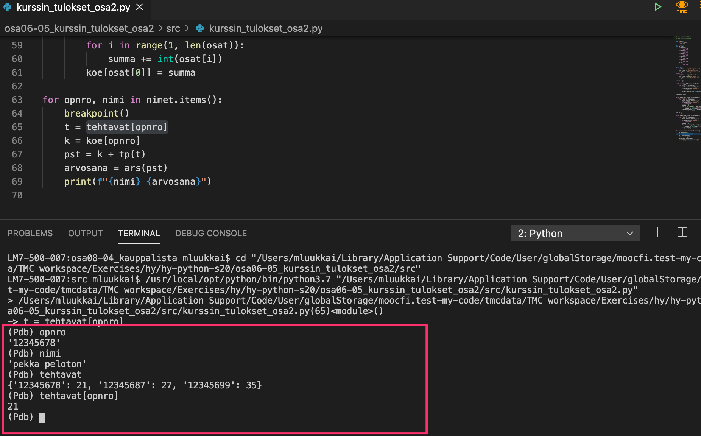
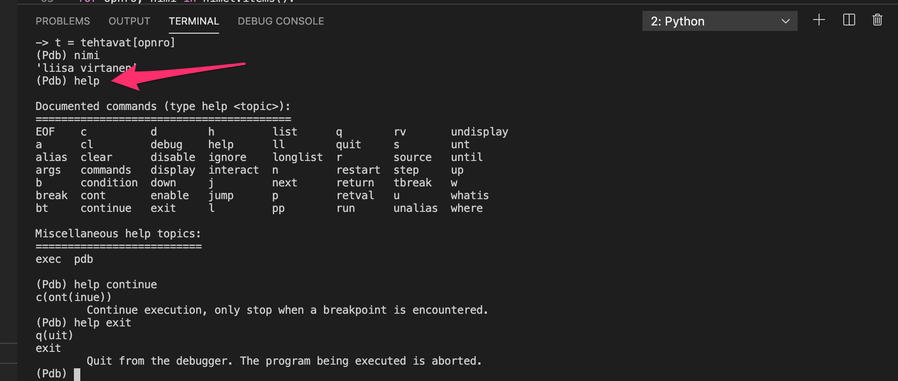

<text-box variant='learningObjectives' name="Learning objectives">

After this section

- You will know what a Python module is
- You will be able to include a module in your program with the `import` statement
- You will know how to look for more information on the contents of modules

</text-box>

## Debugging revisited

We have already come across quite a few debugging methods on this course. The [visualisation tool](http://www.pythontutor.com/visualize.html#mode=edit) should now be familiar to you, and [debugging print outs](/part-2/1-programming-terminology#debugging) are a good old staple by now. You have possibly also tried the Visual Studio Code [built-in debugger](/part-4/1-vscode#the-built-in-debugger). If you come across problems with the debugger not finding your files, there were some tips for handling these situations in the [previous part](/part-6/1-reading-files#debugging-code-which-handles-files).

In Python version 3.7 brought yet another easy and useful tool for debugging programs: the [breakpoint()](https://docs.python.org/3/library/functions.html?highlight=breakpoint#breakpoint) command.

You can add this command to any point in your code (within normal syntactic rules, of course). When the program is run, the execution halts at the point where you inserted the `breakpoint` command. Here is an example of debugging efforts when completing one of the exercises from the previous part (please ignore the Finnish variable names in the images, and concentrate on the functionality):



When the execution halts at the `breakpoint` command, an interactive console window is opened. Here you can write any code just as you would in a normal Python console, and see how the code works at exactly that point in the program.

The `breakpoint` command is especially useful when you know that some line of code causes an error, but you are not quite sure why that is. Add a breakpoint just before the problematic line of code and run your program. Now you can try out different options in the interactive console window, and figure out the correct commands to include in your program.

It is also possible to continue execution from where it halted. The command `continue`, or the shorthand `c`, typed into the debugging console will resume execution until the next breakpoint is reached. The following picture depicts a situation where the loop has already been executed a few times:


There are also some other commands available in the debugging console. You may find them [here](https://docs.python.org/3/library/pdb.html#debugger-commands), or else you can type in _help_ in the debugging console:



The command _exit_ finishes the execution of the program.

When you are done debugging, remember to remove the `breakpoint` commands from your code!

## Using modules

The Python language definition already contains some useful functions, such as the `len` function which returns the length of a string or a list, or the `sum` function which returns the sum of items in a data structure, but they will only get a programmer so far. The Python _standard library_ is a collection of standardised functions and objects, which can be used to expand the expressive power of Python in many ways. We have already used some functions defined in the standard library in previous exercises, for example when calculating square roots.

The standard library is comprised of _modules_, which contain functions and classes grouped around different themes and functionalities. In this part of the course we will familiarize ourselves with some useful Python modules. We will also learn to write our own modules.

The command `import` makes the contents of the given module accessible in the current program. Let's have a closer look at working with the `math` module. It contains the definitions of some mathematical functions, such as `sqrt` for square root and `log` for logarithm.


```python
import math

# The square root of the number 5
print(math.sqrt(5))
# the base 2 logarithm of the number 8
print(math.log(8, 2))
```

<sample-output>

2.23606797749979
3.0

</sample-output>

The functions are defined in the `math` module, so they must be referred to as `math.sqrt` and `math.log` in the program code.

## Selecting distinct sections from a module 

Another way to use modules is to select a distinct entity from the module with the `from` command. In case we want to use just the functions `sqrt` and `log` from the module `math`, we can do the following:

```python
from math import sqrt, log

print(sqrt(5))
print(log(5,2))
```

As you can see above, we do not need the `math` prefix when using the functions imported in this manner.

Sometimes a handy shortcut is to import _all_ the contents of a module with the star notation:

```python
from math import *

print(sqrt(5))
print(log(5,2))
```

Importing modules with the star notation can be useful when testing and in some smaller projects, but it can pose some new problems, too. We will come across these later.

<programming-exercise name='Hypotenuse' tmcname='part07-01_hypotenuse'>

Please write a function named `hypotenuse(leg1: float, leg2: float)`, which takes the lengths of the two sides adjacent to the right angle of an orthogonal triangle. The function should return the length of the hypotenuse, or the side opposite to the right angle.

You can use the [Pythagorean theorem](https://en.wikipedia.org/wiki/Pythagorean_theorem) to calculate the result. You will need the `sqrt` function from the `math` module.

Some examples:

```python
print(hypotenuse(3,4)) # 5.0
print(hypotenuse(5,12)) # 13.0
print(hypotenuse(1,1)) # 1.4142135623730951
```

</programming-exercise>

## The contents of a module

The Python documentation has extensive resources on each module in the Python standard library. The documentation contains information on the functions and methods defined in the module, and how the module can be used. For example, here is the link to the documentation for the `math` module:

* https://docs.python.org/3/library/math.html

We can also have a look at the contents of the module with the function `dir`:

```python
import math

print(dir(math))
```

The function returns a list of names defined by the module. These may be, for example, names of classes, constant values or functions:

<sample-output>

['\_\_doc\_\_', '\_\_name\_\_', '\_\_package\_\_', 'acos', 'acosh', 'asin', 'asinh', 'atan', 'atan2', 'atanh', 'ceil', 'copysign', 'cos', 'cosh', 'degrees', 'e', 'erf', 'erfc', 'exp', 'expm1', 'fabs', 'factorial', 'floor', 'fmod', 'frexp', 'fsum', 'gamma', 'hypot', 'isinf', 'isnan', 'ldexp', 'lgamma', 'log', 'log10', 'log1p', 'modf', 'pi', 'pow', 'radians', 'sin', 'sinh', 'sqrt', 'tan', 'tanh', 'trunc']

</sample-output>

<programming-exercise name='Special characters' tmcname='part07-02_special_characters'>

The Python module [string](https://docs.python.org/3/library/string.html) contains some string constants, which define certain groups of characters. These include for example lowercase letters and punctuation characters. Please familiarize yourself with these constants, and then write a function named `separate_characters(my_string: str)`. The function takes a string as its argument, and it should separate the characters in the string into three other strings, and return these in a tuple:

* The first string should contain the lowercase and uppercase ASCII letters (string constant `ascii_letters`)
* The second string should contain all punctuation characters defined by the string constant `punctuation`
* The third string should contain all the other characters (including whitespace)

The characters should appear in the three strings in the same order as they appeared in the original string.

An example of the function in action:

```python
parts = separate_characters("Olé!!! Hey, are ümläüts wörking?")
print(parts[0])
print(parts[1])
print(parts[2])
```

<sample-output>

OlHeyaremltswrking
!!!,?
é  üäü ö 

</sample-output>

</programming-exercise>

<programming-exercise name='Fractions' tmcname='part07-03_fractions'>

Please familiarize yourself with the Python module `fractions`. Use it to write a function named `fractionate(amount: int)`, which takes the number of parts as its argument. The function should divide the number 1 into as many equal sized fractions as is specified by the argument, and return these in a list.

An example of the function in action:

```python
for p in fractionate(3):
    print(p)

print()

print(fractionate(5))
```

<sample-output>

1/3
1/3
1/3

[Fraction(1, 5), Fraction(1, 5), Fraction(1, 5), Fraction(1, 5), Fraction(1, 5)]

</sample-output>

</programming-exercise>

<!---
<quiz id="94c034a1-3183-5682-acb0-7f126d26ba07"></quiz>
-->
