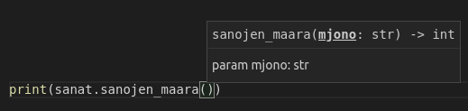

<text-box variant='learningObjectives' name="Learning objectives">

After this section

- You will be able to write your own modules
- You will know what the Python variable `__name__` and the value `__main__` signify

</text-box>

Writing your own Python modules is easy. Any file containing valid Python code can be imported as a module. Let's assume we have a file named `words.py` with the following contents:

```python
def first_word(my_string: str):
    parts = my_string.split(" ")
    return parts[0]

def last_word(my_string: str):
    parts = my_string.split(" ")
    return parts[-1]

def number_of_words(my_string: str):
    parts = my_string.split(" ")
    return len(parts)
```

The functions defined in the file can be accessed by importing the file:

```python
import words

my_string = "Sheila sells seashells by the seashore"

print(words.first_word(my_string))
print(words.last_word(my_string))
print(words.number_of_words(my_string))
```

<sample-output>

Sheila
seashore
6

</sample-output>

NB: the file containing the Python module must be located either in the same directory with the program importing it, or in one of the default Python directories, or else the Python interpreter will not find it when the `import` statement is executed.

We can use our own modules just as we have learnt to use the modules from the Python standard library:

```python
from words import first_word, last_word

sentence = input("Please type in a sentence: ")

print("The first word was: " + first_word(sentence))
print("The last word was: " + last_word(sentence))
```

<sample-output>

Please type in a sentence: **Python is a swell programming language**
The first word was: Python
The last word was: language

</sample-output>

## Putting type hints to use

When using modules, type hinting becomes especially useful. If you are using an editor which has built-in support for type hinting, using different modules becomes much easier.

For example, Visual Studio Code will display the type hints when you are writing code:



## Main function code in a module

If a module contains any code which is not contained within a function definition (that is, if the module contains code in the main function of the module), this code is executed automatically whenever the module is imported.

Let's assume our `words.py` file also contained some test cases:

```python
def first_word(my_string: str):
    parts = my_string.split(" ")
    return parts[0]

def last_word(my_string: str):
    parts = my_string.split(" ")
    return parts[-1]

def number_of_words(my_string: str):
    parts = my_string.split(" ")
    return len(parts)

print(first_word("This is a test"))
print(last_word("Here we are still testing"))
print(number_of_words("One two three four five"))
```

Now, if we import the module with an `import` statement, all the code in the module which is outside the defined functions is automatically executed:

```python
import words

my_string = "Sheila sells seashells by the seashore"

print(words.first_word(my_string))
print(words.last_word(my_string))
print(words.number_of_words(my_string))
```

<sample-output>

This
testing
5
Sheila
seashore
6

</sample-output>

As you can see above, this is not a good outcome, because the program we are trying to write is messed with by the test cases from the module itself.

Luckily, there is a solution, and it is one which you have used many times before in the exercises on this course. We just need to test if the program is being executed on its own, or if the code has been imported with an `import` statement. Python has a built-in variable `__name__`, which contains the name of the program being executed. If the program is being executed on its own, the value of the variable is `__main__`. If the program has been imported, the value of the variable is the name of the imported module (in this case, `words`).

Knowing this, we can add a conditional statement, which lets us only execute the text cases if the program is executed on its own. As you can see below, the structure looks familiar:

```python
def first_word(my_string: str) -> str:
    parts = my_string.split(" ")
    return parts[0]

def last_word(my_string: str) -> str:
    parts = my_string.split(" ")
    return parts[-1]

def number_of_words(my_string: str) -> int:
    parts = my_string.split(" ")
    return len(parts)

if __name__ == "__main__":
    # testing functionality
    print(first_word("This is a test"))
    print(last_word("Here we are still testing"))
    print(number_of_words("One two three four five"))
```

If you execute the module on its own, the test cases are printed out:

<sample-output>

This
testing
5

</sample-output>

When the module is imported into another program, the test cases are not executed:

```python
import words

my_string = "Sheila sells seashells by the seashore"

print(words.first_word(my_string))
print(words.last_word(my_string))
print(words.number_of_words(my_string))
```

<sample-output>

Sheila
seashore
6

</sample-output>

In the exercises on this course, whenever you were asked to write functions, you were usually also expected to wrap test cases in an `if __name__ == "__main__"` block exactly like the one above. Now you know why.

<programming-exercise name='String helper' tmcname='part07-17_string_helper'>

Please write a module named `string_helper`, which contains the following functions:

The function `change_case(orig_string: str)` creates and returns a new version of the parameter string. The lowercase letters in the original should be uppercase, and uppercase letters should be lowercase.

The function `split_in_half(orig_string: str)` splits the parameter string in half, and returns the results in a tuple. If the original has an odd number of characters, the first half should be shorter.

The function `remove_special_characters(orig_string: str)` returns a new version of the parameter string, with all special characters removed. Only lowercase and uppercase letters, numbers and spaces are allowed in the returned string.

Some examples of how the module would be used:

```python
import string_helper

my_string = "Well hello there!"

print(string_helper.change_case(my_string))

p1, p2 = string_helper.split_in_half(my_string)

print(p1)
print(p2)

m2 = string_helper.remove_special_characters("This is a test, lets see how it goes!!!11!")
print(m2)
```

<sample-output>

wELL HELLO THERE!
Well hel
lo there!
This is a test lets see how it goes11

</sample-output>

</programming-exercise>

<!---
<quiz id="2203412c-628c-54a3-bd77-edebd5ce4f67"></quiz>
-->

Please respond to a quick questionnaire on this week's materials.

<quiz id="3847e0b3-f921-546d-9cea-14bdb10adbde"></quiz>
