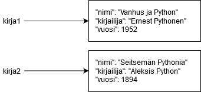

<text-box variant='learningObjectives' name="Learning objectives">

After this section

- You will know what an object is in programming
- You will understand what is meant by the independence of individual objects
- You will be able to create and access objects

</text-box>

This is the first part of the Advanced Course in Programming. The material is designed to be used with the Visual Studio Code editor, just like the preceding Introduction to Programming course was. If you haven't use Visual Studio Code before, you will find the installation instructions [here](https://www.mooc.fi/en/installation/vscode), and an introduction to the programming environment from the previous course [here](/part-4/1-vscode).

In the Introduction to Programming course we noticed that it often makes sense to group related data together in our programs. For example, if we are trying to store information about a book, it might make sense to use a tuple or a dictionary to organize the data into a single data structure.

The solution could look like this when using a tuple:

```python
name = "In Search of Lost Typing"
author = "Marcel Pythons"
year = 1992

# Combine these in a tuple
book = (name, author, year)

# Print the name of the book
print(book[0])
```

In a case like this, the advantage of using a dictionary is that we can use strings instead of indexes as the keys. That is, we can give descriptive names to the items stored in the data structure:

```python
name = "In Search of Lost Typing"
author = "Marcel Pythons"
year = 1992

# Combine these in a dictionary
book = {"name": name, "author": author, "year": year}

# Print the name of the book
print(book["name"])
```

In both cases we are creating a new _object_. In programming, the term has the specific meaning of an independent whole, in this case containing some bits of data which are somehow related. Being independent means that any changes made to one object will not affect other objects.

If we were to create two structurally identical representations of books, using dictionaries with identical keys, any changes made to one of them would not have any effect on the other:

```python
book1 = {"name": "The Old Man and the Pythons", "author": "Ernest Pythons", "year": 1952}
book2 = {"name": "Seven Pythons", "author": "Aleksis Python", "year": 1894}

print(book1["name"])
print(book2["name"])

book1["name"] = "A Farewell to ARM Processors"

print(book1["name"])
print(book2["name"])
```

<sample-output>

The Old Man and the Pythons
Seven Pythons
A Farewell to ARM Processors
Seven Pythons

</sample-output>



<text-box variant="info" name="Python objects">

You may remember from the Introduction to Programming course that any value in Python is internally handled as an object. This means that the value stored in a variable is a _reference to an object_. The data itself is stored within the object in computer memory. If you assign a value to a new variable with the command `a = 3`, the value stored in the variable is _not_ 3, but a _reference to an object which contains the value 3_.

Most other programming languages (at least those which support object-oriented programming) include some specially defined _primitive data types_. These usually include at least integer numbers, floating point numbers and Boolean truth values. Primitives are processed directly, meaning that they are stored directly in variables, not as references. Python has no such primitives, but working with the basic data types in Python is practically very similar. Objects of these basic data types (such as numbers, Boolean values and strings) are _immutable_, meaning that they cannot be changed in memory. If the value stored in a variable of a basic data type needs to be changed, the entire reference is replaced, but the object itself remains intact in memory.

</text-box>

## Objects and methods

The data stored in an object can be accessed through _methods_. A method is a function which operates on the specific object it is attached to. The way to distinguish methods from other functions is the way in which they are called: first you write the name of the object targeted, followed by a dot, and then the name of the method, with arguments if any. For example, the method `values` returns all the values stored in an object of type dictionary, or `dict`:

```python
# this creates an object of type dictionary with the name book
book = {"name": "The Old Man and the Pythons", "author": "Ernest Pythons", "year": 1952}

# Print out all the values
# The method call values() is written after the name of the variable
# Remember the dot notation!
for value in book.values():
    print(value)
```

<sample-output>

The Old Man and the Pythons
Ernest Pythons
1952

</sample-output>

Similarly, string methods target the string object which they are called on. Some examples of string methods include `count` and `find`:

```python
name = "Imaginary Irene"

# Print out the number of times the letter I is found
print(name.count("I"))

# The number of letters I found in another string
print("Irreverent Irises in Islington".count("I"))

# The index of the substring Irene
print(name.find("Irene"))

# This string has no such substring
print("A completely different string".find("Irene"))
```

<sample-output>

2
3
10
-1

</sample-output>

String methods return values, but they will not change the contents of a string. As stated above, strings in Python are immutable. This does not apply to all methods, however. Python lists are mutable, so Python list methods may change the contents of the list they are called on:

```python
my_list = [1,2,3]

# Add a couple of items
my_list.append(5)
my_list.append(1)

print(my_list)

# Remove the first item
my_list.pop(0)

print(my_list)
```

<sample-output>

[1, 2, 3, 5, 1]
[2, 3, 5, 1]

</sample-output>

<programming-exercise name='The smallest average result' tmcname='part08-01_smallest_average'>

Please write a function named `smallest_average(person1: dict, person2: dict, person3: dict)`, which takes three dictionary objects as its arguments.

Each dictionary object contains values mapped to the following keys:

* `"name"`: The name of the contestant
* `"result1"`: the first result of the contestant (an integer between 1 and 10)
* `"result2"`: the second result of the contestant (as above)
* `"result3"`: the third result of the contestant (as above)

The function should calculate the average of the three results for each contestant, and then return the contestant whose average result was the smallest. The return value should be the entire dictionary object containing the contestant's information.

You may assume there will be no ties, i.e. a single contestant will have the smallest average result.

An example of the function in action:

```python
person1 = {"name": "Mary", "result1": 2, "result2": 3, "result3": 3}
person2 = {"name": "Gary", "result1": 5, "result2": 1, "result3": 8}
person3 = {"name": "Larry", "result1": 3, "result2": 1, "result3": 1}

print(smallest_average(person1, person2, person3))
```

<sample-output>

{'name': 'Larry', 'result1': 3, 'result2': 1, 'result3': 1}

</sample-output>

</programming-exercise>

<programming-exercise name='Row sums' tmcname='part08-02_row_sums '>

In Python, every value stored in a variable is a reference to an object, so any value stored in a list is also a reference to an object. This is also true when modelling a matrix data structure: each value in the top level list is a reference to another list, which in turn contains references to the objects representing the elements of the matrix.

Please write a function named `row_sums(my_matrix: list)`, which takes an integer matrix as its argument.

The function should add a new element on each row in the matrix. This element contains the sum of the other elements on that row. The function does not have a return value. It should modify the parameter matrix in place.

An example of the function in action:

```python
my_matrix = [[1, 2], [3, 4]]
row_sums(my_matrix)
print(my_matrix)
```

<sample-output>

[[1, 2, 3], [3, 4, 7]]

</sample-output>

</programming-exercise>
